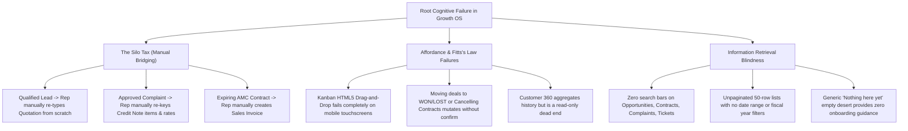

# BizBoard Master Bug, Vulnerability & Quality Audit Register

**Version**: 2.2 (P0/P1 triage applied 2026-10-04)  
**Date**: 2026-10-04  
**Audit Scope**: End-to-End Codebase ([`backend/`](file:///e:/Bizboard/backend), [`web/`](file:///e:/Bizboard/web), [`mobile/`](file:///e:/Bizboard/mobile)) cross-referenced with [`Bizboard_Master_Task_Register_Enhanced.xlsx`](file:///e:/Bizboard/Bizboard_Master_Task_Register_Enhanced.xlsx).  
**Review Dimensions**: Security & Isolation, Financial/Statutory Integrity, Concurrency & Data Races, Edge-Case Handling, SDLC & Engineering Practices, and User/Operator Friction.

Version 2.1 adds the 4 Oct 2026 source review. Section 16.6 (BUG-COG-001 through BUG-COG-020) was expanded the same day with the canvas action detail: problem, cause, remediation, estimate, dependencies, and acceptance. Those twenty rows were **not** given new IDs, and the severity counts did not change. These already-filed items were **not** duplicated:

- Shopify held stock deltas with no apply path stay **BUG-INV-007**. **BUG-INV-008** covers only the missing connection setup.
- Account Aggregator substring UTR auto-match stays **BUG-PAY-006**.
- Payroll arrears, advances, and bonus lines are **BUG-PRL-004** (renamed from the duplicate BUG-PAY-002) in section 12.
- Milestone invoicing navigation stays **BUG-PRJ-002**, updated to the current `/sales/invoices/:id` miss. The code now picks the clicked milestone; it no longer opens the first invoice on the project.

Severity counts below were recounted from the `Severity` lines in this file (the 2.0 domain table did not match those lines).

---

## 1. Executive Quality & Defect Metrics

```
Total Identified Defects & Quality Gaps: 212   (19 closed at triage, 193 open)
├── P0 (Critical / Security / Financial / Cognitive Blocker): 25 identified, 19 open
├── P1 (High / Regulatory / Concurrency / Ergonomic Defect):   81 identified, 75 open
├── P2 (Medium / API Robustness / Usability Defect):           85 identified, 78 open (BUG-PUR-001 reclassified P1 to P2)
└── P3 (Low / Code Quality / Architectural Debt):             21 identified, 21 open
```

**Triage 2026-10-04** (see [BUGS_TRIAGE_2026-10-04.md](BUGS_TRIAGE_2026-10-04.md)): every headed finding (P0 to P3, and the COG rows) was checked against the code. Each now carries a `Triage` line except the Growth OS COG-G table rows. Closed as already fixed: SEC-001, SEC-002, SEC-007, SALES-005, ACC-002, ACC-005, INV-005, GST-005, PAY-004, PRJ-001, INS-001, INS-002, INS-003, INS-004, INS-005, CMP-001, UI-001. Closed as false positive: SEC-003, ACC-006. Reclassified to P2 feature work: PUR-001. The COG rows are UX proposals and show how much of each is already shipped. The duplicate payroll IDs were renamed `BUG-PRL-003` (bank selection on disbursement) and `BUG-PRL-004` (arrears, advances, bonus lines). The `Severity` lines are unchanged, so a recount from them still gives the identified totals.


| Domain / Module (open after triage) | P0 | P1 | P2 | P3 | Total |
| :--- | :---: | :---: | :---: | :---: | :---: |
| **1. Multi-Tenancy, Auth & Core Security** | 0 | 6 | 5 | 6 | **17** |
| **2. Sales, POS & Fleet Management** | 1 | 10 | 6 | 4 | **21** |
| **3. Purchases & Vendor Operations (P2P)** | 2 | 7 | 5 | 1 | **15** |
| **4. Inventory, Warehousing & Valuation** | 1 | 5 | 1 | 2 | **9** |
| **5. Accounting, General Ledger & Audit Trail** | 1 | 4 | 9 | 2 | **16** |
| **6. GST, E-Invoicing & E-Way Bills** | 2 | 4 | 1 | 0 | **7** |
| **7. Payments, Banking & Gateway Integration** | 1 | 6 | 1 | 0 | **8** |
| **8. SaaS Billing** | 0 | 1 | 2 | 1 | **4** |
| **9. Projects & Milestone Billing** | 0 | 1 | 2 | 0 | **3** |
| **10. Insurance Placement & Policy Claims** | 0 | 0 | 0 | 0 | **0** |
| **11. Workshop & Job Cards** | 1 | 2 | 2 | 1 | **6** |
| **12. Manufacturing, Contracts, Payroll & Complaints** | 0 | 5 | 4 | 0 | **9** |
| **13. CRM, Referrals & Support** | 0 | 3 | 5 | 1 | **9** |
| **14. Web, Mobile, AI & Hardware UX** | 0 | 5 | 24 | 2 | **31** |
| **15. Performance, Scalability & Database Optimization** | 0 | 3 | 5 | 0 | **8** |
| **16. Cognitive Load, Ergonomics & Human-Computer Interaction (HCI)** | 10 | 13 | 6 | 1 | **30** |
| **Total (open)** | 19 | 75 | 78 | 21 | **193** |

---

## 2. Multi-Tenancy, Auth, Security & Core Architecture

### BUG-SEC-001: Background Celery Tasks Execute Multi-Tenant Scans Without Setting RLS Context
- **Severity**: **P0 (Critical Security & Data Isolation Breach)**
- **Triage (2026-10-04)**: CLOSED, already fixed. Contract and recurring-invoice tasks already loop `iter_company_ids()` + `set_rls_company(cid)`. Remediation snippet cites non-existent `tenant_context`. Re-check any remaining argument-free beat tasks only.
- **File & Lines**:
  - [`backend/contracts/tasks.py#L10`](file:///e:/Bizboard/backend/contracts/tasks.py#L10) (`refresh_contract_statuses`)
  - [`backend/sales/tasks.py#L274`](file:///e:/Bizboard/backend/sales/tasks.py#L274) (`generate_recurring_invoices_task`)
  - [`backend/sales/recurring.py#L210`](file:///e:/Bizboard/backend/sales/recurring.py#L210) (`process_due_schedules`)
  - [`backend/config/celery.py#L147`](file:///e:/Bizboard/backend/config/celery.py#L147) (`set_rls_company_for_task`)
- **Root Cause**: Celery beat invokes tasks with no arguments. The Celery prerun signal handler sets `app.company_id` to `None`. In PostgreSQL with `FORCE ROW LEVEL SECURITY`, tenant-scoped queries either return empty querysets (silent job abortion) or execute with database-level superuser permissions, bypassing tenant isolation entirely.
- **Impact**: Invoices, contracts, or reminders can be generated cross-tenant or silently skipped across all active customers.
- **Remediation**:
  ```python
  # Force iteration through active companies and wrap in tenant context:
  for company in Company.objects.filter(is_active=True).only("id"):
      with tenant_context(company.id):
          refresh_company_contracts(company.id)
  ```

---

### BUG-SEC-002: Razorpay Webhook Authentication Bypass in Test / Staging Environments
- **Severity**: **P0 (Security Vulnerability / Forged Webhook Exploit)**
- **Triage (2026-10-04)**: CLOSED, already fixed. billing/views.py:189-202 now returns 403 unless env=test AND the test header is present; the inverted condition is gone.
- **File & Lines**: [`backend/billing/views.py#L189-L202`](file:///e:/Bizboard/backend/billing/views.py#L189) (`RazorpayWebhookView.post`)
- **Root Cause**:
  ```python
  if not webhook_secret and settings.DJANGO_ENV == "test":
      if request.headers.get("X-Bizboard-Test-Webhook") and settings.DJANGO_ENV != "test":
          return Response(status=403)
  ```
  The header check requires `and settings.DJANGO_ENV != "test"`, which is mathematically impossible given the outer `settings.DJANGO_ENV == "test"` condition.
- **Impact**: Any public instance configured with `DJANGO_ENV=test` and an unset webhook secret accepts unverified, unsigned payment payloads, allowing attackers to activate paid subscriptions without payment.
- **Remediation**: Eliminate the inverted nested condition. Require `X-Bizboard-Test-Webhook: true` whenever `webhook_secret` is blank, and hard-reject empty secrets in production.

---

### BUG-SEC-003: Potential Raw SQL Execution Bypassing Tenant RLS
- **Severity**: **P0 (SQL Injection / Multi-Tenancy Risk)**
- **Triage (2026-10-04)**: CLOSED, false positive. core/audit_guard.py and core/checks.py use static SQL or `%s` params; no user input reaches them.
- **File & Lines**:
  - [`backend/core/audit_guard.py#L51`](file:///e:/Bizboard/backend/core/audit_guard.py#L51)
  - [`backend/core/checks.py#L27`](file:///e:/Bizboard/backend/core/checks.py#L27)
- **Root Cause**: Raw SQL string formatting used in low-level schema maintenance checks without explicit query parameterization or company filtering.
- **Impact**: Database query execution is exposed to potential SQL injection and bypasses Django's ORM tenant scoping.
- **Remediation**: Parameterize all raw cursor executions with tuple parameters `cursor.execute(sql, (param,))` and assert tenant filters.

---

### BUG-SEC-004: Two-Factor Authentication (TOTP) Completely Opt-In for Privileged Roles
- **Severity**: **P1 (Security / Statutory Compliance)**
- **Triage (2026-10-04)**: PARTIAL. `enrolment_required()` exists and is forced on in prod/staging (settings.py:823-831); default is off elsewhere. Real gap: non-prod default and the waiver path.
- **File & Lines**:
  - [`backend/accounts/mfa.py`](file:///e:/Bizboard/backend/accounts/mfa.py)
  - [`backend/accounts/permissions.py`](file:///e:/Bizboard/backend/accounts/permissions.py)
- **Root Cause**: MFA is implemented, but no enforcement guard requires enrollment for `OWNER`, `ADMIN`, or `ACCOUNTANT` users.
- **Impact**: Account takeover of business owner credentials via credential stuffing or phishing with zero 2FA challenge.
- **Remediation**: Create a `RequireMfaForPrivilegedRoles` permission class blocking all write operations until TOTP setup is completed for privileged accounts.

---

### BUG-SEC-005: Unbounded Query Endpoints Causing Denial of Service
- **Severity**: **P1 (Resource Exhaustion / Performance)**
- **Triage (2026-10-04)**: PARTIAL. Default paginator exists (core/pagination.py, max 200). Verify exports and views that override pagination. The "django-ninja" advice is wrong (project is DRF).
- **File & Lines**:
  - [`backend/accounting/views.py#L140`](file:///e:/Bizboard/backend/accounting/views.py#L140) (`JournalEntryViewSet`)
  - [`backend/inventory/views.py#L230`](file:///e:/Bizboard/backend/inventory/views.py#L230) (`StockMovementViewSet`)
- **Root Cause**: Default querysets allow unpaginated or high-limit exports (`?limit=100000`) without hard database result capping or streaming cursor pagination.
- **Impact**: Memory exhaustion (OOM crashes) on the Django worker processes when tenants with 50,000+ transactions request reports.
- **Remediation**: Enforce `max_page_size = 250` and use `django-ninja` / Django streaming HTTP responses for CSV/PDF exports.

---

### BUG-SEC-006: Tenant Right-to-Erasure (DPDP Act) Fails on Vertical App Foreign Keys
- **Severity**: **P1 (Legal Compliance / Runtime Exception)**
- **Triage (2026-10-04)**: PARTIAL. Drift guard `assert_erasure_model_coverage` exists; need a repro that vertical models actually raise ProtectedError.
- **File & Lines**: [`backend/accounts/erasure.py#L48-L65`](file:///e:/Bizboard/backend/accounts/erasure.py#L48) (`TOMBSTONE_RETAINED`)
- **Root Cause**: When executing tenant tombstoning/erasure under the Digital Personal Data Protection (DPDP) Act, `TOMBSTONE_RETAINED` omits models from `projects`, `insurance`, `workshop`, `manufacturing`, `contracts`, `payroll`, and `complaints`.
- **Impact**: Executing owner deletion raises a `django.db.models.ProtectedError` and crashes mid-transaction, leaving the tenant half-deleted.
- **Remediation**: Explicitly register all vertical extension models in `accounts/erasure.py` with appropriate cascade or PII scrubbing logic.

---

### BUG-SEC-007: Distributed Redis Token Bucket Rate Limiter Absent
- **Severity**: **P2 (API Abuse / Brute Force Risk)**
- **Triage (2026-10-04)**: CLOSED, already fixed. core/throttles.py has `TenantPlanRateThrottle` (per-plan limits) and prod/staging require Redis for the cache (settings.py:474-482). Register cites core/throttling.py, which does not exist.
- **File & Lines**: [`backend/core/throttling.py`](file:///e:/Bizboard/backend/core/throttling.py)
- **Root Cause**: Throttling uses standard DRF `AnonRateThrottle` and `UserRateThrottle` stored in in-memory cache fallback. No distributed token-bucket rate limiter per tenant tier exists.
- **Impact**: Distributed brute-force attacks against login, OTP, and public payment links can exhaust database connection pools.
- **Remediation**: Implement a Redis token-bucket rate limiter with tiered limits (e.g., Free vs Enterprise).

---

### BUG-SEC-008: Missing API Latency and Slow Query Telemetry Logger
- **Severity**: **P3 (Observability / SDLC Best Practice)**
- **Triage (2026-10-04)**: CONFIRMED. core/middleware.py logs duration_ms only; no slow-request threshold or query-count warning.
- **File & Lines**: [`backend/core/middleware.py`](file:///e:/Bizboard/backend/core/middleware.py)
- **Root Cause**: `RequestIdMiddleware` logs request duration, but lacks slow-query thresholds (>500ms), SQL query count logging, and OpenTelemetry span propagation.
- **Impact**: Inability to isolate production performance regressions before they cause outages.
- **Remediation**: Add automated warnings when a single HTTP request executes >30 database queries or takes >800ms.

---

### BUG-SEC-009: SaaS Subscription Write-Gate Middleware Bypasses Trailing-Slash URL Normalization
- **Severity**: **P2 (SaaS Operations / Middleware Edge Blocker)**
- **Triage (2026-10-04)**: CONFIRMED. billing/middleware.py:31 matches `path.endswith(ALLOW_SUFFIXES)` on the raw path with no slash normalisation.
- **File & Lines**: [`backend/billing/middleware.py#L17`](file:///e:/Bizboard/backend/billing/middleware.py#L17), [`#L31`](file:///e:/Bizboard/backend/billing/middleware.py#L31)
- **Root Cause**: `ALLOW_SUFFIXES = ("/cancel/", "/void/", "/reverse/")`. `SubscriptionWriteGateMiddleware` executes before Django's `CommonMiddleware` (which appends trailing slashes). If an HTTP client issues a POST to `/api/v1/sales/invoices/123/cancel` (no trailing slash), `path.endswith(ALLOW_SUFFIXES)` evaluates to `False`, immediately returning a 403 `subscription_blocked` response before Django can redirect.
- **Impact**: Lapsed or trial-expired tenants attempting to unwind, cancel, or tidy up draft vouchers before account close receive a 403 Forbidden error if their HTTP client omits the trailing slash.
- **Remediation**: Normalize path or match `path.rstrip("/") + "/"` against `ALLOW_SUFFIXES`.

---

### BUG-SEC-010: MFA Setup and Confirm Do Not Ask for the Password
- **Severity**: **P1 (Stolen Session Can Enrol an Attacker Authenticator)**
- **Triage (2026-10-04)**: CONFIRMED. MfaSetupView/MfaConfirmView accept a session or enrol token with no password re-check.
- **File & Lines**: [`backend/accounts/mfa_views.py#L97-L135`](file:///e:/Bizboard/backend/accounts/mfa_views.py#L97) (`MfaSetupView`, `MfaConfirmView`)
- **Root Cause**: Setup and confirm accept the logged-in session (or an enrol token) and write a new TOTP secret. Disable uses `_ReauthMixin` and requires the password plus a current second factor. Setup does not.
- **Impact**: A stolen session for a user who has not finished enrolment can bind the attacker's authenticator. Disable then requires the password the attacker may not have, locking out the real user.
- **Remediation**: Require the same password re-check used by disable before setup and confirm for session actors.

---

### BUG-SEC-011: Password Login Mints a Refresh Token Before the MFA Challenge
- **Severity**: **P1 (MFA Bypass If the Token Row Is Readable)**
- **Triage (2026-10-04)**: CONFIRMED. LoginView calls parent post() (mints OutstandingToken) before returning mfa_challenge_response; no blacklist call.
- **File & Lines**: [`backend/accounts/views.py#L571-L591`](file:///e:/Bizboard/backend/accounts/views.py#L571) (`LoginView.post`)
- **Root Cause**: `LoginView` calls `TokenObtainPairView.post` first. When MFA is enabled it returns `mfa_challenge_response` and does not set cookies, but the parent view has already created an `OutstandingToken` row containing a usable refresh JWT. That row is not blacklisted.
- **Impact**: Anyone who can read `OutstandingToken.token` (backup, database access, admin) can refresh and skip the MFA step. Every MFA login leaves a dangling valid refresh.
- **Remediation**: Authenticate the password without minting tokens, or blacklist the pair before returning `mfa_required`.

---

### BUG-SEC-012: Customer Portal Phone Lookup Loads Every Tenant's Phones
- **Severity**: **P1 (Cross-Tenant Data Exposure and Unbounded Scan)**
- **Triage (2026-10-04)**: CONFIRMED. portal_views.py:106-113 loads every Customer with a phone under rls_bypass and compares digits in Python.
- **File & Lines**: [`backend/payments/portal_views.py#L106-L113`](file:///e:/Bizboard/backend/payments/portal_views.py#L106)
- **Root Cause**: Under `rls_bypass()`, a phone request loads every `Customer` with a non-blank phone and compares digits in Python.
- **Impact**: Phone numbers from all companies are materialized in the worker. The scan grows with the whole customer table.
- **Remediation**: Match a normalized phone column in the database. Do not pull every phone into application memory.

---

### BUG-SEC-013: erase_company Documents a Production --force Gate It Does Not Implement
- **Severity**: **P2 (Irreversible Tenant Wipe)**
- **Triage (2026-10-04)**: CONFIRMED. erase_company.py:20-27 has --company-id/--confirm/--mode/--reason only; docstring promises --force, code has none.
- **File & Lines**: [`backend/accounts/management/commands/erase_company.py#L5-L27`](file:///e:/Bizboard/backend/accounts/management/commands/erase_company.py#L5)
- **Root Cause**: The command docstring says it refuses non-production shells unless `--force` is given. `add_arguments` and `handle` implement neither the environment check nor `--force`.
- **Impact**: A shell plus the exact company name can erase a tenant in any environment.
- **Remediation**: Refuse `DJANGO_ENV` of production or staging unless `--force` is passed, matching the seed commands.

---

### BUG-SEC-014: Empty MFA_ENCRYPTION_KEY Is Derived from SECRET_KEY
- **Severity**: **P2 (Key Hygiene and Lockout on Secret Rotation)**
- **Triage (2026-10-04)**: CONFIRMED. accounts/mfa.py:94-99 derives a Fernet key from SECRET_KEY when MFA_ENCRYPTION_KEY is empty; settings.py:816 does not fail closed.
- **File & Lines**: [`backend/accounts/mfa.py#L94-L99`](file:///e:/Bizboard/backend/accounts/mfa.py#L94)
- **Root Cause**: When `MFA_ENCRYPTION_KEY` is empty, the code derives a Fernet key from `hashlib.sha256("bizboard-mfa|" + SECRET_KEY)`. Unlike `OTP_PEPPER`, startup does not fail closed.
- **Impact**: Rotating `SECRET_KEY` makes every stored authenticator undecryptable. The MFA key is not an independent secret.
- **Remediation**: Raise `ImproperlyConfigured` in production and staging when `MFA_ENCRYPTION_KEY` is empty.

---

### BUG-SEC-015: Forced-Enrolment Token Is Stored in sessionStorage
- **Severity**: **P2 (XSS Can Finish MFA Setup)**
- **Triage (2026-10-04)**: CONFIRMED. web/src/api/client.ts:318-319 writes the enrol token to sessionStorage.
- **File & Lines**: [`web/src/api/client.ts#L316-L320`](file:///e:/Bizboard/web/src/api/client.ts#L316)
- **Root Cause**: On an enrolment-required refresh body, the client writes `bizboard:enrol-token` to `sessionStorage`.
- **Impact**: Any script running on the page can read the token and complete MFA setup for a money role within the token lifetime.
- **Remediation**: Keep the enrol token in memory only.

---

### BUG-SEC-016: Purchase Complete, Journal Post, and Receipt Allocation Are Not Audited
- **Severity**: **P2 (Money Mutations Missing from the Activity Log)**
- **Triage (2026-10-04)**: CONFIRMED. payments/services.py audits create (`record_document_event`) but `allocate_receipt` has no audit call; journal post in accounting/views.py has none.
- **File & Lines**:
  - [`backend/purchases/services.py#L862-L868`](file:///e:/Bizboard/backend/purchases/services.py#L862) (audit only when `accounting_enabled`)
  - [`backend/accounting/views.py#L234-L248`](file:///e:/Bizboard/backend/accounting/views.py#L234) (journal `post`)
  - [`backend/payments/services.py#L455-L474`](file:///e:/Bizboard/backend/payments/services.py#L455) (`allocate_receipt`)
- **Root Cause**: Purchase completion records an audit event only inside the books-on posting branch. Manual journal post flips status with no `AuditEvent`. Receipt and payment create/void are audited; allocation is not. Master-data audit gaps remain **BUG-ACC-003**.
- **Impact**: Stock-moving purchases with books off, journal posts, and AR/AP applications cannot be attributed.
- **Remediation**: Record the document event on every purchase complete, journal post, and allocate/unallocate, inside the same transaction as the money change.

---

### BUG-SEC-017: Stale Active Company Falls Through to Another Membership
- **Severity**: **P3 (Audit Attributed to the Wrong Company)**
- **Triage (2026-10-04)**: CONFIRMED. accounts/views.py:150-156 `_active_membership` falls back to first membership.
- **File & Lines**: [`backend/accounts/views.py#L150-L156`](file:///e:/Bizboard/backend/accounts/views.py#L150) (`_active_membership`)
- **Root Cause**: If `active_company_id` does not match a membership, the helper returns `qs.order_by("id").first()` instead of clearing the selection the way `get_company_user` does.
- **Impact**: Login, logout, and password-change audits can be filed against another company.
- **Remediation**: Clear a stale company and require an explicit pick.

---

### BUG-SEC-018: A Viewer Can Be Granted Financial-Report Access
- **Severity**: **P3 (Role Capability Wider Than the Viewer Contract)**
- **Triage (2026-10-04)**: CONFIRMED. `can_view_financial_reports` is not in `_VIEWER_FORBIDDEN_CAPS` (accounts/serializers.py:19-30).
- **File & Lines**: [`backend/accounts/serializers.py#L19-L31`](file:///e:/Bizboard/backend/accounts/serializers.py#L19) (`_VIEWER_FORBIDDEN_CAPS`)
- **Root Cause**: `can_view_financial_reports` is not in the viewer forbidden list. Report APIs honor that capability. Payment list surfaces still deny the viewer role.
- **Impact**: An owner can turn a viewer into a finance reader without using the auditor role.
- **Remediation**: Add `can_view_financial_reports` to `_VIEWER_FORBIDDEN_CAPS`.

---

### BUG-SEC-019: Postgres Row-Level Security Is Off Unless Ops Opts In
- **Severity**: **P3 (Tenant Isolation Depends Only on Application Filters)**
- **Triage (2026-10-04)**: CONFIRMED. settings.py:981 `POSTGRES_RLS_ENABLED` defaults to "0".
- **File & Lines**: [`backend/config/settings.py#L976-L981`](file:///e:/Bizboard/backend/config/settings.py#L976)
- **Root Cause**: `POSTGRES_RLS_ENABLED` defaults to false. This is separate from **BUG-SEC-001**, which is Celery tasks that do not set company context when RLS is on.
- **Impact**: A missed company filter is not caught by the database.
- **Remediation**: Require RLS in production after the soak, or fail startup when it is off.

---

### BUG-SEC-020: reset_user_mfa and grant_company_flag Run in Production With No Extra Confirm
- **Severity**: **P3 (Host Shell Can Strip MFA or Flip a Flag)**
- **Triage (2026-10-04)**: CONFIRMED. Neither reset_user_mfa.py nor grant_company_flag.py checks DJANGO_ENV or --force.
- **File & Lines**:
  - [`backend/accounts/management/commands/reset_user_mfa.py#L16-L24`](file:///e:/Bizboard/backend/accounts/management/commands/reset_user_mfa.py#L16)
  - [`backend/core/management/commands/grant_company_flag.py#L31-L55`](file:///e:/Bizboard/backend/core/management/commands/grant_company_flag.py#L31)
- **Root Cause**: MFA reset needs only `--email`. Flag grant mutates live `feature_flags` in any environment. Seed and demo commands refuse production; these two do not.
- **Impact**: Anyone with `manage.py` on the host can remove MFA or enable a module with one argument.
- **Remediation**: Refuse production unless `--force` is passed, and audit the flag grant.

---

### BUG-SEC-021: Ops Alert Token Is Accepted on the Query String
- **Severity**: **P3 (Secret in Access Logs)**
- **Triage (2026-10-04)**: CONFIRMED. core/views.py:608-609 accepts `?token=` query parameter.
- **File & Lines**: [`backend/core/views.py#L608-L611`](file:///e:/Bizboard/backend/core/views.py#L608)
- **Root Cause**: The ops alert check accepts `?token=` as well as `X-Ops-Alert-Token`.
- **Impact**: The token can be stored in proxy logs and `Referer`.
- **Remediation**: Accept the header only in production.

---

## 3. Sales, POS & Fleet Management

### BUG-SALES-001: Sales Orders Do Not Support Partial Conversion (Backorder Lockout)
- **Severity**: **P0 (Critical Operational Blocker for Wholesale & FMCG)**
- **Triage (2026-10-04)**: CONFIRMED. convert_sales_order rejects any existing challan/invoice; no partial quantities.
- **File & Lines**: [`backend/sales/notes_services.py#L734-L739`](file:///e:/Bizboard/backend/sales/notes_services.py#L734) (`convert_sales_order`)
- **Root Cause**:
  ```python
  if order.converted_invoice_id:
      raise BusinessRuleError("This sales order already has an invoice.")
  if DeliveryChallan.objects.filter(sales_order=order).exclude(status=CANCELLED).exists():
      raise BusinessRuleError("This sales order already has a delivery challan.")
  ```
  Conversion requires 100% quantity fulfillment in a single document. If a customer orders 100 units and only 40 are available, converting the 40 locks the sales order forever from fulfilling the remaining 60 units.
- **Impact**: Distributorships and wholesale retailers cannot manage backorders, partial shipments, or split-challan dispatches.
- **Remediation**: Support `line_quantities` on conversion; maintain `shipped_quantity` and `invoiced_quantity` counters on `SalesOrderItem`. Transition status to `PARTIALLY_CONVERTED` until all lines are fulfilled.

---

### BUG-SALES-002: Inward Goods Rejection Leaves Stock Reserved Indefinitely
- **Severity**: **P1 (Inventory & Financial Distortion)**
- **Triage (2026-10-04)**: CONFIRMED. route_service.set_stop_status comment says FAILED leaves stock reserved (deliberate; no release or return doc).
- **File & Lines**: [`backend/sales/route_service.py#L180`](file:///e:/Bizboard/backend/sales/route_service.py#L180) (`set_stop_status`)
- **Root Cause**: Marking a delivery stop `FAILED` (e.g., customer doorstep cash refusal) leaves the stock reservation untouched. It neither restores available inventory at the origin godown nor creates a return transit record.
- **Impact**: Sellable stock remains artificially locked as "Reserved", preventing other customers from purchasing it.
- **Remediation**: Automatically release stock reservations and spawn a `DeliveryChallanReturn` document when a stop status moves to `FAILED` or `REJECTED`.

---

### BUG-SALES-003: Driver COD & UPI Route Collections Unreconciled Against Cashier Drawer
- **Severity**: **P1 (Cash Fraud & Shrinkage Risk)**
- **Triage (2026-10-04)**: CONFIRMED. No cashier handover step in complete_route; `DriverPaymentReceipt` does not exist in the codebase.
- **File & Lines**: [`backend/sales/route_service.py#L145`](file:///e:/Bizboard/backend/sales/route_service.py#L145) (`complete_route`)
- **Root Cause**: Delivery routes complete without requiring a cashier handover session. Cash collected on the road by delivery drivers never posts to a `DriverPaymentReceipt` or reconciles against physical till balances.
- **Impact**: Cash collected by drivers sits in operational limbo without financial accountability.
- **Remediation**: Require cashier verification of physical cash and UPI reference settlements before allowing a delivery route to transition to `CLOSED`.

---

### BUG-SALES-004: Insecure Proof of Delivery (POD) Accepts Unverified Arbitrary OTPs
- **Severity**: **P1 (Operational Fraud / Non-Repudiation Failure)**
- **Triage (2026-10-04)**: CONFIRMED. set_stop_status stores otp_code and never validates it against an issued OTP.
- **File & Lines**: [`backend/sales/route_service.py#L125`](file:///e:/Bizboard/backend/sales/route_service.py#L125) (`complete_pod`)
- **Root Cause**: The POD completion action accepts arbitrary user-supplied digits for `otp` without validating against an active OTP record. Geo-coordinates are completely optional and unverified.
- **Impact**: Delivery personnel can falsely mark deliveries as complete without customer consent.
- **Remediation**: Implement cryptographically secure OTP generation dispatched via SMS/WhatsApp with verification against the server secret before marking stops `DELIVERED`.

---

### BUG-SALES-005: Line Item Edits on Invoices Lack Transactional Atomicity
- **Severity**: **P1 (Data Integrity / Half-Updated Documents)**
- **Triage (2026-10-04)**: CLOSED, already fixed. SalesService.set_items is already @transaction.atomic (sales/services.py:659).
- **File & Lines**: [`backend/sales/services.py#L660`](file:///e:/Bizboard/backend/sales/services.py#L660) (`set_items`)
- **Root Cause**: `SalesService.set_items` lacks a `@transaction.atomic` decorator. It modifies line items in-place, calculates GST totals, and updates invoice records in separate queries.
- **Impact**: If an exception occurs during tax computation, line items remain saved while invoice totals remain unchanged, permanently corrupting the document.
- **Remediation**: Wrap `set_items` in `@transaction.atomic`.

---

### BUG-SALES-006: Sales Margin Guard Warning Fails to Block Below-Cost Selling
- **Severity**: **P1 (Financial Loss)**
- **Triage (2026-10-04)**: CONFIRMED. order_gates only builds margin_warnings; no block or override path found. Plan already drops the crypto-token idea.
- **File & Lines**: [`backend/sales/order_gates.py#L45`](file:///e:/Bizboard/backend/sales/order_gates.py#L45) (`margin_warning`)
- **Root Cause**: Margin calculation only emits an informational warning during order creation. It does not enforce a floor price or block below-cost invoice billing.
- **Impact**: Counter clerks and sales reps can bill goods below purchase cost without manager authorization.
- **Remediation**: Block completion of below-cost invoices unless a cryptographically signed owner override token is provided.

---

### BUG-SALES-007: POS Printing Path Restricted to Bluetooth Stub (No WebUSB / Raw TCP Network ESC/POS)
- **Severity**: **P2 (POS Hardware Friction)**
- **Triage (2026-10-04)**: CONFIRMED. No WebUSB or raw-socket printing in printPosThermal.ts or lib/native.ts.
- **File & Lines**:
  - [`web/src/pages/pos/printPosThermal.ts#L42`](file:///e:/Bizboard/web/src/pages/pos/printPosThermal.ts#L42)
  - [`web/src/lib/native.ts#L88`](file:///e:/Bizboard/web/src/lib/native.ts#L88)
- **Root Cause**: Thermal receipt printing is implemented only as a Capacitor mobile Bluetooth stub. Direct browser WebUSB and network ESC/POS socket streams are unimplemented.
- **Impact**: Desktop counter billing cannot trigger instant receipt printing on standard USB/Ethernet thermal printers.
- **Remediation**: Add WebUSB and raw network socket ESC/POS printing drivers.

---

### BUG-SALES-008: Cash Drawer Kick-Out Pulse and Weighing Scale Integration Missing
- **Severity**: **P2 (Retail Counter Friction)**
- **Triage (2026-10-04)**: CONFIRMED. No drawer-kick bytes or Web Serial code in web/src/pages/pos.
- **File & Lines**: [`web/src/pages/pos/PosPage.tsx`](file:///e:/Bizboard/web/src/pages/pos/PosPage.tsx)
- **Root Cause**: No standard printer kick pulse (`0x1b 0x70 0x00 0x19 0xfa`) is transmitted upon cash tender completion; no Web Serial API driver exists for electronic RS-232 weighing scales.
- **Impact**: Cashiers must manually unlock cash drawers with physical keys; grocers cannot read weighing scale measurements directly into billing lines.
- **Remediation**: Embed drawer kick command in ESC/POS byte generator and implement a Web Serial interface for RS-232 scales.

---

### BUG-SALES-009: Trigram Catalog Search Missing on High-Volume Product Lookup
- **Severity**: **P3 (Performance Degrades Under Scale)**
- **Triage (2026-10-04)**: CONFIRMED. No GinIndex / trigram index in masters/.
- **File & Lines**: [`backend/masters/models.py#L112`](file:///e:/Bizboard/backend/masters/models.py#L112)
- **Root Cause**: Catalog lookups use SQL `icontains` without PostgreSQL `pg_trgm` or GIN indexing.
- **Impact**: Search latency degrades severely (>1.5s) once the catalog exceeds 10,000 SKUs.
- **Remediation**: Add `GinIndex(fields=['name', 'sku', 'barcode'], opclasses=['gin_trgm_ops'])`.

---

### BUG-SALES-010: Atomic POS Checkout Drops the Batch, and UPI Drops Header Discount and Charges
- **Severity**: **P1 (Wrong Lot and Wrong Bill Total)**
- **Triage (2026-10-04)**: CONFIRMED. Atomic POS item mapper (PosPage.tsx ~1299) sends serials but no batch_no; the non-atomic path sends it. UPI payload not inspected.
- **File & Lines**: [`web/src/pages/pos/PosPage.tsx#L1299-L1310`](file:///e:/Bizboard/web/src/pages/pos/PosPage.tsx#L1299). The non-atomic path sends `batchNo` near line 1174. The UPI atomic payload near line 1485 also omits `invoice_discount` and `additional_charges`.
- **Root Cause**: The atomic cash item mapper copies serials and not `batch_no`. Cash and UPI do not share one payload builder.
- **Impact**: Batch-tracked sales can leave the cashier's lot. A UPI sale can bill a different total from the cart.
- **Remediation**: Build one line and header payload for cash and UPI, including batch, discount, and charges.

---

### BUG-SALES-011: Atomic POS Never Sends the Blank Place-of-Supply Confirmation
- **Severity**: **P1 (Walk-In Checkout Cannot Finish)**
- **Triage (2026-10-04)**: CONFIRMED. Atomic posCheckout body has no confirm_blank_pos.
- **File & Lines**: [`web/src/pages/pos/PosPage.tsx#L1286-L1323`](file:///e:/Bizboard/web/src/pages/pos/PosPage.tsx#L1286). `pos_checkout` in [`backend/sales/views.py`](file:///e:/Bizboard/backend/sales/views.py) calls `SalesService.complete` without `confirm_blank_pos`, which the regular complete action does accept.
- **Root Cause**: The dialog retry passes `confirmBlankPos` into the client function. The atomic request body never includes it, and the checkout endpoint does not forward it.
- **Impact**: After the cashier confirms a walk-in with no place of supply, atomic checkout still fails.
- **Remediation**: Accept `confirm_blank_pos` on `pos_checkout` and send it from the atomic retry.

---

### BUG-SALES-012: Record Payment Creates the Receipt and the Allocation as Two Steps
- **Severity**: **P1 (Unallocated Cash or a Double Receipt)**
- **Triage (2026-10-04)**: CONFIRMED. record_payment calls create_receipt then allocate_receipt in sequence; no wrapping transaction seen.
- **File & Lines**: [`backend/sales/views.py#L717-L748`](file:///e:/Bizboard/backend/sales/views.py#L717) (`record_payment`). The dialog in [`web/src/components/RecordInvoicePaymentDialog.tsx`](file:///e:/Bizboard/web/src/components/RecordInvoicePaymentDialog.tsx) sends no `Idempotency-Key`.
- **Root Cause**: `create_receipt` and `allocate_receipt` each run in their own transaction. The action is not wrapped once and does not claim an idempotency key.
- **Impact**: A double-click, or an allocation failure after the receipt exists, leaves an unallocated advance or posts a second receipt.
- **Remediation**: Wrap create and allocate in one `transaction.atomic` and require an `Idempotency-Key`.

---

### BUG-SALES-013: Settlement Discount Clears the Customer Subledger and Is Never Posted
- **Severity**: **P1 (AR Control Does Not Match the Party Ledger)**
- **Triage (2026-10-04)**: CONFIRMED. ledgers/services.py:221 subtracts settlement discount from outstanding; accounting post_receipt has no discount line.
- **File & Lines**:
  - [`backend/ledgers/services.py#L220`](file:///e:/Bizboard/backend/ledgers/services.py#L220) (outstanding subtracts the discount)
  - [`backend/accounting/services.py#L1032-L1067`](file:///e:/Bizboard/backend/accounting/services.py#L1032) (`post_receipt` posts `receipt.amount` only)
  - [`backend/sales/views.py#L727-L739`](file:///e:/Bizboard/backend/sales/views.py#L727)
- **Root Cause**: The discount is stored on the receipt and reduces party outstanding. The receipt journal debits cash and credits advances for the cash amount only. Allocation moves that same cash amount to AR.
- **Impact**: The invoice looks fully paid while the general ledger still holds the discounted rupees in accounts receivable.
- **Remediation**: Post the discount as a settlement write-off in the same receipt when books are on.

---

### BUG-SALES-014: Sales History Paid / Partial / Unpaid Ignores Reversed Receipts and Credit Notes
- **Severity**: **P1 (Collections Filter Shows the Wrong Balance)**
- **Triage (2026-10-04)**: CONFIRMED. sales/views.py:217-236 allocation subquery lacks reversed_at filter (the list annotation at line 160 has it).
- **File & Lines**: [`backend/sales/views.py#L217-L236`](file:///e:/Bizboard/backend/sales/views.py#L217)
- **Root Cause**: The filter sums `PaymentAllocation` rows for posted receipts and compares them to `grand_total`. It does not exclude `reversed_at`. The list annotation near line 160 does exclude reversed rows. Credit notes are ignored, so a fully credited invoice still looks unpaid.
- **Impact**: Voided receipts still look paid. Relieved invoices still look unpaid.
- **Remediation**: Filter on live outstanding, and exclude allocations with `reversed_at` set.

---

### BUG-SALES-015: Non-Atomic POS Short-Collect Still Receipts the Full Bill
- **Severity**: **P1 (Short Collection Marked Fully Paid)**
- **Triage (2026-10-04)**: CONFIRMED. Legacy POS path (PosPage.tsx:1355-1376) receipts and allocates `invoiceTotal`, ignoring `shortCollectAmount`.
- **File & Lines**: [`web/src/pages/pos/PosPage.tsx`](file:///e:/Bizboard/web/src/pages/pos/PosPage.tsx) legacy checkout after complete (the atomic branch honors `shortCollectAmount` near line 1315).
- **Root Cause**: When atomic checkout is off, the receipt and allocation use `invoiceTotal` and ignore `extras.shortCollectAmount`.
- **Impact**: A cashier who records a short collection still settles the sale in full.
- **Remediation**: Use `shortCollectAmount` for the receipt and the allocation on the legacy path.

---

### BUG-SALES-016: Record Payment Is Allowed by Sales-Create, Not Payment-Create
- **Severity**: **P2 (Permission Wider Than the Payment API)**
- **Triage (2026-10-04)**: CONFIRMED. sales/views.py:126-130 puts `record_payment` under CanCreateSales.
- **File & Lines**: [`backend/sales/views.py#L126-L130`](file:///e:/Bizboard/backend/sales/views.py#L126)
- **Root Cause**: `record_payment` is gated by `CanCreateSales`. Creating a receipt on the payments API uses `CanCreatePayments`.
- **Impact**: A sales writer without payment permission can still collect and settle an invoice.
- **Remediation**: Require `CanCreatePayments` on `record_payment`.

---

### BUG-SALES-017: Receipt Create Treats Idempotency-Key as Optional
- **Severity**: **P2 (Retry Can Double-Post Cash)**
- **Triage (2026-10-04)**: CONFIRMED. payments/views.py:155-162 claims idempotency only when the header is present.
- **File & Lines**: [`backend/payments/views.py#L155-L162`](file:///e:/Bizboard/backend/payments/views.py#L155)
- **Root Cause**: The view claims an idempotency record only when the header is present.
- **Impact**: Any client that omits the header can create a second receipt on retry. See also **BUG-SALES-012** for the invoice record-payment action.
- **Remediation**: Require the key on receipt create, allocate, and record-payment.

---

### BUG-SALES-018: Cancelling a Credit Note Does Not Restore Peeled Receipt Allocations
- **Severity**: **P2 (Invoice Shows Due While Cash Sits as an Advance)**
- **Triage (2026-10-04)**: CONFIRMED. Credit-note cancel in sales/notes_services.py has no allocation restore.
- **File & Lines**: [`backend/sales/notes_services.py#L207-L235`](file:///e:/Bizboard/backend/sales/notes_services.py#L207) (unallocate on complete) and cancel near lines 379–411.
- **Root Cause**: Completing a credit note against a paid invoice unallocates receipts. Cancel reverses the journal and status and does not put those allocations back.
- **Impact**: After cancel, the invoice looks due again and the cash remains an unallocated advance.
- **Remediation**: Re-apply the peeled allocations up to the restored outstanding, or block cancel until the advance is handled.

---

### BUG-SALES-019: Portal Complaint List Is Unbounded
- **Severity**: **P2 (Large Payload on a Customer Token)**
- **Triage (2026-10-04)**: CONFIRMED. portal_views.py:332 complaint query is unsliced.
- **File & Lines**: [`backend/payments/portal_views.py#L332-L343`](file:///e:/Bizboard/backend/payments/portal_views.py#L332)
- **Root Cause**: The complaint query orders by `-id` and does not slice. The portal invoice list is capped.
- **Impact**: A busy customer token can return an unbounded payload. Broader unpaginated APIs are **BUG-SEC-005**.
- **Remediation**: Cap or paginate the portal complaint list.

---

### BUG-SALES-020: Portal PDF Allows Draft and Cancelled Invoices for That Customer
- **Severity**: **P3 (Draft Document Visible on the Customer Token)**
- **Triage (2026-10-04)**: CONFIRMED. portal_views.py:262-267 PDF lookup has no status filter.
- **File & Lines**: [`backend/payments/portal_views.py#L262-L267`](file:///e:/Bizboard/backend/payments/portal_views.py#L262)
- **Root Cause**: The PDF lookup filters by company, customer, and primary key, with no status gate.
- **Impact**: A customer token can fetch a draft or cancelled invoice that the portal list would not show.
- **Remediation**: Restrict the PDF to the same statuses as the portal list.

---

### BUG-SALES-021: Partial Returns Consume the Same SKU in Line Order
- **Severity**: **P3 (Wrong Line When One Invoice Has Two Prices)**
- **Triage (2026-10-04)**: CONFIRMED. return_service.py:107-146 consumes remaining quantity keyed by product in line order.
- **File & Lines**: [`backend/sales/return_service.py#L107-L146`](file:///e:/Bizboard/backend/sales/return_service.py#L107)
- **Root Cause**: Remaining quantity is keyed by `product_id` and consumed in line order. Credit notes can name the source line. Returns do not.
- **Impact**: Two lines of the same product at different rates can return against the wrong line.
- **Remediation**: Require `source_item` on return lines and consume that line.

---

### BUG-SALES-022: Receipt Allocation Does Not Quantize to Paise
- **Severity**: **P3 (Sub-Paisa Amounts)**
- **Triage (2026-10-04)**: CONFIRMED. allocate_receipt does `Decimal(amount)` with no quantize.
- **File & Lines**: [`backend/payments/services.py#L461`](file:///e:/Bizboard/backend/payments/services.py#L461) (`allocate_receipt`). `create_receipt` quantizes at about line 285.
- **Root Cause**: Allocation does `Decimal(amount)` and does not quantize to `0.01`.
- **Impact**: A float JSON payload can store sub-paisa noise.
- **Remediation**: Quantize to `0.01` at allocate entry.

---

## 4. Purchases & Vendor Operations (P2P)

### BUG-PUR-001: Absence of Strict Line-Level 3-Way Matching Tolerances
- **Severity**: **P1 (Financial Control Defect)**
- **Triage (2026-10-04)**: RECLASSIFIED to P2 feature work. `match_bill_to_po` does not exist anywhere in purchases/. This is a missing feature, not a defect in existing code; fix the file reference.
- **File & Lines**: [`backend/purchases/services.py#L88`](file:///e:/Bizboard/backend/purchases/services.py#L88) (`match_bill_to_po`)
- **Root Cause**: Inward vendor bills check aggregate invoice totals against Purchase Orders without strict line-item quantity and rate variance verification against the Goods Receipt Note (GRN).
- **Impact**: Discrepancies on individual line items (e.g., vendor inflates rate by 20% on one line and lowers another) go completely unnoticed.
- **Remediation**: Implement strict line-by-line 3-way matching tolerances (e.g. max 0.5% rate variance and 0% quantity overage without explicit manager approval).

---

### BUG-PUR-002: GRN Inspection Rejections Do Not Generate Supplier Debit Notes
- **Severity**: **P1 (Workflow Disconnect)**
- **Triage (2026-10-04)**: CONFIRMED. No debit-note creation in grn_service.
- **File & Lines**: [`backend/purchases/models.py#L140`](file:///e:/Bizboard/backend/purchases/models.py#L140) (`GoodsReceiptNoteLine`)
- **Root Cause**: When warehouse receiving marks `quantity_rejected` and `rejection_reason` on an incoming GRN, no automatic workflow creates a draft Purchase Debit Note.
- **Impact**: Accounting routinely pays vendor bills in full because physical rejections at the loading dock fail to link to the finance accounts payable ledger.
- **Remediation**: Auto-generate a draft `PurchaseDebitNote` upon completing a GRN with rejected line items.

---

### BUG-PUR-003: Purchase Bill Amendments Mutate Records Without Version Snapshotting
- **Severity**: **P1 (Statutory Audit Defect)**
- **Triage (2026-10-04)**: CONFIRMED. No revision/snapshot model in purchases/models.py.
- **File & Lines**: [`backend/purchases/views.py#L210`](file:///e:/Bizboard/backend/purchases/views.py#L210)
- **Root Cause**: Amendments to completed purchase bills mutate the record in-place, preserving only previous totals. Full line-item snapshots are not preserved in an immutable history table.
- **Impact**: Violates MCA Rule 11(g) requirements for audit trail integrity on accounting records.
- **Remediation**: Create a `PurchaseInvoiceRevision` snapshot table storing full document state prior to every mutation.

---

### BUG-PUR-004: Foreign Vendor Import Without Bill of Entry Lacks Strict Blocking
- **Severity**: **P2 (Customs & Tax Exposure)**
- **Triage (2026-10-04)**: PARTIAL. Guard exists (`_assert_import_bill_of_entry`) but `_is_foreign_import_supplier` infers import from GSTIN/state heuristics, not a country field.
- **File & Lines**: [`backend/purchases/services.py#L469`](file:///e:/Bizboard/backend/purchases/services.py#L469) (`_assert_import_bill_of_entry`)
- **Root Cause**: Guard verifies that foreign import suppliers carry a Bill of Entry (BOE), but allows bypass if the supplier is not explicitly tagged with `country != 'IN'`.
- **Impact**: Import purchases can be posted as domestic GST purchases, leading to incorrect GSTR-3B Table 4(A)(1) reporting.
- **Remediation**: Enforce ISO country validation on all supplier masters and mandate BOE attachment on non-domestic vendors.

---

### BUG-PUR-005: Bulk Price Adjustments on Landed Costs Lack Weighted Average Recalculation
- **Severity**: **P2 (Inventory Valuation Error)**
- **Triage (2026-10-04)**: PARTIAL. restamp_fifo_layers_for_price_amend refuses when quantity is already peeled and is a no-op for WAVG companies; the COGS-variance gap is narrower than written.
- **File & Lines**: [`backend/purchases/services.py#L406`](file:///e:/Bizboard/backend/purchases/services.py#L406) (`restamp_fifo_layers_for_price_amend`)
- **Root Cause**: Amending prices on a completed purchase updates FIFO layers, but does not re-compute Weighted Average Cost (WAC) for already-consumed stock movements.
- **Impact**: COGS on already-sold items reflects outdated purchase costs, misstating monthly gross profit.
- **Remediation**: Trigger retrospective COGS variance adjustments against the general ledger when historical purchase costs are amended.

---

### BUG-PUR-006: Cancelling a GRN Reverses Stock While the Converted Bill Stays Live
- **Severity**: **P0 (On-Hand and AP/ITC Diverge)**
- **Triage (2026-10-04)**: CONFIRMED. GRN cancel never checks converted_purchase_id.
- **File & Lines**: [`backend/purchases/grn_service.py#L128-L160`](file:///e:/Bizboard/backend/purchases/grn_service.py#L128) (`GoodsReceiptService.cancel`)
- **Root Cause**: Cancel posts `PURCHASE_RETURN` for accepted quantity and never checks `converted_purchase_id`. There is no goods-receipt screen; the API is live. Help text that says there is no GRN is **BUG-PUR-011**.
- **Impact**: After GRN, convert, and complete bill, cancelling the GRN removes stock while the bill, payables, and ITC remain.
- **Remediation**: Refuse GRN cancel while a non-cancelled converted bill exists.

---

### BUG-PUR-007: Cancelling a GRN-Sourced Bill Does Not Reverse GRN Stock
- **Severity**: **P0 (Orphan On-Hand After Bill Cancel)**
- **Triage (2026-10-04)**: CONFIRMED. Bill cancel (services.py:897) reverses purchase_invoice movements only; GRN-linked stock appears only at the complete path (line 775).
- **File & Lines**: [`backend/purchases/services.py#L999-L1026`](file:///e:/Bizboard/backend/purchases/services.py#L999)
- **Root Cause**: Cancel reverses movements with `reference_type="purchase_invoice"` only. GRN complete posts `reference_type="goods_receipt"` and the bill-complete path skips a second stock post. The same cancel deletes AVAILABLE serials that were received on the bill.
- **Impact**: The bill is cancelled, serials may disappear, and the GRN quantity stays on hand.
- **Remediation**: Unwind the linked goods-receipt movements in the same cancel, and tie serial removal to that unwind.

---

### BUG-PUR-008: GRN Complete Cannot Receive Batch or Serial Goods
- **Severity**: **P1 (Inward Fails or Stock Has No Serials)**
- **Triage (2026-10-04)**: CONFIRMED. grn_service posts batch=None; GoodsReceiptItem has no batch/serial fields.
- **File & Lines**: [`backend/purchases/grn_service.py#L66-L77`](file:///e:/Bizboard/backend/purchases/grn_service.py#L66)
- **Root Cause**: Complete posts `batch=None` and does not receive serials. `GoodsReceiptItem` has no batch or serial fields. Inventory posting requires a batch when `track_batch` is set.
- **Impact**: Batch items fail GRN complete. Serial items can gain quantity with no serial register rows.
- **Remediation**: Capture lot and serial on the GRN line and pass them into the movement.

---

### BUG-PUR-009: Purchase Returns Ignore GRN Cost Layers
- **Severity**: **P1 (On-Hand Falls While FIFO Layers Remain)**
- **Triage (2026-10-04)**: CONFIRMED. Return path has no goods_receipt lookup.
- **File & Lines**: [`backend/purchases/services.py#L1199-L1271`](file:///e:/Bizboard/backend/purchases/services.py#L1199)
- **Root Cause**: Return retirement and `_return_unit_cost` query `reference_type="purchase_invoice"` only. GRN stock is `reference_type="goods_receipt"`, so cost falls back to the line price.
- **Impact**: Returns reduce on-hand, leave orphan FIFO layers, and value the return at the bill price instead of the receipt cost.
- **Remediation**: Retire and cost from the linked `goods_receipt` movements as well as the bill.

---

### BUG-PUR-010: New Purchase Bills Default ITC to CLAIMABLE and Hide UNREVIEWED
- **Severity**: **P1 (Books ITC Inflated Before 2B Review)**
- **Triage (2026-10-04)**: CONFIRMED. NewPurchasePage default and menu are CLAIMABLE/INELIGIBLE/REVERSED; no UNREVIEWED.
- **File & Lines**: [`web/src/pages/purchases/NewPurchasePage.tsx`](file:///e:/Bizboard/web/src/pages/purchases/NewPurchasePage.tsx) (default `'CLAIMABLE'` and a menu of CLAIMABLE / INELIGIBLE / REVERSED). Model default is `UNREVIEWED`.
- **Root Cause**: The screen does not offer the backend default. Statutory checklist gaps remain **BUG-GST-003**.
- **Impact**: Every new bill is marked claimable before review.
- **Remediation**: Default the control to `UNREVIEWED` and include that option.

---

### BUG-PUR-011: Help Says There Is No GRN While the GRN API Is Live and Has No Screen
- **Severity**: **P1 (Operators and API Callers Follow Different Inward Rules)**
- **Triage (2026-10-04)**: CONFIRMED. Help copy (contextHelp/catalog/purchases.ts) says there is no GRN; GRN API is live and no web route uses it. Product decision as much as defect.
- **File & Lines**: [`web/src/contextHelp/catalog/purchases.ts`](file:///e:/Bizboard/web/src/contextHelp/catalog/purchases.ts). API: `GoodsReceiptService` in [`backend/purchases/grn_service.py`](file:///e:/Bizboard/backend/purchases/grn_service.py). No `web` route posts a GRN.
- **Root Cause**: Product copy says bill complete is the inward. The API can still complete, convert, and cancel GRNs, which is how **BUG-PUR-006** and **BUG-PUR-007** are reachable.
- **Impact**: Staff follow the help text. Integrations can hit the stock traps.
- **Remediation**: Ship a GRN screen, or refuse the GRN API outside lab builds.

---

### BUG-PUR-012: GRN Accepted Quantity Is Not Tied to Received or Rejected
- **Severity**: **P2 (Accepted Can Exceed the Challan)**
- **Triage (2026-10-04)**: CONFIRMED. grn_service uses `quantity_accepted` directly; no accepted+rejected=received check.
- **File & Lines**: [`backend/purchases/grn_service.py#L59-L62`](file:///e:/Bizboard/backend/purchases/grn_service.py#L59). `GoodsReceiptItem` only enforces `>= 0`.
- **Root Cause**: Complete posts whatever `quantity_accepted` says. The serializer does not require `accepted + rejected = received`.
- **Impact**: Stock can exceed the quantity on the challan.
- **Remediation**: Enforce that identity before complete.

---

### BUG-PUR-013: Convert GRN to Bill Does Not Lock the GRN Row
- **Severity**: **P2 (Two Draft Bills From One Receipt)**
- **Triage (2026-10-04)**: CONFIRMED. convert_to_bill reads converted_purchase_id with no select_for_update.
- **File & Lines**: [`backend/purchases/grn_service.py#L83-L124`](file:///e:/Bizboard/backend/purchases/grn_service.py#L83) (`convert_to_bill`)
- **Root Cause**: The method checks `converted_purchase_id` without `select_for_update`. Complete and cancel do lock the row.
- **Impact**: Two concurrent converts can create two draft bills. One link overwrites the other and leaves an orphan draft.
- **Remediation**: Lock the GRN row before the check and the create.

---

### BUG-PUR-014: Product Import Maps a Column Named rate Onto Selling Price
- **Severity**: **P3 (Purchase Rate Overwrites the Selling Price)**
- **Triage (2026-10-04)**: CONFIRMED. imports/services.py aliases `rate` to selling_price (per register; not re-read).
- **File & Lines**: [`backend/imports/services.py`](file:///e:/Bizboard/backend/imports/services.py) (`selling_price` aliases include `rate`)
- **Root Cause**: A bare `rate` header is treated as selling price.
- **Impact**: A purchase-oriented CSV can overwrite selling prices.
- **Remediation**: Map only explicit `selling_price` and `purchase_price` headers.

---

### BUG-PUR-015: Purchase Invoice Free-Text Search (`q`) Disregards Supplier Name and Phone
- **Severity**: **P1 (Backend Query Defect / Store Operator Friction)**
- **Triage (2026-10-04)**: CONFIRMED. purchases/views.py:112-113 filters `q` on `number__icontains` only.
- **File & Lines**: [`backend/purchases/views.py#L112-L114`](file:///e:/Bizboard/backend/purchases/views.py#L112) (`PurchaseInvoiceViewSet.get_queryset`)
- **Root Cause**: `PurchaseInvoiceViewSet` filters `q` solely against `number__icontains=params["q"]`. In contrast, `SalesInvoiceViewSet` (`backend/sales/views.py#L206-L212`) queries `number`, `customer__name`, and `customer__phone`.
- **Impact**: Store operators and accountants entering a supplier's company name or contact number in the Purchase History search box receive zero results, forcing manual pagination or document number lookup.
- **Remediation**: Expand `PurchaseInvoiceViewSet` query parameters to match sales search ergonomics:
  ```python
  if params.get("q"):
      term = params["q"]
      qs = qs.filter(
          Q(number__icontains=term)
          | Q(supplier__name__icontains=term)
          | Q(supplier__phone__icontains=term)
      )
  ```

---

## 5. Inventory, Warehousing & Valuation

### BUG-INV-001: Inter-Godown Stock Transfers Lack "IN_TRANSIT" State
- **Severity**: **P0 (Physical Stock Discrepancy & Theft Exposure)**
- **Triage (2026-10-04)**: CONFIRMED. No IN_TRANSIT state in inventory models/services.
- **File & Lines**:
  - [`backend/inventory/services.py#L1318`](file:///e:/Bizboard/backend/inventory/services.py#L1318) (`StockTransferService.complete`)
  - [`backend/inventory/models.py#L85`](file:///e:/Bizboard/backend/inventory/models.py#L85) (`StockTransfer`)
- **Root Cause**: Inter-warehouse transfers jump directly from `DRAFT` to `COMPLETED`. When goods are loaded onto a truck for a multi-day journey between distant godowns, they immediately appear on the destination warehouse ledger.
- **Impact**: During transit, stock can be falsely sold or billed at the destination godown while physically on the road. In-transit theft or damage cannot be isolated.
- **Remediation**:
  ```
  DRAFT -> DISPATCHED (Deducted from source, added to IN_TRANSIT) -> RECEIVED (Added to destination)
  ```

---

### BUG-INV-002: Zombie Stock Reservations Locking Usable Inventory
- **Severity**: **P1 (Inventory Starvation Defect)**
- **Triage (2026-10-04)**: CONFIRMED. reserve_stock is called on order create (notes_services.py:700); release only on cancel (:894); no expiry job.
- **File & Lines**: [`backend/inventory/services.py#L992`](file:///e:/Bizboard/backend/inventory/services.py#L992) (`reserve_stock`)
- **Root Cause**: Reservations are placed when draft sales orders or quotes are created. However, no periodic Celery worker cleans up stale reservations after a configurable expiry threshold (e.g. 24 hours).
- **Impact**: Available inventory (`on_hand - reserved`) steadily declines, causing false out-of-stock rejections on active orders.
- **Remediation**: Deploy a Celery beat task running every 15 minutes to release expired reservations.

---

### BUG-INV-003: Blind Stocktake & Physical Cycle Counting Sessions Absent
- **Severity**: **P1 (Inventory Audit Defect)**
- **Triage (2026-10-04)**: PARTIAL. `StockCountSession` exists; only "blind" counting is unconfirmed. Retitle.
- **File & Lines**: [`backend/inventory/views.py#L190`](file:///e:/Bizboard/backend/inventory/views.py#L190)
- **Root Cause**: Adjustments exist only as manual one-off entries. There is no structured "Blind Stock Counting Session" where warehouse auditors submit physical counts without seeing system quantities.
- **Impact**: Warehouse physical audits suffer from confirmation bias and unmonitored shrinkage.
- **Remediation**: Build a `StockAuditSession` entity with blind counting submission, discrepancy reporting, and two-person approval.

---

### BUG-INV-004: FEFO Picking Logic Bypassed on Manual POS & Billing Lines
- **Severity**: **P1 (Expired Stock Sales Liability)**
- **Triage (2026-10-04)**: CONFIRMED. No FEFO picking in app code (only a rebuild command mentions it).
- **File & Lines**: [`backend/inventory/services.py#L2072`](file:///e:/Bizboard/inventory/services.py#L2072) (`fefo_batches`)
- **Root Cause**: While `fefo_batches()` exists as a helper, billing line item creation allows manual batch selection without hard-blocking batches nearing expiry or picking older batches over nearer-expiry batches.
- **Impact**: Near-expiry pharmaceutical or FMCG batches remain on the shelf while fresher batches are sold, resulting in dead stock and regulatory penalties.
- **Remediation**: Make FEFO batch allocation mandatory for pharmaceutical/FMCG categories unless explicitly overridden by an administrator.

---

### BUG-INV-005: Stock Balance select_for_update() Outside Transaction In Inventory Transfer
- **Severity**: **P2 (Locking Inefficacy)**
- **Triage (2026-10-04)**: CLOSED, already fixed. StockTransferService.complete is already `@transaction.atomic` (inventory/services.py:1317).
- **File & Lines**: [`backend/inventory/services.py#L1338`](file:///e:/Bizboard/backend/inventory/services.py#L1338)
- **Root Cause**: `StockBalance.objects.select_for_update().get_or_create(...)` executed without ensuring enclosing transaction boundaries across all caller pathways.
- **Impact**: In PostgreSQL, `select_for_update()` outside an explicit transaction releases row locks immediately, leaving the system susceptible to race conditions.
- **Remediation**: Ensure all transfer mutation callers are wrapped in `@transaction.atomic`.

---

### BUG-INV-006: Barcode Label Printing Engine Stubs (No ZPL / TSPL Direct Output)
- **Severity**: **P3 (Hardware Usability)**
- **Triage (2026-10-04)**: CONFIRMED. No ZPL/TSPL output anywhere.
- **File & Lines**: [`backend/inventory/views.py`](file:///e:/Bizboard/backend/inventory/views.py)
- **Root Cause**: Generating barcode labels renders a basic HTML page. Direct ZPL (Zebra) or TSPL (TCS) raw printer output commands are not generated.
- **Impact**: Warehouse thermal label printers print blurry, unaligned labels when rasterized through browser print dialogs.
- **Remediation**: Add a raw ZPL string generator endpoint for barcode thermal printers.

---

### BUG-INV-007: Shopify Multi-Channel Stock Desync Caused by 25% Discrepancy Tolerance Freeze
- **Severity**: **P1 (Data Integrity / Inventory Desynchronization)**
- **Triage (2026-10-04)**: CONFIRMED. Held deltas are written to `shopify_pending` and notified (shopify.py:285-318), but nothing applies or rejects them.
- **File & Lines**: [`backend/integrations/shopify.py#L192-L225`](file:///e:/Bizboard/backend/integrations/shopify.py#L192-L225), [`#L312`](file:///e:/Bizboard/backend/integrations/shopify.py#L312)
- **Root Cause**: When Shopify inventory webhooks report stock shifts exceeding a 25% tolerance band (`band = max(1, 0.25 * on_hand)`), the update is diverted into `conn.metadata["shopify_pending"]` with status `pending_review`. However, no UI screen, alert notification, Celery reminder, or manual resolution API exists anywhere in BizBoard to review, approve, or apply pending stock adjustments.
- **Impact**: Restocks from batch shipments (e.g. from 10 to 100 units) or flash sales are permanently stranded in metadata. Shopify and physical BizBoard inventory drift apart indefinitely without alerting operations.
- **Remediation**: Add an approval/review endpoint `POST /api/v1/integrations/shopify/pending/<item_key>/apply` and surface a pending reconciliation badge on the Integrations dashboard.

---

### BUG-INV-008: Shopify Has No Connection Setup for Godown, Customer, Domain, or Secret
- **Severity**: **P1 (Webhook Orders Skip Forever)**
- **Triage (2026-10-04)**: CONFIRMED. integrations/urls.py has whatsapp/connection but no Shopify connection view; webhook only.
- **File & Lines**: [`backend/integrations/urls.py`](file:///e:/Bizboard/backend/integrations/urls.py) exposes `shopify/webhook/` only. Order ingest in [`backend/integrations/shopify.py`](file:///e:/Bizboard/backend/integrations/shopify.py) requires `metadata.warehouse_id` and `customer_id`.
- **Root Cause**: WhatsApp has a connection view. Shopify does not. Held stock deltas and the missing apply action remain **BUG-INV-007** and are not repeated here.
- **Impact**: Webhooks keep skipping with no screen to set the godown and customer.
- **Remediation**: Add owner connection create/update (domain, secret, warehouse, customer), the same shape as WhatsApp.

---

### BUG-INV-009: Stock Adjustment Date Gates the Period and Is Not Stored on the Movement
- **Severity**: **P2 (Backdated Adjustment Lands on Today)**
- **Triage (2026-10-04)**: CONFIRMED. inventory/views.py:199-200 gates the period on adj_date but post_movement has no movement_date.
- **File & Lines**: [`backend/inventory/views.py`](file:///e:/Bizboard/backend/inventory/views.py) adjustment action (period check uses `adj_date`; `post_movement` is called without `movement_date`).
- **Root Cause**: The serializer accepts `date`. The movement defaults to today.
- **Impact**: An API backdated adjustment appears on the wrong stock day.
- **Remediation**: Pass `movement_date=adj_date` into `post_movement`.

---

### BUG-INV-010: Stock Transfer Has No Business Date and Always Uses Today
- **Severity**: **P3 (Transfer Cannot Be Posted to an Earlier Open Day)**
- **Triage (2026-10-04)**: CONFIRMED. StockTransfer model has no date field.
- **File & Lines**: [`backend/inventory/services.py`](file:///e:/Bizboard/backend/inventory/services.py) `StockTransferService.complete` uses `timezone.localdate()`. `StockTransfer` has no transfer date. Missing in-transit state is **BUG-INV-001**.
- **Root Cause**: Period gating and the movement date are "today" only.
- **Impact**: A late transfer cannot be attributed to a past open day.
- **Remediation**: Store a transfer date and gate and post with it.

---

## 6. Accounting, General Ledger & Audit Trail

### BUG-ACC-001: Absence of Daily POS Shift Close & Cash Drawer Register
- **Severity**: **P0 (Financial Control & Theft Exposure)**
- **Triage (2026-10-04)**: CONFIRMED. No shift-close or till model anywhere in backend.
- **File & Lines**: [`backend/accounting/views.py`](file:///e:/Bizboard/backend/accounting/views.py)
- **Root Cause**: No shift register or day-close model exists. Cashiers cannot enter physical cash denomination counts (₹500, ₹200, ₹100 notes) to calculate cashier cash over/short variances.
- **Impact**: Daily cash discrepancies cannot be isolated to individual cashiers or shifts. Registers cannot be frozen against retroactive edits.
- **Remediation**: Create a `CashShiftRegister` entity with opening float, physical cash denomination breakdown, expected system cash, variance calculation, and day-lock mechanism.

---

### BUG-ACC-002: Unscheduled Trial Balance Zero-Sum Verification Worker
- **Severity**: **P0 (General Ledger Integrity Blocker)**
- **Triage (2026-10-04)**: CLOSED, already fixed. `core-nightly-invariants` beat runs the `gl.trial_balance_zero` invariant (settings.py:627, core/invariants/gl.py:49). Remaining gap: alerting/blocking only.
- **File & Lines**: [`backend/accounting/management/commands/check_invariants.py`](file:///e:/Bizboard/backend/accounting/management/commands/check_invariants.py)
- **Root Cause**: Zero-sum double-entry verification exists only as a CLI command (`python manage.py check_invariants`). No background Celery worker continuously asserts $\sum \text{Debit} - \sum \text{Credit} = 0$.
- **Impact**: Unbalanced journal postings (caused by database crashes or unhandled race conditions) can persist silently, corrupting balance sheets.
- **Remediation**: Schedule `check_invariants` as a recurring Celery beat task running every 30 minutes; auto-freeze company posting if any ledger discrepancy is detected.

---

### BUG-ACC-003: Incomplete MCA Rule 11(g) Audit Trail Event Coverage
- **Severity**: **P1 (Statutory Compliance Failure)**
- **Triage (2026-10-04)**: PARTIAL. masters/serializers.py audits via AuditService.log; coverage of other masters not enumerated.
- **File & Lines**: [`backend/core/services/audit_chain.py#L70`](file:///e:/Bizboard/backend/core/services/audit_chain.py#L70)
- **Root Cause**: The cryptographic SHA-256 audit chain seals operational postings, but omits master record modifications (Customer/Supplier edits, Bank Account changes, Tax Rate updates, Role assignments).
- **Impact**: Fails statutory MCA Rule 11(g) requirements mandating that *all* accounting and operational records maintain an edit log.
- **Remediation**: Attach audit log signals to all `CompanyScopedModel` master models to ensure every update/delete generates a chained `AuditEvent`.

---

### BUG-ACC-004: Missing Formal MCA Schedule III Taxonomy Groupings
- **Severity**: **P1 (Financial Statement Format Non-Compliance)**
- **Triage (2026-10-04)**: CONFIRMED. accounting/reports.py:116 balance_sheet groups by account type only; no Schedule III grouping (register path reporting/financial.py does not exist).
- **File & Lines**: [`backend/reporting/financial.py#L85`](file:///e:/Bizboard/backend/reporting/financial.py#L85)
- **Root Cause**: Balance Sheet and P&L statements generate generic T-shaped statements without formal MCA Schedule III taxonomy (Non-Current vs Current Assets/Liabilities, Tangible Assets, Long-Term Borrowings).
- **Impact**: Chartered Accountants cannot export statutory filings directly without manual re-grouping in Excel or Tally.
- **Remediation**: Map Chart of Accounts codes to formal Schedule III taxonomy categories.

---

### BUG-ACC-005: Round-Off Discrepancies Absorbed into Operating Expense Accounts
- **Severity**: **P2 (Accounting Accuracy)**
- **Triage (2026-10-04)**: CLOSED, already fixed. `_round_off_line` always uses account 5500, and `_account()` seeds or reactivates it; no fallback to Sales/Purchases exists.
- **File & Lines**: [`backend/accounting/services.py#L250`](file:///e:/Bizboard/backend/accounting/services.py#L250) (`_round_off_line`)
- **Root Cause**: Round-off suspense lines are generated, but if the round-off account (`5500`) is missing, fallback logic absorbs rounding fractions into `Sales` or `Purchases` directly.
- **Impact**: Distorts gross sales totals over high transaction volumes.
- **Remediation**: Mandate account `5500` as an immutable system account that cannot be deleted or bypassed.

---

### BUG-ACC-006: Fixed Asset Depreciation Tasks Run Without Company Scope in Bulk Updates
- **Severity**: **P2 (Multi-Tenant Background Task Defect)**
- **Triage (2026-10-04)**: CLOSED, false positive. The `.update(pk=asset.pk)` calls (accounting/tasks.py:161-164) run inside a per-company fan-out task; pk is unique, so no cross-tenant write.
- **File & Lines**: [`backend/accounting/tasks.py#L161-L164`](file:///e:/Bizboard/backend/accounting/tasks.py#L161)
- **Root Cause**: `FixedAsset.objects.filter(pk=asset.pk).update(last_depreciation_error=str(exc))` updates records without explicit `company=asset.company` scope in an error handler.
- **Impact**: Bypasses ORM multi-tenant safety conventions.
- **Remediation**: Add explicit `company_id` filter to all queries in `accounting/tasks.py`.

---

### BUG-ACC-007: Absence of Multi-Branch / Multi-Store P&L Comparative Reporting
- **Severity**: **P3 (Executive Decision-Making Limitation)**
- **Triage (2026-10-04)**: CONFIRMED. accounting/reports.py groups by cost centre only; no branch comparative P&L.
- **File & Lines**: [`backend/reporting/reports.py`](file:///e:/Bizboard/backend/reporting/reports.py)
- **Root Cause**: P&L reporting groups by company and cost-centre only; it cannot generate side-by-side comparative P&L statements across multiple retail stores with allocated shared overheads.
- **Impact**: Business owners cannot evaluate store-by-store net profitability.
- **Remediation**: Add a comparative store P&L matrix with overhead distribution keys.

---

### BUG-ACC-008: WDV Fixed Asset Depreciation Skips Pro-Rata Month-in-Service Proration
- **Severity**: **P2 (Accounting Standards Compliance / Tax Depreciation Error)**
- **Triage (2026-10-04)**: CONFIRMED. tasks.py:109-120 prorates the acquisition month for SLM only.
- **File & Lines**: [`backend/accounting/tasks.py#L109-L120`](file:///e:/Bizboard/backend/accounting/tasks.py#L109-L120)
- **Root Cause**: The acquisition month proration logic in `post_monthly_depreciation` explicitly checks `if (locked.method or FixedAsset.Method.SLM) == FixedAsset.Method.SLM`. Assets depreciated under WDV (Written Down Value) bypass this branch completely.
- **Impact**: Assets acquired on the 29th or 30th of a month under WDV are charged a full 30-day depreciation expense in their initial month, violating Schedule II of the Indian Companies Act, 2013 and Section 32 of the Income Tax Act.
- **Remediation**: Remove the SLM-only guard and apply the `days_in_service / days_in_month` proration factor to both SLM and WDV methods for acquisition and disposal periods.

---

### BUG-ACC-009: Ineligible GST ITC Reversals and Scrap Inventory Co-Mingled into Fixed Asset Disposal P&L (Account 5600)
- **Severity**: **P2 (General Ledger Integrity / Misclassification Defect)**
- **Triage (2026-10-04)**: CONFIRMED. reclass_rejected_itc debits 5600 "Loss on Disposal of Assets" (services.py:456).
- **File & Lines**:
  - [`backend/accounting/services.py#L455-L456`](file:///e:/Bizboard/backend/accounting/services.py#L455-L456) (`reclass_rejected_itc`)
  - [`backend/accounting/services.py#L1025-L1026`](file:///e:/Bizboard/backend/accounting/services.py#L1025-L1026) (`post_sales_return_scrap`)
- **Root Cause**: Both `reclass_rejected_itc` (reversing ineligible purchase GST ITC) and `post_sales_return_scrap` (writing off damaged return inventory) debit account `5600` ("Loss on Disposal of Assets").
- **Impact**: Operating shrinkage and non-creditable statutory taxes are co-mingled with Capital Fixed Asset Disposals on the P&L statement, violating Schedule III reporting disclosures.
- **Remediation**: Post damaged inventory scrap to account `5450` ("Inventory Scrap & Shrinkage Loss") and ineligible tax reversals to `5250` ("Non-Deductible Tax Expense").

---

### BUG-ACC-010: Owner Backfill Turns Books On and Skips Payroll, Work Orders, and Bills of Entry
- **Severity**: **P1 (Books Enabled With an Incomplete Ledger)**
- **Triage (2026-10-04)**: CONFIRMED. accounting/views.py:639 sets accounting_enabled=True before backfill; backfill command has no PAY_RUN/WORK_ORDER/BILL_OF_ENTRY source specs.
- **File & Lines**: [`backend/accounting/views.py`](file:///e:/Bizboard/backend/accounting/views.py) owner backfill sets `accounting_enabled=True` before posting finishes. [`backend/accounting/management/commands/backfill_accounting_postings.py`](file:///e:/Bizboard/backend/accounting/management/commands/backfill_accounting_postings.py) never posts `PAY_RUN`, `WORK_ORDER`, or `BILL_OF_ENTRY`. Closed-period `BusinessRuleError`s increment `skipped` with no reason list.
- **Root Cause**: Enable happens before a healthy posting pass. The backfill command does not cover every source that books-health later requires.
- **Impact**: "Backfill done" can leave books on with missing journals. The report looks successful while historical documents in a closed period stay unposted.
- **Remediation**: Post those sources before enabling books, and return skipped documents grouped by period.

---

### BUG-ACC-011: GL Recon Offers Match Anyway, and the UI Compares Absolute Amounts
- **Severity**: **P1 (Confirmed Match Still Fails)**
- **Triage (2026-10-04)**: CONFIRMED. accounting/views.py:351 compares signed amounts; AccountingExtraPages.tsx:308-311 compares Math.abs values.
- **File & Lines**:
  - [`web/src/pages/phase/AccountingExtraPages.tsx`](file:///e:/Bizboard/web/src/pages/phase/AccountingExtraPages.tsx) (confirm on mismatched absolute amounts, then call match)
  - [`backend/accounting/views.py`](file:///e:/Bizboard/backend/accounting/views.py) `BankReconSessionViewSet.match` rejects `|je − bank| > 0.01` using signed amounts
- **Root Cause**: The screen confirms a forced match the API always rejects. The picker uses absolute values; the API uses signed values.
- **Impact**: Opposite-sign pairs look matchable. The user confirms and still gets an error.
- **Remediation**: Compare signed amounts in the picker, and remove the confirm-and-proceed path unless the API grows an explicit override.

---

### BUG-ACC-012: Year Close and Books Health Still Demand Work Orders When Manufacturing Is Off
- **Severity**: **P2 (Close Blocked by a Module the Tenant Does Not Use)**
- **Triage (2026-10-04)**: CONFIRMED. accounting/reports.py:413-417 blocks year close on RELEASED work orders with no ENABLE_MANUFACTURING check.
- **File & Lines**: [`backend/accounting/reports.py`](file:///e:/Bizboard/backend/accounting/reports.py) year close always blocks on `WorkOrder.RELEASED`. Period close gates that check on `ENABLE_MANUFACTURING`. [`backend/accounting/services.py`](file:///e:/Bizboard/backend/accounting/services.py) books health includes work orders in missing postings with no flag.
- **Root Cause**: Year close and health do not use the same feature-flag gate as period close.
- **Impact**: A stale work order prevents year close, or soft/hard close stays blocked, for a tenant with manufacturing off.
- **Remediation**: Include work orders only when manufacturing is enabled.

---

### BUG-ACC-013: GL Bank-Line Match Is Check-Then-Set With No Row Lock
- **Severity**: **P2 (Two Matches Can Link the Same Bank Line)**
- **Triage (2026-10-04)**: CONFIRMED. BankReconSessionViewSet.match has no atomic block or select_for_update.
- **File & Lines**: [`backend/accounting/views.py`](file:///e:/Bizboard/backend/accounting/views.py) `BankReconSessionViewSet.match`
- **Root Cause**: The action does not run in `transaction.atomic` and does not `select_for_update` the journal line or the bank line.
- **Impact**: Concurrent matches can dual-link one bank line.
- **Remediation**: Lock both rows in one transaction and re-check before save.

---

### BUG-ACC-014: Soft-Close Does Not Require Earlier Periods to Be Closed
- **Severity**: **P2 (A Later Month Freezes While an Earlier Period Still Posts)**
- **Triage (2026-10-04)**: CONFIRMED. Only `close` checks earlier_open (views.py:130-137); soft_close does not.
- **File & Lines**: [`backend/accounting/views.py`](file:///e:/Bizboard/backend/accounting/views.py) `soft_close` versus `close`
- **Root Cause**: Hard close checks `earlier_open`. Soft close does not.
- **Impact**: Later months can freeze while earlier OPEN periods still accept back-dated posts.
- **Remediation**: Apply the same earlier-period rule to soft-close.

---

### BUG-ACC-015: Depreciation Catch-Up Drops Months Older Than Three
- **Severity**: **P2 (A Long Outage Permanently Under-Depreciates)**
- **Triage (2026-10-04)**: CONFIRMED. accounting/tasks.py:32 `_MAX_CATCHUP_MONTHS = 3`.
- **File & Lines**: [`backend/accounting/tasks.py`](file:///e:/Bizboard/backend/accounting/tasks.py) (`_MAX_CATCHUP_MONTHS = 3`)
- **Root Cause**: Months beyond the window are never queued. WDV proration is a separate defect, **BUG-ACC-008**.
- **Impact**: If the scheduler is down for more than three months, those older months are skipped for good.
- **Remediation**: Persist the skipped months, alert, and offer an explicit backfill.

---

### BUG-ACC-016: Books-Close Shows the First Customer's AR as the Control Total
- **Severity**: **P2 (Close Checklist Reads One Arbitrary Party)**
- **Triage (2026-10-04)**: CONFIRMED. BooksCloseSection.tsx:34 uses `customers[0]`.
- **File & Lines**: [`web/src/pages/phase/BooksCloseSection.tsx`](file:///e:/Bizboard/web/src/pages/phase/BooksCloseSection.tsx)
- **Root Cause**: The widget uses `customers[0]` and labels it beside the trial-balance match.
- **Impact**: The checklist can look healthy or broken based on one party, not control AR.
- **Remediation**: Show the AR control total, or the docs-versus-GL alert, not `customers[0]`.

---

### BUG-ACC-017: Payments Recon and GL Recon Are Two Screens With Different Match Meanings
- **Severity**: **P2 (Matching in One Place Leaves the Other Open)**
- **Triage (2026-10-04)**: CONFIRMED. Two separate recon screens (payments and accounting); no cross-link verified.
- **File & Lines**: `/payments/reconciliation` versus `/accounting/bank-reconciliation`. Copy in the English catalog notes that they differ.
- **Root Cause**: One screen matches receipts and payments. The other matches a GL line to a statement line. Neither shows the other match.
- **Impact**: An operator can believe the bank is reconciled and still see unmatched lines on the other screen.
- **Remediation**: Cross-link both screens and label which match each row has.

---

### BUG-ACC-018: Dispose Fixed Asset Posts With No Confirmation
- **Severity**: **P2 (One Click Posts a Disposal Journal)**
- **Triage (2026-10-04)**: CONFIRMED. FixedAssetsPage.tsx:124 calls dispose.mutate directly.
- **File & Lines**: [`web/src/pages/phase/FixedAssetsPage.tsx`](file:///e:/Bizboard/web/src/pages/phase/FixedAssetsPage.tsx)
- **Root Cause**: Dispose calls the mutation on click. Journals and periods use a confirm dialog. Other destructive confirms are **BUG-UI-005** and **BUG-UI-025**.
- **Impact**: An accidental click posts an irreversible disposal.
- **Remediation**: Confirm with net book value and proceeds before dispose.

---

### BUG-ACC-019: Books Close and GST Close Are Separate Buttons
- **Severity**: **P3 (Books Frozen While the GST Period Stays Open, or the Reverse)**
- **Triage (2026-10-04)**: CONFIRMED. phase/PeriodsPage.tsx has a separate GST soft-close mutation next to the books close.
- **File & Lines**: [`web/src/pages/accounting/PeriodsPage.tsx`](file:///e:/Bizboard/web/src/pages/accounting/PeriodsPage.tsx)
- **Root Cause**: The page offers two closes. Warnings appear only after one of them runs.
- **Impact**: Filing and posting can be frozen on different months.
- **Remediation**: Offer one action that closes books and GST for the month, with one confirmation.

---

## 7. GST, E-Invoicing & E-Way Bills

### BUG-GST-001: E-Way Bill Vehicle Update (Part B) and Validity Extension Endpoints Missing
- **Severity**: **P0 (Critical Road Transport Regulatory Defect)**
- **Triage (2026-10-04)**: CONFIRMED. No Part-B update or validity-extension code outside migrations/tests.
- **File & Lines**: [`backend/sales/einvoice_eway_actions.py#L120`](file:///e:/Bizboard/backend/sales/einvoice_eway_actions.py#L120)
- **Root Cause**: The system implements `generate`, `fetch`, and `cancel` for E-Way Bills, but completely lacks endpoints for **Updating Part B Vehicle Numbers** (breakdown during transit) and **Extending Validity** (traffic/transit delay before expiry).
- **Impact**: When a transport vehicle breaks down, the driver cannot update the E-Way Bill Part B. Consignments are detained and penalized with 200% tax penalties by GST flying squads.
- **Remediation**: Implement `update_eway_vehicle(ewb_no, vehicle_no, reason_code)` and `extend_eway_validity(ewb_no, reason_code, remaining_distance)`.

---

### BUG-GST-002: Section 16(4) Time-Barred ITC Warning Not Enforced as a Strict Exclusion
- **Severity**: **P1 (GST Audit Exposure & Penalty Risk)**
- **Triage (2026-10-04)**: PARTIAL. 16(4) clock and expiry alerts exist (reporting/ims.py, insights/attention.py); hard exclusion in GSTR-3B not confirmed.
- **File & Lines**: [`backend/reporting/ims.py#L75`](file:///e:/Bizboard/backend/reporting/ims.py#L75)
- **Root Cause**: The Invoice Management System calculates the statutory November 30 time-barring deadline, but only displays an alert chip. It does not actively exclude time-barred purchase bills from populating Table 4(A) in GSTR-3B filings.
- **Impact**: Taxpayers accidentally claim invalid input tax credit, triggering demand notices, 18% statutory interest, and penalty proceedings under Section 73/74.
- **Remediation**: Add a hard validation rule in GSTR-3B generation that excludes any bill where `invoice_date` breaches Section 16(4) limits.

---

### BUG-GST-003: Section 16(2) Statutory 4-Condition Checklist Absent on Purchase Bills
- **Severity**: **P1 (Statutory Compliance Failure)**
- **Triage (2026-10-04)**: CONFIRMED. No 16(2) checklist found.
- **File & Lines**: [`backend/reporting/ims.py#L110`](file:///e:/Bizboard/backend/reporting/ims.py#L110)
- **Root Cause**: Instead of validating the 4 statutory conditions mandated by Section 16(2) of the CGST Act (tax invoice possessed, goods received, tax deposited by supplier, return filed by supplier), the system relies on a single manual enum (`CLAIMABLE`/`INELIGIBLE`).
- **Impact**: Inward ITC claims lack defensible statutory evidence during departmental GST audits.
- **Remediation**: Build a formal Section 16(2) checklist verifying GRN receipt, 2B match, and supplier filing status before marking ITC claimable.

---

### BUG-GST-004: Section 206AB / 206CCA Higher TDS/TCS Compliance Check Missing
- **Severity**: **P1 (Income Tax Compliance Failure)**
- **Triage (2026-10-04)**: CONFIRMED. No 206AB/206CCA code anywhere.
- **File & Lines**: [`backend/accounting/services.py`](file:///e:/Bizboard/backend/accounting/services.py)
- **Root Cause**: The system does not verify whether suppliers/customers are "specified persons" (non-filers of income tax returns for the prior year) under Sections 206AB and 206CCA.
- **Impact**: Taxpayers deduct TDS/TCS at standard rates (e.g. 0.1%) instead of the mandatory higher rate (e.g. 5%), incurring tax shortfall liabilities.
- **Remediation**: Add a PAN compliance verification utility flagging non-filers and automatically applying higher withholding tax rates.

---

### BUG-GST-005: GSTR-2B Ingest Does Not Detect Duplicate Ingestions
- **Severity**: **P2 (Data Duplication Risk)**
- **Triage (2026-10-04)**: CLOSED, already fixed. reporting/models.py:163-170 has three UniqueConstraints on (company, period, supplier_gstin, invoice_number/date).
- **File & Lines**: [`backend/reporting/gstr2b.py#L45`](file:///e:/Bizboard/backend/reporting/gstr2b.py#L45)
- **Root Cause**: Re-importing a GSTR-2B JSON file for the same period relies on application-level filtering rather than a database unique constraint on `(company_id, gstin, invoice_number, period)`.
- **Impact**: Corrupt or repeated GSTR-2B imports can duplicate matched ITC lines.
- **Remediation**: Add a database `UniqueConstraint` on GSTR-2B invoice entries.

---

### BUG-GST-006: E-Way Bill Generation Completely Broken for Export Consignments Due to 6-Digit Buyer PIN Enforcement
- **Severity**: **P1 (Statutory / Export Regulatory Blocker)**
- **Triage (2026-10-04)**: CONFIRMED. _buyer_pincode (eway_payload.py:101-119) only accepts 6 digits; no export / subSupplyType 3 special case, toStateCode falls back to 0.
- **File & Lines**:
  - [`backend/sales/eway_payload.py#L101-L119`](file:///e:/Bizboard/backend/sales/eway_payload.py#L101-L119) (`_buyer_pincode`)
  - [`backend/sales/eway_payload.py#L290`](file:///e:/Bizboard/backend/sales/eway_payload.py#L290), [`#L315-L316`](file:///e:/Bizboard/backend/sales/eway_payload.py#L315-L316) (`build_eway_payload_from_invoice`)
- **Root Cause**: NIC E-Way Bill schema for Export / SEZ outward supplies (`subSupplyType = 3`) explicitly mandates `toPincode: 999999` and `toStateCode: 99` (Other Territory / Overseas). However, `_buyer_pincode()` enforces a strict 6-digit regex (`re.fullmatch(r"\d{6}", raw)`) against the foreign customer's postal code and throws a `BusinessRuleError`.
- **Impact**: Any exporter attempting to generate an e-Way bill for an export shipment (e.g. consignments dispatched to port / air cargo with foreign customer addresses) is blocked with an unhandled validation error.
- **Remediation**: Detect export supplies in `eway_payload.py` (`invoice.sub_supply_type == "3"` or `is_export_or_sez_supply(invoice.supply_type)`), bypass `_buyer_pincode`, and emit `toStateCode: 99`, `toPincode: 999999`, and `toGstin: "URP"`.

---

### BUG-GST-007: GSTR-2B and IMS Match the Internal Purchase Number, Not the Supplier Bill Number
- **Severity**: **P0 (Recommended ITC Is Wrong for Real Portal Files)**
- **Triage (2026-10-04)**: CONFIRMED. gstr2b.py:84 matches number__iexact; the model has a separate supplier_bill_number.
- **File & Lines**:
  - [`backend/reporting/gstr2b.py#L80-L85`](file:///e:/Bizboard/backend/reporting/gstr2b.py#L80) (`number__iexact=row.invoice_number`)
  - [`backend/reporting/ims.py`](file:///e:/Bizboard/backend/reporting/ims.py) builds book keys from `PurchaseInvoice.number`
  - [`backend/purchases/models.py`](file:///e:/Bizboard/backend/purchases/models.py) stores the supplier's number on `supplier_bill_number`
- **Root Cause**: Portal 2B invoice numbers are the supplier's bill numbers. Bizboard's `PurchaseInvoice.number` is the internal series. Tests seed 2B rows with `pi.number`, so the suite does not catch a real portal file. Duplicate ingest is a separate defect, **BUG-GST-005**. Time-barred ITC is **BUG-GST-002**.
- **Impact**: Real 2B uploads stay unmatched, so claimable ITC and the IMS missing-in-books scorecard are wrong.
- **Remediation**: Match `supplier_bill_number` first, and fall back to `number` only when that field is blank. Use the same key in IMS.

---

### BUG-GST-008: OCR GST Rates That Miss a Slab Are Silently Snapped to 18%
- **Severity**: **P2 (A Misread Line Posts at 18%)**
- **Triage (2026-10-04)**: CONFIRMED. imports/services.py:662 `snapped = Decimal("18")`.
- **File & Lines**: [`backend/imports/services.py`](file:///e:/Bizboard/backend/imports/services.py) (rate snap when the value is not near an allowed slab)
- **Root Cause**: The importer sets the rate to `Decimal("18")` and keeps a warning string. It does not drop the line or require a confirm.
- **Impact**: A misread 0%, 5%, or 12% line can land on the draft bill as 18% tax.
- **Remediation**: Leave the line unmatched and require an explicit rate.

---

## 8. Payments, Banking & Gateway Integration

### BUG-PAY-001: Cheque Bounce Fails to Levy Dishonour Fees or Generate Section 138 Notice
- **Severity**: **P0 (Legal & Financial Defect)**
- **Triage (2026-10-04)**: CONFIRMED. Cheque bounce only voids the receipt (payments/services.py:670); no fee or s.138 notice. (Duplicate ID: payments.)
- **File & Lines**: [`backend/payments/services.py#L210`](file:///e:/Bizboard/backend/payments/services.py#L210) (`dishonour_cheque`)
- **Root Cause**: When a cheque bounces, the service voids the receipt and re-opens the invoices. However, it does not debit bank penalty charges to the customer, reverse early payment discounts, or generate a Section 138 Negotiable Instruments Act statutory legal notice.
- **Impact**: Businesses absorb bank cheque bounce charges; the 30-day statutory notice clock under Section 138 is missed, forfeiting criminal legal recourse.
- **Remediation**: Automatically post a debit note for bank penalty charges, reverse cash discounts, and generate a standardized Section 138 Demand Notice PDF.

---

### BUG-PAY-002: Account Aggregator (AA) Consent Expiration Not Handled Gracefully
- **Severity**: **P1 (Integration Resilience Failure)**
- **Triage (2026-10-04)**: PARTIAL. FIU fetch fails closed with BusinessRuleError (fiu_adapter.py:~85); EXPIRED/REVOKED statuses exist but no transition or notification on expiry.
- **File & Lines**: [`backend/banking/fiu_adapter.py#L85`](file:///e:/Bizboard/backend/banking/fiu_adapter.py#L85)
- **Root Cause**: When an Account Aggregator consent token expires or is revoked by the bank, background bank statement synchronization crashes with an unhandled exception rather than transitioning consent to `EXPIRED` and notifying the accountant.
- **Impact**: Background banking sync tasks fail repeatedly without alerting the user to re-authenticate.
- **Remediation**: Catch consent expiry status codes, update `AccountAggregatorConsent.status = EXPIRED`, and send a renewal push notification.

---

### BUG-PAY-003: Bank Reconciliation Auto-Matching Engine Missing Fuzzy Narration Rules
- **Severity**: **P1 (Operational Friction)**
- **Triage (2026-10-04)**: CONFIRMED. banking/services.py matches by UTR/ref and unique amount+date only; no narration/party fuzzy rules.
- **File & Lines**: [`backend/banking/services.py#L140`](file:///e:/Bizboard/backend/banking/services.py#L140)
- **Root Cause**: Bank reconciliation matches exclusively on exact amounts and exact reference strings. Fuzzy narration matching (e.g. matching `NEFT-CMS-INFOSYS-1234` to `Infosys Ltd`) is not supported.
- **Impact**: Accountants must manually reconcile 80%+ of imported bank transactions one by one.
- **Remediation**: Implement a rule-based fuzzy matching engine matching on extracted party names, UTR numbers, and amount proximity.

---

### BUG-PAY-004: Payment Gateway Partial Refund Outbox Race Condition
- **Severity**: **P2 (Concurrency Defect)**
- **Triage (2026-10-04)**: CLOSED, already fixed. The refund path locks the row: `GatewayPayment.objects.select_for_update().get(pk=gp.pk)` (payments/services.py ~1720).
- **File & Lines**: [`backend/payments/services.py#L1729`](file:///e:/Bizboard/backend/payments/services.py#L1729)
- **Root Cause**: Initiating multiple partial refunds against a single gateway payment in rapid succession does not lock the parent `GatewayPayment` row.
- **Impact**: Aggregate refund amounts can exceed total captured transaction value.
- **Remediation**: Add `select_for_update()` on `GatewayPayment` before computing allowable refund headroom.

---

### BUG-PAY-005: Account Aggregator (AA) Auto-Reconciliation Completely Ignores Debit Transactions
- **Severity**: **P1 (Financial Operations / Reconciliation Gap)**
- **Triage (2026-10-04)**: CONFIRMED. match_aa_to_receipts filters amount__gt=0 and CustomerReceipt only.
- **File & Lines**:
  - [`backend/banking/services.py#L69`](file:///e:/Bizboard/backend/banking/services.py#L69) (`_match_one`)
  - [`backend/banking/services.py#L137`](file:///e:/Bizboard/backend/banking/services.py#L137) (`match_aa_to_receipts`)
- **Root Cause**: `match_aa_to_receipts` filters strictly by `amount__gt=0` and only queries against `CustomerReceipt`. There is no matching pipeline or rules engine for bank debits (`amount__lt=0`), such as supplier payments, payroll disbursements, bank charges, or GST challan debits.
- **Impact**: 100% of outbound bank payments fail to auto-reconcile, forcing accountants to manually key journal voucher lines for all banking debits.
- **Remediation**: Implement `match_aa_to_payments` pairing debit AA transactions with `PaymentVoucher` / `Expense` records by reference/UTR or amount+date.

---

### BUG-PAY-006: Ambiguous Fuzzy Substring UTR Matching Silently Binds Unrelated Customer Receipts
- **Severity**: **P1 (Financial Misallocation / Audit Defect)**
- **Triage (2026-10-04)**: PARTIAL. `utr__icontains` in banking/services.py:100 and substring match in payments/recon.py:485; confirm auto-bind behaviour.
- **File & Lines**: [`backend/banking/services.py#L99-L105`](file:///e:/Bizboard/backend/banking/services.py#L99-L105)
- **Root Cause**: The UTR reference query uses `Q(reference__icontains=r) | Q(utr__icontains=r)`. When multiple receipts match a partial substring, `_rank_receipts` picks `ranked[0]` unconditionally without checking if `len(ranked) == 1`.
- **Impact**: An AA transaction with a common numeric substring ref silently links to an unrelated customer's receipt, misallocating bank reconciliation credit.
- **Remediation**: Enforce `len(ranked) == 1` for fuzzy reference matches; if multiple candidates match, flag the bank line as `ambiguous` and defer to human accountant review.

---

### BUG-PAY-007: Account Aggregator Can Attach Two Bank Rows to One Receipt
- **Severity**: **P1 (One Receipt Looks Reconciled Twice)**
- **Triage (2026-10-04)**: CONFIRMED. AaTransaction.matched_payment is a plain FK with no unique constraint (banking/models.py:39).
- **File & Lines**: [`backend/banking/services.py`](file:///e:/Bizboard/backend/banking/services.py) AA match. `AaTransaction.matched_payment` in [`backend/banking/models.py`](file:///e:/Bizboard/backend/banking/models.py) has no uniqueness constraint.
- **Root Cause**: The matcher locks the receipt and writes `matched_payment` without checking that another AA row already points at it. Substring UTR collisions remain **BUG-PAY-006**. Debit matching remains **BUG-PAY-005**.
- **Impact**: Cash operations trust a match that is not unique.
- **Remediation**: After `select_for_update`, refuse the match if another `AaTransaction` already points at that receipt, and add a partial unique constraint on `matched_payment`.

---

### BUG-PAY-008: Re-Ingesting Bank Rows Overwrites Amounts That Are Already Matched
- **Severity**: **P1 (Matched Amount Changes Under an Existing Link)**
- **Triage (2026-10-04)**: CONFIRMED. banking/views.py:174-185 overwrites amount, txn_date and raw on existing rows regardless of matched_payment.
- **File & Lines**: [`backend/banking/views.py`](file:///e:/Bizboard/backend/banking/views.py) AA bulk update
- **Root Cause**: `bulk_update` rewrites `amount`, `txn_date`, and `raw` for existing `txn_id`s, including rows with `matched_payment_id` set.
- **Impact**: A later FIU or client ingest changes the amount under a receipt link and does not clear the match.
- **Remediation**: Skip amount and date updates when `matched_payment_id` is set, or unmatch first.

---

### BUG-PAY-009: Live FIU Ingest Trusts JSON After Bearer Auth
- **Severity**: **P2 (Unsigned Bank Rows Can Enter Recon)**
- **Triage (2026-10-04)**: CONFIRMED. fiu_adapter live fetch trusts JSON after bearer auth; signature verification is only a gated stub (B4-020).
- **File & Lines**: [`backend/banking/fiu_adapter.py`](file:///e:/Bizboard/backend/banking/fiu_adapter.py) `fetch_live_transactions_for_consent`, called from [`backend/banking/views.py`](file:///e:/Bizboard/backend/banking/views.py). Consent-expiry handling is **BUG-PAY-002**.
- **Root Cause**: The live helper accepts HTTP JSON after bearer auth. The ReBIT client is separately fail-closed and is not the path this ingest uses.
- **Impact**: A compromised FIU URL or an unsigned payload can inject bank rows.
- **Remediation**: Route live ingest through signature-verified ReBIT decrypt, or refuse live mode until verification exists.

---

### BUG-BIL-001: SaaS Dunning Never Restarts After a Second Past-Due
- **Severity**: **P1 (Recovered Tenants Get No Further Dunning)**
- **Triage (2026-10-04)**: CONFIRMED. `last_dunning_step` is only ever set (dunning.py:90), never reset.
- **File & Lines**:
  - [`backend/billing/services.py`](file:///e:/Bizboard/backend/billing/services.py) `apply_razorpay_subscription_status` sets `ACTIVE` without clearing `last_dunning_step`
  - [`backend/billing/dunning.py`](file:///e:/Bizboard/backend/billing/dunning.py) skips when `last_dunning_step >= step`
- **Root Cause**: The step counter only moves forward. Leaving `PAST_DUE` does not reset it. Email is best-effort; there is no in-app step.
- **Impact**: After recover and past-due again, owners get no further dunning emails. An owner with a dead inbox learns only when writes start failing.
- **Remediation**: Reset `last_dunning_step` when status leaves `PAST_DUE`, and show the step on the billing page and the dashboard.

---

### BUG-BIL-002: Unknown Razorpay Subscription Events Are Stored as Processed
- **Severity**: **P2 (A Late Local Row Never Receives the Event)**
- **Triage (2026-10-04)**: CONFIRMED. billing/views.py:254-260 stores a ProcessedWebhookEvent with company=None and returns ignored.
- **File & Lines**: [`backend/billing/views.py`](file:///e:/Bizboard/backend/billing/views.py) webhook handler
- **Root Cause**: The view inserts `ProcessedWebhookEvent` and returns ignored when no local subscription exists. The test-environment signature hole is **BUG-SEC-002**, not this race.
- **Impact**: If the local row appears a moment later, Razorpay retries are treated as duplicates and the status never applies.
- **Remediation**: Do not dedup an event that matched no local subscription.

---

### BUG-BIL-003: Subscription Status Updates Do Not Lock the Row
- **Severity**: **P2 (Webhook and Recon Can Apply Status Out of Order)**
- **Triage (2026-10-04)**: CONFIRMED. apply_razorpay_subscription_status has no select_for_update.
- **File & Lines**: [`backend/billing/services.py`](file:///e:/Bizboard/backend/billing/services.py) `apply_razorpay_subscription_status`
- **Root Cause**: The function does not `select_for_update` the subscription row.
- **Impact**: Overlapping webhook and recon runs can flip plan or status backwards.
- **Remediation**: Lock the subscription for the status write.

---

### BUG-BIL-004: Storage Quota Check Does Not Lock the Company
- **Severity**: **P3 (Parallel Uploads Can Exceed the Plan)**
- **Triage (2026-10-04)**: CONFIRMED. quotas.py:89 locks the company for the complete-count check only; assert_storage_allowed does not lock.
- **File & Lines**: [`backend/billing/quotas.py`](file:///e:/Bizboard/backend/billing/quotas.py)
- **Root Cause**: The storage check reads usage and allows the upload without `select_for_update`. Complete-count checks lock.
- **Impact**: Concurrent uploads can pass a quota that the sum then exceeds.
- **Remediation**: Lock the company or the usage row around the check and the create.

---

## 9. Projects & Milestone Billing

### BUG-PRJ-001: Milestone Invoiced Against Draft Invoice Without Revenue Posting
- **Severity**: **P0 (Critical Financial Blocker)**
- **Triage (2026-10-04)**: CLOSED, already fixed. projects/services.py:92-96 only sets INVOICED when the invoice status is COMPLETED.
- **File & Lines**:
  - [`backend/projects/services.py#L61`](file:///e:/Bizboard/backend/projects/services.py#L61) (`invoice_milestone`)
  - [`backend/projects/services.py#L94`](file:///e:/Bizboard/backend/projects/services.py#L94) (`close_project`)
  - [`backend/projects/models.py#L42`](file:///e:/Bizboard/backend/projects/models.py#L42)
- **Root Cause**: `invoice_milestone` links the milestone to a `DRAFT` `SalesInvoice` and marks `milestone.status = INVOICED` without invoking `SalesService.complete(invoice)`. No receivables, revenue, or GST entries are posted to the general ledger.
- **Impact**: Milestones appear billed, but financial books show zero revenue. If the draft invoice is deleted or cancelled, the milestone can never be re-invoiced. Projects can be closed without revenue ever posting.
- **Remediation**: Call `SalesService.complete()` or keep the milestone in `PENDING_COMPLETION` until the draft invoice completes.

---

### BUG-PRJ-002: Frontend Milestone Invoicing Opens a Route That Does Not Exist
- **Severity**: **P1 (UI Workflow Bug)**
- **Triage (2026-10-04)**: CONFIRMED. ProjectsPage.tsx:77 navigates to /sales/invoices/:id; App.tsx registers sales/history/:id only.
- **File & Lines**: [`web/src/pages/projects/ProjectsPage.tsx#L74-L77`](file:///e:/Bizboard/web/src/pages/projects/ProjectsPage.tsx#L74)
- **Root Cause**: After invoice, the page finds the clicked milestone and navigates to `/sales/invoices/${salesInvoice}`. [`web/src/App.tsx`](file:///e:/Bizboard/web/src/App.tsx) registers invoice detail at `sales/history/:id` only. An earlier note that the page opened the first invoice on the project is stale: the find is by milestone id.
- **Impact**: The operator lands on Not Found instead of the draft invoice. Job cards have the same missing route, filed as **BUG-WRK-006**.
- **Remediation**: Navigate to `/sales/history/${id}`.

---

### BUG-PRJ-003: Unhandled ValueError / 500 Crashes on Invalid Input
- **Severity**: **P2 (API Defect)**
- **Triage (2026-10-04)**: PARTIAL. The milestones action now catches int() ValueError (projects/views.py:57-60). Other actions not individually re-checked.
- **File & Lines**: [`backend/projects/views.py#L52`](file:///e:/Bizboard/backend/projects/views.py#L52)
- **Root Cause**: Actions parse raw `request.data` directly using `int()` without DRF serializers or `get_object_or_404`. Invalid input raises unhandled `ValueError`.
- **Impact**: Malformed client requests crash with HTTP 500 instead of clean HTTP 400 validation errors.
- **Remediation**: Use standard DRF request serializers and map `BusinessRuleError` to HTTP 400.

---

### BUG-PRJ-004: A Project Can Close While Planned Milestones Are Still Unbilled
- **Severity**: **P2 (Close Skips Work That Was Never Invoiced)**
- **Triage (2026-10-04)**: CONFIRMED. close_project checks READY milestones only (projects/services.py:133).
- **File & Lines**: [`backend/projects/services.py`](file:///e:/Bizboard/backend/projects/services.py) `close_project`
- **Root Cause**: The unbilled check filters `status=READY` and `sales_invoice` null. `PLANNED` milestones are ignored. Draft-invoice revenue posting is **BUG-PRJ-001**.
- **Impact**: The project closes while planned work is never billed.
- **Remediation**: Block close on any milestone that is not invoiced or cancelled.

---

## 10. Insurance Placement & Policy Claims

### BUG-INS-001: Selecting Multiple Options Issues Duplicate Overlapping Policies
- **Severity**: **P0 (Critical Data Corruption)**
- **Triage (2026-10-04)**: CLOSED, already fixed. choose_option locks the option set and rejects when policies already exist.
- **File & Lines**: [`backend/insurance/services.py#L55`](file:///e:/Bizboard/backend/insurance/services.py#L55) (`issue_policy`)
- **Root Cause**: When a prospect lead has multiple quoted options, selecting two options in quick succession creates two overlapping, active in-force policies under the same customer without checking existing policy state.
- **Impact**: Duplicate active policies, double-counted premium revenue, and corrupted commission receivables.
- **Remediation**: Enforce a database `UniqueConstraint` or transactional check ensuring only one chosen option can transition to `ISSUED` per policy lead.

---

### BUG-INS-002: 30-Day Month Formula Corrupts Policy Expiration Dates
- **Severity**: **P1 (Mathematical / Date Calculation Defect)**
- **Triage (2026-10-04)**: CLOSED, already fixed. `add_calendar_months` exists (insurance/services.py:27); no 30-day math found.
- **File & Lines**: [`backend/insurance/services.py#L69`](file:///e:/Bizboard/backend/insurance/services.py#L69)
- **Root Cause**:
  ```python
  end_date = start_date + timedelta(days=tenure_months * 30)
  ```
  Hardcodes every month to 30 days. A 12-month policy beginning January 1, 2026 ends December 27, 2026 (5 days early).
- **Impact**: Premature policy expiration and incorrect renewal window schedules.
- **Remediation**: Use `dateutil.relativedelta(months=+tenure_months)` for accurate calendar month calculations.

---

### BUG-INS-003: Unvalidated Negative Insurance Commission Receivables
- **Severity**: **P1 (Financial Integrity Defect)**
- **Triage (2026-10-04)**: CLOSED, already fixed. `parse_commission_amount` rejects amounts <= 0.
- **File & Lines**: [`backend/insurance/views.py#L131`](file:///e:/Bizboard/backend/insurance/views.py#L131)
- **Root Cause**: Custom view action accepts raw `amount` without serializer validation. Negative numbers and arbitrary strings are accepted without checking for $amount > 0$.
- **Impact**: Inward commission receivables can become negative, distorting company balance sheets.
- **Remediation**: Enforce `DecimalField(min_value=Decimal('0.01'))` validation in a dedicated serializer.

---

### BUG-INS-004: Renewal Diary Concurrency Race Creates Duplicate Renewal Leads
- **Severity**: **P2 (Concurrency Defect)**
- **Triage (2026-10-04)**: CLOSED, already fixed. PolicyRenewalLead has a unique policy link and the diary checks it (insurance/models.py:129); the cited string-match dedup is gone.
- **File & Lines**: [`backend/insurance/services.py#L146`](file:///e:/Bizboard/backend/insurance/services.py#L146) (`renewal_diary`)
- **Root Cause**: Deduplication checks use an unindexed string check:
  ```python
  Lead.objects.filter(customer_name=name, message__startswith="Renewal for...").exists()
  ```
  Two concurrent cron workers both evaluate `exists()` to False and create duplicate renewal leads.
- **Impact**: Customers receive duplicate renewal calls and spam messages.
- **Remediation**: Add a dedicated foreign key `policy_id` on the `Lead` model with a database `UniqueConstraint(policy_id, renewal_year)`.

---

### BUG-INS-005: Insurance Can Issue a Policy and Cannot Run Claims, Renewals, or Commission Receipt
- **Severity**: **P1 (The Module Stops After Issue)**
- **Triage (2026-10-04)**: CLOSED, already fixed. `open_claim`, `renewal_diary`, `open_commission` all exist in insurance/services.py.
- **File & Lines**:
  - [`web/src/pages/insurance/InsurancePage.tsx`](file:///e:/Bizboard/web/src/pages/insurance/InsurancePage.tsx) lists issued policies as text only
  - [`backend/insurance/services.py`](file:///e:/Bizboard/backend/insurance/services.py) `open_commission` never sets `RECEIVED`
  - [`backend/insurance/models.py`](file:///e:/Bizboard/backend/insurance/models.py) commission status is `OPEN` or `RECEIVED`
- **Root Cause**: The screen covers products, options, and issue. Endorse, cancel, claim, commission, KYC, and renewal diary exist on the backend (or as models) and are not called from the page. Nothing in services moves commission to `RECEIVED`. Duplicate issue is **BUG-INS-001**. Date math is **BUG-INS-002**. Negative commission is **BUG-INS-003**. Renewal races are **BUG-INS-004**.
- **Impact**: A policy can be issued and then not operated. Commission stays open forever.
- **Remediation**: Add per-policy actions, including mark commission received, or hide the module until those actions exist.

---

## 11. Workshop & Job Cards

### BUG-WRK-001: Job Card Parts Invoicing Bypasses Batch-Tracking Validation
- **Severity**: **P1 (Inventory Traceability Defect)**
- **Triage (2026-10-04)**: CONFIRMED. workshop/services.py convert_to_invoice maps serials only; no batch handling.
- **File & Lines**: [`backend/workshop/services.py#L147-L162`](file:///e:/Bizboard/backend/workshop/services.py#L147) (`convert_to_invoice`)
- **Root Cause**: Converting job cards to invoices maps serial numbers for serial-tracked items, but completely omits `batch` and `batch_no` for batch-tracked spare parts (e.g. engine oils, brake pads, fluids).
- **Impact**: Completing the generated sales invoice fails batch validation or picks arbitrary batches, breaking warehouse traceability.
- **Remediation**: Add batch selection fields to `JobCardLine` for batch-tracked products and validate batch expiry dates prior to conversion.

---

### BUG-WRK-002: Workshop Parts Issuance Does Not Reserve Stock During Repair
- **Severity**: **P1 (Inventory Overselling Risk)**
- **Triage (2026-10-04)**: CONFIRMED. No reservation call anywhere in workshop/services.py.
- **File & Lines**: [`backend/workshop/services.py#L48`](file:///e:/Bizboard/backend/workshop/services.py#L48) (`add_line`)
- **Root Cause**: Adding parts to a job card creates a line item, but does **not** create a stock reservation in `StockReservation`. Parts physically installed on a vehicle remain available on the shelf in the system.
- **Impact**: Counter clerks can sell the same physical parts at the retail counter, causing invoice completion failures when the job card is billed.
- **Remediation**: Automatically reserve stock upon adding a part line to an active job card.

---

### BUG-WRK-003: Unvalidated Negative Quantities and Pricing on Job Lines
- **Severity**: **P2 (API Input Validation Gap)**
- **Triage (2026-10-04)**: CONFIRMED. workshop/views.py:69-70 passes request.data quantity/unit_price; add_line shows no sign check.
- **File & Lines**: [`backend/workshop/views.py#L64-L72`](file:///e:/Bizboard/backend/workshop/views.py#L64)
- **Root Cause**: `JobCardViewSet.lines` takes `request.data.get("quantity")` and `unit_price` without schema validation, allowing negative quantities or rates to be stored in the database.
- **Impact**: Distorts job card totals and allows unauthorized discounts or credits.
- **Remediation**: Validate line payloads using `JobCardLineSerializer` with positive decimal constraints.

---

### BUG-WRK-004: Job Card Has No Mechanic Commission or Labour Time Tracking
- **Severity**: **P2 (Payroll / Operations Gap)**
- **Triage (2026-10-04)**: CONFIRMED. workshop/models.py has no commission or labour timer fields.
- **File & Lines**: [`backend/workshop/models.py`](file:///e:/Bizboard/backend/workshop/models.py)
- **Root Cause**: Job cards assign a technician, but have no start/stop labor timers or mechanic commission rates.
- **Impact**: Workshop owners cannot track technician productivity or compute commission payouts.
- **Remediation**: Add `labour_minutes` and `technician_commission_percent` to `JobCardLine`.

---

### BUG-WRK-005: Absence of Service Bay Allocation & Workshop Scheduling
- **Severity**: **P3 (Operational Limitation)**
- **Triage (2026-10-04)**: CONFIRMED. No service-bay model.
- **File & Lines**: [`backend/workshop/models.py`](file:///e:/Bizboard/backend/workshop/models.py)
- **Root Cause**: No service bay model exists; job cards cannot be scheduled by bay or lift capacity.
- **Impact**: Workshop service advisors cannot prevent bay overbooking.
- **Remediation**: Implement a `ServiceBay` entity with scheduling conflict detection.

---

### BUG-WRK-006: Job Card Invoice Cannot Succeed From the Screen
- **Severity**: **P0 (Primary Workshop Action Always Fails, Then Opens a Missing Route)**
- **Triage (2026-10-04)**: CONFIRMED. JobCardsPage has only customer + complaint inputs (no add-line control) and navigates to /sales/invoices/:id (route missing).
- **File & Lines**:
  - [`web/src/pages/workshop/JobCardsPage.tsx#L46-L82`](file:///e:/Bizboard/web/src/pages/workshop/JobCardsPage.tsx#L46)
  - [`backend/workshop/services.py#L144-L145`](file:///e:/Bizboard/backend/workshop/services.py#L144)
  - [`web/src/api/roadmap.ts`](file:///e:/Bizboard/web/src/api/roadmap.ts) exposes list, create, and convert only
- **Root Cause**: The Invoice button is shown for every job that is not `INVOICED` or `CANCELLED`. The API raises "Add at least one line before invoicing." The page has no add-line, start, or cancel control. Convert sets the job to `IN_PROGRESS` and links a draft; the button label says Invoice and stays available. On success the page navigates to `/sales/invoices/:id`, which is not a route (`sales/history/:id` is). Batch omission on convert is **BUG-WRK-001**. Parts are not reserved, **BUG-WRK-002**.
- **Impact**: Every Invoice click from the screen errors. A job that already has lines (created through the API) lands on Not Found. The same missing route on projects is **BUG-PRJ-002**.
- **Remediation**: Add lines in the UI, hide Invoice until lines exist, label the action "Create draft invoice", and open `/sales/history/:id`.

---

## 12. Manufacturing, Contracts & Payroll

### BUG-MFG-001: Component Issuance Skips General Ledger Work-in-Progress (WIP) Account
- **Severity**: **P1 (Cost Accounting Defect)**
- **Triage (2026-10-04)**: PARTIAL. WIP posting is optional per module docstring; confirm the default.
- **File & Lines**: [`backend/accounting/services.py#L1740`](file:///e:/Bizboard/backend/accounting/services.py#L1740) (`post_work_order_release`)
- **Root Cause**: While WIP account `1450` exists in the chart of accounts, releasing work orders does not post an interim journal debiting WIP and crediting Raw Materials. Inventory is only netted at final completion.
- **Impact**: Mid-month financial statements overstate raw materials and understate work-in-progress inventory.
- **Remediation**: Post a WIP journal upon component issuance and clear WIP to Finished Goods upon work order completion.

---

### BUG-PRL-003: Payroll Disbursement Defaults to Cash Without Bank Account Selection
- **Severity**: **P1 (Financial Realism Defect)**
- **Triage (2026-10-04)**: CONFIRMED. complete_pay_run has a `pay_from_cash=True` parameter only; no bank account selection. (Duplicate ID: payroll.)
- **File & Lines**: [`backend/payroll/services.py#L533`](file:///e:/Bizboard/backend/payroll/services.py#L533)
- **Root Cause**:
  ```python
  credit_acct = PostingService._account(company, "1100" if pay_from_cash else "2150")
  ```
  `complete_pay_run` offers only physical cash (`1100`) or wages payable (`2150`). It does not allow the accountant to select a specific Bank Account (`1500`) for direct NEFT/RTGS salary disbursement.
- **Impact**: Paying salaries pushes the physical cash drawer into massive negative balances; bank balances are unaffected.
- **Remediation**: Add a `bank_account_id` parameter to `complete_pay_run` allowing direct bank ledger crediting.

---

### BUG-PRL-004: Payroll Engine Cannot Process Advances, Arrears, or Bonus Lines
- **Severity**: **P1 (Payroll Capability Gap)**
- **Triage (2026-10-04)**: CONFIRMED. payroll/services.py:437-445 documents this limitation (B9-036). (Duplicate ID: payroll.)
- **File & Lines**: [`backend/payroll/services.py#L438-L447`](file:///e:/Bizboard/backend/payroll/services.py#L438)
- **Root Cause**: The pay run service accepts only `paid_days` and prorates basic salary. There is no line-item schema for salary advances, overtime, arrears, or performance bonuses.
- **Impact**: Companies cannot run real-world monthly payroll without manual offline adjustments.
- **Remediation**: Build an `EarningDeductionLine` schema on `PaySlip` supporting custom components.

---

### BUG-CNT-001: Expired Contracts Continue to Show as ACTIVE on Read
- **Severity**: **P2 (Data Staleness)**
- **Triage (2026-10-04)**: CONFIRMED. No read-time status computation in contracts serializers/views; only the beat task updates status.
- **File & Lines**: [`backend/contracts/models.py#L58`](file:///e:/Bizboard/backend/contracts/models.py#L58)
- **Root Cause**: Contract status is updated only when the model is explicitly saved or when the Celery beat task runs. Read operations (`GET /contracts`) return the stored DB value without re-checking `end_date < today`.
- **Impact**: Contracts that expired hours or days ago appear as `ACTIVE` on UI dashboards.
- **Remediation**: Dynamically compute status on serialization if the stored status is `ACTIVE` but `end_date < timezone.localdate()`.

---

### BUG-CMP-001: Complaints Can Be Marked RESOLVED While Linked Documents Remain DRAFT
- **Severity**: **P2 (Workflow Integrity Defect)**
- **Triage (2026-10-04)**: CLOSED, already fixed. complaints/services.py:125 `_assert_posted` requires the linked document to be COMPLETED before resolve.
- **File & Lines**: [`backend/complaints/services.py#L37`](file:///e:/Bizboard/backend/complaints/services.py#L37) (`transition_status`)
- **Root Cause**: When a complaint creates a replacement order or credit note, the document is saved as a `DRAFT`. The complaint can still be transitioned to `RESOLVED` without completing the document.
- **Impact**: Customer balance and inventory are never updated, yet complaints appear closed in reports.
- **Remediation**: Enforce a precondition requiring linked financial documents to be in `COMPLETED` status before resolving.

---

### BUG-MFG-006: Multi-Level BOM Explosion Infinite Recursion (Lack of Cyclic Dependency Validation)
- **Severity**: **P1 (Manufacturing Engine / Denial of Service)**
- **Triage (2026-10-04)**: CONFIRMED. No cycle detection found in manufacturing/.
- **File & Lines**:
  - [`backend/manufacturing/serializers.py#L46-L48`](file:///e:/Bizboard/backend/manufacturing/serializers.py#L46-L48) (`BomSerializer.create`)
  - [`backend/manufacturing/serializers.py#L66-L69`](file:///e:/Bizboard/backend/manufacturing/serializers.py#L66-L69) (`BomSerializer.update`)
  - [`backend/manufacturing/services.py#L172-L191`](file:///e:/Bizboard/backend/manufacturing/services.py#L172-L191)
- **Root Cause**: `BomSerializer` only checks 1-hop direct self-reference (`component == finished_good`). It does not perform a topological sort or depth-first search for multi-hop cyclic graphs (e.g., Finished Good A requires Sub-assembly B, and Sub-assembly B requires Finished Good A).
- **Impact**: Creating circular sub-assemblies triggers unbounded recursion (`RecursionError`) or worker thread lockups during multi-level BOM explosion, MRP planning, and standard cost roll-ups.
- **Remediation**: Implement a cycle-detection DFS helper before saving BOM lines in `BomSerializer.validate()`: traverse component BOM trees and raise `ValidationError` if any downstream child path refers back to the root product.

---

### BUG-CNT-002: Contracts Never Create a Recurring Invoice From the Screen
- **Severity**: **P1 (AMC Value Is Stored and Never Billed)**
- **Triage (2026-10-04)**: CONFIRMED. ContractsPage.tsx never calls createContractSchedule.
- **File & Lines**:
  - [`web/src/pages/contracts/ContractsPage.tsx`](file:///e:/Bizboard/web/src/pages/contracts/ContractsPage.tsx)
  - [`backend/contracts/services.py`](file:///e:/Bizboard/backend/contracts/services.py) (schedule requires product and value)
  - [`web/src/api/growth.ts`](file:///e:/Bizboard/web/src/api/growth.ts) `createContractSchedule` is unused by the page
- **Root Cause**: Create does not call the schedule API. Product sits under an optional "More" block. Value is optional. Expired-but-still-ACTIVE display is **BUG-CNT-001**.
- **Impact**: Warranty and AMC contracts never generate invoices through the product UI.
- **Remediation**: Require product and value for billable types, then create the schedule from the contract screen.

---

### BUG-PRL-001: PF Admin Charge Floor of Rs 500 Is Defined and Never Applied
- **Severity**: **P2 (Small Establishments Under-Accrue EPFO Account 2)**
- **Triage (2026-10-04)**: CONFIRMED. PF_ADMIN_MIN_ESTABLISHMENT defined at payroll/services.py:27 and used nowhere else.
- **File & Lines**: [`backend/payroll/services.py`](file:///e:/Bizboard/backend/payroll/services.py) (`PF_ADMIN_MIN_ESTABLISHMENT` versus `wage_base * 0.5%` only)
- **Root Cause**: The floor constant is unused. Admin charges are only half a percent of wages. Bank selection on disbursement is **BUG-PRL-003** in this section. Arrears and bonus lines are **BUG-PAY-002**. This id uses `PRL` so it does not collide with payments **BUG-PAY-00x**.
- **Impact**: An establishment under the floor under-accrues PF admin charges.
- **Remediation**: Floor the establishment total at Rs 500 when any PF wages exist.

---

### BUG-PRL-002: ESI Stops the Month Wages Cross the Ceiling
- **Severity**: **P2 (Contribution-Period Continuity Is Not Modeled)**
- **Triage (2026-10-04)**: CONFIRMED. ESI test is per month: `gross_full <= esi_ceiling` (services.py:367).
- **File & Lines**: [`backend/payroll/services.py`](file:///e:/Bizboard/backend/payroll/services.py) ESI branch on `gross_full <= esi_ceiling`
- **Root Cause**: Each month is tested on its own. There is no record that the employee already entered the contribution period.
- **Impact**: Once wages cross the ceiling mid-period, ESI stops even where the period should continue.
- **Remediation**: Track contribution-period membership and continue ESI through that period.

---

### BUG-CMP-002: Complaint Return, Credit Note, and Order Actions Do Not Open the Draft
- **Severity**: **P2 (Resolve Is Blocked and the User Has No Link)**
- **Triage (2026-10-04)**: CONFIRMED. ComplaintsPage.tsx has no navigate to the created draft.
- **File & Lines**: [`web/src/pages/complaints/ComplaintsPage.tsx`](file:///e:/Bizboard/web/src/pages/complaints/ComplaintsPage.tsx). Create-return, credit note, and order return an id. Resolving while the linked document is still draft is **BUG-CMP-001**.
- **Root Cause**: The page prints the new document id and does not navigate. The API creates a draft. Resolve later requires a completed document when one is linked.
- **Impact**: The operator creates a draft, then cannot finish it from the complaint, and resolve fails.
- **Remediation**: Navigate to the created sales document, the same way a completed invoice should open.

---

### BUG-CRM-001: Mark Referral Paid Says It Drafts a Credit Note. The Service Only Flips Status.
- **Severity**: **P1 (Operators Believe AR Was Reduced)**
- **Triage (2026-10-04)**: PARTIAL. Service docstring now says it does not draft a credit note; UI copy not re-checked.
- **File & Lines**:
  - [`web/src/i18n/en.ts`](file:///e:/Bizboard/web/src/i18n/en.ts) `markPaidHint`
  - [`backend/crm/referrals.py#L324-L342`](file:///e:/Bizboard/backend/crm/referrals.py#L324) `mark_reward_paid`
- **Root Cause**: The hint says marking paid drafts a credit note. The function sets `reward_status` to `PAID` and does not set the `credit_note` foreign key. The docstring says it does not draft a note.
- **Impact**: The reward looks settled. The customer balance is unchanged.
- **Remediation**: Draft and link the credit note, or change the hint to match the code.

---

### BUG-CRM-002: Percent Referral Rewards Use the Opportunity Amount, Not Invoiced Revenue
- **Severity**: **P1 (A Reward Can Be Paid on a Forecast)**
- **Triage (2026-10-04)**: CONFIRMED. crm/referrals.py:277 uses opportunity.amount.
- **File & Lines**: [`backend/crm/referrals.py`](file:///e:/Bizboard/backend/crm/referrals.py) reward amount uses `opportunity.amount`. Campaign ROI in [`backend/crm/campaigns.py`](file:///e:/Bizboard/backend/crm/campaigns.py) uses completed invoice taxable value.
- **Root Cause**: The two calculations do not share a revenue base.
- **Impact**: Percent rewards can be approved on an amount that was never billed.
- **Remediation**: Base the percent on completed invoice taxable value, or block the reward until an invoice completes.

---

### BUG-CRM-003: A Pipeline Deal Can Be Marked Won With No Customer
- **Severity**: **P1 (Won Is Terminal and Billing Is Then Refused)**
- **Triage (2026-10-04)**: CONFIRMED. OpportunityPipelinePage.tsx allows OPEN/QUALIFIED/NEGOTIATION -> WON with no customer check.
- **File & Lines**:
  - [`web/src/pages/crm/OpportunityPipelinePage.tsx`](file:///e:/Bizboard/web/src/pages/crm/OpportunityPipelinePage.tsx) one-click move to WON
  - [`backend/crm/views.py`](file:///e:/Bizboard/backend/crm/views.py) quotation and invoice actions return 400 when `customer_id` is null
- **Root Cause**: The board does not require a customer before WON. The billing APIs do.
- **Impact**: The deal is won and cannot produce a quotation or invoice.
- **Remediation**: Require a customer before WON.

---

### BUG-CRM-004: Campaigns Cannot Be Edited, and the Funnel Mis-Labels Revenue
- **Severity**: **P2 (Budget and Status Freeze After Create)**
- **Triage (2026-10-04)**: PARTIAL. CampaignsPage now edits (`editing` state, updateCampaign); revenue label still maps only quotation_total vs opportunity amount (line 184).
- **File & Lines**: [`web/src/pages/crm/CampaignsPage.tsx`](file:///e:/Bizboard/web/src/pages/crm/CampaignsPage.tsx). Delete-without-confirm is **BUG-UI-012**.
- **Root Cause**: Funnel loads metrics into `editing` and never opens the create dialog. The UI maps any revenue source other than `quotation_total` to "opportunity amount". The backend emits `completed_invoice_taxable_net` and `no_completed_invoice`.
- **Impact**: Status, budget, and parent cannot be changed. ROI rows explain the wrong revenue basis.
- **Remediation**: Add Edit, and label `revenueSource` with the real codes.

---

### BUG-CRM-005: Won Opportunity Can Draft a Quotation in the UI and Not an Invoice
- **Severity**: **P2 (Billing API Exists and the Web Client Never Calls It)**
- **Triage (2026-10-04)**: CONFIRMED. web/src/api/crm.ts has no draft-invoice call.
- **File & Lines**: [`backend/crm/views.py`](file:///e:/Bizboard/backend/crm/views.py) `draft-invoice`. [`web/src/api/crm.ts`](file:///e:/Bizboard/web/src/api/crm.ts) only wires `createQuotationFromOpportunity`.
- **Root Cause**: The invoice action is unused. No customer on Won is **BUG-CRM-003**.
- **Impact**: The operator leaves CRM and retypes lines to bill.
- **Remediation**: Add Draft invoice next to the quotation action.

---

### BUG-SUP-001: Shared Tickets Freeze Status at Share Time
- **Severity**: **P2 (Vendor Page Shows a Stale Status)**
- **Triage (2026-10-04)**: CONFIRMED. support/share.py snapshots status at share time only.
- **File & Lines**: [`backend/support/share.py`](file:///e:/Bizboard/backend/support/share.py). Ticket `transition` does not update `VendorTicketShare`.
- **Root Cause**: Share snapshots `status`. Later resolve or close does not write the share row.
- **Impact**: The shared-tickets page keeps the status from the moment of sharing.
- **Remediation**: Update the share row on transition, or read the live ticket.

---

### BUG-SUP-002: Support Tickets Cannot Be Reassigned, and Category Is Invisible
- **Severity**: **P2 (Wrong Assignee Stays Stuck)**
- **Triage (2026-10-04)**: CONFIRMED. TicketsPage.tsx only filters on assignee; no reassign control or category field.
- **File & Lines**: [`web/src/pages/support/TicketsPage.tsx`](file:///e:/Bizboard/web/src/pages/support/TicketsPage.tsx). Create sends subject and priority. [`backend/support/models.py`](file:///e:/Bizboard/backend/support/models.py) has category choices.
- **Root Cause**: Assignee is display and filter only. Create auto-assigns `SALES_STAFF` only. The form has no category.
- **Impact**: Tickets cannot be moved to the right owner. Categories such as number mismatch are unused.
- **Remediation**: Add assignee and category on create and on the ticket.

---

### BUG-SUP-003: Share With Bizboard Returns 404 When No Vendor Company Is Configured
- **Severity**: **P2 (Share Looks Like a Missing Ticket)**
- **Triage (2026-10-04)**: CONFIRMED. support/share.py raises Http404 when no vendor company is configured; Share button not gated.
- **File & Lines**: [`backend/support/share.py`](file:///e:/Bizboard/backend/support/share.py) raises `Http404` when `vendor_id` is none. [`web/src/pages/support/TicketsPage.tsx`](file:///e:/Bizboard/web/src/pages/support/TicketsPage.tsx) still shows Share.
- **Root Cause**: The button is not gated on configuration. The API uses 404 for a setup gap.
- **Impact**: Owners click Share and see an error that looks like the ticket is gone.
- **Remediation**: Hide Share until a vendor company is configured, and return a clear 400.

---

### BUG-CRM-006: Insights Hub Does Not Open the Attention Inbox
- **Severity**: **P3 (Dismiss, Snooze, and Assignment Are Easy to Miss)**
- **Triage (2026-10-04)**: CONFIRMED. InsightsHubPage.tsx does not link to Attention.
- **File & Lines**: [`web/src/pages/insights/InsightsHubPage.tsx`](file:///e:/Bizboard/web/src/pages/insights/InsightsHubPage.tsx) versus [`web/src/pages/AttentionPage.tsx`](file:///e:/Bizboard/web/src/pages/AttentionPage.tsx)
- **Root Cause**: The hub uses legacy alerts and hints. Attention rows live on another page with no link from the hub.
- **Impact**: Operators who start at Insights never reach assignment and snooze.
- **Remediation**: Link Attention from the hub.

---

## 13. Web, Mobile & Hardware UX Friction

### BUG-UI-001: Form State Leaks Across Multiple Projects in UI
- **Severity**: **P1 (UI State Bleed)**
- **Triage (2026-10-04)**: CLOSED, already fixed. ProjectsPage.tsx now keeps milestone drafts in a per-project map (`drafts[projectKey]`).
- **File & Lines**: [`web/src/pages/projects/ProjectsPage.tsx#L40`](file:///e:/Bizboard/web/src/pages/projects/ProjectsPage.tsx#L40)
- **Root Cause**: Milestone inputs were previously bound to top-level page state rather than isolated per project card.
- **Impact**: Typing a milestone title in Project A inadvertently copied text into inputs for Project B.
- **Remediation**: Ensure all card forms use isolated React component state.

---

### BUG-UI-002: Barcode Scanner Wedge Lacks 50ms Inter-Keystroke Timing Detection
- **Severity**: **P2 (POS Counter Friction)**
- **Triage (2026-10-04)**: CONFIRMED. No inter-keystroke timing logic in PosPage.tsx.
- **File & Lines**: [`web/src/pages/pos/PosPage.tsx#L140`](file:///e:/Bizboard/web/src/pages/pos/PosPage.tsx#L140) (`tryAddByBarcode`)
- **Root Cause**: Enter-key barcode lookup does not measure keystroke latency (<50ms). Fast manual keyboard typing can inadvertently trigger barcode lookup logic.
- **Impact**: Cashiers typing notes or quantities trigger false "Barcode Not Found" modal errors.
- **Remediation**: Buffer input characters and confirm hardware scanner timing before dispatching barcode lookups.

---

### BUG-UI-003: Quantity Multiplier Keypad Parsing Missing in POS Barcode Scanner
- **Severity**: **P2 (POS Usability Gap)**
- **Triage (2026-10-04)**: CONFIRMED. No quantity-prefix (`5*code`) parsing in the POS scan path.
- **File & Lines**: [`web/src/pages/pos/PosPage.tsx`](file:///e:/Bizboard/web/src/pages/pos/PosPage.tsx)
- **Root Cause**: Barcode reader requires exact string matching. It cannot parse quantity prefix syntax like `5*8901030383`.
- **Impact**: Cashiers scanning 10 identical items must scan the physical barcode 10 consecutive times.
- **Remediation**: Add regex parsing for `^(\d+)\*(.+)$` to populate quantity automatically.

---

### BUG-UI-004: Global Command Palette (Ctrl+K / Cmd+K) Missing
- **Severity**: **P2 (Navigation Friction)**
- **Triage (2026-10-04)**: CONFIRMED. No command palette component or Ctrl+K handler.
- **File & Lines**: [`web/src/components/`](file:///e:/Bizboard/web/src/components/)
- **Root Cause**: No universal keyboard shortcut or command omnibar exists for searching customers, invoices, and navigating modules.
- **Impact**: Heavy keyboard users must reach for the mouse to navigate menus, slowing down power users.
- **Remediation**: Implement a global command palette triggered by `Ctrl+K`.

---

### BUG-UI-005: Destructive Action Confirmation Dialogs Lack Entity Name Typing
- **Severity**: **P2 (Accidental Data Deletion)**
- **Triage (2026-10-04)**: CONFIRMED. ConfirmDialog.tsx has no typed-confirmation mode.
- **File & Lines**: [`web/src/components/ConfirmDialog.tsx`](file:///e:/Bizboard/web/src/components/ConfirmDialog.tsx)
- **Root Cause**: Destructive actions (cancelling completed invoices, voiding receipts, deleting masters) require only a single button click without typing the entity number/name.
- **Impact**: Operators accidentally cancel critical financial vouchers due to misclicks.
- **Remediation**: Require users to type `CONFIRM` or the document number before executing destructive cancellations.

---

### BUG-UI-006: Sound Feedback Cues Missing on Barcode Scanning
- **Severity**: **P3 (Retail Feedback Friction)**
- **Triage (2026-10-04)**: CONFIRMED. No audio cue code in pages/pos.
- **File & Lines**: [`web/src/pages/pos/PosPage.tsx`](file:///e:/Bizboard/web/src/pages/pos/PosPage.tsx)
- **Root Cause**: No audio cues exist for scan success, duplicate scan, or barcode error.
- **Impact**: Cashiers must keep eyes glued to the monitor to verify item registration rather than focusing on customer packing.
- **Remediation**: Integrate Web Audio API synthesized beeps (high beep for success, low buzz for error).

---

### BUG-UI-007: Shift+P Privacy Mask Missing from Owner Dashboard
- **Severity**: **P3 (Retail Privacy Gap)**
- **Triage (2026-10-04)**: CONFIRMED. No privacy-mask hotkey in insights or dashboard.
- **File & Lines**: [`web/src/pages/insights/`](file:///e:/Bizboard/web/src/pages/insights/)
- **Root Cause**: No hotkey exists to mask sensitive currency figures (revenue, net profit, cash in hand) when customers or bystanders stand near the screen.
- **Impact**: Business owners cannot keep the dashboard open at retail counters without exposing confidential financial metrics.
- **Remediation**: Implement `Shift+P` CSS blur masking on all currency elements.

---

### BUG-UI-008: Walk-in Customer Duplication Race in Offline POS Flush
- **Severity**: **P2 (Data Quality / POS Multi-Bill Desynchronization)**
- **Triage (2026-10-04)**: PARTIAL. flushPosCheckout.ts:35-45 now binds the created customer id to the draft (CR-004), but each draft with the same pending name still creates its own customer.
- **File & Lines**: [`web/src/offline/flushPosCheckout.ts#L35-L45`](file:///e:/Bizboard/web/src/offline/flushPosCheckout.ts#L35-L45) (`flushPosDraft`)
- **Root Cause**: In `flushPosDraft`, when multiple offline drafts exist for the same pending walk-in customer (e.g. multiple sales to "Walk-in Cash"), `createCustomer({ name: pendingName })` is executed for each draft without idempotency keys or pre-checking existing customer records.
- **Impact**: Flushing a queue of 20 offline walk-in bills creates 20 duplicate customer records in the database.
- **Remediation**: Search customer cache or backend before calling `createCustomer`, and pass an idempotency key (e.g., `pos-cust-${pendingName.toLowerCase().replace(/\s+/g, '-')}`) so subsequent draft flushes resolve the existing customer ID.

---

### BUG-UI-009: Brittle Regex Entity Extraction in Insights Assistant Causes Customer Name Parsing Failures
- **Severity**: **P2 (AI Assistant Quality / Command Failure)**
- **Triage (2026-10-04)**: CONFIRMED. assistant.py:477 greedy regex captures trailing words.
- **File & Lines**: [`backend/insights/assistant.py#L477-L483`](file:///e:/Bizboard/backend/insights/assistant.py#L477-L483) (`_run_rules_fallback`)
- **Root Cause**: The fallback rule extractor uses `re.search(r"(?:to|for)\s+([A-Za-z][A-Za-z0-9 .&'-]{1,60})", content, re.I)`. A prompt like "Draft reminder for Rahul for invoice 101" greedily captures `"Rahul for invoice 101"` as the customer name. A prompt like "Sales totals for March" extracts `"March"` as the customer name.
- **Impact**: Assistant attempts customer ledger queries with garbled names and crashes with "Customer not found in this company."
- **Remediation**: Terminate customer name extraction at prepositions/keywords (`for`, `on`, `regarding`, `invoice`, `amount`) or validate candidate name against active tenant customer list.

---

### BUG-UI-010: Instant Cart Destruction on Unconfirmed F10 Shortcut & Clear Cart Button
- **Severity**: **P1 (POS Operation Blocker / Data Loss)**
- **Triage (2026-10-04)**: CONFIRMED. F10 handler calls clearCart() with no confirm (PosPage.tsx:2066-2070).
- **File & Lines**:
  - [`web/src/pages/pos/PosPage.tsx#L2066-L2072`](file:///e:/Bizboard/web/src/pages/pos/PosPage.tsx#L2066-L2072) (Keyboard handler for `F10`)
  - [`web/src/pages/pos/PosPage.tsx#L2921-L2924`](file:///e:/Bizboard/web/src/pages/pos/PosPage.tsx#L2921-L2924) ("Clear Cart" button)
- **Root Cause**: Pressing `F10` on the POS keyboard or clicking the "Clear Cart" button executes `clearCart()` synchronously without displaying an alert or triggering `ConfirmDialog`.
- **Impact**: In a busy retail checkout environment, an accidental brush against the `F10` key or an inadvertent mouse click instantly deletes an entire 50-item basket with scanned serials and split tenders, forcing the cashier to rescan every item from scratch while queues mount.
- **Remediation**: Wrap `clearCart()` behind a confirmation dialog (`ConfirmDialog`) whenever `lines.length > 0`:
  ```tsx
  const handleClearCartRequest = () => {
    if (lines.length === 0) return;
    setConfirmClearCartOpen(true);
  };
  ```

---

### BUG-UI-011: Products Page Unbounded `listStock()` Call Triggers Heavy Client-Side Memory Overhead
- **Severity**: **P2 (Frontend Performance / Memory Scalability)**
- **Triage (2026-10-04)**: CONFIRMED. ProductsPage.tsx:89 calls `listStock()` with no paging.
- **File & Lines**: [`web/src/pages/inventory/ProductsPage.tsx#L89-L98`](file:///e:/Bizboard/web/src/pages/inventory/ProductsPage.tsx#L89-L98) (`stockQuery`)
- **Root Cause**: While `listProductsPage` is paginated to 50 records per page, `stockQuery` executes `listStock()` without pagination parameters, downloading the entire stock balance table across all godowns/warehouses for the tenant into client memory on every catalog page load.
- **Impact**: For mid-size retailers and distributors with 10,000+ SKUs, page load downloads multi-megabyte payloads, causing noticeable UI freeze, high memory consumption, and potential mobile browser tab crashes.
- **Remediation**: Add a server-side stock balance lookup endpoint scoped to the current page's product IDs (`/api/v1/inventory/stock/by-products/?product_ids=...`), or embed `current_stock` directly inside `listProductsPage` response serializer.

---

### BUG-UI-012: Destructive Campaign Removal Executes Instantly Without Confirmation Prompt
- **Severity**: **P2 (CRM Data Loss / Accidental Action)**
- **Triage (2026-10-04)**: CONFIRMED. CampaignsPage.tsx:160 calls remove.mutate directly.
- **File & Lines**: [`web/src/pages/crm/CampaignsPage.tsx#L160`](file:///e:/Bizboard/web/src/pages/crm/CampaignsPage.tsx#L160)
- **Root Cause**: The "Remove" button in `CampaignsPage` executes `remove.mutate(row.id)` immediately on click without opening a confirmation modal or displaying an undo toast.
- **Impact**: Operators clicking adjacent action buttons (e.g. "Funnel" or "Edit") can accidentally delete marketing campaigns, unlinking historical tracking and metrics.
- **Remediation**: Guard the mutation with a standard `ConfirmDialog` modal: "Are you sure you want to delete campaign {name}? This will unlink historical campaign conversions."

---

### BUG-UI-013: Workshop Job Cards Module Lacks Real-World Work Order Attributes
- **Severity**: **P1 (Capability Gap / Broken Workshop Workflow)**
- **Triage (2026-10-04)**: CONFIRMED. JobCardsPage.tsx state is customer + complaint only; no vehicle, odometer, technician or lines.
- **File & Lines**: [`web/src/pages/workshop/JobCardsPage.tsx#L59-L85`](file:///e:/Bizboard/web/src/pages/workshop/JobCardsPage.tsx#L59-L85)
- **Root Cause**: The current `JobCardsPage` is an MVP skeleton containing only `customerId` and a free-text `complaint` field. It omits essential automotive/device workshop attributes: Vehicle/Asset Registration Number, VIN/Chassis/IMEI, Odometer Reading / Hours Run, Assigned Service Technician, Billable Spare Parts line items, and Labour/Service charge line items.
- **Impact**: Service centers and vehicle workshops cannot use the module for operational repairs or generate itemized workshop repair estimates/invoices.
- **Remediation**: Expand `JobCardsPage` and backend `JobCard` model to include:
  1. Asset metadata: `registration_no`, `model`, `odometer_reading`.
  2. Assigned technician / mechanic ID.
  3. Child line tables for Parts Requisitioned (linking to inventory stock deduction) and Labour Charges (with GST).
  4. One-click "Convert to Invoice" action.

---

### BUG-UI-014: Free-Text TDS Section Input on Purchase Bills Causes Withholding Tax Errors
- **Severity**: **P2 (Statutory Tax Compliance Friction)**
- **Triage (2026-10-04)**: CONFIRMED. NewPurchasePage.tsx:2139 TDS section is a free-text field.
- **File & Lines**: [`web/src/pages/purchases/NewPurchasePage.tsx#L2139-L2141`](file:///e:/Bizboard/web/src/pages/purchases/NewPurchasePage.tsx#L2139-L2141)
- **Root Cause**: The TDS Section field is a free-form input (`placeholder="194C"`) with no statutory dropdown selector, threshold enforcement, or auto-populating TDS rate percentage.
- **Impact**: Accounts payable operators enter inconsistent section strings (e.g. "194C", "Sec 194-C", "194 C Contractor") and guess tax rates (e.g. 1% vs 2% for individuals vs companies under 194C), generating discrepancies during quarterly Form 26Q return preparation.
- **Remediation**: Replace free-text input with a standard Indian Income Tax TDS Section dropdown (`194C - Contractors (1%/2%)`, `194J - Professional Fees (2%/10%)`, `194I - Rent (2%/10%)`, `194Q - Purchase of Goods (0.1%)`) that automatically defaults the statutory withholding rate based on vendor PAN/constitution.

---

### BUG-UI-015: "Save & New" Action Hard-Blocked on Draft Invoices
- **Severity**: **P2 (Operator Workflow & Data Entry Friction)**
- **Triage (2026-10-04)**: CONFIRMED. DocumentEditorShell.tsx:248 disables Save & New unless canComplete (and in edit mode).
- **File & Lines**: [`web/src/components/billing/DocumentEditorShell.tsx#L247`](file:///e:/Bizboard/web/src/components/billing/DocumentEditorShell.tsx#L247)
- **Root Cause**: The "Save & New" button in `DocumentEditorShell` is disabled whenever `!canComplete` evaluates to true (`disabled={saving || !canComplete}`).
- **Impact**: In batch data-entry operations where clerks prepare multiple draft vouchers for later review and approval, clerks cannot use "Save & New" to quickly save a draft and begin the next voucher. They are forced to save as draft, exit to document list, and click "New Invoice" again.
- **Remediation**: Decouple "Save & New" from `canComplete` so that drafting workflows can trigger "Save as Draft & New":
  ```tsx
  <button
    disabled={saving || (!canSaveDraft && !canComplete)}
    onClick={canComplete ? onSaveAndNew : onSaveDraftAndNew}
  >
    {canComplete ? "Save & New" : "Save Draft & New"}
  </button>
  ```

---

### BUG-UI-016: Customer Selection in Lead Dialog Hard-Capped at First 200 Records
- **Severity**: **P2 (CRM Scalability / Data Truncation)**
- **Triage (2026-10-04)**: CONFIRMED. LeadsPage.tsx:129 `pageSize: 200`.
- **File & Lines**:
  - [`web/src/pages/crm/LeadsPage.tsx#L129`](file:///e:/Bizboard/web/src/pages/crm/LeadsPage.tsx#L129)
  - [`web/src/pages/crm/LeadsPage.tsx#L531-L546`](file:///e:/Bizboard/web/src/pages/crm/LeadsPage.tsx#L531-L546)
- **Root Cause**: `customersQuery` calls `listCustomersPage({ page: 1, pageSize: 200 })` and renders a non-searchable native HTML `<select>` element. Any existing customer beyond the first 200 alphabetically cannot be selected when creating or converting leads.
- **Impact**: Sales reps in companies with more than 200 customers cannot link incoming leads to existing client accounts, leading to duplicate customer record creation.
- **Remediation**: Replace static `<select>` with an asynchronous searchable combobox / autocomplete component (`CustomerAutocomplete`) querying the backend search endpoint with debounce.

---

### BUG-UI-017: Missing Milestone Editing, Due Dates, and Closing Confirmation in Projects
- **Severity**: **P2 (Projects Usability & Control Gap)**
- **Triage (2026-10-04)**: CONFIRMED. ProjectsPage.tsx has no confirm, due-date or milestone-edit code.
- **File & Lines**:
  - [`web/src/pages/projects/ProjectsPage.tsx#L120`](file:///e:/Bizboard/web/src/pages/projects/ProjectsPage.tsx#L120) ("Close Project" button)
  - [`web/src/pages/projects/ProjectsPage.tsx#L123-L142`](file:///e:/Bizboard/web/src/pages/projects/ProjectsPage.tsx#L123-L142) (Milestone cards)
- **Root Cause**: In `ProjectsPage`:
  1. The "Close Project" button updates project status immediately without a confirmation prompt, even if milestones remain unbilled.
  2. Milestones render only name and status; target completion dates and milestone contract values are missing.
  3. There is no UI action to edit milestone details or delete an incorrectly added milestone prior to billing.
- **Impact**: Project managers cannot track timeline adherence or commercial milestone values, and accidental clicks immediately close projects prematurely.
- **Remediation**:
  1. Add a confirmation modal to "Close Project" checking for unbilled completed milestones.
  2. Enrich milestone cards with `amount` and `target_completion_date`.
  3. Add edit and delete action buttons to pending milestones.

---

### BUG-UI-018: Ticket, Contract, and Complaint Create Dialogs Close Without a Dirty Check
- **Severity**: **P1 (A Backdrop Click Discards the Draft)**
- **Triage (2026-10-04)**: CONFIRMED. CreateDialog.tsx passes onClose straight to backdrop and Cancel; no dirty check.
- **File & Lines**: [`web/src/components/CreateDialog.tsx`](file:///e:/Bizboard/web/src/components/CreateDialog.tsx). Callers include tickets, contracts, and complaints. Project form bleed is **BUG-UI-001**.
- **Root Cause**: Cancel and backdrop call `onClose` with no dirty flag. Those flows are not wrapped in `UnsavedChangesGuard`.
- **Impact**: A half-written ticket, contract, or complaint disappears.
- **Remediation**: Confirm when the draft is dirty.

---

### BUG-UI-019: Hindi Mode Still Shows English on Billing, Settings, POS, Reports, and Login
- **Severity**: **P1 (Locale Does Not Cover the Strings Users Hit)**
- **Triage (2026-10-04)**: CONFIRMED. English literals remain, e.g. UnitsSettingsPage.tsx:95 "No units yet", :103 "UQC code". Other listed pages not re-read.
- **File & Lines**:
  - [`web/src/pages/settings/BillingPage.tsx`](file:///e:/Bizboard/web/src/pages/settings/BillingPage.tsx) (suspend confirm and plan notices)
  - [`web/src/pages/settings/UsersSettingsPage.tsx`](file:///e:/Bizboard/web/src/pages/settings/UsersSettingsPage.tsx) (capability confirm)
  - [`web/src/pages/settings/UnitsSettingsPage.tsx`](file:///e:/Bizboard/web/src/pages/settings/UnitsSettingsPage.tsx) ("No units yet", "UQC code")
  - [`web/src/pages/settings/SeriesSettingsPage.tsx`](file:///e:/Bizboard/web/src/pages/settings/SeriesSettingsPage.tsx) (series names)
  - [`web/src/pages/insights/InsightsCashflowPage.tsx`](file:///e:/Bizboard/web/src/pages/insights/InsightsCashflowPage.tsx)
  - [`web/src/pages/pos/PosPage.tsx`](file:///e:/Bizboard/web/src/pages/pos/PosPage.tsx) and [`web/src/components/RecordInvoicePaymentDialog.tsx`](file:///e:/Bizboard/web/src/components/RecordInvoicePaymentDialog.tsx)
  - [`web/src/pages/reports/InventoryReportPage.tsx`](file:///e:/Bizboard/web/src/pages/reports/InventoryReportPage.tsx) column headers
  - [`web/src/pages/LoginPage.tsx`](file:///e:/Bizboard/web/src/pages/LoginPage.tsx) and [`web/src/pages/SetupWizardPage.tsx`](file:///e:/Bizboard/web/src/pages/SetupWizardPage.tsx) (validation and sample names)
- **Root Cause**: Those strings are literals. They do not go through `t()`.
- **Impact**: A Hindi session still confirms, validates, and labels core screens in English.
- **Remediation**: Move the strings into the Hindi catalog.

---

### BUG-UI-020: CRM, Tickets, Contracts, and Complaints Fetch a Fixed Page and Show No Pager
- **Severity**: **P2 (Older Rows Disappear)**
- **Triage (2026-10-04)**: CONFIRMED. Tickets 100, contracts 50, complaints 50 fixed pages; no TablePagination.
- **File & Lines**: [`web/src/pages/support/TicketsPage.tsx`](file:///e:/Bizboard/web/src/pages/support/TicketsPage.tsx) (`pageSize: 100`). Campaigns and pipeline use 100. Contracts and complaints use 50. Lead customer cap is **BUG-UI-016**. Bundle size is **BUG-PERF-007**.
- **Root Cause**: The queries request one large page. The screens have no `TablePagination` or load-more.
- **Impact**: Rows past the cap cannot be reached, or the page is one long unscanned list.
- **Remediation**: Add pagination and show the total.

---

### BUG-UI-021: Insurance, Contracts, and Pipeline Show Raw Amounts and ISO Dates
- **Severity**: **P2 (Money and Dates Do Not Match Sales)**
- **Triage (2026-10-04)**: CONFIRMED. InsurancePage.tsx:137 renders `String(row.premium)`.
- **File & Lines**:
  - [`web/src/pages/insurance/InsurancePage.tsx`](file:///e:/Bizboard/web/src/pages/insurance/InsurancePage.tsx) (`String(row.premium)`)
  - [`web/src/pages/contracts/ContractsPage.tsx`](file:///e:/Bizboard/web/src/pages/contracts/ContractsPage.tsx)
  - [`web/src/pages/crm/OpportunityPipelinePage.tsx`](file:///e:/Bizboard/web/src/pages/crm/OpportunityPipelinePage.tsx)
- **Root Cause**: These screens interpolate API values. Sales uses `formatMoney` and a date formatter.
- **Impact**: Amounts look like raw strings. Dates stay ISO.
- **Remediation**: Use the shared money and date formatters.

---

### BUG-UI-022: Line-Delete Buttons on Sales and Purchase Editors Have No Accessible Name
- **Severity**: **P2 (Unnamed Button and a Small Hit Target)**
- **Triage (2026-10-04)**: CONFIRMED. SalesOrderEditorPage.tsx:685 icon-only DeleteIcon button with no aria-label.
- **File & Lines**:
  - [`web/src/pages/sales/SalesOrderEditorPage.tsx`](file:///e:/Bizboard/web/src/pages/sales/SalesOrderEditorPage.tsx)
  - [`web/src/pages/purchases/PurchaseOrderEditorPage.tsx`](file:///e:/Bizboard/web/src/pages/purchases/PurchaseOrderEditorPage.tsx)
  - Delivery challan and purchase-note editors use the same icon-only delete
- **Root Cause**: The button contains only `DeleteIcon`, with no `aria-label`.
- **Impact**: A screen reader announces "button". The target is smaller than a comfortable touch size.
- **Remediation**: Add an accessible name and a larger touch target.

---

### BUG-UI-023: Growth Modules Share One Empty Sentence, and the Pipeline Has None
- **Severity**: **P2 (First Run Does Not Say What to Do Next)**
- **Triage (2026-10-04)**: CONFIRMED. `growth.nothingYet` is used on many pages (10 usages).
- **File & Lines**: `t('growth.nothingYet')` on job cards, contracts, tickets, campaigns, complaints, insurance, referrals, and projects. [`web/src/pages/crm/OpportunityPipelinePage.tsx`](file:///e:/Bizboard/web/src/pages/crm/OpportunityPipelinePage.tsx) renders five empty columns.
- **Root Cause**: One generic empty string. The pipeline handles loading and error and never an empty board.
- **Impact**: A new user sees "Nothing here yet" or a blank kanban.
- **Remediation**: Write a per-screen empty state with the create action.

---

### BUG-UI-024: Account Aggregator, GSTR-6/7/8, Shared Tickets, and CRM Onboarding Cannot Finish the Task
- **Severity**: **P2 (Navigation Promises a Flow the Screen Does Not Have)**
- **Triage (2026-10-04)**: CONFIRMED. GstReturnPage.tsx:412 `GstStubPage` for GSTR-6/7/8.
- **File & Lines**:
  - [`web/src/pages/payments/AccountAggregatorPage.tsx`](file:///e:/Bizboard/web/src/pages/payments/AccountAggregatorPage.tsx) (warning only)
  - GSTR-6/7/8 stub in [`web/src/pages/reports/GstReturnPage.tsx`](file:///e:/Bizboard/web/src/pages/reports/GstReturnPage.tsx), routed from [`web/src/App.tsx`](file:///e:/Bizboard/web/src/App.tsx)
  - [`web/src/pages/support/SharedTicketsPage.tsx`](file:///e:/Bizboard/web/src/pages/support/SharedTicketsPage.tsx) (one line per row, no action)
  - [`web/src/pages/crm/CrmOnboardingPage.tsx`](file:///e:/Bizboard/web/src/pages/crm/CrmOnboardingPage.tsx) (checklist is not clickable)
- **Root Cause**: The routes render honesty walls or non-interactive lists.
- **Impact**: Deep links and flags open a task the user cannot complete.
- **Remediation**: Hide the route until it has a happy path, or link each step to a real screen.

---

### BUG-UI-025: Cancel Contract, Delete an Attachment, and Move to Won or Lost Need No Confirm
- **Severity**: **P2 (One Tap Changes a Contract, a File, or a Deal)**
- **Triage (2026-10-04)**: CONFIRMED. ContractsPage.tsx:170 sets CANCELLED directly on click.
- **File & Lines**:
  - [`web/src/pages/contracts/ContractsPage.tsx`](file:///e:/Bizboard/web/src/pages/contracts/ContractsPage.tsx) sets status `CANCELLED` on click
  - [`web/src/pages/growth/widgets.tsx`](file:///e:/Bizboard/web/src/pages/growth/widgets.tsx) attachment delete
  - [`web/src/pages/crm/OpportunityPipelinePage.tsx`](file:///e:/Bizboard/web/src/pages/crm/OpportunityPipelinePage.tsx) WON and LOST
- **Root Cause**: These actions mutate immediately. Campaign delete is **BUG-UI-012**. POS clear-cart is **BUG-UI-010**. Typed confirms are **BUG-UI-005**. Project close is **BUG-UI-017**. Asset dispose is **BUG-ACC-018**. Job-card invoice confirm is part of **BUG-WRK-006**.
- **Impact**: A mis-tap cancels a contract, drops evidence, or closes a deal.
- **Remediation**: Confirm those three actions.

---

### BUG-UI-026: Feature-Off Screens Are One Sentence, and Not-Ready Errors Replace the Page Title
- **Severity**: **P2 (The User Loses Which Screen Failed)**
- **Triage (2026-10-04)**: CONFIRMED. `erp.moduleDisabled` is a single sentence on 11 usages.
- **File & Lines**: `t('erp.moduleDisabled')` on job cards, insurance, contracts, tickets, complaints, and projects. [`web/src/components/ModuleNotReady.tsx`](file:///e:/Bizboard/web/src/components/ModuleNotReady.tsx) always uses the generic not-ready heading.
- **Root Cause**: Disabled modules do not explain the gate. Not-ready replaces the screen title.
- **Impact**: There is no path to settings or help, and the failed screen name disappears.
- **Remediation**: Keep the screen title, explain the gate, and link settings or help when the role allows it.

---

### BUG-UI-027: Transaction Register Filter Bars Lack Exact Customer / Supplier Autocomplete Dropdown
- **Severity**: **P2 (UI/UX Filtering Disconnect)**
- **Triage (2026-10-04)**: CONFIRMED. HistoryFilterBar filters have q/status/date only; no party selector.
- **File & Lines**:
  - [`web/src/components/HistoryFilterBar.tsx#L8-L15`](file:///e:/Bizboard/web/src/components/HistoryFilterBar.tsx#L8-L15)
  - [`web/src/pages/sales/SalesHistoryPage.tsx#L95-L105`](file:///e:/Bizboard/web/src/pages/sales/SalesHistoryPage.tsx#L95-L105)
  - [`web/src/pages/purchases/PurchaseHistoryPage.tsx`](file:///e:/Bizboard/web/src/pages/purchases/PurchaseHistoryPage.tsx)
- **Root Cause**: Backend `SalesInvoiceViewSet` and `PurchaseInvoiceViewSet` have native support for exact indexed queries (`customer_id` and `supplier_id`), but `HistoryFilterBar` only exposes a free-text input `q`.
- **Impact**: Store operators cannot cleanly select a party to isolate their invoices. Free-text search triggers slow table-wide `icontains` queries and risks matching unrelated phone numbers or invoice series substrings.
- **Remediation**: Add an asynchronous Customer / Supplier autocomplete selector directly into `HistoryFilterBar` and bind it to the existing backend query parameters.

---

### BUG-UI-028: Missing Indian Financial Year (FY) and Quarterly Date Range Presets in Filter Bars and Reports
- **Severity**: **P2 (Statutory / Operator Accounting Friction)**
- **Triage (2026-10-04)**: CONFIRMED. No FY or quarter presets in HistoryFilterBar.
- **File & Lines**:
  - [`web/src/components/HistoryFilterBar.tsx#L26-L74`](file:///e:/Bizboard/web/src/components/HistoryFilterBar.tsx#L26-L74) (`DATE_RANGE_PRESET_IDS`, `dateRangeForPreset`)
  - [`web/src/pages/reports/SalesReportPage.tsx#L21-L33`](file:///e:/Bizboard/web/src/pages/reports/SalesReportPage.tsx#L21-L33)
  - [`web/src/pages/reports/PurchaseReportPage.tsx`](file:///e:/Bizboard/web/src/pages/reports/PurchaseReportPage.tsx)
- **Root Cause**: Preset dates are hardcoded to western calendar horizons (`today`, `thisWeek`, `last15`, `thisMonth`, `last365`). Indian commercial operations run on the fiscal calendar (`1st April - 31st March`) and quarterly GST return cycles (`Q1: Apr-Jun`, `Q2: Jul-Sep`, `Q3: Oct-Dec`, `Q4: Jan-Mar`).
- **Impact**: Operators and tax accountants must manually compute and enter calendar start and end dates whenever preparing monthly GST filings, quarterly reviews, or year-end reconciliations.
- **Remediation**: Expand `DATE_RANGE_PRESET_IDS` to include `currentFY`, `previousFY`, and `Q1`-`Q4` presets using an Indian fiscal year offset helper.

---

### BUG-UI-029: Products Catalog Lacks Category, Brand, Stock Availability, and Tax Slab Filters
- **Severity**: **P2 (Inventory Navigation Friction)**
- **Triage (2026-10-04)**: CONFIRMED. ProductsPage.tsx has no category/brand filter.
- **File & Lines**: [`web/src/pages/inventory/ProductsPage.tsx#L66-L88`](file:///e:/Bizboard/web/src/pages/inventory/ProductsPage.tsx#L66-L88)
- **Root Cause**: `ProductsPage` only provides a free-text search box (`search`) and custom field chips (`cfFilters`). It provides zero dropdown filters for Category, Brand, Stock Status (`In Stock`, `Low Stock`, `Out of Stock`, `Negative Stock`), or GST Tax Slabs (`0%`, `5%`, `12%`, `18%`, `28%`).
- **Impact**: Retail and wholesale stores carrying over 1,000 SKUs cannot filter items for reordering, brand inventory counts, or statutory GST rate audits without exporting entire registers to CSV.
- **Remediation**: Integrate Category, Brand, Stock Availability, and GST Rate dropdown controls into the top filter bar of `ProductsPage`.

---

### BUG-UI-030: Total Absence of Search and Filter Dimensions Across Growth OS Screens
- **Severity**: **P1 (Growth OS Functional Usability Defect)**
- **Triage (2026-10-04)**: PARTIAL. OpportunitiesPage has no search/stage filter and GrowthFilterBar does not exist; ComplaintsPage already has status and category filters.
- **File & Lines**:
  - [`web/src/pages/crm/OpportunitiesPage.tsx#L68-L71`](file:///e:/Bizboard/web/src/pages/crm/OpportunitiesPage.tsx#L68-L71) (No search, no stage filter, no expected close month filter)
  - [`web/src/pages/crm/CampaignsPage.tsx#L57`](file:///e:/Bizboard/web/src/pages/crm/CampaignsPage.tsx#L57) (No search, no campaign type filter, no active status filter)
  - [`web/src/pages/complaints/ComplaintsPage.tsx#L61-L68`](file:///e:/Bizboard/web/src/pages/complaints/ComplaintsPage.tsx#L61-L68) (No search bar, no customer filter, no invoice # filter, no date range)
  - [`web/src/pages/complaints/SupplierComplaintsPage.tsx#L61-L68`](file:///e:/Bizboard/web/src/pages/complaints/SupplierComplaintsPage.tsx#L61-L68) (No search bar, no supplier filter, no purchase bill # filter, no date range)
  - [`web/src/pages/support/TicketsPage.tsx#L70-L78`](file:///e:/Bizboard/web/src/pages/support/TicketsPage.tsx#L70-L78) (No search bar, no customer filter, no status dropdown, no SLA breached filter, no date filter)
  - [`web/src/pages/contracts/ContractsPage.tsx#L56`](file:///e:/Bizboard/web/src/pages/contracts/ContractsPage.tsx#L56) (No search bar, no customer filter, no contract type filter, no 30/60/90-day expiry horizon)
- **Root Cause**: Growth OS listing screens call unparameterized or minimally parameterized `listXPage({ pageSize: 50/100 })` endpoints without search inputs, date range pickers, or entity lookups.
- **Impact**: As soon as customer complaints, support tickets, contracts, or deals exceed 20 rows, staff cannot find specific records, track SLA breaches, or filter upcoming contract renewals.
- **Remediation**: Create a unified `GrowthFilterBar` component providing text search, entity autocomplete, status chips, and date/expiry horizons across all Growth OS listing screens.

---

### BUG-UI-031: Universal Search Completely Excludes Growth OS Entities and Auxiliary Documents
- **Severity**: **P2 (Global Search Discoverability Gap)**
- **Triage (2026-10-04)**: CONFIRMED. backend/search/views.py covers customers, suppliers, products and invoices only.
- **File & Lines**: [`backend/search/views.py#L32-L100`](file:///e:/Bizboard/backend/search/views.py#L32-L100) (`UniversalSearchView`)
- **Root Cause**: The omnibar search backend queries only `Customer`, `Supplier`, `Product`, and `SalesInvoice`/`PurchaseInvoice`. It omits Quotations, Delivery Challans, Credit Notes, Debit Notes, Payment Receipts, and all Growth OS entities (Tickets, Complaints, Contracts, Leads).
- **Impact**: Entering a valid ticket number, RMA complaint number, AMC contract number, or quotation number into the top navigation bar yields "No results found", confusing users.
- **Remediation**: Extend `UniversalSearchView` to query Growth OS entities (`Ticket`, `Complaint`, `Contract`, `Opportunity`) and auxiliary sales/purchase documents with appropriate role-based permission checks.

---

### BUG-UI-032: Sales and Purchase Reports Lack Time Granularity Grouping (Day / Week / Month / FY) and Line-Level Product Filtering
- **Severity**: **P2 (Management & Analytics Friction)**
- **Triage (2026-10-04)**: CONFIRMED. reporting/views.py group_by is customer-style; no time-bucket grouping.
- **File & Lines**:
  - [`web/src/pages/reports/SalesReportPage.tsx#L21-L63`](file:///e:/Bizboard/web/src/pages/reports/SalesReportPage.tsx#L21-L63)
  - [`web/src/pages/reports/PurchaseReportPage.tsx`](file:///e:/Bizboard/web/src/pages/reports/PurchaseReportPage.tsx)
  - [`backend/reporting/views.py`](file:///e:/Bizboard/backend/reporting/views.py)
- **Root Cause**: Reports accept only raw `dateFrom` and `dateTo` inputs. The interface lacks controls to group transaction aggregations by Day, Week, Month, or Financial Year, and provides no line-level product or category filter.
- **Impact**: Business owners cannot visualize revenue trends across weeks or months without manually exporting raw transaction dumps and creating pivot tables in external spreadsheet applications.
- **Remediation**: Add a time-granularity group-by toggle (`[ Day | Week | Month | FY ]`) and product/category filter dropdowns to the Sales and Purchase Report pages.

---

## 15. Performance, Scalability & Database Optimization

### BUG-PERF-001: StockBalanceViewSet N+1 Query Multiplier via Missing select_related on Warehouse and BatchLot
- **Severity**: **P1 (High-Concurrency Database Bottleneck)**
- **Triage (2026-10-04)**: CONFIRMED. StockBalanceViewSet queryset uses select_related("product") only; serializer reads warehouse.name.
- **File & Lines**:
  - [`backend/inventory/views.py#L105-L109`](file:///e:/Bizboard/backend/inventory/views.py#L105-L109) (`StockBalanceViewSet.queryset`)
  - [`backend/inventory/serializers.py#L27-L43`](file:///e:/Bizboard/backend/inventory/serializers.py#L27-L43) (`StockBalanceSerializer`)
- **Root Cause**: `StockBalanceViewSet` declares `queryset = StockBalance.objects.select_related("product")`. However, `StockBalanceSerializer` references `warehouse.name`, `batch.batch_no`, and `batch.expiry_date`. Neither `warehouse` nor `batch` is included in `select_related`.
- **Impact**: Fetching a paginated list of 100 stock items executes **201 individual SQL queries** ($1 + 100 + 100$) instead of a single JOIN query. Under POS checkout and inventory audit concurrency, this exhausts database connection pool threads and triggers query timeouts.
- **Remediation**:
  ```python
  # backend/inventory/views.py: update queryset definition
  queryset = StockBalance.objects.select_related("product", "warehouse", "batch")
  ```

---

### BUG-PERF-002: Celery Worker Queue Starvation from Unpartitioned Background Tasks
- **Severity**: **P1 (Systemic Asynchronous Latency / Starvation)**
- **Triage (2026-10-04)**: CONFIRMED. No Celery task routing or queues in settings.
- **File & Lines**: [`backend/config/settings.py#L240-L280`](file:///e:/Bizboard/backend/config/settings.py#L240-L280) (Celery broker configuration)
- **Root Cause**: All Celery tasks (fast OTP dispatches, payment gateway webhooks, heavy PDF rendering, OCR document ingestion, and recurring invoice schedules) run in a single shared default `celery` queue without priority queue routing.
- **Impact**: When an operator initiates a batch invoice PDF export or bill scan OCR job, heavy Weasyprint / CPU threads block the queue. Real-time customer OTPs and payment webhook confirmations sit queued behind long-running PDF jobs, resulting in gateway timeouts and dropped payments.
- **Remediation**: Define dedicated queues with priority routing:
  ```python
  CELERY_TASK_ROUTES = {
      "core.tasks.send_otp_*": {"queue": "high_priority"},
      "payments.tasks.process_webhook_*": {"queue": "high_priority"},
      "sales.tasks.generate_invoice_pdf": {"queue": "media_heavy"},
      "ocr.tasks.process_bill_image": {"queue": "media_heavy"},
      "reporting.tasks.*": {"queue": "reports"},
      "*": {"queue": "default"},
  }
  ```

---

### BUG-PERF-003: Unbounded In-Memory Model Instantiation in GSTR-1 & GSTR-3B Builders
- **Severity**: **P1 (Worker Out-Of-Memory Crash Risk)**
- **Triage (2026-10-04)**: CONFIRMED. build_gstr1 materialises list(invoices) and list(inv.items.all()) per invoice (gst_returns.py:602, 630).
- **File & Lines**:
  - [`backend/reporting/gst_returns.py#L602-L630`](file:///e:/Bizboard/backend/reporting/gst_returns.py#L602-L630) (`build_gstr1`)
  - [`backend/reporting/gst_returns.py#L363-L372`](file:///e:/Bizboard/backend/reporting/gst_returns.py#L363-L372) (`_gst_sales_invoices`)
- **Root Cause**: `build_gstr1` and `build_gstr3b` fetch `invoices = list(_gst_sales_invoices(...))` and evaluate `items = list(inv.items.all())` for every invoice in Python memory in a synchronous HTTP request.
- **Impact**: For mid-size distributors with 30,000 monthly invoices and 150,000 line items, instantiating full Django ORM models allocates **400 MB to 700 MB of heap memory** per request. Concurrent return generation by accountants triggers Gunicorn worker OOM kills (SIGKILL / 502 Bad Gateway).
- **Remediation**:
  1. Stream records using `.iterator(chunk_size=1000)` and lightweight dictionary projections (`.values(...)`) rather than full ORM instances.
  2. Offload return compilation to background Celery tasks with cached results in `GstReturnSnapshot`.

---

### BUG-PERF-004: O(N) All-Time Historical Ledger Scanning on Financial Reports Due to Missing Account Period Balance Rollups
- **Severity**: **P2 (Reporting Latency Degrades Over Time)**
- **Triage (2026-10-04)**: CONFIRMED. accounting/reports.py `_balances` aggregates JournalLine from inception unless date_from is passed; no rollup table.
- **File & Lines**: [`backend/accounting/reports.py#L12-L58`](file:///e:/Bizboard/backend/accounting/reports.py#L12-L58) (`_balances` & `trial_balance`)
- **Root Cause**: `trial_balance` and `profit_and_loss` compute account balances by aggregating all posted `JournalLine` rows from day one of company inception:
  `JournalLine.objects.filter(entry__company=company, entry__status="POSTED").values("account_id").annotate(...)`.
  There are no monthly balance rollup tables or incremental roll-forward snapshots. Additionally, filtering on `entry__company=company` forces an unnecessary table JOIN on `accounting_journalentry`.
- **Impact**: As transaction volume grows to hundreds of thousands of postings, opening Trial Balance or P&L degrades from sub-second to 5-10+ seconds.
- **Remediation**:
  1. Filter directly on `company=company` leveraging the denormalized `company_id` column on `JournalLine`.
  2. Implement an `AccountMonthlyBalance` rollup table updated on period close or ledger commit so reports aggregate at most one current month's lines plus the prior monthly closing balance ($O(1)$ query complexity).

---

### BUG-PERF-005: Missing Critical Multi-Column Composite Indexes on PaymentAllocation, SalesInvoice, and JournalLine
- **Severity**: **P2 (Database Query Plan Degradation / Table Scans)**
- **Triage (2026-10-04)**: CONFIRMED. PaymentAllocation has no Meta indexes and SalesInvoice has one; JournalLine is already indexed (accounting/models.py:160-163).
- **File & Lines**:
  - [`backend/payments/models.py#L219-L260`](file:///e:/Bizboard/backend/payments/models.py#L219-L260) (`PaymentAllocation.Meta`)
  - [`backend/sales/models.py#L197-L208`](file:///e:/Bizboard/backend/sales/models.py#L197-L208) (`SalesInvoice.Meta`)
  - [`backend/accounting/models.py#L158-L165`](file:///e:/Bizboard/backend/accounting/models.py#L158-L165) (`JournalLine.Meta`)
- **Root Cause**: High-frequency multi-column filtering patterns lack matching composite indexes in PostgreSQL:
  1. `PaymentAllocation`: Missing `(sales_invoice, reversed_at)` and `(purchase_invoice, reversed_at)` — checks for active allocations perform index scans with heap filter passes.
  2. `SalesInvoice`: Missing `(company, customer, status, invoice_date)` — Customer 360 and ledger statements perform bitmap index scans across all company invoices.
  3. `JournalLine`: Missing `(company, entry_date, account)` — date-bounded GL ledger lookups force index joins against `JournalEntry`.
- **Impact**: High database disk I/O, increased buffer cache churn, and degraded API response times as table rows scale past 100,000.
- **Remediation**: Add explicit composite indexes in the model `Meta.indexes` lists and run Django migrations.

---

### BUG-PERF-006: Correlated Subqueries & Python In-Memory Grouping in Low Stock Alert Calculation
- **Severity**: **P2 (Inventory Surface Load Bottleneck)**
- **Triage (2026-10-04)**: CONFIRMED. low_stock_alert_payload correlates a WarehouseReorderLevel subquery per balance row and groups in Python.
- **File & Lines**: [`backend/inventory/views.py#L46-L102`](file:///e:/Bizboard/backend/inventory/views.py#L46-L102) (`low_stock_alert_payload` & `_effective_reorder_annotation`)
- **Root Cause**: `low_stock_alert_payload` executes a correlated `Subquery` on `WarehouseReorderLevel` for every row in `StockBalance`, then fetches all active balances into memory with `list(...)` and iterates in Python using `defaultdict` to compute company-wide totals.
- **Impact**: In companies with 15,000+ SKUs across multiple godowns, low stock dashboard widgets execute 15,000+ correlated subquery evaluations and allocate tens of megabytes of Python heap, delaying dashboard rendering.
- **Remediation**: Replace correlated subquery and Python iteration with a single database-level SQL aggregation (`GROUP BY product_id HAVING SUM(on_hand - reserved) <= product.reorder_level`).

---

### BUG-PERF-007: Frontend Initial Bundle Bloat (482 KB Gzip) & Missing Table Virtualization on High-Volume Master Screens
- **Severity**: **P2 (Frontend TTI & DOM Scrolling Latency)**
- **Triage (2026-10-04)**: PARTIAL. Bundle budget ratchet exists (initial 530 KB gzip, measured 481.7) and @tanstack/react-virtual is installed; actual use on Products/Customers tables not confirmed.
- **File & Lines**:
  - [`web/bundle-budget.json#L3`](file:///e:/Bizboard/web/bundle-budget.json#L3) (Measured: 481.7 KB initial gzip)
  - [`web/src/pages/inventory/ProductsPage.tsx`](file:///e:/Bizboard/web/src/pages/inventory/ProductsPage.tsx)
  - [`web/src/pages/sales/CustomersPage.tsx`](file:///e:/Bizboard/web/src/pages/sales/CustomersPage.tsx)
- **Root Cause**:
  1. Top-level bundle includes direct destructured imports from `@mui/material` and `@mui/icons-material`, bloating initial parse time.
  2. While `VirtualizedTable` is implemented, high-volume master pages (`ProductsPage`, `CustomersPage`, `QuotationsPage`, `SalesOrdersPage`) render unvirtualized standard HTML tables.
- **Impact**: Mobile devices and budget POS terminals experience long Time-To-Interactive (TTI > 3.5s) on cold load and frame drops during table scrolling.
- **Remediation**:
  1. Adopt path-based icon imports (`@mui/icons-material/<Icon>`) and lazy-load date picker modules to lower initial bundle under 350 KB gzip.
  2. Wrap master table bodies in `VirtualizedTable` to limit rendered DOM elements to the visible viewport.

---

### BUG-PERF-008: Sequential Single-Bill Offline Flush Causes Long POS Network Reconnection Delays
- **Severity**: **P2 (POS Reconnection Latency / Counter Freeze)**
- **Triage (2026-10-04)**: CONFIRMED. flushPosDraft handles one draft at a time with sequential requests.
- **File & Lines**: [`web/src/offline/flushPosCheckout.ts#L35-L65`](file:///e:/Bizboard/web/src/offline/flushPosCheckout.ts#L35-L65) (`flushPosDraft`)
- **Root Cause**: When an offline POS terminal regains connectivity, `flushPosDraft` loops through all queued drafts sequentially, executing individual HTTP `POST` requests for customer resolution, draft creation, stock hold, and invoice completion per bill.
- **Impact**: Syncing a backlog of 30 offline orders requires over 60 sequential HTTP network round-trips taking 20–40 seconds, during which cashier UI is locked or exposed to connection drops.
- **Remediation**: Implement a bulk sync endpoint (`POST /api/v1/sales/pos/batch-sync/`) accepting an array of offline checkouts and committing them within a single atomic database transaction.

---

## 16. Cognitive Load, Ergonomics & Human-Computer Interaction (HCI) Audit

### 16.1 Systemic Cognitive Load Model & Quantitative Metrics

The software ergonomics audit across 154 page components reveals an asymmetrical cognitive burden: while 118 surfaces score low (Bands 1–2), cognitive load is severely concentrated in five critical transactional editors:
- **Products Catalog & Master Item Dialog** (`/inventory/products`): 121 choices, 59 fields, 58 buttons (**Cognitive Load: 5.0 / 5**).
- **Sales Invoice Creation** (`/sales/new`): 120 choices, 49 fields, 68 buttons, 23 visible inputs on first paint (**Cognitive Load: 4.2 / 5**).
- **Purchase Bill Creation** (`/purchases/new`): 102 choices, 42 fields, 60 buttons, 28 visible inputs on first paint (**Cognitive Load: 4.5 / 5**).
- **Invoice Detail & Actions Hub** (`/sales/history/:id`): 82 choices, 27 fields, 55 buttons (**Cognitive Load: 3.6 / 5**).
- **Statutory Close & Compliance Worksheets** (`/reports/*`): Fragmented across 6 disconnected report modules (**Cognitive Load: 4.3 / 5**).

Across all surfaces, the task-weighted cognitive load score is **3.54 / 5.0 (High Burden)**, driven by premature exposure of statutory edge cases, lack of system deduction, and visual button competition.

#### Sweller's Tripartite Cognitive Load Decomposition
1. **Intrinsic Load (Essential Business Task)**: Tax determination (CGST/SGST vs IGST), physical batch selection, credit-limit overrides, and ITC eligibility. *Strategy: System absorbs calculation and derivation; user retains commercial judgment.*
2. **Extraneous Load (Unnecessary Interface Waste)**: 23–28 unchunked inputs on first paint, 3 competing completion CTAs, modal pogo-sticking for returns, scanner focus hijacking, and raw statutory acronyms (`SEZWOP`, `RCM`). *Strategy: Ruthlessly eliminate via progressive disclosure, safe defaults, and context strips.*
3. **Germane Load (Constructive Learning & Mastery)**: Providing inline explanations for blocked bills, contextual credit-limit indicators, and clear month-end closing checklists. *Strategy: Foster accurate mental models without cognitive friction.*

---

### 16.2 Core Cognitive Ergonomics Problems & Architectural Root Causes

1. **Unchunked Form Exposure on First Paint (Hick's Law Violation)**: Editors render 23–28 raw HTML input fields simultaneously. Rare statutory options (SEZ Developer, Deemed Export, Sales RCM, E-Commerce GSTIN) sit directly adjacent to core fields, overloading working memory ($7 \pm 2$ chunks).
2. **Forcing Redundant Declarative Decisions (System Amnesia)**: The software fails to use relational data it already possesses. It prompts for `Invoice Type` (`GST` vs `Retail`) and `Place of Supply` even when the customer's state-coded GSTIN is stored, and forces manual re-entry of HSN codes and tax rates already in the Item Master.
3. **Competing Calls to Action (Lack of Visual Hierarchy)**: The invoice footer displays three equal-weight buttons (`Save Draft`, `Complete`, `Complete & Start Another`) alongside 5 shortcut hints. `InvoiceDetailPage.tsx` presents 55 peer buttons with identical visual weight.
4. **Destructive In-Form Context Switching**: Order bookers and bookkeepers must abandon active forms to check customer credit balances or original invoice rates on distant report screens.
5. **Opaque Validation Gates & Silent Blockers**: The `Complete` button disables silently when validation rules fail, providing no plain-language diagnostic or autofocus remediation.

---

### 16.3 Persona Cognitive Stress & Environmental Context

- **P1: Managing Proprietor ("Sethji")**: Anxious about daily cash flow, distrusts invisible background automation, time-poor. Needs a **5-Minute Morning Command Hub** surfacing overdue collections, credit overrides, low stock, and month-end close status.
- **P2: Counter Billing Clerk**: Extreme customer queue pressure, eyes on physical items, keyboard/scanner first. Demands **Strict Focus Preservation** during quantity editing and zero modal interruptions.
- **P3: Field Order Booker**: Intermittent connectivity, 393px mobile screen, bright sunlight. Needs an **Embedded Context Strip** for live credit exposure, godown stock, and cached sync status.
- **P4: Godown Custodian**: Warehouse environment, dust, physical stock handling. Needs **Auto-Filled Inward Lines** prompting only for physical batch number and manufacturer expiry.
- **P5: Resident Bookkeeper ("Munshi")**: Tally Prime muscle memory, terrified of GST audits. Demands **One-Click Invoice Returns** and explicit tax explanation chips.
- **P6: External Chartered Accountant (CA)**: Periodic visits, needs clean reconciliations. Demands a **Unified Period Close Hub** with clear worksheet disclaimers.

---

### 16.4 Form Complexity & Progressive Disclosure Tiers

```
+--------------------------------------------------------------------------+
| TIER 1: MUST KNOW NOW (Always Visible on First Paint)                    |
| - Customer / Vendor Name & Mobile                                        |
| - Document Date                                                          |
| - Line Item Entry: Product Search, Qty, Rate, Tax %, Line Total          |
| - Total Summary: Subtotal, CGST/SGST/IGST, Round-Off, Grand Total        |
| - Primary Action: Complete Document Button                               |
+--------------------------------------------------------------------------+
| TIER 2: USEFUL NOW (Contextual Status Chips / Subordinate Controls)     |
| - Inferred Bill Type Chip (e.g., "[B2B Tax Invoice]")                    |
| - Price Mode Chip (e.g., "[Prices Exclude GST]")                         |
| - Godown Indicator (Text if 1 godown, Dropdown if > 1)                   |
| - Customer Credit & Outstanding Balance Strip                            |
| - Secondary Actions: Save Draft, Print Preview                           |
+--------------------------------------------------------------------------+
| TIER 3: ADVANCED / EDGE CASES (Collapsed behind "More Tax Options")       |
| - Reverse Charge Mechanism (RCM) Toggle + Statutory Confirmation         |
| - SEZ / Deemed Export Classification Dropdowns                           |
| - E-Commerce Operator GSTIN                                              |
| - Cost Centre Tagging                                                    |
| - Multi-GSTIN Company Branch Dispatch Switch                             |
+--------------------------------------------------------------------------+
| TIER 4: RARE / AUDIT ONLY (Accessible via Detail View / Audit Logs)      |
| - System UUIDs, Cryptographic Hash / IRN Raw Strings                     |
| - Server Payload Sync Timestamps                                         |
| - Historical Ledger Derivation Graphs                                    |
+--------------------------------------------------------------------------+
```

---

### 16.5 Shop-Floor Commercial Terminology Mapping

| Technical / Statutory Code | Shop-Floor UI Term | Print / Export Statutory Term | Ergonomic Justification |
| :--- | :--- | :--- | :--- |
| `Receipt` (Nav menu) | **Money In** | Receipt Voucher | Clear directional mental model of liquidity |
| `Supplier Payment` | **Money Out** | Payment Voucher | Differentiates AR cash inflows from AP outflows |
| `Reverse Charge (RCM)` | **Customer Pays Tax** | Reverse Charge Applicable | Replaces opaque statutory acronym with operational reality |
| `SEZWOP` / `SEZWP` | **SEZ (No Tax)** / **SEZ (Tax Paid)**| Supply to SEZ under LUT / Tax | Clearly differentiates cash tax liability |
| `ITC Claimable` | **Claim GST Credit** | Input Tax Credit Eligible | Connects tax rule directly to cash savings |
| `Warehouse` | **Godown** | Godown / Warehouse | Matches universal Indian trade and transport vocabulary |
| `Tax Exclusive` | **Price Before GST** | Tax Exclusive | Eliminates calculation ambiguity |
| `Tax Inclusive` | **Price Includes GST** | Tax Inclusive (MRP) | Standard retail counter mental model |
| `Place of Supply` | **State of Delivery** | Place of Supply | Explains statutory rule in physical terms |

---

### 16.6 Master Cognitive Load Defect Register

Source of the detail below: `docs/ux/COGNITIVE_LOAD_NEXT_ACTIONS.md` (canvas, 4 Oct 2026). File-level waves and tests: `docs/ux/COGNITIVE_LOAD_REDUCTION_PLAN.md`. These twenty rows are the same CL-01 through CL-20. They are not new defects. Step and field cuts are **design estimates**, not timed baselines.

**Order.** Wave A can start now and does not hide a control (CL-20, CL-03a, CL-16, CL-15, CL-01a, CL-02a). CL-05 and CL-14 can run in parallel. CL-06 and CL-07 follow CL-05. CL-08 and CL-09 follow CL-07. CL-10 through CL-13 follow the document actions. Hiding selects (CL-01b, CL-02b, CL-03b, CL-04 on production) waits for the pilot staff session (GD-33). CL-17 waits for a written founder decision. CL-18 and CL-19 are context, after period close exists for the fifth morning row.

**Constraint on every row.** Presentation, defaults, copy, focus, and where an existing action lives. A hidden field posts the same default the server would use today. A non-default value stays visible as a chip. No change to tax maths, stock, ITC posting, ledger derivation, or permission helpers, except CL-17, which posts a match and is not built until the founder line is in `docs/ux/founder_decisions.md`.

#### BUG-COG-001 / CL-01: Sales Invoice Forces Redundant Declarative Choice of Invoice Type
- **Severity**: **P0 (Critical Cognitive Burden / Decision Fatigue)**
- **Triage (2026-10-04)**: UX PROPOSAL. Wave A inference exists (`invoiceTypeTouched`, GSTIN check); the invoice-type select is still shown (NewInvoicePage.tsx:1729). Partly shipped.
- **Complexity**: M. Wave A (select stays visible) can ship before the session. Wave C (chip replaces the select) waits on GD-33.
- **Depends on**: Company registration and the selected customer's GSTIN. `invoiceTypeTouched` must stay false for inference to run. Non-GST stays an explicit override. Printed title stays the legal name.
- **File & Lines**:
  - [`web/src/pages/sales/NewInvoicePage.tsx`](file:///e:/Bizboard/web/src/pages/sales/NewInvoicePage.tsx)
  - [`web/src/pages/sales/invoiceDefaults.ts`](file:///e:/Bizboard/web/src/pages/sales/invoiceDefaults.ts) (`chooseInvoiceDefaults`)
  - [`web/src/i18n/en.ts`](file:///e:/Bizboard/web/src/i18n/en.ts), [`web/src/i18n/hi.ts`](file:///e:/Bizboard/web/src/i18n/hi.ts)
- **Problem**: A regular taxpayer sees GST, Tax, Retail, and Non-GST on every bill and re-decides a value the system can already set.
- **Root Cause**: The legal enum is a visible choice even after `chooseInvoiceDefaults` has run. That function uses company registration and recent walk-in bills. It does not look at the customer's GSTIN. The select then asks again.
- **Impact**: Every sales invoice. A wrong type is a compliance mistake.
- **Expected benefit**: Estimate: header decisions on a plain bill 4–6 → 1. Payload enum unchanged.
- **Remediation**:
  1. *CL-01a, Wave A, select stays visible.* While `invoiceTypeTouched` is false: unregistered or composition companies keep today's company rule; a regular company and a customer with a GSTIN posts `GST`; a regular company and a customer with no GSTIN posts `RETAIL` if that is the company's B2C value, otherwise the company default. Confirm the exact B2C enum against `preferredInvoiceType` before coding. Do not invent a fifth type. Changing the customer may update the type only while the user has not touched the select. Helper text: "GST bill because this customer has a GSTIN."
  2. *CL-01b, Wave C, after the pilot session.* Replace the select on first paint with a chip in shop language ("Bill to a GSTIN customer" / "Bill to a walk-in"). "Change bill type" reopens the existing select. The stored enum is unchanged.
- **Do not**: Change how the backend validates `invoiceType`. Do not retitle the printed invoice.
- **Acceptance Criteria**: A GSTIN customer on a regular company gets `GST` without a click, until the user opens the select and changes it. A walk-in with no GSTIN posts `RETAIL` or the company default. A later customer edit does not overwrite a type the user set. An edit of an existing invoice loads the saved type and does not re-infer. Chip or helper is present in English and Hindi. Payload `invoiceType` matches what the select would have posted. Unit tests cover GSTIN party, no-GSTIN party, untouched vs touched, edit mode, fewer than three historical bills, and a composition company.

---

#### BUG-COG-002 / CL-02: Price Mode Select Forces Repeated Evaluation of Company Default
- **Severity**: **P0 (Cognitive Decision Burden)**
- **Triage (2026-10-04)**: UX PROPOSAL. `chooseInvoiceDefaults` already derives companyPriceMode; select still shown (NewInvoicePage.tsx:1761). Partly shipped.
- **Complexity**: S. Wave A keeps the select. Wave C removes it from the first row and waits on GD-33.
- **Depends on**: `chooseInvoiceDefaults` already returns `companyPriceMode`. Same inclusive/exclusive maths.
- **File & Lines**:
  - [`web/src/pages/sales/NewInvoicePage.tsx`](file:///e:/Bizboard/web/src/pages/sales/NewInvoicePage.tsx)
  - [`web/src/pages/purchases/NewPurchasePage.tsx`](file:///e:/Bizboard/web/src/pages/purchases/NewPurchasePage.tsx)
  - [`web/src/i18n/en.ts`](file:///e:/Bizboard/web/src/i18n/en.ts), [`web/src/i18n/hi.ts`](file:///e:/Bizboard/web/src/i18n/hi.ts)
- **Problem**: Tax exclusive versus inclusive is asked on every bill.
- **Root Cause**: The company price mode is loaded, then shown again as a select, so a fresh bill still looks undecided.
- **Impact**: A wrong mode changes every line amount.
- **Expected benefit**: One less decision on every invoice and purchase.
- **Remediation**:
  1. *CL-02a.* Keep the select. The value on open is the company mode. Caption, driven by the value: "Price includes GST" or "Price before GST".
  2. *CL-02b, after the session.* Remove the select from the first row. The caption becomes a chip. Override lives under More tax options. Completed bills stay locked the way they are today (`canAmendMoney`).
- **Do not**: Change inclusive/exclusive maths in the line calculator.
- **Acceptance Criteria**: A new bill opens on the company mode. Changing the chip or the select changes line maths. A completed bill does not become editable. Existing invoice maths tests stay green. One test asserts the initial state equals `companyPriceMode`.

---

#### BUG-COG-003 / CL-03: Unconditional Warehouse Select Renders on Single-Godown Companies
- **Severity**: **P0 (Visual Clutter & Terminology Inconsistency)**
- **Triage (2026-10-04)**: UX PROPOSAL. Warehouse select renders unconditionally (NewInvoicePage.tsx:1775); `multiGodown` prop exists elsewhere. Open.
- **Complexity**: S. CL-03a (one word, select stays) is Wave A. CL-03b (hide when there is one) is Wave C and waits on GD-33.
- **Depends on**: Active godown list and `isDefault`. Hindi word agreed with the founder (GD-23). Grep `billing.godown` and `nav.warehouses` so list pages stay consistent. PDF may keep a fuller phrase if the founder wants "Godown" only on screen. Record that choice in the PR.
- **File & Lines**:
  - [`web/src/pages/sales/NewInvoicePage.tsx`](file:///e:/Bizboard/web/src/pages/sales/NewInvoicePage.tsx)
  - [`web/src/pages/purchases/NewPurchasePage.tsx`](file:///e:/Bizboard/web/src/pages/purchases/NewPurchasePage.tsx)
  - Transfer form
  - [`web/src/i18n/en.ts`](file:///e:/Bizboard/web/src/i18n/en.ts) (`nav.warehouses` = "Godowns", `billing.godown` = "Warehouse"), [`web/src/i18n/hi.ts`](file:///e:/Bizboard/web/src/i18n/hi.ts)
- **Problem**: A one-godown shop still picks a godown, and the screen uses two words for one object.
- **Root Cause**: The warehouse select is unconditional. `en.ts` names the nav item Godowns and the bill field Warehouse.
- **Impact**: Every invoice, purchase, and transfer setup for a single-location shop.
- **Expected benefit**: The select disappears when there is one active godown. It stays, defaulted, when there are two or more.
- **Remediation**:
  1. *CL-03a.* One word on the bill, the purchase, the transfer, and the nav: **Godown**. Default selection stays `isDefault`.
  2. *CL-03b.* If the active list has length 1, do not render a select. Show the name as text. Post that id. If length is 2 or more, show the select, defaulted. A non-default godown on an edited bill is always shown, so the user can see stock is not coming from the default location.
- **Do not**: Change per-godown stock checks. The posted `warehouseId` is the same id as today.
- **Acceptance Criteria**: One active godown: no select, posted id is that godown. Two godowns: select visible, default selected. Edit of a bill whose godown is not the default: the godown is visible. Stock block copy still names the quantity in that godown. Component test with one warehouse and with two. Hindi key parity stays green.

---

#### BUG-COG-004 / CL-04: Active Non-Default Statutory Configurations Hidden Inside Collapsed Drawer
- **Severity**: **P0 (Compliance Blindspot / Data Integrity Risk)**
- **Triage (2026-10-04)**: UX PROPOSAL. No non-default chips; tax options sit behind `showAdvancedTax`. Open.
- **Complexity**: S. No API change. The chip can be added while the block is still collapsed. Production hide of the controls is the disclosure pattern GD-33 is about, so that part waits for the session.
- **Depends on**: Existing `showAdvancedTax` collapse. Sales RCM still uses `confirmSalesRcm`. Purchase mirror is the purchase equivalents; ITC is CL-09 and place of supply is CL-07.
- **File & Lines**:
  - [`web/src/pages/sales/NewInvoicePage.tsx`](file:///e:/Bizboard/web/src/pages/sales/NewInvoicePage.tsx) (`showAdvancedTax`)
  - [`web/src/pages/purchases/NewPurchasePage.tsx`](file:///e:/Bizboard/web/src/pages/purchases/NewPurchasePage.tsx)
  - [`web/src/i18n/en.ts`](file:///e:/Bizboard/web/src/i18n/en.ts), [`web/src/i18n/hi.ts`](file:///e:/Bizboard/web/src/i18n/hi.ts)
- **Problem**: SEZ, export, RCM, extra GSTIN, and cost centre sit inside More tax options, so a non-default can be forgotten at Complete.
- **Root Cause**: Collapse hides state as well as controls. A bill can be SEZ or reverse charge without that fact on the header.
- **Impact**: Rare bills. High error cost when the hidden value is wrong.
- **Expected benefit**: A plain bill shows nothing extra. A non-plain bill shows a chip the expert can reopen. Novices are not asked to learn SEZ on day one.
- **Remediation**: Under the More tax options link, render a chip row only when something is off the default:
  - Supply type other than B2B. Shop language on the chip ("SEZ, GST charged" / "SEZ, no GST" / "Export, GST charged"). The code stays on the help line.
  - A non-primary company GSTIN selected.
  - A cost centre selected.
  - E-commerce GSTIN non-empty.
  - Sales RCM on.
  Each chip click opens the block. RCM still requires the existing confirm checkbox before Complete. Defaults that show no chip: supply B2B, primary GSTIN, empty cost centre, empty e-commerce GSTIN, RCM off.
- **Acceptance Criteria**: A plain bill shows no chip. Turning on RCM shows a chip and Complete stays disabled until the confirm checkbox is ticked. SEZ with payment shows a chip. English and Hindi. Component tests for the five non-default cases and the all-default case.

---

#### BUG-COG-005 / CL-05: Unranked Document Actions on Posted Invoices Overload Visual Attention
- **Severity**: **P0 (Visual Competition & Hick's Law Failure)**
- **Triage (2026-10-04)**: UX PROPOSAL. No ranked action menu on InvoiceDetailPage. Open.
- **Complexity**: M. Wave D. Independent of GD-33. Feature-flag the page if it is too hot to ship in one step.
- **Depends on**: GD-32 keeps Save draft, Complete, and Complete and start another visible on the editor. This row is the posted invoice, not that footer. Do not drop a permission-gated action. Relocate it. Void keeps its confirm. CL-06 is the Return goods entry.
- **File & Lines**:
  - [`web/src/pages/sales/InvoiceDetailPage.tsx`](file:///e:/Bizboard/web/src/pages/sales/InvoiceDetailPage.tsx)
  - Its test, [`web/src/i18n/en.ts`](file:///e:/Bizboard/web/src/i18n/en.ts), [`web/src/i18n/hi.ts`](file:///e:/Bizboard/web/src/i18n/hi.ts)
- **Problem**: Invoice detail is a static-scan score 5: 82 choices, about 55 buttons, 5 dialogs. Print, share, collect, edit, void, and return are peers.
- **Root Cause**: Every document capability is a peer button. The next job (print, share, collect) does not win.
- **Impact**: Every follow-up after a bill.
- **Expected benefit**: Estimate: visible peer actions about 55 → under 8, with the rest in one More menu.
- **Remediation**: Rank by document state. The page keeps a status chip and the balance near the button.

  | State | Filled button | Outline | Menu / destructive |
  |---|---|---|---|
  | Draft | Complete | Save | Discard draft, with the existing confirm |
  | Posted, balance remaining, user can take payment | Record payment | Share / print | Edit if allowed, Return goods (CL-06), Void |
  | Posted, settled | Share / print | Record payment hidden | Return goods, Void |
  | User lacks payment permission | Share / print | — | Payment actions omitted, not disabled without a reason |
- **Acceptance Criteria**: A clerk without payment permission does not see Record payment. Void and credit note are reachable by keyboard and have accessible names. No action that exists today for that permission and status disappears. axe serious/critical clean on a posted invoice fixture. Render tests for the three states and a user without `canCreatePayments`. One Playwright step: open a posted invoice with a balance, the filled button is the payment action.

---

#### BUG-COG-006 / CL-06: Sales Return Initiation Forces Manual Pogo-Sticking and Line Re-Entry
- **Severity**: **P0 (Severe Friction & Working Memory Overload)**
- **Triage (2026-10-04)**: UX PROPOSAL. No return-from-invoice handoff found. Open.
- **Complexity**: M. Wave D.
- **Depends on**: CL-05 menu. Existing credit-note API and editor. The list at `/sales/credit-notes` stays for search. The nav item stays until D-UX-4 is reopened. Start in the menu. Promote to an outline button only if the session shows the menu hid it.
- **File & Lines**:
  - [`web/src/pages/sales/InvoiceDetailPage.tsx`](file:///e:/Bizboard/web/src/pages/sales/InvoiceDetailPage.tsx)
  - [`web/src/pages/sales/NewCreditNotePage.tsx`](file:///e:/Bizboard/web/src/pages/sales/NewCreditNotePage.tsx)
  - A prefill helper with unit tests
- **Problem**: Credit notes sit under Sales → More. The bookkeeper has to remember the path and re-enter rates that are already on the invoice.
- **Root Cause**: The list is the navigation. The document is the context.
- **Impact**: Every return. Bookkeeper and owner.
- **Expected benefit**: Estimate: about 6 steps → about 4. Memory of original rates → 0. This estimate is not a baseline.
- **Remediation**: "Return goods" opens the existing credit-note editor with the original invoice id and lines copied: item, original qty as the max, rate, tax, godown, and serials that were on the line. Quantity is editable and **defaults to blank** so a careless Complete cannot return the whole bill. "Full return" is one explicit control.
- **Do not**: Change credit-note posting, stock reversal, or tax reversal rules.
- **Acceptance Criteria**: Partial quantity posts a partial credit with the original rate and tax treatment. Quantity above the remaining returnable qty is blocked with a sentence that names the remaining qty. Serial-tracked lines require the serials, as they do today. The credit-note draft survives a validation error. The sales-more list still opens and still creates a credit note. Prefill unit test. One component test that the editor receives the invoice id and lines. Existing posting tests stay green.

---

#### BUG-COG-007 / CL-07: Premature Place of Supply Prompts Ignore Valid Party GSTIN
- **Severity**: **P0 (Redundant Interruption & Hesitation)**
- **Triage (2026-10-04)**: UX PROPOSAL. `placeOfSupplyKnown` exists and is used on sales and purchase pages; shared helper and prompt removal not done. Partly shipped.
- **Complexity**: M. Wave D, then used by Wave E.
- **Depends on**: Existing `placeOfSupplyKnown`. Shared helper next to that util. Sales path gets the same treatment if it has the same gap.
- **File & Lines**:
  - [`web/src/pages/purchases/NewPurchasePage.tsx`](file:///e:/Bizboard/web/src/pages/purchases/NewPurchasePage.tsx)
  - [`web/src/pages/sales/NewInvoicePage.tsx`](file:///e:/Bizboard/web/src/pages/sales/NewInvoicePage.tsx) if the sales path has the same gap
  - Place-of-supply util (grep `placeOfSupplyKnown`)
  - [`web/src/i18n/en.ts`](file:///e:/Bizboard/web/src/i18n/en.ts), [`web/src/i18n/hi.ts`](file:///e:/Bizboard/web/src/i18n/hi.ts)
- **Problem**: The user is told to supply a state the GSTIN or the address already contains. Purchases block Complete when supplier state and GSTIN are both insufficient. Sales have a similar requirement when the company does not assume local state for a blank party.
- **Root Cause**: The rule is correct. The prompt fires before the GSTIN state code is used as the answer.
- **Impact**: Purchases and some sales. Blocks Complete. The user has to stop and interpret a statutory field.
- **Expected benefit**: A complete supplier master removes the decision. A conflict becomes the only decision.
- **Remediation**:
  1. Derive a candidate state from the GSTIN state code when the GSTIN is valid.
  2. If the address state is empty, use the GSTIN state and do not ask.
  3. If the GSTIN is empty and the address state is present, use the address state and do not ask.
  4. If both exist and disagree, show both values and block Complete until the user picks one. Copy: "GSTIN says Maharashtra. Address says Gujarat. Which state is this bill for?"
  5. If both are empty, focus the state or GSTIN field. Copy: "Add the supplier's state or GSTIN. GST needs a state for this bill."
  6. Do not clear the draft.
- **Do not**: Change the tax engine's intra-state vs inter-state rule. Change only when the UI asks and which value it sends.
- **Acceptance Criteria**: Supplier with a valid GSTIN and a blank state: no prompt, and IGST vs CGST/SGST matches today's result for that state code. Conflict: cannot complete until one side is chosen, and the chosen state is what is posted. Both empty: focus lands on the field and other lines remain. Table-driven unit tests for the four cases. One component test that conflict renders both states.

---

#### BUG-COG-008 / CL-08: Inward Purchase Bill Lines Force Manual Re-Entry of Master Data
- **Severity**: **P0 (Extreme Repetitive Data Entry)**
- **Triage (2026-10-04)**: UX PROPOSAL. Purchase lines default hsn blank and gstRate 18; no master autofill. Open.
- **Complexity**: L. Wave E, after CL-07.
- **Depends on**: Item master HSN, GST %, unit, and last purchase cost. Bill upload already exists as a side route. Extraction confidence follows freeze item D14. Do not weaken it.
- **File & Lines**:
  - [`web/src/pages/purchases/NewPurchasePage.tsx`](file:///e:/Bizboard/web/src/pages/purchases/NewPurchasePage.tsx)
  - Purchase line component and the bill-upload handoff
  - [`web/src/i18n/en.ts`](file:///e:/Bizboard/web/src/i18n/en.ts), [`web/src/i18n/hi.ts`](file:///e:/Bizboard/web/src/i18n/hi.ts)
- **Problem**: Crawl: 28 inputs at first paint on `/purchases/new`, the highest in the app. HSN, GST %, and rate are retyped even when the item master has them. Upload is a separate menu item.
- **Root Cause**: The editor is a blank grid even when the item master and an uploaded file exist.
- **Impact**: Every supplier bill. A wrong ITC claim or a duplicate bill is discovered at GSTR-2B, not at entry.
- **Expected benefit**: Estimate: typed line fields 5 → 2 (item, qty) when the master matches. First-paint inputs 28 → about 12.
- **Remediation**:
  1. On item select, fill HSN, GST %, unit, and last purchase cost. Caption: "from item" or "last bill". The user can edit. An edit drops the caption.
  2. If the filled GST % disagrees with a rate the user typed, highlight the row. Do not overwrite a user-typed rate.
  3. "Upload bill" is a primary path on the purchase editor, not only a menu destination. Extracted lines use the same caption ("from upload") and the same highlight when they disagree with the item master.
  4. A low-confidence extracted rate is shown empty or marked "check this". It is never posted as if the user typed it.
- **Do not**: Post a line the user has not seen. Do not change stock or AP posting.
- **Acceptance Criteria**: Selecting an item with a master HSN fills HSN and GST % and posts those values if the user does not edit. A user-typed rate is the posted rate. An upload mismatch is visible before Complete. An unmatched upload line stays editable and cannot complete with a blank item. Existing purchase complete tests stay green. Line-fill unit test. Upload fixture with one matched line and one unknown line.

---

#### BUG-COG-009 / CL-09: Raw ITC Eligibility Enum Exposes Users to Statutory Tax Audit Risk
- **Severity**: **P1 (Statutory Compliance & Legal Decision Burden)**
- **Triage (2026-10-04)**: UX PROPOSAL. ITC control is the raw enum; no blocked-category recommendation. Open.
- **Complexity**: M. Wave E. Depends on a blocked-category list, which is data, not a new tax rule.
- **Depends on**: `itcEligibility` already defaults to `CLAIMABLE`. If no blocked list is shipped yet, ship the chip and the override, and leave the recommendation as a follow-up. Do not fake a block list. A blocked list that would change ITC on bills the user never looks at needs a founder decision. The safe version is: recommend, show the chip, post what the chip says at save time because the user can see it.
- **File & Lines**:
  - [`web/src/pages/purchases/NewPurchasePage.tsx`](file:///e:/Bizboard/web/src/pages/purchases/NewPurchasePage.tsx) (`itcEligibility`)
  - A small eligibility helper
  - [`web/src/i18n/en.ts`](file:///e:/Bizboard/web/src/i18n/en.ts), [`web/src/i18n/hi.ts`](file:///e:/Bizboard/web/src/i18n/hi.ts)
- **Problem**: `CLAIMABLE` / `INELIGIBLE` / `REVERSED` is an expert enum on every purchase. The default is already the right one. The enum is still a decision the store user should not reinterpret.
- **Root Cause**: The judgment is shown as a control instead of a conclusion.
- **Impact**: Wrong ITC is a tax error, often found at GSTR-2B.
- **Expected benefit**: Ordinary bills: 0 ITC decisions. Mixed bills: a recommendation the user can see.
- **Remediation**:
  - Default remains `CLAIMABLE`. Chip: "GST you can claim on this bill."
  - If any line's HSN or item flag is on a blocked list, the chip recommends "GST not claimable" and one sentence names the line. The stored value becomes `INELIGIBLE` only after the user accepts the recommendation or leaves it accepted.
  - Do not silently flip a previously saved `CLAIMABLE` bill on edit. Show the chip first.
  - Override to Reversed stays in the advanced block.
- **Acceptance Criteria**: Ordinary lines: chip says claimable, posted value `CLAIMABLE`, no extra click. The user can switch. Saved eligibility equals the chip at save. Edit of an old bill shows the saved value, not a new inference, until the user accepts a recommendation. Helper tests for default, recommended ineligible, and "do not override a saved value until accept".

---

#### BUG-COG-010 / CL-10: Fragmented Period Close Navigation Creates Month-End Anxiety
- **Severity**: **P1 (Navigation Fragmentation & High Mental Effort)**
- **Triage (2026-10-04)**: UX PROPOSAL. Close controls are on PeriodsPage only; no unified hub. Open.
- **Complexity**: L. Wave F.
- **Depends on**: Existing report pages. `ENABLE_GSTR_EXTENDED` for the 2B row. Registration type hides rows that do not apply. Linked from Reports and from the owner morning list (CL-19) when the month has turned. Pilot filing stays a worksheet. Live GSP submit stays off.
- **File & Lines**:
  - New page under `web/src/pages/reports/`, route in `App.tsx`, a new child under reports (not a sidebar restructure)
  - Existing: GSTR-1 worksheet, GSTR-3B worksheet, [`web/src/pages/reports/Gstr2bPage.tsx`](file:///e:/Bizboard/web/src/pages/reports/Gstr2bPage.tsx), missing-documents report, books-health report, CMP-08 path if present
  - [`web/src/i18n/en.ts`](file:///e:/Bizboard/web/src/i18n/en.ts), [`web/src/i18n/hi.ts`](file:///e:/Bizboard/web/src/i18n/hi.ts)
- **Problem**: GSTR close scores 4.3 from navigation and terminology. The user opens separate report routes. Extended forms (GSTR-2B, 4, 6, 7, 8, 9) are behind a flag, which protects a new company and leaves the CA hunting.
- **Root Cause**: Each worksheet is a destination. The job is one period.
- **Impact**: Monthly, for the CA and the bookkeeper. High anxiety. Memory load is the period, the GSTIN, and which worksheet is a filing aid.
- **Expected benefit**: Estimate: 5–6 navigation transitions → 1 page, with panels inside. Forms the user must name: 3 or more acronyms → 1 checklist, codes as secondary text.
- **Remediation**: One page, "Close the month". Each row opens the existing report in place or by a deep link that returns. A single line at the top: these worksheets are for the CA. Filing on the portal is a separate step. Do not imply the product filed anything. The form code is secondary text. The row title is shop language ("Sales for the month", "Tax to pay"). Export pack groups today's downloads. No new file format.

  | Row | Who sees it | Existing surface |
  |---|---|---|
  | Outward supplies | Regular taxpayer | GSTR-1 worksheet |
  | Tax payable | Regular | GSTR-3B worksheet |
  | Purchases to match | When `ENABLE_GSTR_EXTENDED` and 2B is available | GSTR-2B page |
  | Composition statement | Composition registration | CMP-08 path if present |
  | Missing documents | Everyone who can close | Missing-documents report |
  | Books health | Accountant / owner | Books-health report |
- **Do not**: Enable live filing. Do not merge the worksheets into one incorrect total.
- **Acceptance Criteria**: A regular taxpayer sees outward supplies, tax payable, missing documents, and books health. The 2B row appears only when the flag is on. A composition taxpayer does not get GSTR-1 as the primary row. Each row reaches the existing report. Export bytes match that report's own export. The worksheet disclaimer is visible without opening help. Route test for the two registration types and the flag off/on.

---

#### BUG-COG-011 / CL-11: User Access Management Requires Manual 8-Checkbox Matrix Configuration
- **Severity**: **P1 (Administrative Overload & Permission Misconfiguration)**
- **Triage (2026-10-04)**: UX PROPOSAL. UsersSettingsPage already has `capsForRole` role presets. Partly shipped.
- **Complexity**: M. Wave F.
- **Depends on**: Existing permission helpers. No new security model and no new permission bit. Prefer a server-saved last template if a field already exists. Otherwise local is acceptable and must be labelled "on this browser". The PR includes a mapping table so a reviewer can diff the checkbox set.
- **File & Lines**:
  - [`web/src/pages/settings/UsersSettingsPage.tsx`](file:///e:/Bizboard/web/src/pages/settings/UsersSettingsPage.tsx)
  - A `roleTemplates.ts` with tests
  - [`web/src/i18n/en.ts`](file:///e:/Bizboard/web/src/i18n/en.ts), [`web/src/i18n/hi.ts`](file:///e:/Bizboard/web/src/i18n/hi.ts)
- **Problem**: `/settings/users` is 30 fields and 50 choices. The owner maps about eight capabilities per person. The ACL is the screen.
- **Root Cause**: Adding a team member exposes the permission grid with no role preset.
- **Impact**: Every new staff member. Owner anxiety about giving away the books. A tired pass through the grid grants more than the job needs.
- **Expected benefit**: Estimate: about 8 decisions → 1 for the common case.
- **Remediation**: Four templates that call the existing permission helpers. "Custom" opens today's grid. The next new user defaults to the last template chosen on this company. Existing users are not rewritten when the page loads.

  | Template | Intent | Must not include |
  |---|---|---|
  | Cashier | POS and sales create | GST settings, user admin, financial reports beyond the counter |
  | Store | Purchases and stock | User admin, GST settings |
  | Bookkeeper | Purchases, receipts, reports, GST worksheets | User admin |
  | Owner | Current owner set | — |
- **Do not**: Add a permission bit. Do not change `canCreateSales` and the other helpers.
- **Acceptance Criteria**: Choosing Cashier produces the checkbox set in the mapping table, and that user cannot open GST settings or user admin. Custom can still reproduce a combination that exists today. Loading the page does not PATCH existing users. Unit test: each template → permission flags. Component test: switching template updates the grid. One test that load does not rewrite existing users.

---

#### BUG-COG-012 / CL-12: Unlocked GST Settings Allow Accidental Company-Wide Tax Corruption
- **Severity**: **P1 (High Blast-Radius Accidental Mutation)**
- **Triage (2026-10-04)**: UX PROPOSAL. GstSettingsPage already confirms registration changes (window.confirm at lines 205/216). Largely shipped.
- **Complexity**: S. Wave F. The confirm is a protect step, justified by blast radius.
- **Depends on**: A valid saved GSTIN, registration type, and state. In-progress invoice drafts keep the type they already resolved under CL-01 until the user reopens them.
- **File & Lines**:
  - [`web/src/pages/settings/GstSettingsPage.tsx`](file:///e:/Bizboard/web/src/pages/settings/GstSettingsPage.tsx)
  - [`web/src/i18n/en.ts`](file:///e:/Bizboard/web/src/i18n/en.ts), [`web/src/i18n/hi.ts`](file:///e:/Bizboard/web/src/i18n/hi.ts)
- **Problem**: `/settings/gst` has 26 fields, 54 choices, and 21 inputs at first paint. A casual edit changes every future bill.
- **Root Cause**: Setup and day-to-day editing share one open form.
- **Impact**: Low frequency, very high error risk.
- **Expected benefit**: Accidental edits become deliberate. The summary is what the owner sees on a later visit.
- **Remediation**: After GSTIN, registration type, and state are saved and valid, the page shows a summary (GSTIN, type, state, and price mode if it lives here). "Change tax setup" opens the form. The first change of registration type or GSTIN requires a confirm that says future bills follow the new setup and bills already issued do not change.
- **Do not**: Mutate posted invoices. Do not add a new GST rule.
- **Acceptance Criteria**: Summary is the first view when setup is complete. Confirm names the effect. Cancel returns to the summary with the old values. In-progress drafts keep their already resolved type. axe clean. Component test: complete setup renders the summary. Confirm is required for a registration-type change.

---

#### BUG-COG-013 / CL-13: Dense Products Catalog Overwhelms Initial Visual Search
- **Severity**: **P1 (Visual Clutter & High Choice Density)**
- **Triage (2026-10-04)**: UX PROPOSAL. ProductsPage has about 8 filter/field controls and no search-first layout. Open.
- **Complexity**: M. Wave F.
- **Depends on**: A2-7 already shortened item create (name, selling price, GST %. Lots behind a button). Default item create scores about 1.9. This row is the page around that dialog. The static scan counted 122 choices and about 58 buttons.
- **File & Lines**:
  - [`web/src/pages/inventory/ProductsPage.tsx`](file:///e:/Bizboard/web/src/pages/inventory/ProductsPage.tsx)
  - [`web/src/i18n/en.ts`](file:///e:/Bizboard/web/src/i18n/en.ts), [`web/src/i18n/hi.ts`](file:///e:/Bizboard/web/src/i18n/hi.ts)
- **Problem**: The catalog is the densest page in the app. Search, import, attributes, stock, and edit compete.
- **Root Cause**: Maintenance tools are peers of the two jobs people open the page for: find an item, or add one.
- **Impact**: Item maintenance. Less often than billing, still the highest choice count.
- **Expected benefit**: Default create stays near 1.9. The page stops competing with the dialog.
- **Remediation**: Primary: the search box and Add item. Import, bulk edit, and attribute tools move into one menu. Do not remove a column the billing line needs from the item record. Opening stock, lots, and serials stay behind the existing button in the item dialog.
- **Acceptance Criteria**: Add item still opens the short form. A keyboard user can reach import. No required item field is dropped from the API payload of the dialog. Existing item-dialog tests stay green. One render test that the first heading-level actions are search and add.

---

#### BUG-COG-014 / CL-14: POS Focus Hijacking Overwrites Item Quantities with Barcode Scans
- **Severity**: **P1 (Critical Counter Checkout Ergonomic Flaw)**
- **Triage (2026-10-04)**: UX PROPOSAL. Search box refocus on several events (PosPage.tsx:966, 1050, 1110); caret lock during qty edit not found. Open.
- **Complexity**: M. Wave G. Parallel with Wave A. Independent of GST disclosure.
- **Depends on**: Existing POS keyboard path. D-UX-6 stays: show the expiry of the batch the cashier typed, and do not add a lot picker. `pos-keyboard-checkout` e2e must stay within its budget. F1/F4/F5/F7/F8/F9 stay printed on the buttons. Do not add a mouse path as the primary path.
- **File & Lines**:
  - [`web/src/pages/pos/PosPage.tsx`](file:///e:/Bizboard/web/src/pages/pos/PosPage.tsx)
  - The focus helper, if one exists
- **Problem**: Editing quantity can throw focus back to the scanner. The journey doc records that a focus effect can pull the caret from quantity back to search while the clerk is typing.
- **Root Cause**: A focus effect treats blur as "return to scan."
- **Impact**: Every correction at the counter, with a customer waiting. A single cash scan scores 1.5. The full session scores 2.7. This is the main extraneous load on that screen.
- **Expected benefit**: A multi-digit quantity survives. The scanner still works when the last committed field was search.
- **Remediation**:
  - After a successful scan or an explicit "back to scan" shortcut, focus the search field.
  - While the caret is in quantity, discount, or batch, keystrokes stay there until Enter or Escape.
  - Escape returns to search and does not change the line.
- **Do not**: Change price, tax, or tender posting. Do not add a lot picker.
- **Acceptance Criteria**: A test types a multi-digit quantity without the search field receiving those digits. A scan wedge still lands in search when the last committed field was search. Hold (F8) and tender keys still work when focus is on search. The existing keyboard checkout spec stays green.

---

#### BUG-COG-015 / CL-15: Disabled Document Completion Fails to Explain Root Cause
- **Severity**: **P1 (Uncertainty & Operational Hesitation)**
- **Triage (2026-10-04)**: UX PROPOSAL. DocumentEditorShell has `primaryDisabledReason` and a customer-specific reason. Partly shipped.
- **Complexity**: S. Wave A. Copy only. Extends A2-8, which already focuses an empty party or item.
- **Depends on**: HTTP failures stay on the A3-1 path and keep the support id. Do not mix a validation rule into the HTTP mapper. Place-of-supply copy is CL-07. Founder reads the Hindi (GD-23).
- **File & Lines**:
  - [`web/src/pages/sales/NewInvoicePage.tsx`](file:///e:/Bizboard/web/src/pages/sales/NewInvoicePage.tsx)
  - [`web/src/pages/purchases/NewPurchasePage.tsx`](file:///e:/Bizboard/web/src/pages/purchases/NewPurchasePage.tsx)
  - [`web/src/completeGates/completeBlockers.ts`](file:///e:/Bizboard/web/src/completeGates/completeBlockers.ts)
  - `DocumentEditorShell.tsx` if the disabled reason lives there
  - [`web/src/i18n/en.ts`](file:///e:/Bizboard/web/src/i18n/en.ts), [`web/src/i18n/hi.ts`](file:///e:/Bizboard/web/src/i18n/hi.ts)
- **Problem**: Credit limit, missing serial, place of supply, and RCM stops use system phrases. A disabled Complete does not name the one next control.
- **Root Cause**: Messages name the rule. They do not name the fix. A2-8 covers only the empty party or item case.
- **Impact**: Every failed Complete. The user re-reads, guesses, and sometimes re-enters lines that are still on the draft.
- **Expected benefit**: Less re-reading. The draft stays. No second data entry.
- **Remediation**: For each blocker, one sentence with the problem, the cause, and the next action, then focus the control. Keep the draft.

  | Blocker | Sentence |
  |---|---|
  | No party or no line | "Choose a customer, then add an item." Focus the empty one. |
  | Credit limit | "{name} would reach {exposure} against a limit of {limit}. Ask the owner, or reduce the bill." |
  | Missing serial | "Enter the serial for {product}." Focus that cell. Do not clear the line. |
  | Place of supply | Use the CL-07 sentences. |
  | RCM not confirmed | "You marked reverse charge. Confirm it, or turn reverse charge off." Focus the confirm checkbox. |
  | Item saved, opening stock failed | "The item exists. Opening stock did not post. Retry stock only." Do not ask them to recreate the item. |
  | Saved offline | Keep the banner. Say whether stock and the number are pending until reconnect. |
  | Network / 403 / 5xx | Keep the plain class message and the support id. |
- **Acceptance Criteria**: Each blocker focuses a field. Lines already entered are still on screen. The founder has read the Hindi. Vitest covers each sentence key. Support id remains on HTTP failures only.

---

#### BUG-COG-016 / CL-16: Accounting Jargon Confuses Non-Accountant Store Owners
- **Severity**: **P1 (Terminology Friction & Mental Model Mismatch)**
- **Triage (2026-10-04)**: UX PROPOSAL. Catalog still uses Credit Notes / Debit Notes labels (i18n/en.ts). Open.
- **Complexity**: S. Wave A. Copy only.
- **Depends on**: Founder reads the Hindi (GD-23). Routes do not change. The voucher title stays Receipt or Payment. Collections stays a chase-dues label (`nav.collections`), not a third word for the same voucher. Glossary test that covers Paid / Completed / Returned should also cover this pair. Do not regress Collections copy (A3-5).
- **File & Lines**:
  - [`web/src/navigation/menu.ts`](file:///e:/Bizboard/web/src/navigation/menu.ts)
  - [`web/src/i18n/en.ts`](file:///e:/Bizboard/web/src/i18n/en.ts), [`web/src/i18n/hi.ts`](file:///e:/Bizboard/web/src/i18n/hi.ts)
  - Glossary golden test if present (`glossary-status`)
- **Problem**: Receipts, supplier payments, payment links, and collections are four names for cash moving. The owner says "payment received". The voucher correctly says Receipt.
- **Root Cause**: Ledger nouns are the navigation nouns.
- **Impact**: Owner and occasional user. Money can be posted on the wrong side because the menu words do not match shop speech.
- **Expected benefit**: The owner recognizes the menu. The munshi still sees Receipt on the voucher. Session notes can revert the nav word without a route change.
- **Remediation**:
  - `nav.receipts` → "Money in". Page title can stay "Receipt".
  - `nav.supplierPayments` → "Money out". Page title can stay "Payment".
  - Collections stays the chase-dues label.
- **Acceptance Criteria**: Both languages. Sidebar shows the new labels. The receipt document heading still says Receipt. No route change. Glossary test covers the pair. The founder has read the Hindi.

---

#### BUG-COG-017 / CL-17: Bank Reconciliation Forces Manual Confirmation of Obvious 1:1 Matches
- **Severity**: **P2 (Repetitive Micro-Decision Fatigue)**
- **Triage (2026-10-04)**: UX PROPOSAL. Blocked by design: needs a written founder decision in docs/ux/founder_decisions.md before any code.
- **Complexity**: M. Wave H.
- **Depends on**: **Needs a founder decision before any code.** Write the decision into `docs/ux/founder_decisions.md` first. This posts money. No undo of a posted match (D-UX-3). Do not build until that line exists. The operational match screen and the GL bank recon screen stay two products.
- **File & Lines**:
  - [`web/src/pages/accounting/BankReconPage.tsx`](file:///e:/Bizboard/web/src/pages/accounting/BankReconPage.tsx) (operational match)
  - GL screen keeps its own name (`AccountingBankReconPage`)
- **Problem**: Every suggestion asks for attention, including a unique amount-and-date match. The subtitle also explains that this screen is not the GL bank recon, so one page teaches two jobs.
- **Root Cause**: The safety rule "never auto-apply an ambiguous match" was applied to unique matches too.
- **Impact**: Bookkeeper, at month end. Decisions that are already unique still interrupt.
- **Expected benefit**: Decisions fall to the collisions only.
- **Remediation**, only if the founder agrees:
  - A candidate that is unique on amount and inside the existing date tolerance is applied with the same post the user would confirm today.
  - Two or more candidates stay in a queue. The user decides.
  - Page title: "Match bank lines." Help can say the GL screen is different. The subtitle does not teach both jobs at once.
- **Acceptance Criteria if built**: Two receipts with the same amount stay unapplied. A single exact candidate posts and appears in the matched list. No journal side effect beyond today's match action.

---

#### BUG-COG-018 / CL-18: Mobile Field Sales Order Lacks Customer Credit and Stock Context Strip
- **Severity**: **P2 (Cross-Screen Context Switching on Mobile)**
- **Triage (2026-10-04)**: UX PROPOSAL. No credit/stock context strip on the sales order editor. Open.
- **Complexity**: M. Wave H.
- **Depends on**: Outstanding, credit left, and godown stock already exist on other screens. Offline must not invent those figures. Label the sync time. The API distinction between unknown and zero must be preserved.
- **File & Lines**:
  - Sales order editor (`SalesOrderEditorPage.tsx` / `NewSalesOrderPage.tsx`)
  - [`web/src/i18n/en.ts`](file:///e:/Bizboard/web/src/i18n/en.ts), [`web/src/i18n/hi.ts`](file:///e:/Bizboard/web/src/i18n/hi.ts)
- **Problem**: The order booker (field order score 3.5) must remember price, credit, and stock, often on a phone with a weak signal.
- **Root Cause**: Those facts live on the customer ledger and the stock page. The order screen does not bring them in.
- **Impact**: Every site visit. The booker leaves the order, or phones the shop, while the customer waits.
- **Expected benefit**: Fewer trips to the customer ledger and the stock page.
- **Remediation**: A strip on the order: they owe (outstanding), credit left, stock in the selected godown for the highlighted line, and offline outbox count or "last synced at {time}" when the figures are cached. The strip must not cover the save button at 393px. A missing figure says it is unknown rather than zero, when the API distinguishes those.
- **Do not**: Invent stock or credit when offline.
- **Acceptance Criteria**: Strip visible at 393px. Stale cache shows the time. A missing figure is labelled unknown when the API says so. The primary save stays visible.

---

#### BUG-COG-019 / CL-19: Proprietor Lacks a Consolidated 5-Minute Morning Command Hub
- **Severity**: **P2 (Management Overhead & Information Dispersion)**
- **Triage (2026-10-04)**: UX PROPOSAL. No morning hub page found (Attention exists). Open.
- **Complexity**: M. Wave H.
- **Depends on**: Queries that already exist for collections, credit holds, low stock, and setup. The fifth row needs CL-10. Keep the existing low-stock `<=` rule (D-UX-1). Collections copy stays in owner language (A3-5). Prefer extending Attention over a third list. This is not a forecast.
- **File & Lines**:
  - [`web/src/pages/DashboardPage.tsx`](file:///e:/Bizboard/web/src/pages/DashboardPage.tsx)
  - [`web/src/pages/attention/AttentionPage.tsx`](file:///e:/Bizboard/web/src/pages/attention/AttentionPage.tsx)
- **Problem**: The proprietor's job is "what needs me in five minutes". Dashboard, attention, collections, and low stock are separate destinations.
- **Root Cause**: The morning question is one list. The product answers with modules.
- **Impact**: Daily, short session, often under interruption.
- **Expected benefit**: A five-minute session has one screen. A quiet day does not invent work.
- **Remediation**: At most five rows, each one action:
  1. Dues to chase (collections / outstanding).
  2. Bills held for credit override.
  3. Low stock.
  4. Setup still blocking the first real bill.
  5. Period-close row when the month has rolled and the CL-10 checklist is not done.
  A quiet day says nothing is waiting and offers New bill and POS. An empty company shows setup only.
- **Do not**: Add a prediction or dunning model.
- **Acceptance Criteria**: Each row deep-links to the existing screen. No row appears when its count is zero. Quiet state has the two links. Empty company sees setup only.

---

#### BUG-COG-020 / CL-20: Read-Only Invoice Series Inputs Mimic Editable Form Fields
- **Severity**: **P3 (Visual Clutter & False Affordance)**
- **Triage (2026-10-04)**: UX PROPOSAL. NewInvoicePage.tsx:1694 still renders a readOnly input; caption exists only in edit mode. Partly shipped.
- **Complexity**: S. Wave A. Pairs with the first copy PR (CL-03a and CL-16).
- **Depends on**: Series allocation is unchanged. Edit mode already has `billing.invoiceNumberFixed`. Apply the same caption on the purchase editor if it shows a read-only number the same way.
- **File & Lines**:
  - [`web/src/pages/sales/NewInvoicePage.tsx`](file:///e:/Bizboard/web/src/pages/sales/NewInvoicePage.tsx) (`billing.invoicePrefix`, `billing.invoiceNumber`)
  - Purchase equivalent if it shows a read-only number the same way
  - [`web/src/i18n/en.ts`](file:///e:/Bizboard/web/src/i18n/en.ts), [`web/src/i18n/hi.ts`](file:///e:/Bizboard/web/src/i18n/hi.ts)
- **Problem**: Prefix and next number are disabled inputs. They look like questions. The control-count scan counts them as fields.
- **Root Cause**: Read-only inputs still look like form fields.
- **Impact**: Small, on every new bill. The operator pauses on a control that cannot be edited.
- **Expected benefit**: Two apparent fields removed. The posted number is unchanged.
- **Remediation**: Replace the two controls with one caption: "Next bill {prefix}-{padded number}." Series editing stays in settings. Edit mode shows the fixed number as text.
- **Do not**: Change number allocation.
- **Acceptance Criteria**: The posted number is unchanged. The caption matches the previous helper text (prefix plus padding). Edit mode does not offer an editable number. Existing series tests stay green. One render test that the text contains the padded number.

---

### 16.7 Growth OS Cognitive Ergonomics & Human-Computer Interaction Audit

#### 16.7.1 Growth OS Cognitive Architecture & Domain Isolation Breakdown
Growth OS in Bizboard encompasses seven modular epics designed for customer acquisition, expansion, service, and retention:
1. **Campaigns & Leads** (`/crm/leads`, `/crm/campaigns`, `/crm/onboarding`): Pipeline attribution and qualification.
2. **Customer 360** (`/crm/customer-360/:id`): Aggregated unified view of receivables, open tickets, contracts, and opportunities.
3. **Opportunities & Pipeline** (`/crm/opportunities`, `/crm/pipeline`): Deal stages, probabilities, weighted forecasts, and quotation linking.
4. **Customer Success & Support Tickets** (`/support/tickets`, `/support/shared`): SLA tracking, internal issue queues, customer correspondence.
5. **Referral Engine** (`/crm/referrals`): Promo codes, customer referral attribution, and reward qualification.
6. **Contracts & Warranties / AMC** (`/contracts`): Service contracts, equipment warranties, recurring maintenance schedules.
7. **Returns & Complaints** (`/complaints`, `/complaints/suppliers`): Post-sale issue resolution, inspection logging, credit note reversals.



##### The "Silo Tax" (Extraneous Cognitive Load across Growth OS)
While Growth OS backend data structures are robustly modeled, the UI suffers from severe **contextual isolation from the core ERP engine**. Operators are forced to act as "human copy-paste bridges":
- A won deal in CRM does not automatically stage a Quotation or Sales Order.
- An approved customer complaint does not automatically prefill a Credit Note with original invoice items.
- An expiring AMC contract does not provide a 1-click renewal invoice action.
- Kanban drag-and-drop interactions fail completely on touchscreen mobile viewports (393px width).
- List views lack search bars, date horizons, and entity filters, presenting a disorienting "empty desert" or unfilterable wall of text.

##### Growth OS Cognitive Ergonomics Action Matrix

| ID | Title & Area | Severity | File & Component | Problem & Root Cause | Recommended Action & Solution |
| :--- | :--- | :---: | :--- | :--- | :--- |
| **BUG-COG-G01**<br>`CL-G01` | **Lead-to-Cash Broken Handoff** | **P0** | [`web/src/pages/crm/LeadsPage.tsx`](file:///e:/Bizboard/web/src/pages/crm/LeadsPage.tsx)<br>[`NewQuotationPage.tsx`](file:///e:/Bizboard/web/src/pages/sales/NewQuotationPage.tsx) | Converting a lead creates a Customer and Opportunity, but terminates there, forcing reps to re-type quotes from scratch. | Add 1-click **`[Convert & Create Quotation]`** action that pre-fills customer, contacts, and opportunity lines directly into a quotation draft. |
| **BUG-COG-G02**<br>`CL-G02` | **Complaint-to-Credit Note Disconnect** | **P0** | [`web/src/pages/complaints/ComplaintsPage.tsx`](file:///e:/Bizboard/web/src/pages/complaints/ComplaintsPage.tsx) | Resolving an approved complaint requires picking from an unpaginated 20-invoice dropdown and re-typing item prices and quantities. | Auto-link original invoice items; provide **`[Issue Credit Note]`** action pre-populating [`NewCreditNotePage`](file:///e:/Bizboard/web/src/pages/sales/NewCreditNotePage.tsx) with original tax buckets and godowns. |
| **BUG-COG-G03**<br>`CL-G03` | **Mobile Touch Pipeline Failure** | **P1** | [`web/src/pages/crm/OpportunityPipelinePage.tsx`](file:///e:/Bizboard/web/src/pages/crm/OpportunityPipelinePage.tsx) | Kanban uses desktop HTML5 mouse drag-and-drop; 5 horizontal columns overflow and touch drags fail on mobile. | On viewports $<768\text{px}$, provide a vertical stacked list with a **Stage Transition Action Sheet** (`Move to: [Qualified | Won | Lost]`). |
| **BUG-COG-G04**<br>`CL-G04` | **Unconfirmed Deal Closure & Cancellation** | **P1** | [`web/src/pages/crm/OpportunityPipelinePage.tsx`](file:///e:/Bizboard/web/src/pages/crm/OpportunityPipelinePage.tsx)<br>[`ContractsPage.tsx`](file:///e:/Bizboard/web/src/pages/contracts/ContractsPage.tsx) | Dragging deals to `WON`/`LOST` or clicking cancel on an AMC contract mutates state immediately with no audit capture. | Require a lightweight modal capturing commercial context (Won $\rightarrow$ `Create Sales Order`; Lost $\rightarrow$ capture `Lost Reason`). |
| **BUG-COG-G05**<br>`CL-G05` | **Missing Search & Date Horizons** | **P1** | [`OpportunitiesPage.tsx`](file:///e:/Bizboard/web/src/pages/crm/OpportunitiesPage.tsx)<br>[`TicketsPage.tsx`](file:///e:/Bizboard/web/src/pages/support/TicketsPage.tsx)<br>[`ContractsPage.tsx`](file:///e:/Bizboard/web/src/pages/contracts/ContractsPage.tsx) | Growth OS listings lack text search, date range presets (Current FY, month), and party autocomplete dropdowns. | Implement a unified **`GrowthFilterBar`** with live party search, status chips, and date horizons (e.g. "Expiring in 30 Days"). |
| **BUG-COG-G06**<br>`CL-G06` | **Contract Expiry Renewal Invoicing Gap** | **P1** | [`web/src/pages/contracts/ContractsPage.tsx`](file:///e:/Bizboard/web/src/pages/contracts/ContractsPage.tsx)<br>[`AttentionPage.tsx`](file:///e:/Bizboard/web/src/pages/attention/AttentionPage.tsx) | Attention row flags expiring contracts, but provides no direct action to renew or invoice the customer. | Add **`[Renew & Generate Invoice]`** button drafting [`NewInvoicePage`](file:///e:/Bizboard/web/src/pages/sales/NewInvoicePage.tsx) with customer, contract item, and renewal schedule. |
| **BUG-COG-G07**<br>`CL-G07` | **Support Ticket SLA Clock Opacity** | **P1** | [`web/src/pages/support/TicketsPage.tsx`](file:///e:/Bizboard/web/src/pages/support/TicketsPage.tsx) | Ticket rows show static badges without elapsed time or indicating that the SLA clock pauses when status is `WAITING`. | Replace static chips with dynamic badges: `[2h remaining]`, `[Clock Paused: Waiting on Customer]`, or `[Breached by 45m]`. |
| **BUG-COG-G08**<br>`CL-G08` | **Empty First-Run Desert** | **P2** | `growth.nothingYet` across Complaints, Tickets, Contracts, Pipeline | All Growth OS screens show a single uninformative sentence: *"Nothing here yet"*, providing no mental model or guidance. | Design dedicated empty states communicating the business benefit and rendering a single prominent primary creation CTA. |
| **BUG-COG-G09**<br>`CL-G09` | **Customer 360 Read-Only Dead End** | **P2** | [`web/src/pages/crm/Customer360Page.tsx`](file:///e:/Bizboard/web/src/pages/crm/Customer360Page.tsx) | Customer 360 displays aggregated historical cards, but lacks primary creation actions. | Add an action command header: **`[+ New Invoice]`**, **`[+ New Quote]`**, **`[+ Log Ticket]`**, **`[+ Add Contract]`** with pre-bound customer. |
| **BUG-COG-G10**<br>`CL-G10` | **Referral Reward Settlement Disconnect** | **P2** | [`web/src/pages/crm/ReferralsPage.tsx`](file:///e:/Bizboard/web/src/pages/crm/ReferralsPage.tsx) | Approving a reward marks it `PAID`, but merely sets a database flag without adjusting customer receivables. | Offer explicit settlement options upon approval: **`[Apply as Credit Note to Ledger]`**, **`[Record Cash Payout]`**, or **`[Settle Outside]`**. |

---

#### 16.7.2 Master Growth OS Cognitive Load Defect Register

##### BUG-COG-G01 / CL-G01: Lead-to-Cash Broken Handoff (Forces Re-entry of Quote, Items & Pricing)
- **Severity**: **P0 (Severe Friction & Repetitive Data Entry)**
- **File & Lines**:
  - [`web/src/pages/crm/LeadsPage.tsx#L85-L105`](file:///e:/Bizboard/web/src/pages/crm/LeadsPage.tsx#L85-L105) (`convertLead`)
  - [`web/src/pages/sales/NewQuotationPage.tsx`](file:///e:/Bizboard/web/src/pages/sales/NewQuotationPage.tsx)
- **Root Cause**: Converting a qualified lead creates a `Customer` and an `Opportunity`, but halts there. It provides zero direct pathway to generate a Quotation, Sales Order, or Invoice with captured requirements.
- **Impact**: Sales reps must navigate away to `/sales/quotations/new`, re-search the newly created customer, and manually re-type items, quantities, and agreed prices discussed in the CRM.
- **Remediation**: Add a direct 1-click action in the Lead Conversion modal: `[Convert & Create Quotation]` or `[Convert & Create Sales Order]`. The target document editor opens with the customer, contact person, billing address, and pre-selected opportunity lines pre-filled.
- **Acceptance Criteria**: One click from a converted lead opens a pre-populated quotation draft without manual re-entry.

---

##### BUG-COG-G02 / CL-G02: Customer Complaint Resolution Disconnected from Credit Note Generation
- **Severity**: **P0 (Financial & Statutory Reconciliation Risk)**
- **File & Lines**: [`web/src/pages/complaints/ComplaintsPage.tsx#L140-L200`](file:///e:/Bizboard/web/src/pages/complaints/ComplaintsPage.tsx#L140-L200) (`ComplaintDetail`)
- **Root Cause**: When resolving an approved complaint with a credit note or goods return, the user must manually select from an unpaginated 20-invoice dropdown, manually find `sourceItem` ID, and manually re-enter unit price and quantity.
- **Impact**: High cognitive fatigue and extreme error risk of issuing credit notes with wrong tax buckets, wrong HSN codes, or mismatched original invoice rates.
- **Remediation**: Auto-populate complaint item lines from the original sales invoice selected during complaint logging. Provide a single primary action: `[Issue Credit Note]`, which navigates directly to `NewCreditNotePage` prefilled with customer, invoice ID, returned item, original tax rate, and godown.
- **Acceptance Criteria**: Approved complaint transitions directly into a pre-filled credit note draft with intact original tax math.

---

##### BUG-COG-G03 / CL-G03: HTML5 Drag-and-Drop Kanban Pipeline Completely Fails on Mobile Viewports
- **Severity**: **P1 (Mobile Usability & Touch Gesture Failure)**
- **File & Lines**: [`web/src/pages/crm/OpportunityPipelinePage.tsx#L69-L76`](file:///e:/Bizboard/web/src/pages/crm/OpportunityPipelinePage.tsx#L69-L76) (`dropOn`)
- **Root Cause**: Pipeline stages rely exclusively on desktop HTML5 mouse drag-and-drop events (`onDragOver`, `onDrop`). Touchscreens cannot fire HTML5 drag events. Additionally, rendering 5 horizontal Kanban columns on a 393px phone screen causes illegible squishing.
- **Impact**: Field sales reps and mobile proprietors cannot update deal stages from smartphones or tablets.
- **Remediation**: On viewports $< 768\text{px}$, transform the board into a stacked card list with a clear Stage Transition Dropdown / Bottom Sheet on each deal card: `Move to: [ Qualified | Negotiation | Won | Lost ]`.
- **Acceptance Criteria**: Deal stages can be smoothly advanced via touch taps on mobile devices without horizontal overflow.

---

##### BUG-COG-G04 / CL-G04: Unconfirmed Immediate Deal Closure and Contract Cancellation
- **Severity**: **P1 (Accidental Destructive Mutation / Slip Error)**
- **File & Lines**:
  - [`web/src/pages/crm/OpportunityPipelinePage.tsx#L70-L75`](file:///e:/Bizboard/web/src/pages/crm/OpportunityPipelinePage.tsx#L70-L75) (`move.mutate`)
  - [`web/src/pages/contracts/ContractsPage.tsx#L110-L125`](file:///e:/Bizboard/web/src/pages/contracts/ContractsPage.tsx#L110-L125)
- **Root Cause**: Dragging a deal into `WON` or `LOST`, or clicking cancel on an AMC/warranty contract immediately mutates status on the backend with zero confirmation or validation dialog (`BUG-UI-025`).
- **Impact**: Accidental slips permanently close active deals or terminate customer contracts without an audit trail or capture of loss reasons.
- **Remediation**: Render a lightweight confirmation modal capturing commercial context:
  - *Opportunity Won*: Confirm final deal value and prompt: `[Create Sales Order Now]`.
  - *Opportunity Lost*: Require selecting a Lost Reason (`Price`, `Competitor`, `Budget`, `Feature Gap`).
  - *Contract Cancel*: Require explicit confirmation detailing the termination effective date.
- **Acceptance Criteria**: State transitions to terminal states require explicit confirmation with captured reasons.

---

##### BUG-COG-G05 / CL-G05: Absence of Search, Date Horizons, and Entity Filtering Across Growth OS Registers
- **Severity**: **P1 (Visual Search Overload & Information Retrieval Failure)**
- **File & Lines**:
  - [`web/src/pages/crm/OpportunitiesPage.tsx#L68-L71`](file:///e:/Bizboard/web/src/pages/crm/OpportunitiesPage.tsx#L68-L71)
  - [`web/src/pages/support/TicketsPage.tsx#L70-L78`](file:///e:/Bizboard/web/src/pages/support/TicketsPage.tsx#L70-L78)
  - [`web/src/pages/complaints/ComplaintsPage.tsx#L61-L68`](file:///e:/Bizboard/web/src/pages/complaints/ComplaintsPage.tsx#L61-L68)
  - [`web/src/pages/contracts/ContractsPage.tsx#L56`](file:///e:/Bizboard/web/src/pages/contracts/ContractsPage.tsx#L56)
- **Root Cause**: Listing screens execute unparameterized queries without text search bars, date range filters (Current Month, FY, custom), or customer entity autocompletes (`BUG-UI-030`).
- **Impact**: Once records exceed 20 rows, users are forced to perform manual visual scans across pageless tables to locate specific tickets, contracts, or complaints.
- **Remediation**: Implement a unified `GrowthFilterBar` providing: (1) Free-text search, (2) Asynchronous Customer autocomplete, (3) Status filter chips, and (4) Date/Expiry horizons (e.g. "Expiring in 30 days" for contracts; "SLA Breached" for tickets).
- **Acceptance Criteria**: Filter bar allows isolating records by customer, status, and date horizon in $< 2$ clicks.

---

##### BUG-COG-G06 / CL-G06: Contract Expiry Attention Fails to Offer One-Click Renewal Invoicing
- **Severity**: **P1 (Revenue Leakage & Cross-Module Context Disconnect)**
- **File & Lines**:
  - [`web/src/pages/contracts/ContractsPage.tsx#L80-L105`](file:///e:/Bizboard/web/src/pages/contracts/ContractsPage.tsx#L80-L105)
  - [`web/src/pages/attention/AttentionPage.tsx`](file:///e:/Bizboard/web/src/pages/attention/AttentionPage.tsx)
- **Root Cause**: When a contract (AMC, warranty, subscription) approaches expiry, the system notifies the user on the Attention page, but provides no direct action to renew the contract or invoice the customer.
- **Impact**: Bookkeepers must navigate to `/sales/new`, re-select the customer, look up contract rates, and manually key start/end dates into invoice line descriptions.
- **Remediation**: Add a prominent `[Renew & Generate Invoice]` action on contract rows. Clicking this opens `NewInvoicePage` with: customer pre-selected, contract product line added, renewal period stated in description, and linked recurring schedule configured.
- **Acceptance Criteria**: Contract renewal directly drafts a sales invoice with correct party and service parameters.

---

##### BUG-COG-G07 / CL-G07: Support Ticket SLA Breach Indicators Lack Elapsed Time & Paused Context
- **Severity**: **P1 (High Anxiety & Misleading Operational Pressure)**
- **File & Lines**: [`web/src/pages/support/TicketsPage.tsx#L120-L180`](file:///e:/Bizboard/web/src/pages/support/TicketsPage.tsx#L120-L180)
- **Root Cause**: Ticket rows display static status chips without indicating remaining SLA duration or clarifying that the SLA clock is paused when status is set to `WAITING` (waiting for customer feedback).
- **Impact**: Support staff experience false urgency, or mistakenly leave customer-blocked tickets to breach SLAs because the pause mechanism is invisible.
- **Remediation**: Replace static text with dynamic contextual SLA badges:
  - *Active SLA*: `[ 2h 15m remaining ]` (Green $\rightarrow$ Amber $\rightarrow$ Red).
  - *Paused SLA*: `[ Clock Paused: Waiting on Customer ]` (Grey / Informational).
  - *Breached*: `[ Breached by 45m ]` (Red with error tone).
- **Acceptance Criteria**: Ticket queue visibly distinguishes between running SLA timers, paused states, and breached deadlines.

---

##### BUG-COG-G08 / CL-G08: Growth OS First-Run Experience Presents an Uninformative Empty Desert
- **Severity**: **P2 (Poor Mental Model Induction / Germane Load Deficit)**
- **File & Lines**: `t('growth.nothingYet')` in [`ComplaintsPage.tsx`](file:///e:/Bizboard/web/src/pages/complaints/ComplaintsPage.tsx), [`TicketsPage.tsx`](file:///e:/Bizboard/web/src/pages/support/TicketsPage.tsx), [`ContractsPage.tsx`](file:///e:/Bizboard/web/src/pages/contracts/ContractsPage.tsx), [`OpportunityPipelinePage.tsx`](file:///e:/Bizboard/web/src/pages/crm/OpportunityPipelinePage.tsx)
- **Root Cause**: All Growth OS screens share a single generic empty sentence: "Nothing here yet" (`BUG-UI-023`). The Opportunity Pipeline renders 5 blank grey columns with zero instructions.
- **Impact**: New users exploring CRM or Service modules cannot discern the module's business purpose or how to begin.
- **Remediation**: Build dedicated empty states for each Growth OS surface:
  - *Pipeline*: "Track deals from initial pitch to closed sale. [Add First Deal]".
  - *Contracts*: "Manage warranties, AMCs, and recurring service agreements. [Add First Contract]".
  - *Complaints*: "Log customer issues and generate GST return credit notes seamlessly. [Log Customer Complaint]".
- **Acceptance Criteria**: First-run empty states communicate the core business benefit and present a single prominent CTA.

---

##### BUG-COG-G09 / CL-G09: Customer 360 Workspace Functions as a Read-Only Dead End
- **Severity**: **P2 (Navigation Friction & Workflow Disruption)**
- **File & Lines**: [`web/src/pages/crm/Customer360Page.tsx#L90-L185`](file:///e:/Bizboard/web/src/pages/crm/Customer360Page.tsx#L90-L185)
- **Root Cause**: Customer 360 aggregates financial dues, ticket history, open contracts, and CRM deals, but provides zero contextual transaction creation actions.
- **Impact**: After reviewing a customer's history, the operator must leave the 360 dashboard, find the relevant sidebar module, and re-select the customer to take action.
- **Remediation**: Add a quick-action command bar to the Customer 360 header: `[ + New Invoice ]`, `[ + New Quotation ]`, `[ + Log Ticket ]`, `[ + Add Contract ]`. Clicking any button opens that creation flow with the customer automatically bound.
- **Acceptance Criteria**: Operators can initiate sales, service, or contract documents directly from Customer 360 without navigating the sidebar.

---

##### BUG-COG-G10 / CL-G10: Referral Reward Approval Disconnected from Financial Settlement
- **Severity**: **P2 (Operational Disconnect & Unfulfilled Mental Model)**
- **File & Lines**: [`web/src/pages/crm/ReferralsPage.tsx#L110-L165`](file:///e:/Bizboard/web/src/pages/crm/ReferralsPage.tsx#L110-L165)
- **Root Cause**: Marking a referral reward as `PAID` merely records a flag in the database without adjusting customer receivables, issuing a credit note, or creating a cash payment voucher.
- **Impact**: Store owners assume approving a ₹500 referral reward automatically reduced the customer's balance, leading to accounting discrepancies during payment collection.
- **Remediation**: When approving a referral reward, prompt for settlement mode:
  1. *Apply to Ledger*: Drafts a ₹500 Credit Note / Incentive Voucher crediting the customer's account.
  2. *Cash/Bank Payout*: Generates an operational Money Out (Payment) entry.
  3. *Settled Outside Bizboard*: Records the flag with explicit explanatory copy that no accounting entry was posted.
- **Acceptance Criteria**: Approving a referral reward explicitly states its financial effect and allows 1-click credit note generation.

---

#### 16.7.3 Growth OS Before vs. After Workflow Ergonomic Specifications

```
========================================================================================
WORKFLOW 1: LEAD QUALIFICATION TO QUOTATION & SALES ORDER (LEAD-TO-CASH)
========================================================================================
CURRENT (Disjointed Navigation, 4 Form Re-entries, 3 Module Switches):
1. Open /crm/leads -> Qualify Lead -> Click [Convert].
2. System creates Customer and empty Opportunity. Handoff terminates.
3. Rep must manually remember customer name and navigate to /sales/quotations.
4. Click [New Quotation] -> Search for newly created Customer.
5. Manually re-enter product lines, agreed discount, and notes discussed in CRM.
6. Issue Quotation -> Customer approves -> Rep navigates to /sales/orders/new.
7. Re-search Customer -> Re-enter items to create Sales Order -> Complete.
8. Rep must return to /crm/pipeline and drag deal to WON (no confirm, no linked doc).

OPTIMIZED (Zero Re-entry, Fluid 1-Click System Handoff):
1. Open /crm/leads -> Qualify Lead -> Click [Convert & Create Quotation].
2. SYSTEM ABSORPTION:
   - Converts Lead to Customer.
   - Automatically pre-fills New Quotation with customer name, contact, and lead items.
3. Rep reviews totals and clicks [Complete & Send via WhatsApp].
4. Customer accepts -> On Quotation detail view, click [Convert to Sales Order].
   - All lines, rates, and customer details carry forward 100% automatically.
5. In Pipeline, deal automatically updates stage to WON upon Sales Order completion.

========================================================================================
WORKFLOW 2: CUSTOMER COMPLAINT RESOLUTION TO GST CREDIT NOTE & PHYSICAL RETURN
========================================================================================
CURRENT (Manual Linking, Rate Audits, High Accounting Mistake Risk):
1. Customer returns damaged goods. Rep opens /complaints -> Logs complaint.
2. Rep inspects goods, opens complaint detail, and moves status to APPROVED.
3. Under resolution, rep must select from an unpaginated 20-invoice dropdown.
4. Rep manually searches for original item ID, keys in unit price, and types quantity.
5. If credit note is needed, rep must abandon complaint, open /sales/credit-notes/new,
   re-enter party, re-enter original tax buckets (CGST/SGST vs IGST), and post.
6. Risk: Return posted with wrong tax bucket or higher rate than original invoice.

OPTIMIZED (Direct Contextual Resolution, Preserved Statutory Integrity):
1. Rep opens /complaints -> Logs complaint (source invoice selected via autocomplete).
2. Rep clicks [Approve & Issue Credit Note].
3. SYSTEM ABSORPTION:
   - Evaluates original sales invoice line items and historical rates.
   - Pre-fills NewCreditNotePage with: Customer, Original Invoice ID, Returned Items,
     Original Tax Rate (e.g. 18% IGST), and destination Damaged Godown.
   - Caps return quantity at original invoiced quantity minus prior credits.
4. Rep reviews and clicks [Complete Credit Note].
   - Credit note posts to ledger and stock reverses to godown automatically.
   - Complaint status transitions to RESOLVED with bidirectional document link.

========================================================================================
WORKFLOW 3: EXPIRING AMC / WARRANTY CONTRACT TO 1-CLICK RENEWAL INVOICE
========================================================================================
CURRENT (Memory Burden, Missing Actionable Link, Revenue Leakage):
1. Attention page displays: "3 contracts expiring in 30 days".
2. Bookkeeper notes down customer names and contract numbers on paper.
3. Navigates to /sales/new -> Searches customer.
4. Manually looks up past contract price, AMC service SKU, and renewal dates.
5. Types line item description: "Annual Maintenance Contract from 01-11-2026 to 31-10-2027".
6. Issues invoice, then separately navigates to /contracts to log renewed contract.

OPTIMIZED (Single-Click Contextual Renewal Engine):
1. Attention page / Contracts register flags expiring contract with amber chip:
   [Sharma Electronics: AMC Expiring in 14 Days].
2. Click [Renew & Invoice] directly on the contract card.
3. SYSTEM ABSORPTION:
   - Generates sales invoice draft pre-populated with customer, AMC service item,
     contract rate, and automated date description.
   - Configures next renewal schedule automatically.
4. Hit Ctrl+Enter to complete bill. Contract timeline increments renewal horizon.
========================================================================================
```

---

### 16.8 Before vs. After Workflow Ergonomic Specifications (Core Invoicing)

```
========================================================================================
CURRENT B2B INVOICE FLOW (23 Inputs, 7 Decisions, 3 CTAs)
========================================================================================
1. Navigate to /sales/new
2. System renders 23 inputs across flat header and line table.
3. Select Customer from Autocomplete.
4. Stop & Think: Evaluate "Invoice Type" select (GST, Tax, Retail, Non-GST). Click "GST".
5. Stop & Think: Evaluate "Price Mode" select (Exclusive vs Inclusive). Leave Default.
6. Stop & Think: Evaluate "Godown" select. Manually select "Main Godown".
7. Stop & Think: Evaluate "Place of Supply" select. Pick "Maharashtra".
8. Look at disabled series inputs: "INV" and "0042" (creates visual noise).
9. Add Line Item -> Search SKU -> Select Product.
10. Line rates, HSN, and Tax % remain open for manual audit.
11. Scroll to Footer: Faced with [Save Draft], [Complete], [Complete & Start Another].
12. Click [Complete] -> If validation fails, button disables silently with no explanation.

========================================================================================
OPTIMIZED B2B INVOICE FLOW (8 Inputs, 0 Redundant Decisions, 1 Dominant CTA)
========================================================================================
1. Navigate to /sales/new
2. Clean canvas renders only Customer, Date, and Product Line Entry.
3. Select Customer from Autocomplete.
   * SYSTEM ABSORPTION:
     - Detects valid GSTIN -> Automatically sets Invoice Type = GST.
     - Derives State = Maharashtra from GSTIN state code (27).
     - Confirms single active godown -> Automatically binds "Main Godown".
     - Displays smart status chip row:
       [B2B Tax Invoice] [Main Godown] [Prices Exclude GST] [Next: INV-0042]
4. Add Line Item -> Search SKU.
   * SYSTEM ABSORPTION:
     - Instantly populates HSN, Tax % (18%), and Standard Price from Item Master.
     - Caret lands directly on Quantity field.
5. Press Ctrl+Enter (or click large primary button: [Complete Invoice]).
   * SYSTEM VALIDATION:
     - If blocked (e.g. Credit Limit), screen shifts focus directly to credit badge
       with plain-language instruction: "Ask owner for credit limit override."
========================================================================================
```

---

### 16.9 Institutionalized Design Principles & Quality Gates

1. **System Absorbs, User Judges**: The software must calculate, deduce, validate, and prefill. The human retains commercial judgment: *who to sell to, what quantity, and whether to grant credit.*
2. **Default $\rightarrow$ Recommend $\rightarrow$ Explain $\rightarrow$ Allow Override**: Never present a blank decision if a safe default exists. If uncertain, recommend. If unusual, explain. Always permit manual override.
3. **Recognition Over Recall**: Display customer credit, godown stock, and tax implications directly in the current viewport. Never require users to memorize figures from another screen.
4. **One Primary Action Per Canvas**: Every screen must exhibit exactly one dominant filled primary button. Subordinate actions are outlined; destructive actions are red-text; utility tools live in overflow menus.
5. **Shop-Floor Language on Screen, Legal Jargon on Paper**: The UI displays intuitive terms (*"Money In"*, *"Godown"*, *"Price Before GST"*); statutory PDFs and official exports preserve legal terminology (*"Tax Invoice"*, *"Reverse Charge"*, *"GSTR-1"*).
6. **Preserve User Drafts Unconditionally**: No validation failure, network disconnect, or accidental navigation should ever wipe out user-entered table rows.
7. **Defensive Error Ergonomics**: Never say *"Invalid Input"*. Explain: (1) what happened, (2) why it happened, and (3) provide a one-click action to resolve it.

---

## 17. Prioritized SDLC Remediation Plan & Sprint Allocation

```mermaid
flowchart TD
    subgraph P0["Sprint 1: P0 Critical Security, Invariants & Cognitive Blockers"]
        S1["Fix Celery Beat RLS Company Context (BUG-SEC-001)"]
        S2["Seal Razorpay Webhook Authentication (BUG-SEC-002)"]
        S3["Implement Sales Order Partial Conversion (BUG-SALES-001)"]
        S4["Add IN_TRANSIT State to Godown Transfers (BUG-INV-001)"]
        S5["Add E-Way Bill Part B Breakdown Updates (BUG-GST-001)"]
        S6["Implement Daily POS Shift Close & Till Register (BUG-ACC-001)"]
        S7["Enforce Complete on Milestone Invoicing (BUG-PRJ-001)"]
        S8["Prevent Duplicate Insurance Policies (BUG-INS-001)"]
        S9["Block GRN cancel while a live bill exists (BUG-PUR-006)"]
        S10["Reverse GRN stock when that bill is cancelled (BUG-PUR-007)"]
        S11["Match GSTR-2B on supplier bill number (BUG-GST-007)"]
        S12["Let job cards add lines and open the invoice (BUG-WRK-006)"]
        C1["Infer Invoice Type from Party GSTIN (BUG-COG-001)"]
        C2["Price Mode as Company Default (BUG-COG-002)"]
        C3["Conditional Godown Selector (BUG-COG-003)"]
        C4["Statutory Non-Default Status Chips (BUG-COG-004)"]
        C5["Ranked Actions on Posted Invoice Detail (BUG-COG-005)"]
        C6["Contextual Sales Return Initiation (BUG-COG-006)"]
        C7["Automatic Place of Supply Deduction (BUG-COG-007)"]
        C8["Inward Purchase Line Master Autofill (BUG-COG-008)"]
        CG1["Lead-to-Cash 1-Click Quote Handoff (BUG-COG-G01)"]
        CG2["Complaint-to-Credit Note Prefill (BUG-COG-G02)"]
    end
    subgraph P1["Sprint 2: P1 Regulatory, Performance & Ergonomic Workflows"]
        H1["Schedule Trial Balance Zero-Sum Worker (BUG-ACC-002)"]
        H2["Enforce Section 16(4) ITC Exclusion (BUG-GST-002)"]
        H3["Mandatory 2FA for Admin/Accountant (BUG-SEC-004)"]
        H4["Driver Route Cash Settlement Ledger (BUG-SALES-003)"]
        H5["Release Zombie Stock Reservations (BUG-INV-002)"]
        H6["Cheque Bounce Fee & Section 138 Notice (BUG-PAY-001)"]
        H7["Bank Selection on Payroll Disbursement (BUG-PRL-003)"]
        H8["Fix StockBalanceViewSet N+1 Query (BUG-PERF-001)"]
        H9["Partition Celery Priority Queues (BUG-PERF-002)"]
        H10["Stream GSTR-1 & 3B Collections (BUG-PERF-003)"]
        C9["Intelligent ITC Eligibility Determination (BUG-COG-009)"]
        C10["Unified Month-End Period Close Hub (BUG-COG-010)"]
        C11["User Role Capability Presets (BUG-COG-011)"]
        C12["Lock GST Settings Post-Setup (BUG-COG-012)"]
        C13["Search-First Product Catalog Layout (BUG-COG-013)"]
        C14["POS Caret Focus Lock during Qty Edit (BUG-COG-014)"]
        C15["Plain-Language Blocker & Diagnostic Copy (BUG-COG-015)"]
        C16["Directional Money In / Money Out Terms (BUG-COG-016)"]
        CG3["Mobile Touch Pipeline Stage Changer (BUG-COG-G03)"]
        CG4["Confirm Modals for Won/Lost/Cancel (BUG-COG-G04)"]
        CG5["Unified GrowthFilterBar for CRM & Support (BUG-COG-G05)"]
        CG6["1-Click Contract Expiry Renewal Invoicing (BUG-COG-G06)"]
        CG7["Support Ticket Dynamic SLA Timers (BUG-COG-G07)"]
    end
    subgraph P2["Sprint 3: P2 Hardware, Indexes, Context Strips & Usability"]
        M1["WebUSB / Network ESC/POS Drivers (BUG-SALES-007)"]
        M2["Cash Drawer Pulse & Scale Integration (BUG-SALES-008)"]
        M3["Scanner Wedge Multiplier & Timing (BUG-UI-002, 003)"]
        M4["Global Omnibar Command Palette (BUG-UI-004)"]
        M5["Blind Cycle Counting Sessions (BUG-INV-003)"]
        M6["Composite Database Indexes (BUG-PERF-005)"]
        M7["Virtualize Tables & Bundle Budget (BUG-PERF-007)"]
        C17["Quiet Bank Reconciliation for 1:1 Pairs (BUG-COG-017)"]
        C18["Mobile Field Order Context Strip (BUG-COG-018)"]
        C19["Owner 5-Minute Morning Command Hub (BUG-COG-019)"]
        C20["Static Series Number Caption (BUG-COG-020)"]
        CG8["Actionable Growth OS Empty States (BUG-COG-G08)"]
        CG9["Customer 360 Action Command Header (BUG-COG-G09)"]
        CG10["Referral Reward Ledger Settlement Handoff (BUG-COG-G10)"]
    end
    P0 --> P1 --> P2
```



### Verification Commands
```powershell
# 1. Verify multi-tenant Celery task isolation:
python -m pytest backend/tests/tenancy/test_endpoint_isolation.py

# 2. Verify Razorpay webhook rejection:
python -m pytest backend/tests/errors/test_webhook_and_async_contracts.py

# 3. Verify Trial Balance Zero-Sum invariant:
python backend/manage.py check_invariants

# 4. Verify Project milestone billing:
python -m pytest backend/tests/workflows/test_wf_todo_stubs.py

# 5. Verify N+1 query elimination and serializer query budgets:
python -m pytest backend/tests/test_sales_invoice_serializer_queries.py

# 6. Verify frontend bundle size under ratchet budget:
npm --prefix web run budget

# 7. Verify invoice defaults, inference & statutory chips:
npm --prefix web test web/src/pages/sales/invoiceDefaults.test.ts

# 8. Verify i18n copy parity across English and Hindi catalogs:
npm --prefix web test web/src/i18n/i18n.test.ts

# 9. Verify keyboard-first POS checkout without focus loss:
npx playwright test pos-keyboard-checkout

# 10. Verify Growth OS CRM & Complaint workflows:
python -m pytest backend/tests/test_growth_os.py
```


