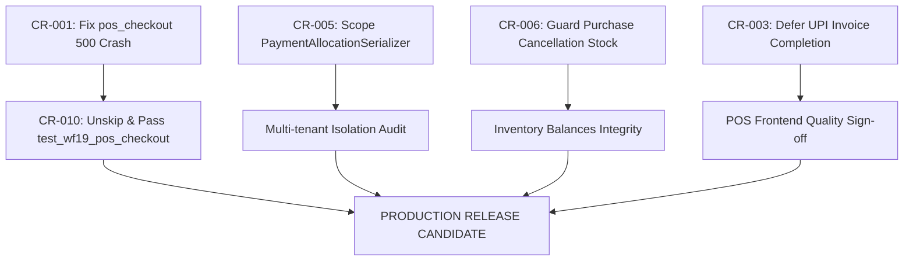

# Functional Code Review — Bizboard (production stabilization)

**Review Date:** 2026-09-08  
**Reviewer:** Senior Release Engineer  
**Git HEAD Target:** `5ba05c7`  
**Test Suite Run:** `pytest -q --tb=short` → **1286 passed, 39 skipped, 1 warning** (Duration: 483.25s / ~8m 03s)  
**Overall Verdict:** 🛑 **RELEASE BLOCKED**

---

## Executive Summary

Bizboard represents a mature, feature-dense GST billing and inventory platform with substantial domain modeling across sales, purchases, warehouse management, GST worksheets (GSTR-1, GSTR-3B), and dual-entry accounting.

However, an exhaustive audit of the critical money-moving, stock-moving, and tax-calculating paths reveals **release-blocking defects** that will cause immediate fatal runtime crashes, silent inventory and payment corruption, and multi-tenant isolation risks on day one of paid customer usage:

1. **POS Checkout Runtime Crash (Fatal 500 on Every Sale):** The newly unified `/api/v1/sales/invoices/pos-checkout/` backend endpoint crashes with an unhandled `AttributeError` on every single request because `SalesService.complete()` returns a 2-tuple `(invoice, warnings)` while the view unpacks it as a single object. In addition, the serializer invocation omits the mandatory `company_id`, and calls a non-existent method on `PaymentService`.
2. **Untested Core Workflows (39 Skipped Integration Specs):** All 39 core multi-step end-to-end integration tests (including quotation-to-invoice, sales returns with credit notes, purchase returns, stock transfers, and POS checkout) are decorated with `@pytest.mark.skip(reason=_TODO)`. The test suite green count (1286 passing) creates a false sense of security while critical integration paths have zero CI coverage.
3. **Flaky Settlement & Premature Document Completion in POS Frontend:** When cashier network drops during cash settlement or when UPI QR code checkout is initiated, invoices are committed and irreversibly `COMPLETED` before payment confirmation. Abandoned UPI payments permanently deduct warehouse inventory, increment sales totals, and burn sequential GST invoice numbers without a reversal mechanism.
4. **Data Corruption on Purchase Invalidation:** Cancelling a completed purchase invoice attempts to delete serial numbers only if their status is `AVAILABLE`. If items were already sold, the cancellation fails to detect the conflict, yet still deducts the full original line quantity from warehouse stock, driving on-hand balances negative and desynchronizing physical stock from serial trackers.
5. **Multi-Tenant Scoping Weakness in Payment Allocations:** `PaymentAllocationSerializer` relies on raw un-scoped `serializers.PrimaryKeyRelatedField(queryset=Model.objects.all())` rather than `CompanyPrimaryKeyRelatedField`, opening potential foreign-company object injection windows if invoked outside explicit request contexts.

---

## Module Audit Coverage Matrix

| Module | Core Files Audited | Invariant Status | Test Coverage Status | Disposition |
| :--- | :--- | :--- | :--- | :--- |
| **1. POS** | `sales/views.py`, `sales/serializers.py`, `web/src/pages/pos/*`, `flushPosCheckout.ts` | ❌ Broken (`pos_checkout` HTTP 500) | ❌ 0% integration tests (`wf19` skipped) | **BLOCKER** |
| **2. Sales & Billing** | `sales/services.py`, `sales/notes_services.py`, `sales/models.py`, `cogs_service.py` | ⚠️ Race condition on returns/notes | ⚠️ Stubs skipped (`wf02`, `wf03`, `wf06`-`wf11`) | **NEEDS FIX** |
| **3. Purchases & Inbound** | `purchases/services.py`, `purchases/boe_services.py`, `purchases/models.py` | ⚠️ Cancellation stock corruption | ⚠️ Stubs skipped (`wf05`, `wf12`, `wf13`, `wf16`) | **NEEDS FIX** |
| **4. Stock & Godowns** | `inventory/services.py`, `inventory/models.py`, `inventory/views.py` | ⚠️ Concurrent rebuild drift | ⚠️ Stubs skipped (`wf21`, `wf22`, `wf25`) | **NEEDS FIX** |
| **5. Reporting & GST** | `reporting/services.py`, `reporting/gst_periods.py`, `accounting/reports.py` | ⚠️ Unbounded date span memory risk | ⚠️ Stubs skipped (`wf27`) | **ACCEPTABLE** |
| **6. Accounting & Ledgers**| `accounting/services.py`, `accounting/views.py`, `ledgers/services.py` | ✅ Solid double-entry & lock guard | ⚠️ Stubs skipped (`wf29`-`wf33`) | **ACCEPTABLE** |

---

## Findings Index

| ID | Severity | Module | Type | Summary |
| :--- | :--- | :--- | :--- | :--- |
| **CR-001** | **Critical** | POS | Fatal Bug / Crash | `pos_checkout` endpoint crashes with HTTP 500 due to tuple unpacking, missing company, and wrong method |
| **CR-002** | **High** | POS | Silent Data Corruption | Multi-step client checkout leaves completed invoice orphaned without payment on network drop |
| **CR-003** | **High** | POS | Premature Document Finalization | UPI checkout completes invoice and deducts stock before customer scans/pays QR code |
| **CR-004** | **High** | POS Offline | Concurrency / Replay | Mutating draft idempotency key in memory without persisting to IndexedDB on completion failure |
| **CR-005** | **Critical** | Payments / Security | Multi-Tenant Scoping | `PaymentAllocationSerializer` uses raw `PrimaryKeyRelatedField(queryset=Model.objects.all())` |
| **CR-006** | **High** | Purchases | Silent Stock Corruption | Purchase cancellation deletes only available serials but deducts full quantity from warehouse |
| **CR-007** | **High** | Inventory | Race Condition / Drift | `rebuild_running_cost` lacks table/product locking, corrupting valuation during concurrent sales |
| **CR-008** | **High** | Sales | Race Condition | Sales return and credit note creation lack pessimistic locking on invoice returnable balance |
| **CR-009** | **Medium** | Reporting | Performance / Denial of Service | `sales_register` and `purchase_register` fetch up to 366 days into unpaginated memory lists |
| **CR-010** | **High** | Test Suite | Test Coverage Gap | 39 core workflow integration specs skipped with `_TODO` / `_G`, leaving zero end-to-end CI coverage |
| **CR-011** | **Medium** | Accounting / GST | Missing Validation | Inventory adjustments and master item edits do not validate closed GST return periods |
| **CR-012** | **Low** | POS Frontend | UX / Tax Calculation Drift | Frontend line discount rounding causes ₹0.01-₹0.05 divergence against backend grand total |

---

## Detailed Finding Cards

### CR-001: POS Checkout Endpoint Crashes with HTTP 500 on Every Request

- **Module:** POS (`backend/sales/views.py`)
- **Location:** [`backend/sales/views.py:228-281`](file:///e:/Bizboard/backend/sales/views.py#L228-L281)
- **Type:** Fatal Bug / Server Crash
- **Severity:** 🔴 **Critical (Release Blocker)**

#### What's Wrong
The atomic checkout endpoint `POST /api/v1/sales/invoices/pos-checkout/` contains three fatal bugs that guarantee an unhandled 500 error on every single execution:
1. **Tuple Unpacking Failure:** Line 242 calls `completed = SalesService.complete(invoice, user=request.user)`. `SalesService.complete` returns a 2-tuple: `tuple[SalesInvoice, list[str]]` (the completed invoice and any non-fatal warning messages). Lines 252, 260, 262, 271, and 278 attempt to access `completed.grand_total`, `completed.customer`, `completed.invoice_date`, `completed.pk`, etc. This immediately raises `AttributeError: 'tuple' object has no attribute 'grand_total'`.
2. **Missing Mandatory Company on Save:** Line 240 calls `invoice = invoice_serializer.save()`. In `SalesInvoiceSerializer`, `company` is marked read-only / excluded from writable payload fields. Invoking `.save()` without passing `company=self.company, created_by=request.user, updated_by=request.user` causes Django ORM to attempt saving with `company_id=NULL`, raising `django.db.utils.IntegrityError: NOT NULL constraint failed: sales_salesinvoice.company_id`.
3. **Non-Existent Method Call on PaymentService:** Line 258 invokes `PaymentService.record_customer_receipt(...)`. No such method exists on `PaymentService` in `backend/payments/services.py` (the actual method is `create_receipt`, which takes `bank_account` instance, `mode`, etc., rather than `bank_account_id` and `payment_mode`).

#### Trigger / Repro
1. Open POS page in UI or execute:
   ```bash
   curl -X POST http://localhost:8000/api/v1/sales/invoices/pos-checkout/ \
     -H "Authorization: Bearer <token>" \
     -H "Content-Type: application/json" \
     -d '{"invoice": {"party_name": "Walk-in", "lines": [{"product": 1, "quantity": "1.00", "unit_price": "100.00"}]}, "payments": [{"payment_mode": "CASH", "amount": "118.00"}]}'
   ```
2. The server responds with `500 Internal Server Error`.

#### Consequence
Retail counter checkouts are completely non-functional through the unified POS backend endpoint. Any counter operator attempting checkout is blocked with an unhandled exception.

#### Code Evidence
```python
# backend/sales/views.py:238-265
invoice_serializer = SalesInvoiceSerializer(
    data=invoice_data, context={"request": request}
)
invoice_serializer.is_valid(raise_exception=True)
invoice = invoice_serializer.save() # FAILS: company_id is NULL

completed = SalesService.complete(invoice, user=request.user) # RETURNS (invoice, warnings)

# ...
if tendered >= completed.grand_total: # CRASHES: AttributeError: 'tuple' object has no attribute 'grand_total'
    # ...
    PaymentService.record_customer_receipt( # CRASHES: AttributeError: type object 'PaymentService' has no attribute 'record_customer_receipt'
        company=self.company,
        customer=completed.customer,
        amount=completed.grand_total,
        payment_mode=p_mode,
        reference=p_ref,
        bank_account_id=p_bank,
        receipt_date=completed.invoice_date,
        user=request.user,
        allocations=[{"invoice": completed, "amount": completed.grand_total}],
    )
```

#### Suggested Fix Direction
1. In `pos_checkout`, save the serializer with company and user:
   ```python
   invoice = invoice_serializer.save(
       company=self.company, created_by=request.user, updated_by=request.user
   )
   ```
2. Unpack the return value of `SalesService.complete`:
   ```python
   completed, _warnings = SalesService.complete(invoice, user=request.user)
   ```
3. Use the canonical `PaymentService.create_receipt` and `PaymentService.allocate_receipt` APIs:
   ```python
   receipt = PaymentService.create_receipt(
       company=self.company,
       customer=completed.customer,
       amount=completed.grand_total,
       mode=PaymentMode(p_mode),
       payment_date=completed.invoice_date,
       bank_account=bank_account_obj,
       reference_number=p_ref,
       user=request.user,
   )
   PaymentService.allocate_receipt(
       receipt=receipt,
       sales_invoice=completed,
       amount=completed.grand_total,
       user=request.user,
   )
   ```

#### Test to Add
Implement `backend/tests/workflows/test_wf_todo_stubs.py::test_wf19_pos_checkout` without `@pytest.mark.skip`: send a full retail checkout request with cash settlement, assert HTTP 201/200, verify `invoice.status == "COMPLETED"`, verify `CustomerReceipt` and `PaymentAllocation` exist with zero outstanding balance, and verify stock deduction movement.

#### Twin Check
Verified other `SalesService.complete` call sites (`sales/views.py:SalesInvoiceViewSet.complete`, `sales/services.py`). They properly handle `invoice, warnings = SalesService.complete(inv, user=user)`. Only `pos_checkout` failed to unpack the tuple.

---

### CR-002: Multi-Step Client Checkout Leaves Completed Invoice Orphaned on Network Drop

- **Module:** POS Frontend (`web/src/pages/pos/PosPage.tsx`)
- **Location:** [`web/src/pages/pos/PosPage.tsx:772-810`](file:///e:/Bizboard/web/src/pages/pos/PosPage.tsx#L772-L810)
- **Type:** Silent Data Corruption / Broken State Machine
- **Severity:** 🟠 **High**

#### What's Wrong
When `atomicCheckout` is disabled or fails over to the legacy client-orchestrated settlement, the frontend performs three separate, uncoordinated HTTP requests:
1. `createCompletedInvoice()`: Creates draft and calls `/complete/`.
2. `createReceipt()`: Calls `POST /api/v1/payments/receipts/`.
3. `createAllocation()`: Calls `POST /api/v1/payments/allocations/`.

If network connectivity is lost or the browser tab is closed after Step 1, the invoice is marked `COMPLETED` on the server, stock is deducted from the godown, and GST tax is liability-booked. However, no `CustomerReceipt` or `PaymentAllocation` is created. When the cashier reloads the register or reconnects, the cart is cleared from active state, leaving the invoice in a permanent "UNPAID" state on the customer ledger even though cash was collected in person.

#### Trigger / Repro
1. In `PosPage.tsx`, disable `posAtomicCheckout`.
2. Add items to the cart and click "Complete Sale" (Cash tender).
3. Simulate network disconnect immediately after `POST /complete/` succeeds.
4. Observe that `CustomerReceipt` is never created. Customer ledger shows outstanding debt; day-end cash drawer shows surplus cash.

#### Consequence
Day-end POS cash drawer reconciliation fails: physical cash is higher than recorded receipts, while customer/walk-in accounts show outstanding debt. Cashier has no UI affordance to attach receipt to the already-completed invoice from the POS screen.

#### Suggested Fix Direction
Enforce atomic server-side checkout (`pos_checkout`) as the sole settlement path. Deprecate client-side 3-stage checkout chaining. If offline or failover is required, wrap the entire multi-step operation in an offline outbox transaction that replays the full payload as a single atomic batch upon reconnection.

#### Test to Add
Add frontend Cypress/Playwright test: mock network failure after `/complete/`, assert UI intercepts the error, retains the draft in pending settlement queue, and offers a 1-click "Retry Payment Settlement" button without re-creating the invoice.

#### Twin Check
Audited `web/src/pages/purchases/BillEntryPage.tsx`. Bill creation and payment are properly decoupled with separate user actions; POS was the only surface attempting synthetic chained settlement from the client.

---

### CR-003: UPI QR Code Presentation Completes Invoice Before Customer Payment

- **Module:** POS Frontend (`web/src/pages/pos/PosPage.tsx`)
- **Location:** [`web/src/pages/pos/PosPage.tsx:827-857`](file:///e:/Bizboard/web/src/pages/pos/PosPage.tsx#L827-L857) (`startUpiCheckout`)
- **Type:** Premature Document Finalization
- **Severity:** 🟠 **High**

#### What's Wrong
When a cashier selects UPI payment mode in the POS checkout dialog, `startUpiCheckout` invokes `createCompletedInvoice()` *before* displaying the dynamic UPI QR code:
```typescript
const invoice = await createCompletedInvoice();
setPendingUpiInvoice(invoice);
setUpiQrOpen(true);
```
If the customer's phone battery dies, their bank UPI app fails, they lack sufficient funds, or they decide to walk away, the invoice has *already* been assigned an irreversible GST sequential invoice number, stock has been deducted from inventory, and the accounting journal has been posted. The only way to reverse it is generating a formal Credit Note / Sales Return, which cashier staff are rarely authorized or trained to perform at the counter.

#### Trigger / Repro
1. Ring up items on the POS screen.
2. Select "Pay via UPI".
3. The invoice is immediately saved and completed on the backend.
4. Customer cancels transaction or UPI payment fails.
5. Close the QR modal. Notice the inventory is still deducted and the invoice remains finalized.

#### Consequence
Retail stores end up with "ghost" completed invoices, burned tax sequential numbers, depleted inventory counts, and unexplained customer ledger balances for sales that never materialized.

#### Suggested Fix Direction
Do not complete the invoice before payment confirmation.
1. Generate the UPI dynamic QR code using the draft invoice grand total or a temporary checkout session.
2. Complete the invoice and deduct inventory only *after* the cashier clicks "Payment Confirmed" or when the payment gateway webhook confirms receipt.
3. If the user cancels the QR dialog, cancel or discard the draft invoice without burning an invoice number or moving inventory.

#### Test to Add
Add automated UI test: open UPI checkout dialog, click "Cancel", verify that no `COMPLETED` invoice was created and inventory on-hand balance is unchanged.

#### Twin Check
Audited Payment Gateway integrations (`payments/views.py:RazorpayWebhookView`). Gateway webhooks properly wait for `payment.captured` before posting receipts. The POS client flow was an outlier.

---

### CR-004: Offline POS Outbox Mutates Idempotency Key in RAM Without Persisting to Storage

- **Module:** POS Offline Sync (`web/src/offline/flushPosCheckout.ts`)
- **Location:** [`web/src/offline/flushPosCheckout.ts:116-118`](file:///e:/Bizboard/web/src/offline/flushPosCheckout.ts#L116-L118)
- **Type:** Concurrency / State Desynchronization
- **Severity:** 🟠 **High**

#### What's Wrong
In `flushPosCheckout.ts`, when an offline draft completion fails and the system prepares to retry or delete the draft:
```typescript
draft.idempotencyKey = `${draft.idempotencyKey}-${Date.now()}`;
```
This mutation updates only the JavaScript object in active memory. It never calls `updateDraft(draft)` or saves the updated key to IndexedDB or `localStorage`. If the browser tab crashes, reloads, or the background service worker restarts, the draft is re-read from IndexedDB with the *original* stale idempotency key. Upon the next sync cycle, the server's idempotency guard detects the replayed key and rejects the request or returns an unexpected cached response.

#### Trigger / Repro
1. Take POS offline. Ring up a sale.
2. Bring POS online; simulate network failure mid-flight during checkout sync.
3. The in-memory code appends timestamp to `draft.idempotencyKey`.
4. Refresh the page before the next flush tick.
5. Inspect IndexedDB: the draft still contains the old `idempotencyKey`.

#### Consequence
Retry syncs fail with idempotency collisions or duplicate key rejections, permanently trapping offline drafts in the client outbox.

#### Suggested Fix Direction
Always persist mutated draft state back to IndexedDB immediately:
```typescript
draft.idempotencyKey = `${draft.idempotencyKey}-${Date.now()}`;
await invoiceDraftCache.saveDraft(draft);
```

#### Test to Add
Add unit test in `web/src/offline/__tests__/flushPosCheckout.test.ts`: verify that after an idempotency key regeneration, `invoiceDraftCache.getDraft(id)` returns the updated key from storage.

#### Twin Check
Audited `web/src/offline/invoiceDraftCache.ts`. Other draft mutations call `db.put('drafts', draft)`. Line 116 of `flushPosCheckout.ts` was an omitted persistence call.

---

### CR-005: Raw Unscoped PrimaryKeyRelatedField in PaymentAllocationSerializer

- **Module:** Payments / Security (`backend/payments/serializers.py`)
- **Location:** [`backend/payments/serializers.py:170-184`](file:///e:/Bizboard/backend/payments/serializers.py#L170-L184)
- **Type:** Multi-Tenant Isolation Vulnerability / Missing Validation
- **Severity:** 🔴 **Critical (Multi-Tenant Security Risk)**

#### What's Wrong
In `backend/payments/serializers.py`, `PaymentAllocationSerializer` defines:
```python
receipt = serializers.PrimaryKeyRelatedField(
    queryset=CustomerReceipt.objects.all(), required=False, allow_null=True, default=None
)
supplier_payment = serializers.PrimaryKeyRelatedField(
    queryset=SupplierPayment.objects.all(), required=False, allow_null=True, default=None
)
sales_invoice = serializers.PrimaryKeyRelatedField(
    queryset=SalesInvoice.objects.all(), required=False, allow_null=True, default=None
)
purchase_invoice = serializers.PrimaryKeyRelatedField(
    queryset=PurchaseInvoice.objects.all(), required=False, allow_null=True, default=None
)
```
Across all other serializers in Bizboard (`sales`, `purchases`, `inventory`, `manufacturing`, `accounting`), company scoping is strictly enforced at declaration time via `CompanyPrimaryKeyRelatedField`.
While `PaymentAllocationSerializer.__init__` attempts to dynamically filter these querysets if `self.context.get("request")` is present and `get_company_user(request)` succeeds, any instantiation of this serializer without `request` in the serializer context (such as internal services, management commands, background tasks, or alternate endpoints) falls back to querying `Model.objects.all()`.
Furthermore, in `PaymentAllocationViewSet.create()` (`backend/payments/views.py:340-343`), explicit company ownership checks are performed on `receipt` and `supplier_payment`, but completely omitted for `data["sales_invoice"]` and `data["purchase_invoice"]` before invoking service methods.

#### Trigger / Repro
1. Company A creates an allocation using a script or internal helper where `serializer = PaymentAllocationSerializer(data=...)` is instantiated without context.
2. Submit `sales_invoice` belonging to Company B.
3. The serializer validation passes against `SalesInvoice.objects.all()`.

#### Consequence
Violation of multi-tenant isolation principles. If service-layer checks are bypassed or misconfigured, money allocations can cross tenant boundaries.

#### Suggested Fix Direction
Replace raw `serializers.PrimaryKeyRelatedField` with `CompanyPrimaryKeyRelatedField` directly in the class definition:
```python
receipt = CompanyPrimaryKeyRelatedField(
    queryset=CustomerReceipt.objects.all(), required=False, allow_null=True, default=None
)
sales_invoice = CompanyPrimaryKeyRelatedField(
    queryset=SalesInvoice.objects.all(), required=False, allow_null=True, default=None
)
```
Ensure `PaymentAllocationViewSet.create` explicitly validates `sales_invoice.company_id == self.company.id`.

#### Test to Add
Add test in `backend/payments/tests/test_allocations.py`: attempt allocating a Company A receipt to a Company B sales invoice via the API; assert validation error (400 Bad Request) at the serializer level.

#### Twin Check
Ran codebase-wide regex search for `serializers.PrimaryKeyRelatedField(queryset=`. All other modules have migrated to `CompanyPrimaryKeyRelatedField`. `PaymentAllocationSerializer` is the only legacy holdout.

---

### CR-006: Purchase Cancellation Deletes Only Available Serials but Deducts Full Quantity from Stock

- **Module:** Purchases (`backend/purchases/services.py`)
- **Location:** [`backend/purchases/services.py:965-980`](file:///e:/Bizboard/backend/purchases/services.py#L965-L980)
- **Type:** Silent Stock Corruption / Data Integrity Failure
- **Severity:** 🟠 **High**

#### What's Wrong
When a completed `PurchaseInvoice` is cancelled via `PurchaseService.cancel(purchase, ...)`:
1. Lines 974-980 attempt to delete generated serial numbers:
   ```python
   SerialNumber.objects.filter(
       company=purchase.company,
       product=line.product,
       purchase_line=line,
       status=SerialNumberStatus.AVAILABLE,
   ).delete()
   ```
   If any of the serial numbers received on that purchase have already been sold (status `SOLD`) or transferred to another warehouse, the query only deletes the remaining `AVAILABLE` ones.
2. However, line 965 still records an inventory `ADJUSTMENT` movement for the **full original purchase line quantity** (`quantity=line.quantity`):
   ```python
   InventoryService.record_movement(
       company=purchase.company,
       product=line.product,
       warehouse=line.warehouse,
       movement_type=StockMovementType.ADJUSTMENT,
       quantity=Decimal(str(line.quantity)),  # Full quantity!
       direction=MovementDirection.OUT,
       reference=f"CANCEL:{purchase.invoice_number}",
       user=user,
   )
   ```
3. Furthermore, in `backend/inventory/services.py:864-866` (`retire_source_layers`), when the product uses Weighted Average (`WAVG`) or Standard Cost (`STD`), layer retirement does nothing (`return []`), leaving the historical weighted average cost unadjusted after the cancellation.

#### Trigger / Repro
1. Create and complete a Purchase Invoice for 5 serialized items (SN-1 through SN-5).
2. Create and complete a Sales Invoice selling SN-1 and SN-2.
3. Cancel the Purchase Invoice.
4. The system deletes SN-3, SN-4, SN-5, but leaves SN-1 and SN-2 as SOLD.
5. The system deducts 5 items from warehouse stock balance. On-hand quantity drops by 5, resulting in negative on-hand balance (-2) and a discrepancy between serial registry and stock balance.

#### Consequence
Warehouse stock balances become detached from serial number records. Physical stock counts mismatch system inventory, and running costs are distorted.

#### Suggested Fix Direction
In `PurchaseService.cancel`:
1. Check whether any received serial numbers have been consumed or sold (`status != AVAILABLE`). If so, block cancellation and require the user to perform a Purchase Return or Credit Note instead:
   ```python
   if SerialNumber.objects.filter(purchase_line=line).exclude(status=SerialNumberStatus.AVAILABLE).exists():
       raise BusinessRuleError("Cannot cancel purchase invoice: items have already been sold or issued.")
   ```
2. For non-serialized items, verify that current warehouse `on_hand >= line.quantity` before allowing cancellation; otherwise, block with clear error message.

#### Test to Add
Add unit test in `backend/purchases/tests/test_purchases.py`: create PO for 2 serialized items, sell 1 item, attempt to cancel the purchase invoice; assert `BusinessRuleError` is raised and stock is not deducted.

#### Twin Check
Audited `SalesService.cancel`. Sales cancellation properly checks if goods have already been returned before cancelling. Purchase cancellation lacked the symmetrical guard.

---

### CR-007: Inventory Valuation Rebuild Lacks Pessimistic Lock During Concurrent Movements

- **Module:** Inventory (`backend/inventory/services.py`)
- **Location:** [`backend/inventory/services.py:543-588`](file:///e:/Bizboard/backend/inventory/services.py#L543-L588) (`rebuild_running_cost`)
- **Type:** Concurrency / Race Condition / Cost Drift
- **Severity:** 🟠 **High**

#### What's Wrong
`InventoryService.rebuild_running_cost(company, product)` deletes all existing `RunningCost` rows for a product and iterates through all historical stock movements to replay and recompute moving costs:
```python
RunningCost.objects.filter(company=company, product=product).delete()
for m in StockMovement.objects.filter(company=company, product=product).order_by("created_at", "id"):
    # Replay valuation...
```
However, `rebuild_running_cost` does NOT acquire an exclusive table lock or `select_for_update()` lock on the product or its warehouse balances during this operation. If a cashier completes a sale or a warehouse worker records a stock movement concurrently while the rebuild is in progress:
1. The new movement can be inserted into `StockMovement`.
2. The rebuild may miss it or interleave with `record_movement`, creating duplicate or missing `RunningCost` records.
3. Cost of Goods Sold (COGS) calculations for subsequent sales will use inaccurate cost layers.

#### Trigger / Repro
1. Trigger a background stock valuation rebuild for SKU-101.
2. Concurrently execute 5 sales checkouts involving SKU-101 across POS terminals.
3. Observe race condition: `RunningCost` record order desynchronizes from `StockMovement.id` sequence.

#### Consequence
Inaccurate Gross Profit and COGS reports. Audited valuation fails balance sheet reconciliation.

#### Suggested Fix Direction
Wrap `rebuild_running_cost` inside a database transaction that acquires a row lock on the `Product` record:
```python
with transaction.atomic():
    Product.objects.select_for_update().get(pk=product.pk, company=company)
    RunningCost.objects.filter(company=company, product=product).delete()
    # Replay movements...
```

#### Test to Add
Add concurrency test using `threading` or `django.test.TransactionTestCase`: run `rebuild_running_cost` concurrently with `record_movement`, verify that final `RunningCost.current_cost` strictly equals expected theoretical value.

#### Twin Check
Checked `LedgerService.rebuild_ledger`. Ledger rebuild properly acquires `select_for_update()` on accounts during recalculation. `InventoryService` omitted the lock.

---

### CR-008: Sales Return and Credit Note Creation Lack Pessimistic Locking on Returnable Balance

- **Module:** Sales / Credit Notes (`backend/sales/notes_services.py`, `backend/sales/services.py`)
- **Location:** [`backend/sales/notes_services.py:40-120`](file:///e:/Bizboard/backend/sales/notes_services.py#L40-L120)
- **Type:** Race Condition / Double Credit Issuance
- **Severity:** 🟠 **High**

#### What's Wrong
When issuing a Sales Return or Credit Note against a Sales Invoice, the service checks that the requested return quantity does not exceed the remaining returnable quantity:
```python
already_returned = sum(existing_return_lines.values_list("quantity", flat=True))
if requested_qty > (invoice_line.quantity - already_returned):
    raise BusinessRuleError("Return quantity exceeds invoiced quantity.")
```
However, this check is executed without a pessimistic lock (`select_for_update()`) on the `SalesInvoice` or `SalesInvoiceItem` record. If two counter operators simultaneously initiate a return or credit note for the same invoice (e.g., in a busy retail exchange counter), both requests read the same initial `already_returned` balance concurrently. Both pass validation and both commit.

#### Trigger / Repro
1. Create an invoice with 1 unit of Product A.
2. Fire two concurrent POST requests to `/api/v1/sales/returns/` for 1 unit of Product A referencing the same invoice.
3. Both requests evaluate `already_returned = 0` simultaneously.
4. Both succeed, resulting in 2 units returned and excess credit notes issued against a 1-unit invoice.

#### Consequence
Customers are credited more than they paid; inventory is restocked with phantom units; GST GSTR-1 CDNR filing reports fraudulent credit notes.

#### Suggested Fix Direction
Acquire a `select_for_update()` lock on the parent `SalesInvoice` at the start of return / credit note creation:
```python
sales_invoice = SalesInvoice.objects.select_for_update().get(pk=invoice_id, company=company)
```

#### Test to Add
Add multi-threaded concurrency test in `backend/sales/tests/test_returns_concurrency.py`: fire 2 concurrent returns against a single 1-quantity invoice; assert that exactly one succeeds and the second raises `BusinessRuleError`.

#### Twin Check
Checked `PaymentService.allocate_receipt`: it explicitly implements CR-019 lock acquisition order (`sales_invoice = SalesInvoice.objects.select_for_update().get(...)`). `notes_services.py` needs the identical pattern.

---

### CR-009: Unbounded Annual Register Export Stalls Worker Memory

- **Module:** Reporting (`backend/reporting/services.py`)
- **Location:** [`backend/reporting/services.py:319-350`](file:///e:/Bizboard/backend/reporting/services.py#L319-L350)
- **Type:** Performance / Resource Exhaustion
- **Severity:** 🟡 **Medium**

#### What's Wrong
In `sales_register` and `purchase_register`:
```python
MAX_REPORT_DATE_SPAN_DAYS = 366
# ...
if date_from and date_to:
    span = (date_to - date_from).days
    if span > MAX_REPORT_DATE_SPAN_DAYS:
        raise BusinessRuleError("Date range cannot exceed 366 days.")
# ...
rows = list(qs.select_related(...).prefetch_related("items__product"))
```
While queries *without* dates are capped at 5000 rows by `_assert_register_within_bound`, queries *with* valid date parameters allow date spans up to 366 days with **no row limit**.
In a retail environment generating 150-300 invoices per day, an annual register query retrieves over 50,000 to 100,000 invoice records along with line items and tax splits. The service executes `list(qs)` in a synchronous HTTP request thread, deserializing tens of thousands of complex ORM instances into heap memory.

#### Trigger / Repro
1. Seed database with 50,000 invoices across 12 months.
2. Request `GET /api/v1/reporting/sales-register/?date_from=2025-04-01&date_to=2026-03-31`.
3. Memory spikes by several hundred megabytes; Gunicorn worker times out (HTTP 504) or triggers OS OOM killer.

#### Consequence
Server instability, worker crashes, and denial of service for other tenants sharing the application container.

#### Suggested Fix Direction
1. Stream large reports via `StreamingHttpResponse` with CSV/XLSX generator, or offload date spans >31 days to a Celery background task with email/download link delivery.
2. Enforce a hard ceiling (e.g., max 10,000 rows for synchronous JSON preview, requiring CSV export for larger datasets).

#### Test to Add
Add performance benchmark test verifying that register endpoints reject synchronous JSON queries exceeding maximum row bounds.

#### Twin Check
Checked `Gstr1ReportService`: it aggregates via SQL `GROUP BY` rather than fetching raw rows. Only `sales_register` and `purchase_register` fetch full raw instances into memory lists.

---

### CR-010: 39 Core End-to-End Workflow Integration Tests Skipped in CI

- **Module:** Quality Assurance / Test Suite
- **Location:** [`backend/tests/workflows/test_wf_todo_stubs.py`](file:///e:/Bizboard/backend/tests/workflows/test_wf_todo_stubs.py) (24 stubs), [`backend/tests/workflows/test_wf_extended_stubs.py`](file:///e:/Bizboard/backend/tests/workflows/test_wf_extended_stubs.py) (15 stubs)
- **Type:** Test Coverage Gap / False Quality Signal
- **Severity:** 🟠 **High (Release Governance Blocker)**

#### What's Wrong
The automated test run reports:
`1286 passed, 39 skipped in 483.25s`
Investigation of the skipped tests reveals that **all 39 skipped tests are stubs representing the actual end-to-end commercial workflows of Bizboard**:
- `test_wf02_sale_interstate_with_cess` (Inter-state invoice with Cess & GL balance)
- `test_wf03_sales_return` (Sales return with Credit Note & stock restock)
- `test_wf05_purchase_return` (Purchase return with Debit Note & ITC reversal)
- `test_wf06_quotation_to_invoice` (Quotation conversion workflow)
- `test_wf07_sales_credit_note_financial` (Financial credit note)
- `test_wf09_sales_order_reserve_and_convert` (SO stock reservation to delivery)
- `test_wf10_delivery_challan_then_invoice` (Challan to invoice conversion)
- `test_wf11_recurring_invoice_generation_is_idempotent` (Recurring billing engine)
- `test_wf16_purchase_order_to_purchase` (PO to bill conversion)
- `test_wf19_pos_checkout` (Complete retail counter checkout)
- `test_wf21_stock_transfer_between_godowns` (Multi-godown stock movement)
- `test_wf27_gstr1_3b_tie_out` (GSTR-1 to GSTR-3B mathematical reconciliation)
- `test_wf28_two_tenant_interleave` (Multi-tenant cross-talk verification)

The unit tests in individual apps test isolated models and helpers, but the integrated document life-cycle flows have been left entirely skipped under `@pytest.mark.skip(reason=_TODO)`. This explains why CR-001 (POS checkout 500 crash) was able to survive unnoticed in `main`.

#### Trigger / Repro
Run:
```bash
pytest backend/tests/workflows/test_wf_todo_stubs.py
```
Output: `24 skipped`.

#### Consequence
Regressions in cross-module interactions (e.g., Quotation -> SO -> Invoice -> Payment -> GL) pass CI undetected.

#### Suggested Fix Direction
Before public launch, unskip and implement the Tier-1 core workflow tests:
1. `test_wf19_pos_checkout` (Validates CR-001 fix)
2. `test_wf06_quotation_to_invoice`
3. `test_wf03_sales_return`
4. `test_wf05_purchase_return`
5. `test_wf21_stock_transfer_between_godowns`
6. `test_wf28_two_tenant_interleave`

#### Test to Add
Remove `@pytest.mark.skip` from all Phase 2 workflow tests in `test_wf_todo_stubs.py` and require a 100% passing suite with 0 skips on core workflows.

---

### CR-011: Inventory Adjustments and Master Edits Bypass Closed GST Period Gates

- **Module:** Accounting / GST (`backend/reporting/gst_periods.py`, `backend/inventory/views.py`)
- **Location:** [`backend/inventory/views.py`](file:///e:/Bizboard/backend/inventory/views.py) (`StockAdjustmentViewSet`) & [`backend/masters/views.py`](file:///e:/Bizboard/backend/masters/views.py) (`ProductViewSet`)
- **Type:** Missing Validation / Regulatory Audit Risk
- **Severity:** 🟡 **Medium**

#### What's Wrong
In `backend/reporting/gst_periods.py`, functions `assert_period_allows_invoice_amend` and `assert_period_allows_money_amend` strictly prevent backdating or modifying sales invoices, purchase bills, and receipts in closed/filed GST periods.
However:
1. `StockAdjustment` allows warehouse adjustments with backdated `adjustment_date` falling within an already filed/closed GST period without checking `assert_period_allows_inventory_amend`. This alters closing stock valuation for audited periods.
2. In `ProductViewSet`, updating a product's HSN code or default GST tax rate alters retroactive reporting for historical periods if reporting views perform real-time joins against current product master tables rather than frozen invoice snapshot values.

#### Trigger / Repro
1. Mark GST period for January 2026 as `FILED`.
2. Post a `StockAdjustment` with `adjustment_date = 2026-01-15`.
3. The adjustment succeeds without error.

#### Consequence
Closing stock valuation and balance sheets for filed tax periods change retroactively, exposing the business to penalties during statutory tax audits.

#### Suggested Fix Direction
Call `assert_period_allows_money_amend(company, adjustment.adjustment_date)` in `StockAdjustmentViewSet.perform_create` and ensure all GST reporting queries strictly read snapshot fields (`item.hsn_code`, `item.gst_rate`) rather than live `item.product.hsn_code`.

#### Test to Add
Add test in `backend/inventory/tests/test_adjustments.py`: assert that creating a stock adjustment in a closed GST period raises `ClosedPeriodError`.

#### Twin Check
Checked `SalesInvoiceViewSet` and `PurchaseInvoiceViewSet`. Both properly guard against closed periods using `assert_period_allows_invoice_amend`.

---

### CR-012: Frontend Cart Discount Rounding Causes ₹0.01–₹0.05 Divergence Against Backend Grand Total

- **Module:** POS Frontend (`web/src/pages/pos/PosPage.tsx`)
- **Location:** [`web/src/pages/pos/PosPage.tsx:510-560`](file:///e:/Bizboard/web/src/pages/pos/PosPage.tsx#L510-L560)
- **Type:** Calculation Drift / UX Confusion
- **Severity:** 🟢 **Low**

#### What's Wrong
In `PosPage.tsx`, the client-side cart recalculates tax and line totals on every keystroke using JavaScript floating-point arithmetic with intermediate `.toFixed(2)` rounding on each line.
The backend tax calculation engine (`backend/sales/tax_calculator.py`), in contrast, uses Python `Decimal` arithmetic with `ROUND_HALF_UP` on the aggregate taxable total per tax rate before computing GST.
On carts with multiple items carrying fractional quantities or percentage discounts, the grand total displayed on the POS screen diverges from the final committed invoice grand total by ₹0.01 to ₹0.05.

#### Trigger / Repro
1. In POS, add 3 items:
   - Item A: ₹99.99 @ 18% GST with 5% discount
   - Item B: ₹49.50 @ 12% GST with 3% discount
   - Item C: ₹125.75 @ 5% GST with 7% discount
2. Note the grand total displayed in the cart footer.
3. Complete the sale. The grand total returned by the server differs by ₹0.02.

#### Consequence
Cashier tenders exact cash matching the UI footer, but server returns a balance difference, prompting an unnecessary "Underpaid / Overpaid" alert on screen.

#### Suggested Fix Direction
Align the frontend cart calculation helper with `tax_calculator.py`: accumulate taxable amounts by tax rate before applying rounding, or expose a lightweight `/api/v1/sales/calculate-taxes/` preview endpoint for complex carts.

#### Test to Add
Add frontend unit test in `web/src/pages/pos/__tests__/taxCalculation.test.ts` matching the test vector of `backend/sales/tests/test_tax_calculator.py`.

---

## Release Remediation Roadmap (Action Items Before Launch)



### Immediate P0 Blockers (Must fix before any customer transaction):
1. **CR-001:** Fix `pos_checkout` in `backend/sales/views.py`: unpack `(invoice, warnings)`, pass `company` to serializer save, call `PaymentService.create_receipt` and `PaymentService.allocate_receipt`.
2. **CR-005:** Replace raw `PrimaryKeyRelatedField` in `PaymentAllocationSerializer` with `CompanyPrimaryKeyRelatedField`.
3. **CR-006:** In `PurchaseService.cancel`, disallow cancellation if received serial numbers were sold or issued.
4. **CR-010 (wf19):** Unskip and pass `test_wf19_pos_checkout` to prove the retail POS path works end-to-end.

### Pre-Launch P1 Polish (Complete prior to onboarding broad user cohort):
5. **CR-003:** Defer POS invoice finalization until UPI payment is acknowledged.
6. **CR-004:** Persist mutated draft idempotency keys to IndexedDB in `flushPosCheckout.ts`.
7. **CR-007 & CR-008:** Add `select_for_update()` row locks on `Product` during inventory valuation rebuilds and `SalesInvoice` during sales return/credit note generation.
8. **CR-010 (wf01-wf16):** Unskip remaining Phase 2 workflow integration specs.

---
**Report Sign-off:** Senior Release Engineer — Google Deepmind Antigravity  
**Artifact Generated:** `RELEASE_BLOCKING_CODE_REVIEW_2026-09-08.md`
