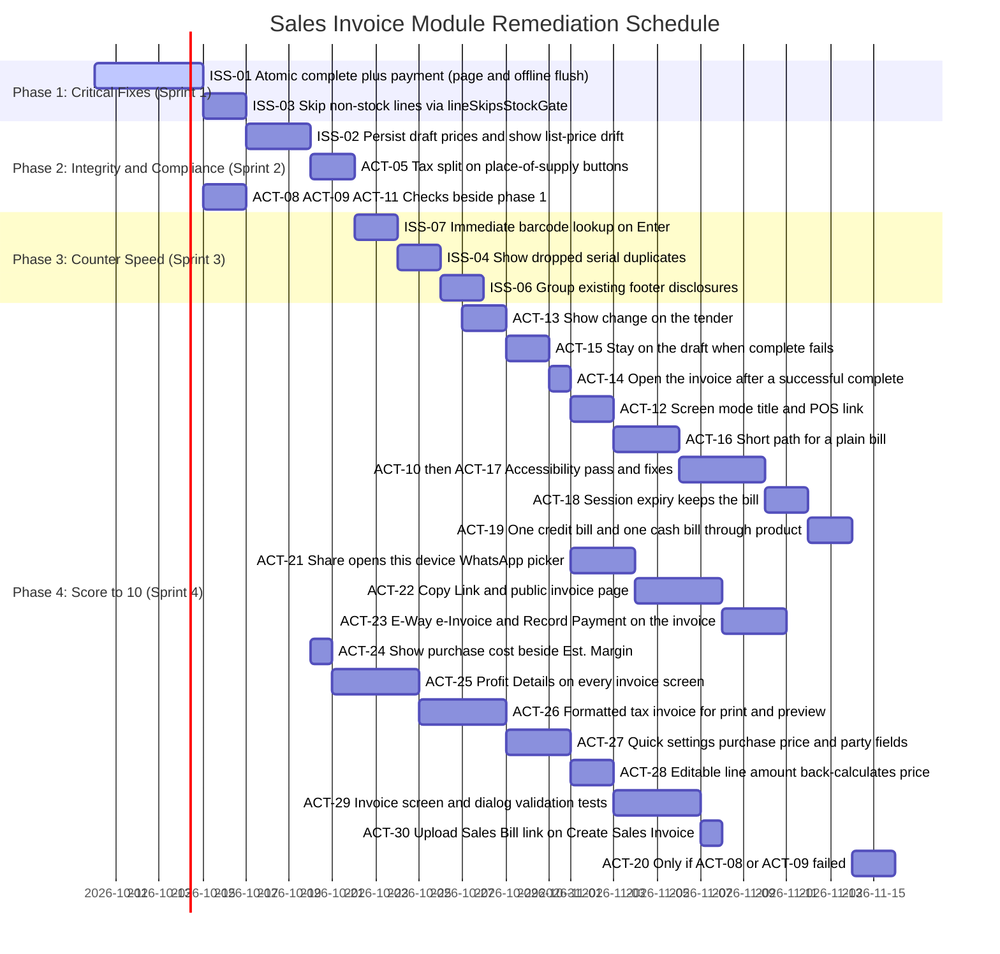

# Sales Invoice Module: Comprehensive Issue Audit & Remediation Plan

**Document:** `Sales_invoice.md`  
**System Module:** Create Sales Invoice (`web/src/pages/sales/NewInvoicePage.tsx`)  
**Backend Domain:** `backend/sales/` (`services.py`, `views.py`, `models.py`)  
**Related paths:** `web/src/pages/sales/invoice/useInvoiceOffline.ts`, `backend/sales/views.py` (`pos_checkout`, `record_payment`)  
**Audit Roles:** Principal Product Manager · Senior UX Designer · Business Analyst · Software Architect · QA Lead  
**Audit Date:** October 2026  
**Status:** Action register from the October 2026 product review. ACT-01 through ACT-30 are done in code. ACT-20 is not required. Credit exposure on the customer detail subtracts unallocated advances. Preview of an unsaved bill and the triplicate download use the same PDF renderer. The INV screen checks are automated tests.  
**Kind split:** Defects are ACT-01 through ACT-11, ACT-15, and ACT-18. Everything else is an enhancement. Checks (ACT-08, ACT-09, ACT-10, ACT-11, ACT-19) do not change code unless they fail.  
**Verdict:** Ready with fixes. A credit invoice can be completed. Taking money on this screen cannot, until ACT-01 is done.  
**One build order:** the Action order table is the only sequence. The Gantt and the implementation-plan order follow it. The shared-file table is merge order inside a file, not a second schedule.  

---

## Executive Summary

The **Create Sales Invoice** module is an enterprise-grade billing interface supporting Indian GST compliance, multi-godown stock controls, batch FEFO selection, serialized inventory tracking, collection hold ladders, and offline PWA functionality.

A code-checked audit found two correctness bugs worth fixing first, plus several UX gaps whose original sketches do not match the code.

The critical issue (**P0**, ACT-01) is that counter payment is applied in later HTTP calls after invoice completion has already committed. The same split is repeated when an offline draft is flushed. A sales user who cannot create receipts hits this on every cash complete: the invoice API allows the call, and the receipt API rejects it. The online path does flash a payment warning, so the failure is visible, but nothing retries the receipt. POS checkout already settles the bill inside one database transaction and requires both sales and payments permissions; this page should follow that pattern.

The stock gate (**P1**) blocks service and non-stock lines on the client even though the server already skips them. Draft price refresh (**P1**) is intentional for unedited lines, and the current draft payload throws away the authored price, so "keep the old price" cannot be offered until that write changes.

ACT-01 through ACT-07 are the defects that make a counter bill trustworthy. ACT-12 through ACT-30 are enhancements. The score table is a closure checklist for those items, not a measured quality score. Each action's Done when list is the acceptance test. The implementation-plan chapter names modules, dependencies, and the other flows that must still pass.

---

## Issue Summary Matrix

| ID | Priority | Category | Issue Description | Impact Surface | Effort |
|---|---|---|---|---|---|
| **ISS-01** / ACT-01 | **P0** | Architecture / Financial | Invoice complete commits before receipt and allocation. Amount received is also offered to users who cannot create receipts | Accounts Receivable, Cash Register, General Ledger, Permissions | Moderate |
| **ISS-02** / ACT-02 | **P1** | Data Integrity / Pricing | Local draft drops unedited prices, then restore refills from catalog and ignores the customer price list | Sales Margin, Customer Trust, Price Lists | Low |
| **ISS-03** / ACT-03 | **P1** | Inventory / Workflow | In-memory stock shortfall check flags services and non-stock items under `BLOCK` | Service Billing, Counter Dispatch | Low |
| **ISS-04** / ACT-04 | **P2** | UX / Dispatch Efficiency | Serial duplicates are dropped with no message on this page | Warehouse Operations, Barcode Dispatch | Low |
| **ISS-05** / ACT-05 | **P2** | Compliance / UX | Place-of-supply conflict buttons do not say which tax split the choice selects | GST Audit, GSTR-1, Operator Confidence | Low |
| **ISS-07** / ACT-07 | **P2** | UX / Retail Speed | Barcode add waits on a 300ms debounced search, so a fast second scan drops the first | Cashier Throughput, Checkout Speed | Low |
| **ISS-06** / ACT-06 | **P3** | UI / Cognitive Load | TCS sits with notes, terms, bank, and UPI as separate footer disclosures | Visual Rhythm, Form Organization | Low |
| **ACT-08** | — | Needs verification | Credit-limit outstanding on the form versus the ledger at complete | Credit control | Low |
| **ACT-09** | — | Needs verification | Delivery challan that already posted stock must not deduct again on invoice complete | Inventory | Low |
| **ACT-10** | — | Needs verification | Keyboard, focus, and narrow-viewport pass on this editor | Accessibility | Low |
| **ACT-11** | — | Needs verification | Cheque image and GSTIN in logs; device-draft isolation across users | Security | Low |
| **ACT-12** | **P3** | Purpose | New bill, draft edit, and completed amend share one title | Operator confidence | Low |
| **ACT-13** | **P1** | UX / Payments | Amount received above the total shows balance ₹0 and does not show change | Cash Register, Operator confidence | Low |
| **ACT-14** | **P1** | Flow | A successful complete opens the history list, not the invoice that was just saved | Print, Share, Invoice detail | Low |
| **ACT-15** | **P1** | Error recovery | Complete can fail after the draft is saved, and the user is sent away from that draft | Draft resume | Low |
| **ACT-16** | **P1** | Cognitive load | Statutory controls stay in the default path on a simple bill | Counter speed, GST | Moderate |
| **ACT-17** | **P1** | Accessibility | Fixes for the failures recorded by ACT-10 | Keyboard, narrow viewport | Moderate |
| **ACT-18** | **P1** | Session | A 401 during save can drop the operator off the bill they were completing | Draft, Idempotency | Low |
| **ACT-19** | **P1** | Cross-product | One finished bill is not re-read through history, ledger, stock, PDF, and GST | Reports, GSTR, PDF | Low |
| **ACT-20** | **P1** | Conditional | Credit-limit or challan-stock mismatch found by ACT-08 or ACT-09 | Credit control, Inventory | Low |
| **ACT-21** | **P1** | Share | Share sends through the business WhatsApp API or a fixed phone number, so the user cannot pick a contact or group on this device | Invoice, POS, collections, ledgers, payments, support | Moderate |
| **ACT-22** | **P1** | Share | No Copy Link. Recipients cannot open one invoice without a BizBoard login | Public invoice page, PDF | Moderate |
| **ACT-23** | **P1** | Post-invoice | E-Way Bill, e-Invoice, and Record Payment are not on the completed-invoice action bar | Invoice detail | Moderate |
| **ACT-24** | **P2** | Pricing | Est. Margin shows the rupee and percent without the purchase cost those figures use | Invoice editor totals | Low |
| **ACT-25** | **P1** | Profit | No Profit Details view. Item cost, tax payable, and profit or loss are not shown on the invoice | Invoice detail, editor, history, POS, dashboard, customer | Moderate |
| **ACT-26** | **P1** | Print | The printable invoice is not the formatted tax invoice, and the editor has no preview of it | PDF, print, editor preview, public page | Moderate |
| **ACT-27** | **P1** | Settings | Show purchase price while adding items does nothing, and party custom fields fail or never appear on the invoice | Quick settings, item add, party panel | Moderate |
| **ACT-28** | **P1** | Lines | The line amount is display-only. Editing it does not back-calculate price per item | Sales invoice lines, purchase lines | Moderate |
| **ACT-29** | **P1** | Tests | The invoice screen and its dialogs have no automated pass that each control accepts valid input and rejects invalid input | Create invoice, quick settings, party, item, detail | Moderate |
| **ACT-30** | **P3** | Entry | Create Sales Invoice has no link to Upload Sales Bill. That page exists only under Sales → More | Create invoice header | Low |

---

## Action Items

Defects are ACT-01 through ACT-11, ACT-15, and ACT-18. The rest are enhancements. ACT-21 changes invoice Share and POS Share. Reminder links keep the customer's phone. ACT-08 through ACT-11 and ACT-19 are checks. ACT-17 fixes whatever ACT-10 finds. ACT-20 is written only if ACT-08 or ACT-09 fails. The closure checklist after the action order is not a quality score.

---

### ACT-01 (P0) — Settle upfront payment inside invoice complete

**Status:** Done  
**Classification:** Observed  
**Pairs with:** ISS-01  
**Screens:** `/sales/new`, `/sales/history/:id/edit`  
**Also:** offline flush in `web/src/pages/sales/invoice/useInvoiceOffline.ts`

#### Problem

`saveMutation` completes the invoice, then calls `createReceipt`, then `createAllocation`. `SalesService.complete` commits on its own. If the tab closes, the network drops, or the receipt call fails, the invoice stays **COMPLETED** and unpaid. The UI flashes `paymentWarning` and does not retry.

`flushInvoiceDraft` repeats the same three steps. If the receipt succeeds and the allocation fails, that path does not surface `paymentWarning`.

`record-payment` already creates a receipt and an allocation in one transaction. It is still a second HTTP call, so switching the client to it does not close the hole.

#### Permission gap (same action)

The route and invoice `complete` require `canCreateSales` only. `NewInvoicePage.tsx` never checks `canCreatePayments`. `CustomerReceiptViewSet` requires `CanCreatePayments` to create a receipt. POS checkout (`pos_checkout`) requires both.

A sales-only user who enters an amount received will complete the invoice and then receive a refusal on the receipt. That is a deterministic unpaid bill, not only a network race.

Putting the receipt inside `complete` without adding `CanCreatePayments` would let a sales-only user post cash. The payments check has to stay.

#### Impact

- Cash or card taken at the counter is missing from receipts.
- The customer ledger stays open, so collection can run against someone who already paid.
- When books are on, the sales journal posts and the cash journal does not.
- Sales history shows a normal unpaid invoice. There is no "payment failed" state.

**Level:** High for payments, ledger, accounting, and audit.

#### What to do

1. Hide or disable amount received, payment mode, and cheque fields unless `canCreatePayments(user)` is true. A credit invoice (nothing received) stays available to every sales user.
2. Extract settlement into a helper called from `complete` inside one outer `transaction.atomic()`, the same shape as `pos_checkout`. The helper runs only after `SalesService.complete` returns. Pass through every argument `_run()` already handles: RCM confirm, blank place-of-supply confirm, GSTIN total change, licence, GST-guard override, unlock code, below-cost reason, and pharmacy fields. Do not replace that call with a stripped sketch.
3. If `amount_received > 0` and the user lacks `CanCreatePayments`, reject before anything commits.
4. `amount_received` is the tender for this gesture, not a running total and not `previous received + delta` computed in the browser. `still_open` is `grand_total` minus allocations already on the invoice. A draft that already has a receipt uses that open balance.
5. Cash only: cap the receipt at `min(tendered, grand_total, still_open)`. Store `tendered` and `change_given` on the receipt (new fields). Notes may repeat them. Reports read the fields. A smaller cash amount stays a part-payment. Do not park the excess as an unallocated advance. Card, UPI, bank, and cheque reject a tender above `still_open`. They do not become change.
6. `receipt_date` is today's date in the company timezone, not `invoice.invoice_date`. If that date falls in a locked period, reject the payment inside the same transaction.
7. Confirm the invoice number is allocated inside this transaction. If a rolled-back payment still consumes a number, GST Rule 46 (consecutive serials) is broken. The acceptance test below covers that. Do not ship a gap and call it harmless.
8. Pass cheque number, bank, date, and image through `cheque_fields_from_payload`. The image is a `FileAsset` id.
9. Payment validation fails this same transaction. A failure in `allocate_receipt` rolls back the invoice, the stock movements, and the journals.
10. Idempotency stays `wrap_idempotent` (`scope="sales_invoice_complete"`). A rolled-back request must not store a failure under that key. Check `on_commit` hooks (PDF, e-invoice, notifications) so they run only after the outer transaction commits. Do not add `idempotency_key` or `cheque_details` to `PaymentService.create_receipt` or `allocate_receipt`.
11. Extend `completeSalesInvoice` with `amountReceived`, `paymentMode`, and the cheque fields. Remove `createReceipt` and `createAllocation` from `NewInvoicePage.tsx`.
12. `flushInvoiceDraft` sends the tender on that same complete call. If the queued row has a tender and the user no longer has `CanCreatePayments`, leave the row in a visible failed state. Do not retry it forever, and do not complete it as a silent credit sale.
13. One mode per complete. Split tender (cash plus UPI) and auto-apply of an unallocated advance are out of this action.

```python
# Inside the existing complete() body, after the current _run() arguments are bound.
# Do not drop RCM, place of supply, GST guard, licence, or pharmacy arguments.
with transaction.atomic():
    invoice, warnings = SalesService.complete(invoice, request.user, **complete_kwargs)
    tendered = Decimal(str(amount_received or 0))
    if tendered > 0:
        outstanding = Decimal(str(LedgerService.sales_invoice_outstanding(invoice) or 0))
        if mode != "CASH" and tendered > outstanding:
            raise ValidationError("Only cash can be more than the amount due.")
        amount = min(tendered, outstanding)
        if amount > 0:
            receipt = PaymentService.create_receipt(
                company=invoice.company,
                customer=invoice.customer,
                amount=amount,
                mode=mode,
                receipt_date=timezone.localdate(),
                user=request.user,
                **cheque_fields_from_payload(request.data, company=invoice.company),
            )
            receipt.tendered = tendered
            receipt.change_given = tendered - amount if mode == "CASH" else Decimal("0")
            receipt.save(update_fields=["tendered", "change_given"])
            PaymentService.allocate_receipt(
                receipt=receipt, sales_invoice=invoice, amount=amount, user=request.user,
            )
```

The field names on the receipt model are the contract. If a migration is required, POS writes the same two fields when it records change.

#### Do not

- Leave receipt and allocation as follow-up browser calls.
- Drop `CanCreatePayments` when folding payment into complete.
- Send the raw tender into `allocate_receipt` when it is above the amount still due.
- Treat card, UPI, or cheque overpayment as change.
- Post the receipt on the invoice date when the cash was received today.

#### Done when

- Inject a failure inside `allocate_receipt`. The invoice is not `COMPLETED`, stock did not move, no journal row exists, and the invoice series did not advance (or the test documents that the counter cannot roll back, and the series is then moved inside the transaction before this action closes).
- ₹500 cash on a ₹500 bill: one receipt, one allocation, `tendered` ₹500, `change_given` ₹0, `receipt_date` today.
- ₹500 cash tendered on a ₹480 bill: receipt amount ₹480, `change_given` ₹20.
- ₹500 by UPI on a ₹480 bill: the complete is rejected and nothing is posted.
- Cheque number, bank, date, and image post on the same complete call.
- A sales-only user's crafted body with an amount does not leave a completed unpaid invoice.
- A flush that has lost `CanCreatePayments` stays visible as failed. It does not spin and it does not post a credit invoice.
- Replaying the idempotency key after success does not create a second receipt. Replaying after a rolled-back failure is allowed to try again.

#### Regression

High. POS checkout, offline flush, idempotency replay, e-invoice guards, stock movements, journals, and `on_commit` notifications all sit on complete. POS change, if it stays in notes only, is updated to the same `tendered` and `change_given` fields in this action so cash reports have one source.

---

### ACT-02 (P1) — Keep the draft price, and ask before applying today's rate

**Status:** Done  
**Classification:** Observed. Zeroing unedited prices is intentional. The payload then cannot offer "keep what I saw."  
**Pairs with:** ISS-02

#### Problem

`writeDraft` stores unedited lines with `unitPrice: 0`. Restore fills those from `product.sellingPrice` unless `priceEdited` is set. The banner says "Prices were updated" and only offers Restore or Discard.

Adding a product uses `resolveListUnitPrice`. Restore does not. A customer price-list rate that was never typed is replaced by the catalog price.

#### Impact

An in-progress bill can change, including upward, when the draft is restored. The operator cannot see which lines moved.

**Level:** Medium for margin and customer trust. High if price-list customers restore drafts often.

#### What to do

1. Stop writing `unitPrice: 0` for unedited lines. Keep `priceEdited` as the "operator typed this" flag, and keep the displayed `unitPrice`.
2. On restore, compare with `resolveListUnitPrice` for the draft's customer, in the same price mode (tax inclusive or exclusive). Fall back to `sellingPrice` only when no list rate applies. Drift is a difference above ₹0.01. Also flag a GST-rate or HSN change on the item since the draft was saved. Do not silently apply those either.
3. If any line drifted, do not change a price, a GST rate, or an HSN until the operator chooses **Keep draft prices** or **Update to current prices**. Name the lines and show old → new.

#### Do not

- Treat a typed price (`priceEdited`) as drift.
- Compare only with `sellingPrice` when the customer has a price list.

#### Done when

- Draft saved at catalog ₹100 without typing in the price box. Catalog moves to ₹120. Restore lists that line and offers ₹100 or ₹120.
- Customer price list at ₹90. Restore compares against ₹90.
- A typed price is kept with no prompt.

#### Regression

High for the shared draft-line helper. Purchase and note editors use `makeLine`. Local drafts already in browsers must still restore.

---

### ACT-03 (P1) — Skip services and non-stock lines in the stock gate

**Status:** Done  
**Classification:** Observed. The server already skips these lines.  
**Pairs with:** ISS-03

#### Problem

When `negativeStockPolicy === 'BLOCK'`, `stockShortfalls` sums every line and compares it with `availableByProduct`. Services and `track_inventory=False` items have no balance row, so available is 0 and complete stays disabled.

Looking the product up in `products.data` or the first 50 catalog rows does not fix this. That pool is the current search, not the line.

#### Impact

A mixed bill (parts plus installation) cannot be completed from this screen. The server would accept it.

**Level:** High for inventory workflow. The posted stock movement is unchanged, because complete never runs.

#### What to do

1. Stamp `productType` and `trackInventory` in `makeLine` (`web/src/components/billing/lineHelpers.ts`), the same way `trackBatch` and `trackSerial` are stamped.
2. In `stockShortfalls`, skip lines where `lineSkipsStockGate` (`web/src/pages/pos/posRules.ts`) is true. That helper is already tested: `productType === 'SERVICE'` or `trackInventory === false`.
3. Hydrate both fields when an existing invoice is loaded into draft lines.

```typescript
for (const l of lines) {
  if (lineSkipsStockGate(l)) continue;
  // sum quantity by product, then compare with availableByProduct
}
```

#### Do not

- Remove the godown filter in `availableByProduct`. Stock in another godown still does not count.
- Change `tracks_inventory` on the server. It is already correct.

#### Done when

- Policy `BLOCK`. Goods within availability plus a service qty 1. No shortfall. Save & Complete stays enabled.
- Goods with `trackInventory === false` are ignored.
- Goods over available stock in the selected godown still block.

#### Regression

Medium. Purchase and note editors share `makeLine`. The POS stock gate must keep the same rule.

---

### ACT-04 (P2) — Show dropped serial duplicates on the invoice line

**Status:** Done  
**Classification:** Observed  
**Pairs with:** ISS-04

#### Problem

`parseSerialInput` already splits on commas and newlines, expands ranges, and drops duplicates. `NewPurchasePage.tsx` shows `serialDuplicatesDropped`. The invoice cell only shows the kept count. A repeated serial disappears, and the quantity gate can fail without saying why.

A focused text field already accepts scanner keystrokes. A new scanner stack is not required for the grid.

#### Impact

Dispatch mis-counts serials. The completion error does not name the duplicate.

**Level:** Medium for warehouse dispatch. Low for tax and ledger.

#### What to do

Show `serialDuplicatesDropped` on the invoice serial cell the way the purchase screen does. Also reject a serial that is already on another line of this bill, and a serial that is not in stock for that item. If a dialog is added later, feed it `parseSerialInput`. Do not write a second parser.

#### Done when

- Paste `SN-1, SN-1, SN-2` on a qty-2 line. The helper reports one duplicate dropped, and the kept count is 2.
- Qty 5 with five distinct serials satisfies the completion gate.

#### Regression

Low. Shared parser. Do not change `parseSerialInput` behavior.

---

### ACT-05 (P2) — Name the tax split on place-of-supply conflict buttons

**Status:** Done  
**Classification:** Observed  
**Pairs with:** ISS-05

#### Problem

When GSTIN state and address state disagree, the alert offers two buttons and does not say whether the choice is intra-state (CGST + SGST) or inter-state (IGST). `posPick` already feeds `isIntraState`, and the totals change after the click.

#### Impact

The wrong state posts the wrong tax schedule and later needs a debit or credit note. GSTR and e-invoice follow that schedule.

**Level:** High for GST if the operator guesses. The calculation itself already exists.

#### What to do

Label each button with the split that state would produce. Use `isIntraState(companyPlace, code)`. For goods, the place of supply compared here is the ship-to (delivery) location when a ship-to state is set, not only the billing GSTIN state. Do not add an `isCompanyGstinState` helper. "POS" in this action means place of supply, not the Point of Sale till.

- Intra: `t('billing.taxIntraStateHint')`
- Inter: `t('billing.taxInterStateHint')`

Do not hardcode the English sentences. The app does not distinguish UTGST from SGST today. Reuse the current strings.

#### Done when

- Delhi seller, customer with a Delhi GSTIN and a Haryana address. The GSTIN button is intra-state. The address button is inter-state. The label is visible before the click.
- Hindi locale uses the Hindi strings.

#### Regression

Medium for copy only. Purchase bills, credit and debit notes, and GSTR place of supply should keep the same intra/inter meaning. This action does not change the calculation.

---

### ACT-07 (P2) — Look up a barcode on Enter

**Status:** Done  
**Classification:** Observed  
**Pairs with:** ISS-07

#### Problem

The scan effect waits until `debouncedProductQuery` (300ms) equals the box, then searches. That wait stops a typed prefix from matching a shorter SKU. A second scan before the first search returns replaces `productQuery`, and the first code is never added.

Resolving Enter against `products.data` or the first 50 catalog rows does not fix it. That pool is the previous search. `exactBarcodeOrSku` also returns null when the query is shorter than 3 characters.

#### Impact

A cashier scanning several items in a row misses lines and re-scans.

**Level:** Medium for counter speed. No ledger impact until the wrong lines are saved.

#### What to do

On Enter in the item box:

1. `preventDefault`, and stop the event so MUI Autocomplete does not also select the highlighted prefix match.
2. Call a barcode/SKU lookup for that string immediately. Serialize the lookups so a slower response cannot land after a newer scan.
3. If the lookup returns one active product already on the bill without a batch, increment that line's quantity. Do not add a second line.
4. If it returns more than one product (batch or variant), leave the box filled and list the matches. Do not pick one.
5. If it returns nothing, show an error on the field and do not clear the code.
6. Treat Tab the same as Enter when the box has a code of at least 3 characters. A scanner that sends no suffix still needs the operator to press Enter. Say that in the field hint.
7. Leave the debounced search in place for typed names.

#### Done when

- Barcode, Enter, barcode, Enter at about 100ms, including a code outside the first 50 products. Both lines are added. No extra line from the autocomplete highlight.
- Typing a name still waits for debounce and does not add a shorter SKU prefix early.

#### Regression

Medium for the item autocomplete only.

---

### ACT-06 (P3) — Group the footer disclosures that already exist

**Status:** Done  
**Classification:** Observed layout  
**Pairs with:** ISS-06

#### Problem

The footer column is five disclosures: notes, terms, TCS (`billing.tcsShow`, hidden on `NON_GST`), bank, and payment QR. TCS looks like optional document text. E-commerce operator GSTIN is under "more tax options", not here. There is no delivery-instructions field in this column.

#### Impact

Statutory TCS is easier to miss. Posted amounts are unchanged until the operator opens TCS and enters it. Column height changes as sections open.

**Level:** Low.

#### What to do

Group only what is in this column:

- Notes and terms
- TCS (GST invoices only)
- Bank and UPI

Each group must still edit `notes`, `termsText`, `tcsSection` / `tcsRate` / `tcsAmount`, `showBank`, and `showQr`.

#### Do not

- Add delivery instructions.
- Move e-commerce GSTIN into this footer in the same change.

#### Done when

- Notes, terms, TCS, bank, and UPI still save.
- TCS stays hidden on `NON_GST`.
- Custom invoice fields beside this column are unchanged.

#### Regression

Low. Print flags for bank and UPI, and TCS on the invoice total, must keep their current values.

---

### ACT-08 — Confirm the credit-limit figure matches the ledger

**Status:** Done. The customer detail returns `credit_exposure`, which is ledger outstanding minus unallocated advances. The invoice uses that figure, then subtracts this bill's open balance on an amend.  
**Classification:** Needs verification. Not a defect until the check fails.  
**Pairs with:** none

#### What to check

`creditLimitExceeded` on `NewInvoicePage.tsx` uses the customer credit exposure plus the draft grand total. Complete may use the ledger outstanding instead. On an amend of a completed invoice, adding the grand total again double-counts that invoice. The check includes that case. The server check locks the customer row so two cashiers cannot both pass the limit.

#### Done when

A customer whose stored outstanding disagrees with `LedgerService` is completed (or blocked) the same way on the client and the server. If they disagree, file a follow-up with the two figures. Do not change the formula as part of guessing.

---

### ACT-09 — Confirm a converted challan does not deduct stock twice

**Status:** Done  
**Classification:** Needs verification  
**Pairs with:** none

#### What to check

`SalesService.complete` skips stock when the delivery challan already posted it (`stock_from_challan`). Walk a full conversion, a partial quantity, an over-quantity attempt, and a bill converted from more than one challan.

#### Done when

On-hand quantity drops once. If it drops twice, file a follow-up against that branch. Do not change the branch while the check is still open.

---

### ACT-10 — Accessibility and narrow-viewport pass

**Status:** Done  
**Classification:** Observed in automated checks. Not scored from a signed-in browser session.  
**Pairs with:** none

#### What is already in the source

Amount received has an accessible name. The serial blocker can move focus to the field. The item search is the keyboard target. A shortcuts dialog exists. The footer and item row stack on narrow widths.

#### What to check

Target WCAG 2.1 AA. Contrast, focus order through the line grid, touch size of the text-link disclosures, scanner plus keyboard on a till, and whether the line table scrolls or overflows on a phone. Check a desktop width and a narrow width.

#### Done when

The pass is written down. Failures become their own actions. Do not restyle the page before that pass.

#### Result (October 2026)

Automated checks. Primary, body, and error text meet 4.5:1 (`web/src/theme/contrast.test.ts`). The line table is a region whose overflow scrolls. At 320px the line name, quantity, and amount stay inside that region. Document order is the party field, then the item search, then Save & Complete. A keyboard path chooses the party, adds one item, completes, and opens that invoice (`NewInvoicePage.test.tsx`, ACT-17). Footer group buttons stay at least 44px (ACT-16). A signed-in browser session was not available because the dev server was not running.

---

### ACT-11 — Log and draft isolation check

**Status:** Done  
**Classification:** Observed  
**Pairs with:** none

#### What is already in the source

Device drafts are written under the company id and user id.

#### What to check

- Cheque images and customer GSTIN do not land in application logs when a receipt is created from this screen.
- User A's draft does not restore on user B's session in the same browser profile.
- After logout, that browser does not still hold the draft in local storage for the next person on the machine.

#### Done when

Both checks are recorded. A leak becomes its own action.

#### Result (October 2026)

Cheque images are stored on the receipt. The receipt log line is `customer_receipt.created id=<receipt id>`. A cheque complete with a customer GSTIN and a cheque-image file does not put the GSTIN or the image name in the log or in the audit metadata (`test_act_11_receipt_log_names_the_id_and_omits_gstin_and_cheque_image`). Device drafts use `bizboard:draft:v1:{companyId}:{userId}:sales-invoice`, so user A's draft is not read for user B. Logout and `bizboard:session-expired` call `clearForUser`. A 401 on `/sales/new` or the invoice edit URL dispatches `bizboard:invoice-reauth` and does not clear the draft or sign the operator out of the form.

---

### ACT-12 (P3) — Say which job this screen is doing

**Status:** Done  
**Classification:** Observed  
**Scores:** Purpose clarity 8 → 10, Cognitive load  
**Screens:** `/sales/new`, `/sales/history/:id/edit`

#### Problem

The shell title is `billing.title` for a new bill and `billing.editTitle` for every edit. A draft edit and an owner amend of a completed invoice share that second title. Counter cash is also taken on this page, while POS checkout already exists for a till.

#### What to do

1. In `NewInvoicePage.tsx`, set the shell title from three states:
   - New invoice: `billing.title`
   - Server draft, or a local draft restore: a draft-edit string
   - `editingStatus === 'COMPLETED'`: the existing completed-edit warning stays, and the title says this is an amend
2. Add the two new strings to `web/src/i18n/en.ts` and `web/src/i18n/hi.ts`. Do not leave them as English literals in the page.
3. When POS is enabled and `canAccessPos(user)` is true, show one line under the title: this page is the tax invoice; the till is POS. Link to the POS route the nav already uses. Hide that line when POS is off or the user cannot open it.
4. Keep one component. Do not split create and amend into two pages.

#### Do not

- Send every cash bill to POS. A tax invoice with a part-payment stays here.
- Remove the completed-invoice warning or the IRN lock.

#### Done when

- A new bill, a draft edit, and a completed amend show three different titles in English and Hindi.
- A user who can open POS sees the till link. A user who cannot does not.
- Amend still requires an owner confirm, and a live IRN still blocks line edits.

#### Regression

Low. History edit links stay on `/sales/history/:id/edit`.

---

### ACT-13 (P1) — Show change when the amount received is above the total

**Status:** Done  
**Classification:** Observed  
**Scores:** UX, Functionality, Business logic  
**Location:** `NewInvoicePage.tsx` — `balance` is `max(0, amountDue - amountReceived)`

#### Problem

₹500 received on a ₹480 bill displays balance ₹0. The operator cannot see ₹20 change. ACT-01 records change on the receipt notes. The screen still has to show it before save.

#### What to do

1. Cash only. When `canCreatePayments` and the tender exceeds the amount due by more than ₹0.01, show tendered, amount applied, and change. Amount applied is `min(tendered, amountDue)`. Change is the remainder. The saved receipt's `change_given` is that same figure (ACT-01).
2. Card, UPI, bank, and cheque: the field refuses an amount above the total. There is no change line. This is INV-MAIN-18.
3. Part-payment below the total keeps today's balance due. Do not call that change.
4. Add translated labels.

#### Do not

- Clamp a cash tender. The till needs to record what was handed over.
- Allow a non-cash tender above the total.
- Show change when the user cannot create payments. That block is hidden by ACT-01.

#### Done when

- ₹500 cash on ₹480 shows change ₹20 before save, and the receipt's `change_given` is ₹20.
- ₹500 by UPI on ₹480 is refused in the field and is not saved.
- ₹200 on ₹480 shows ₹280 due and no change line.

#### Regression

Low. POS already has its own tender and change copy. Keep the words aligned with that screen's meaning, using this page's i18n keys.

---

### ACT-14 (P1) — Open the finished invoice after complete

**Status:** Done  
**Classification:** Observed  
**Scores:** Flow, Functionality, UX  
**Location:** `saveMutation.onSuccess` navigates to `/sales/history`

#### Problem

After Save and complete, the operator lands on the invoice list. Print and share already exist on `InvoiceDetailPage` (`/sales/history/:id`). The list flash does not put those actions under the hand that just saved.

#### What to do

1. For `complete` when `invoice.status === 'COMPLETED'`, navigate to `/sales/history/${invoice.id}` and pass the existing saved message in route state.
2. Leave `complete_new` on `/sales/new` with the form reset. That mode is "start the next bill".
3. Leave `draft` and `draft_new` on the history list, unless ACT-15 says the complete failed and the draft must stay open.
4. Do not rebuild print or share on this editor. The detail page already prints, downloads, and opens `ShareInvoiceDialog`.

#### Done when

- Save and complete opens the new invoice's detail page, and print and share are available there without a second search.
- Save and new still clears this form and stays on `/sales/new`.
- Save draft still opens the history list.

#### Regression

Medium for any test that expects `/sales/history` after complete. Update those tests. The history cache warm can stay so a later visit to the list is not empty.

---

### ACT-15 (P1) — Stay on the draft when complete fails

**Status:** Done  
**Classification:** Observed  
**Scores:** Flow, Error handling, Data and state  
**Location:** `saveMutation` sets `completeWarning` when `completeInvoiceWithConfirms` throws, then `onSuccess` still navigates to history with `billing.draftSavedCompleteFailed`

#### Problem

Create can succeed and complete can fail. The invoice is a DRAFT. The UI treats that as a finished trip to the list. The operator has to find the draft again to fix the server error.

#### What to do

1. If `completeWarning` is set and the invoice is still `DRAFT`, do not navigate away.
2. On a new bill, replace the URL with `/sales/history/${invoice.id}/edit` so a refresh reloads that draft. Keep the lines on screen.
3. Put `completeWarning` in the page error, with the first actionable sentence from the server. Keep the draft id visible.
4. This action owns the idempotency key for a failed complete. Hold it in a ref until success. Retry sends that same key and must not create a second invoice. ACT-18 reuses this ref. It does not create a second key store.
5. A successful complete follows ACT-14.

#### Do not

- Roll back the draft. The number has not been issued yet. The draft is the recovery.
- Leave key reuse to ACT-18. A validation failure that never returns 401 still needs the same key.

#### Done when

- A complete that the server rejects leaves the user on that draft, shows the reason, and a second complete updates the same id.
- A successful complete still opens the detail page.

#### Regression

Medium. Offline queue is unchanged: a network failure still enqueues. This action is for an HTTP error after the draft exists.

---

### ACT-16 (P1) — Keep a simple bill on a short path

**Status:** Done. A default bill test renders party, items, and the total with notes, TCS, and the tax drawer closed.
**Classification:** Observed
**Scores:** Cognitive load 5 → the high 8s or 9. This is the item that moves cognitive load. A GST invoice that always shows every statutory choice does not score 10.
**Existing helpers:** `showGodownSelect`, `decidePlaceOfSupply`, and `statutoryChipIds` in `web/src/cognitive/loadHelpers.ts`. Batch and serial columns already appear only when a line tracks them.

#### Problem

A one-godown, single-state, no-serial bill still shows price-mode, more-tax, TCS, bank, and UPI as peers of the line table. The operator has to decide which of those matter.

#### What to do

1. Default path, in order: party, invoice date, items, total, and the primary save. Amount received stays on that path only when ACT-01 allows payments.
2. Keep these closed until the document needs them:
   - Godown: keep `showGodownSelect`. One active godown stays a label.
   - Price mode, supply type, reverse charge, e-commerce GSTIN, cost center: stay inside the existing "more tax options" collapse. The statutory chips already summarize non-defaults. Do not open the collapse on first paint.
   - Place-of-supply conflict (ACT-05): show it only when `decidePlaceOfSupply` returns `conflict` or `missing`.
   - Batch and serial columns: keep today's rule. Open them when a line has `trackBatch` or `trackSerial`.
   - TCS, notes, terms, bank, UPI: stay behind ACT-06 groups, closed until the invoice already has a value or the operator opens the group.
3. When a gate blocks complete, keep the single `completeDisabledReason` and the focus button. Do not add a second checklist.
4. Add a test that a default company (one godown, no RCM, no TCS, no serial item) renders party, items, and total without the tax drawer open.

#### Do not

- Build a second "simple invoice" page or a wizard.
- Hide a control that is already non-default (RCM on, TCS amount set, multi-godown, place-of-supply conflict). Those open themselves. TCS stays off the default path of a plain bill (this action). When a TCS amount is already set, the statutory chip stays visible so the tax is not buried inside ACT-06's group.
- Move e-invoice IRN, returns, or till close onto this page.

#### Done when

- A plain taxable bill can be completed without opening tax options, TCS, bank, or UPI.
- Turning on reverse charge, or adding a serialised item, reveals that control and the complete gate for it.
- Hindi and English both use existing strings. New strings only if a group label is missing.

#### Regression

High for the editor layout. Purchase invoice uses the same disclosure ideas. Change this page's render conditions. Do not change `decidePlaceOfSupply` or `showGodownSelect` behavior.

---

### ACT-17 (P1) — Fix the accessibility failures from ACT-10

**Status:** Done. Footer group buttons are at least 44px tall. The line table scrolls sideways, and at 320px the name, quantity, and amount stay in that region. Party, item search, and Save & Complete stay in that order. Keyboard entry chooses the party, adds one item, completes, and opens `/sales/history/{id}`. A signed-in browser pass was not run.  
**Classification:** The check is required. The fixes are this action.  
**Scores:** Accessibility. The score stays near 5 until these fixes ship.  
**Screens:** this editor at desktop width and at 320px width.

#### Problem

ACT-10 records contrast, focus order, touch size, and the line table on a phone. Those notes are not a fix.

#### What to do

1. Run ACT-10 and list each failure as a row: control, what fails, viewport.
2. Fix only those rows. Expected areas, if the pass confirms them:
   - Focus order: party, then items, then the line that blocked complete, then the primary button.
   - Serial and stock blockers already move focus. Keep that, and make sure the target is in tab order.
   - Footer disclosures from ACT-06 are buttons with a visible name, not caption-sized hit areas.
   - The line grid scrolls inside the page at 320px. Columns do not paint off-screen with no scroll.
3. Re-run the same pass. Keyboard-only: choose a customer, add one item, complete, and land on the detail page from ACT-14.

#### Do not

- Restyle the whole editor before the pass.
- Replace MUI controls with a custom widget set.

#### Done when

- Every ACT-10 failure is either fixed or explicitly accepted with a reason in this document.
- The keyboard-only bill above completes.
- A 320px-wide viewport can read each line's name, quantity, and amount.

#### Regression

Medium for shared billing inputs. Check the purchase editor only if a shared control's hit area or label changed.

---

### ACT-18 (P1) — Keep the bill when the session expires mid-save

**Status:** Done  
**Classification:** Inferred from the API client. Needs the save-path check in Done when.  
**Scores:** Error handling, Data and state, Flow  
**Existing behavior:** `web/src/api/client.ts` retries a 401 once after `refreshAccessToken()`. If the refresh fails, the error is rejected to the page.

#### Problem

The page's save error flash does not promise that the lines are still there, and the idempotency key for that gesture lives inside the mutation. A retry can mint a new key and, if the first request actually committed, create a second document.

#### What to do

1. Reuse the idempotency ref ACT-15 already holds. Do not add a second key store.
2. On 401 after the client's single refresh has failed, do not clear `lines`, the customer, or the device draft.
3. The global interceptor redirects other screens to sign-in. This save must not follow that redirect. Show an in-place sign-in dialog on the invoice page so the form stays mounted. After a successful sign-in in that dialog, the operator presses complete again. Do not auto-submit. Do not add a second token-refresh implementation. The client still refreshes once before this dialog appears.
4. If the dialog is dismissed, the lines stay. The device draft stays.

#### Do not

- Navigate to a blank `/sales/new` or to the global sign-in route on this 401.
- Clear the device draft in the 401 handler.
- Claim "sign in, then retry" without the in-place dialog. A full-page redirect unmounts the form.

#### Done when

- Expire the session, press complete, and the lines are still on screen inside the sign-in dialog.
- Sign in inside that dialog and retry. One invoice exists for the ACT-15 key.
- A 401 that the client successfully refreshes still completes without the dialog.
- A 401 on a different page still uses the existing redirect.

#### Regression

Medium for the API client. This change belongs in the invoice save path. Do not change refresh for every screen in the same patch.

---

### ACT-19 (P1) — Read one finished bill through the rest of the product

**Status:** Done  
**Classification:** Verification with a written result. A mismatch becomes a fix in this same action, because a 10 on cross-product integration requires the bill to match everywhere it is read.  
**Scores:** Cross-product integration, Data and state, Consistency

#### What to do

Complete two bills after ACT-01, ACT-03, and ACT-14 are in place:

1. Credit invoice. Nothing received. Stocked goods, quantity within the selected godown.
2. Cash invoice. Amount received equals the total. User can create payments. One service line plus one goods line.

For each bill, read:

| Surface | What must match |
|---|---|
| Sales history, page 1 | The bill is listed with the number and total from the save response |
| Invoice detail | Same total, tax split, and status |
| Customer ledger | Credit bill increases outstanding by the total. Cash bill does not leave that total open |
| Stock | Goods quantity drops in the selected godown. The service line does not |
| Receipts | Cash bill has one receipt and one allocation, with `tendered` and `change_given`. Credit bill has none |
| PDF | The printed total, tax split, and party match the saved invoice |
| GSTR fields | CGST/SGST or IGST on the worksheet matches the place of supply on the editor |

These seven rows are the only reading list. Write the result of an automated check (a test that loads the saved invoice, the ledger, the stock movement, the receipt, the PDF text fields, and the GSTR line). Prose in this file is the failure note, not the check itself. Any mismatch is fixed before this action closes.

#### Do not

- Treat a preview total as the legal figure. Compare the saved invoice.
- File ACT-19 against a bill completed before ACT-01. The unpaid-cash case is the old bug.

#### Done when

Both bills match all seven rows, and a failing row names the module that owns the figure.

#### Regression

This action is the regression pass for ACT-01, ACT-03, and ACT-14.

---

### ACT-20 (P1) — Fix credit limit or challan stock only if the check failed

**Status:** Done — not required. ACT-08: a new bill uses ledger outstanding plus the draft; an amend subtracts this invoice's open balance so it is not counted twice. ACT-09: a full conversion and two challans on one invoice drop on-hand once, on the challan. A shorter or longer quantity than the challan is refused, so stock is not deducted again. The stock branch was not changed.  
**Scores:** Business logic. Required for a 10 only when a check fails.

#### If ACT-08 fails

`creditLimitExceeded` uses `selectedCustomer.outstanding`. The server uses the ledger.

1. Block complete from the server's outstanding, returned on the customer or on preview, not from a stale copy the form already had.
2. Show the same outstanding figure in the credit-limit banner and in the complete error.
3. A customer with no credit limit (`limit <= 0`) stays unlimited, which is the current rule.

#### If ACT-09 fails

`SalesService.complete` is supposed to skip stock when `stock_from_challan` is true.

1. Fix that branch so the conversion walk-through drops on-hand once.
2. Add a test: challan posts stock, invoice completes, on-hand moves by the challan quantity only.

#### Do not

- Change either path while the matching check is still "not run".
- Weaken the godown stock gate from ACT-03 to make a challan pass.

#### Done when

- ACT-08 and ACT-09 are both recorded as pass, and this action is "not required", or
- Each failed check has a fix and a repeated pass.

---

### ACT-21 (P1) — Share opens WhatsApp on this device, then the user picks the chat

**Status:** Done  
**Classification:** Observed  
**Scores:** UX, Flow, Functionality, Consistency  
**Applies to:** invoice Share and POS Share. Reminder links (collections, ledgers, UPI, GSTR-2B) keep the customer's phone.

#### Problem

The Share control does not open the WhatsApp account already logged in on this phone or computer. It does one of two other things:

1. **Business API.** `ShareInvoiceDialog` posts to `/sales/invoices/:id/share/` with a phone number. When WhatsApp Cloud is enabled and the customer has opted in, `sales/whatsapp_send.py` sends the message from the company's Cloud API number. The user never sees WhatsApp, and they cannot choose a different person or a group.
2. **A link aimed at one number.** Otherwise the app opens `https://wa.me/{phone}?text=...` (`backend/core/services/whatsapp.py` `_wa_me_link`, and the same shape in ledgers, collections, UPI, and GSTR-2B). That skips the picker and opens a chat with that phone only. A group has no phone number, so it cannot be chosen.

`https://wa.me/?text=...` with no phone is already used in a few empty-phone branches (`CollectionsWorklistPage`, ledger pages). That URL opens WhatsApp's own "send to" picker. The Share button does not use it when a phone is known.

#### What the user must be able to do

From Share, WhatsApp opens on this device under the account already logged in there. The message is filled in. The user then picks any contact or any group and sends it. Bizboard does not pick the recipient.

Email share stays an email. It is a different channel.

#### What stays on the Cloud API

Scheduled and automatic sends are not the Share button. Leave these on the Cloud API when the customer has opted in:

- Payment dunning in `backend/payments/dunning.py`
- Route / dispatch templates in `backend/sales/route_service.py`
- Inbound lead capture from the WhatsApp webhook

Do not route those through the device. They run with no one holding the phone.

#### One helper for invoice Share and POS Share

Add `shareOnThisDevice` in `web/src/utils/safeUrl.ts`. Invoice Share and POS Share call it. Reminder screens do not.

The composed text is the invoice number, the amount, and, once ACT-22 exists, the public link. Until then the text does not pretend a logged-out recipient can open `/sales/history/:id`. The device response is `{ mode: 'device', text, documentUrl }`. It does not Cloud-send. Status is not `SENT`. An audit row records that Share was opened.

#### Where the picker applies, and where a phone stays

The original request is the invoice Share button: the operator picks any contact or group. Reminder flows are "message this customer." They keep a phone-targeted link.

| Location | After |
|---|---|
| Invoice Share (`ShareInvoiceDialog`, invoice detail) | Device picker. No phone in the URL. Email still asks for an address. |
| POS "Share on WhatsApp" | Same picker. Do not auto-send to `offer.phone`. |
| Collections worklist, customer ledger, supplier ledger, UPI remind, GSTR-2B remind | Keep `wa.me/{phone}` when a phone exists. These are reminders to that party. |
| Dunning, route templates, inbound webhook | Stay on the Cloud API. |

Invoice Share also keeps an explicit **Send from business number** action, off unless the company turns it on. It is not the default, and it is not removed. It still requires opt-in and still uses the Cloud API. The default button does not.

#### How the picker opens

1. On a phone, if `navigator.canShare` accepts a PDF `File`, call `navigator.share` with that file and the text. Fetch the PDF before the click handler returns. A fetch started after the click loses the user activation and throws `NotAllowedError`.
2. On a phone without file share, `navigator.share` with the text and the public link.
3. On desktop, do not use `navigator.share`. Chrome, Edge, and Safari open an OS sheet that often has no WhatsApp. Open `https://wa.me/?text=` with no phone.
4. If the user dismisses the sheet, stay on the page. Do not show an error. Do not set WhatsApp status to `SENT`. Write an audit event that Share was opened. That event is not delivery.
5. Add an ESLint `no-restricted-syntax` rule so new `wa.me/{phone}` and `api.whatsapp.com` links cannot appear on the invoice Share path. Reminder files are an allowlist.

`wa.me/?text=` showing a chat chooser on WhatsApp Web and on desktop WhatsApp is not assumed. The done-when list includes one manual check on phone, WhatsApp Web, and the desktop app.

`SalesInvoiceViewSet.share` with an empty recipient returns `{ mode: 'device', text, documentUrl }` and does not Cloud-send. The business-number action is a separate request that still may Cloud-send.

#### Copy

Update `common.whatsappShare`, `common.whatsappLinkHint`, and `common.whatsappSend` in `web/src/i18n/en.ts` and `web/src/i18n/hi.ts`. The button says the user will choose the chat in WhatsApp. Remove the hint that tells them to type a mobile number for WhatsApp. Help text in `web/src/pages/help/intents.ts` (`pdf-or-share-unavailable`) matches that.

#### Tests

- `ShareInvoiceDialog.test.tsx`: WhatsApp submits with no phone and does not call Cloud send. The opened URL has no phone path.
- `InvoiceDetailPage.test.tsx`: the share button still opens the dialog.
- `PosPage` share test: the offer does not post the customer's phone as the recipient.
- Collections and ledger reminder tests still expect `wa.me/{phone}` when a phone exists.
- Invoice Share tests assert `mode == device` and a `wa.me/?text=` link. Dunning tests still assert Cloud send when opt-in is on. The business-number action still asserts Cloud send when the company setting is on.
- `safeUrl.test.ts`: `https://wa.me/?text=Hello` is allowed. `javascript:` stays blocked.

#### Do not

- Strip the phone from collections or ledger reminders. Those are not the invoice Share button.
- Delete Cloud-API send from the product. Invoice Share defaults to the device. Send from the business number stays an explicit company option.
- Mark the invoice WhatsApp status `SENT` when the picker opens.
- Share the PDF as the only payload on desktop. `wa.me` cannot attach a file. The text includes the link. The file share is the phone path, when `canShare` accepts files.
- Change the inbound webhook or the Cloud credentials screen.

#### Done when

- On a phone, invoice Share opens the system sheet, and a group can be chosen. The PDF was fetched before that click.
- On desktop, invoice Share opens `https://wa.me/?text=` and does not call `navigator.share`. A manual check on WhatsApp Web and the desktop app records whether a chooser appeared.
- A collections reminder for a customer with a phone still opens that chat.
- A dunning run for an opted-in customer still uses the Cloud API.
- Invoice Share does not Cloud-send unless the operator chose Send from business number and the company allows it.

#### Regression

High for invoice Share and POS share. Reminder links and dunning stay. Ship the picker behind the existing share response (`mode: device`) so a rollback is the previous phone link, not a data migration. The public URL in the message waits for ACT-22. Until then the text uses the staff path only in the authenticated app, and the message says the link needs a login.

---

### ACT-22 (P1) — Copy Link under Share, public invoice without a BizBoard login

**Status:** Done  
**Classification:** Observed gap. A customer portal already exists, and it is the wrong link for this button.  
**Scores:** UX, Flow, Functionality, Cross-product  
**Screens:** invoice detail Share menu. The public page is unauthenticated.

#### Problem

Share on the invoice is a single button that opens `ShareInvoiceDialog` (`InvoiceDetailPage.tsx`). There is no Copy Link.

The customer portal (`/public/customer-portal/:token`) is not this feature. `CustomerPortalToken` expires in about 15 minutes, covers every invoice for that customer, and the page is a list plus a PDF download. It does not render one tax invoice for someone who has no BizBoard account.

The staff URL `/sales/history/:id` asks the recipient to log in.

#### Expected flow

Share → Copy Link → a public invoice URL is copied → the recipient opens it with no BizBoard login → they see the invoice and can download it.

The reference menu is a Share dropdown with **WhatsApp** (ACT-21) and **Copy Link** (this action). The reference page shows the seller, the tax invoice, the amount, paid or unpaid, print, and download. Other vouchers stay hidden until the customer asks for their own portal. That portal login is optional. It is not required to view or download this invoice.

#### What to build

1. **Share menu.** On `InvoiceDetailPage`, replace the lone Share button with a menu:
   - WhatsApp — ACT-21, opens this device's WhatsApp.
   - Copy Link — this action.
   Keep Email inside the existing dialog, opened from the menu only if the operator chooses email. Copy Link does not open that dialog and does not ask for a phone.
2. **Stable public token.** New model, company-scoped, one active row per invoice. Token from `secrets.token_urlsafe` (not the invoice id). Fields: invoice, token, created_by, revoked_at. Copying again returns the same URL while the row is active. Only `COMPLETED` and `RETURNED` invoices can mint a link. A draft or cancelled invoice returns the same error Share already uses (`PDF_OR_SHARE_UNAVAILABLE`).
3. **Authenticated mint.** `POST /api/v1/sales/invoices/{id}/public-link/` requires the same permission as invoice share. Response: `{ url }`, an absolute `FRONTEND_URL` plus `/i/{token}`. The web app copies `url` with `navigator.clipboard.writeText` and shows a short "Link copied" confirmation. If the clipboard is blocked, show the URL in a field the operator can copy.
4. **Public read.** `GET /api/v1/public/invoices/{token}/` and `GET /api/v1/public/invoices/{token}/pdf/` are anonymous, throttled like `CustomerPortalReadThrottle`, and look up by token only. Responses send `Referrer-Policy: no-referrer`, `Cache-Control: no-store`, and `X-Robots-Tag: noindex`. If row-level security is on, this lookup has an explicit tenant bypass that loads only the invoice for that token. A missing or revoked token is a generic unavailable page. A cancelled invoice shows Cancelled, not that generic page. Amend and return revoke the previous token or mark the page as superseded. Optional expiry and a view count are stored. The page shows the customer's name, GSTIN, address, and amounts to anyone who has the link. The copy on the staff Share menu says that.
5. **Public page** at `/i/:token`, outside the logged-in app shell. It shows the seller name, GSTIN, invoice number, date, bill-to, ship-to, place of supply, lines (item, HSN, qty, rate, tax, amount), totals, and paid or unpaid. Download uses the public PDF endpoint. Print prints that page or the PDF. No BizBoard session cookie is required.
6. **What the public payload includes.** The same figures the customer PDF shows. Omit cost, margin, internal notes, and staff-only audit fields.
7. **WhatsApp text.** ACT-21's message link is this public URL, not `/sales/history/:id`.
8. **Revoke.** The invoice detail page can revoke the active link. The next Copy Link mints a new token. The old URL becomes unavailable.
9. **Optional history.** A "Log in to see all invoices" control starts the existing customer-portal magic link. Rate-limit that request so a public page cannot be used to spam. It does not send the recipient to the staff login.

#### Do not

- Put the sequential invoice id in the URL.
- Reuse `CustomerPortalToken` as the copied link. It expires in minutes and lists every invoice for that customer.
- Require `ENABLE_WHATSAPP_CLOUD` or a phone number before Copy Link works.
- Show another customer's invoice if the token is wrong. Cross-company tokens return unavailable.

#### Done when

- On a completed invoice, Share → Copy Link puts a `/i/{token}` URL on the clipboard and confirms it.
- A browser with no BizBoard session opens that URL and shows the invoice. Download saves the PDF. Print works.
- The same Copy Link click returns the same URL until revoke.
- A draft invoice has no Copy Link, or the action explains that the bill must be completed first.
- After revoke, the old URL shows the unavailable page, and a new Copy Link works.
- Opening `/i/{token}` does not show a second customer's bill, cost, or margin.
- The WhatsApp message from ACT-21 contains this public URL.

#### Tests

- API: mint, repeat mint returns the same token, revoke, anonymous GET, anonymous PDF, wrong token is 404, other company's token is 404, draft is rejected.
- Web: the Share menu contains WhatsApp and Copy Link. Copy Link calls the clipboard with the returned URL.
- Public page renders seller, number, one line, total, and download without an auth header.

#### Regression

Medium. Staff invoice detail, the PDF generator, and the 15-minute customer portal stay as they are. Payment links (`/pay/:token`) stay a different URL. This link is for viewing the invoice, not a substitute for the payment page. A Pay button may be added later. It is not required to close this action.

---

### ACT-23 (P1) — E-Way Bill, e-Invoice, and Record Payment on the completed invoice

**Status:** Done  
**Classification:** Observed. The APIs and a lower panel exist. The action bar does not offer them together.  
**Scores:** UX, Flow, Functionality  
**Screen:** `/sales/history/:id` for a completed invoice. The operator does not leave this page.

#### Problem

`primaryPostedAction` shows one contained button. When the balance is open and the user can take payments, that button is Record Payment and Share is not beside it. When the bill is paid, Record Payment disappears and Share becomes the only contained button.

Download and print sit in `PdfStatusPoller` and the More menu. Generate E-Way Bill and Generate e-Invoice are inside `EinvoiceEwayPanel`, below transport fields. A user finishing a bill has to scroll and open More to do the next statutory or cash step.

The reference bar on a completed unpaid invoice is: Download PDF, Print PDF, Share, Generate E-Way Bill, Generate e-Invoice, Record Payment. All of those stay on this invoice.

#### Action bar

On a wide screen the bar order is:

1. Generate e-Invoice, when the bill is eligible. A customer copy shared before IRN and QR exist is not the invoice to send. Download, Print, and Share follow a successful IRN, and stay available when e-invoice does not apply.
2. Download PDF.
3. Print PDF.
4. Share — WhatsApp and Copy Link (ACT-21, ACT-22). The PDF and the public page include IRN and QR when those exist.
5. Generate E-Way Bill, when the bill is eligible.
6. Record Payment — only when the outstanding balance is above ₹0.01 and `canCreatePayments(user)` is true.

On a phone, the primary action is the first eligible item in that list. The rest sit in an overflow menu. A sales user who is not an owner sees Generate e-Invoice and Generate E-Way Bill disabled, with the reason, when live submit is on. They do not click through to an owner error.

Eligibility:

- e-Invoice: completed GST invoice, B2B (customer GSTIN present), and the company is past the turnover threshold already stored for e-invoice (`einvoice_enabled` / the existing flag). Not B2C. Not `NON_GST`. An override on the dialog can prepare the JSON when the operator confirms the bill is in scope. The button does not show for every GST invoice.
- e-Way Bill: completed GST invoice of goods (not a service-only bill) whose consignment value is above ₹50,000, using the threshold the company already stores when one is set. Hide it below that value. An override can open the dialog. Not `NON_GST`. Not services.

`RETURNED` keeps download, print, and share. It does not offer a new e-way, a new e-invoice, or record payment.

A draft keeps Complete. It does not show these three.

Do not remove `EinvoiceEwayPanel`. Cancel, manual IRN, and the raw payload stay there. The new buttons are the primary way to generate.

#### Generate E-Way Bill

Use the endpoints already on the invoice: `prepare-eway` and `submit-eway` (`InvoiceEinvoiceEwayActionsMixin`). Do not add a second e-way service.

1. The button is on screen only when the e-way rules above say so. Hide it for `NON_GST`, for a service-only bill, and for a goods bill at or under ₹50,000 unless the operator uses the override.
2. The click opens a dialog on this page. It asks for transport distance (km), and vehicle number or transporter when those are empty. Distance is required by `build_eway_payload_from_invoice`. Save them on the invoice, then generate. Do not send the user to the challan screen or to Settings.
3. When `isEwaySubmitEnabled()` is on, an owner calls `submit-eway`. The page shows the e-way bill number and validity from the response. A sales user who is not an owner sees the button disabled and the reason. Submit stays owner-only.
4. When live submit is off, the same button calls `prepare-eway` and downloads the JSON. The dialog says the payload is ready and the government portal is where it is filed. Do not mark the bill `GENERATED` in that case.
5. If `ewayStatus` is already `GENERATED`, the button shows the e-way number and does not create another bill.

#### Generate e-Invoice

Use `prepare-einvoice` and `submit-einvoice`. Do not add a second IRP client.

1. The button is on screen only for an eligible B2B GST invoice, as defined above. Hide it for B2C and for `NON_GST`.
2. The click stays on this page. No extra dialog when GSTIN, HSN, and place of supply are already valid. If `prepare` or `submit` returns a validation error, show that error here. Do not navigate to the GST settings page.
3. When `isEinvoiceSubmitEnabled()` is on, an owner calls `submit-einvoice`. The page then shows IRN and acknowledgement number. A non-owner sees the button disabled and the reason. A second click when an IRN already exists does not submit again (`already` on the claim).
4. When live submit is off, the button calls `prepare-einvoice` and downloads the JSON, with the existing help that this app does not call the live IRP until that flag is on. Status becomes `READY`, not `GENERATED`.
5. After a live IRN, line edit stays locked by `hasLiveIrn`. This action does not remove that lock.

#### Record Payment

Use `RecordInvoicePaymentDialog` and `POST /sales/invoices/{id}/record-payment/`. That call already creates the receipt and the allocation in one transaction. Do not send the user to the Receipts screen to type the same payment.

1. Show the button only when the invoice is completed, the balance is above ₹0.01, and the user can create payments. Label it Record Payment. The reference "Unpaid" chip is the balance, not a new status.
2. The dialog collects amount (default the open balance), mode, date, and cheque fields when the mode is cheque. Cap the amount at the open balance, the same rule as ACT-01.
3. On success, close the dialog, refresh this invoice, and update the balance chip. If the balance is now zero, remove the Record Payment button. Stay on `/sales/history/:id`.
4. A user who cannot create payments does not see the button.

#### Do not

- Build a new e-way or e-invoice vendor. Call the mixin's prepare and submit actions.
- Mark an invoice generated when only a JSON file was downloaded.
- Hide Download, Print, or Share in order to make room for one primary button.
- Open Record Payment for a paid invoice.

#### Done when

- A completed unpaid B2B GST invoice above the e-way threshold shows e-Invoice first, then Download, Print, Share, E-Way Bill, and Record Payment. A B2C invoice hides e-Invoice. A service bill and a goods bill at or under ₹50,000 hide E-Way Bill. A phone shows one primary action and an overflow menu.
- Generate E-Way Bill with a distance either returns an e-way number (submit on) or downloads the payload (submit off), without leaving the invoice.
- Generate e-Invoice either shows an IRN (submit on) or downloads the payload (submit off), without leaving the invoice.
- Record Payment for the open balance clears the unpaid chip and removes the button. A partial amount leaves the button and the remaining balance.
- A paid invoice has no Record Payment button. A non-GST invoice has no e-way or e-invoice button. A draft has neither.

#### Tests

- `InvoiceDetailPage`: a B2B goods invoice above ₹50,000 shows e-Invoice before Share, and e-Way Bill. A B2C invoice omits e-Invoice. Balance zero omits Record Payment. `NON_GST` omits both generate buttons. A non-owner sees submit disabled.
- E-way dialog posts distance and calls prepare or submit according to the flag.
- E-invoice button calls prepare when submit is off, and does not set `GENERATED`.
- Record payment dialog posts `record-payment` and the button disappears when the returned balance is zero.

#### Regression

Medium. The lower `EinvoiceEwayPanel` still cancels and still accepts a manual IRN. Challan e-way is unchanged. `record-payment` permissions stay `CanCreatePayments`. Owner-only submit stays owner-only.

---

### ACT-24 (P2) — Show the purchase cost next to Est. Margin

**Status:** Done  
**Classification:** Observed  
**Scores:** UX, Business logic  
**Screen:** Create Sales Invoice totals, `NewInvoicePage.tsx`. The same block is the row in the reference: Subtotal, Tax, Total Amount, Est. Margin.

#### Problem

The totals row shows `Est. Margin ₹23.96 (18.2%)` and does not show the cost that produced it. The percent is margin divided by the subtotal. On that example, ₹23.96 is 18.2% of ₹131.50, so the cost in the sum is ₹107.54. That cost is not on the row.

The number already exists. Preview totals return `estimated_cogs`. The editor maps it to `estimatedCogs` and does not render it. The tooltip only says the figure is an average-cost guide, not the FIFO cost booked at complete.

The cost in that sum is the weighted average unit cost of stock on hand (`InventoryValuationService.bulk_unit_cost`: stock value ÷ quantity, per product, in the selected godown). It is not the item master's `purchase_price` field. Showing the master price would make the percent not match the rupee margin. Show the cost the formula already uses.

Services and other non-stock lines are left out of the cost, which is the current rule.

#### What to show

On the same line, for users who already see margin (`canViewFinancialReports` or owner):

`Est. Margin ₹23.96 (18.2%) on purchase cost ₹107.54`

- The rupee after "on purchase cost" is `estimatedCogs`.
- A partial estimate keeps the leading `~` and the existing partial hint.
- The tooltip still says this is current average cost, not the FIFO cost posted when the invoice is completed. Add one line per stocked product: name, unit cost, quantity, and line cost. Those lines must sum to `estimatedCogs`.
- A stocked line with no cost yet is listed as "no cost yet" and is not given a zero price.

#### API

`build_totals_preview` already returns `estimated_cogs`. Extend that margin block with `margin_lines`: product id, name, unit cost, quantity, line cost. Build the list in the same loop that adds `unit_cost * quantity` into `estimated_cogs`. Do not run a second cost query.

The web preview type already has `estimatedCogs`. Add `marginLines` next to it in `mapMarginEstimate`.

#### Copy

Add `billing.estimatedMarginOnCost` in `en.ts` and `hi.ts`, with the cost amount as a parameter. Do not hardcode "purchase cost" only in English.

#### Do not

- Show the item master's purchase price when it differs from the unit cost in the margin sum.
- Show cost or margin to a user who cannot see financial reports.
- Change the margin formula, the FIFO snapshot at complete, or the percent basis (subtotal before tax).

#### Done when

- The reference row shows the margin, the percent, and the purchase cost those two came from. Subtotal − that cost = the margin rupee, within ₹0.01.
- Two stocked lines: the tooltip lists both unit costs, and the line costs add up to the total next to the margin.
- A service-only bill does not invent a purchase cost. Margin stays the current service behavior.
- A user without financial reports does not see the margin line.

#### Tests

- `test_preview_totals_includes_margin_estimate_for_owner` also asserts `margin_lines` unit cost ₹80, quantity 2, line cost ₹160, and `estimated_cogs` ₹160.
- A web test of the totals row contains the cost amount whenever `estimatedMargin` is rendered.

#### Regression

Low. Margin stays hidden for the same roles. Completion profit snapshot is a different field and stays FIFO.

The line-by-line breakdown and the profit after tax live in ACT-25. This row only names the total purchase cost. It does not subtract tax.

---

### ACT-25 (P1) — Profit Details on every invoice screen

**Status:** Done  
**Classification:** New view. Invoice-level margin is stored. The item table and the tax subtraction are not.  
**Scores:** UX, Functionality, Business logic  
**Who can open it:** the same people who can see margin (`canViewFinancialReports` or owner). Everyone else does not see the button.

#### What the user sees

A **Profit Details** button on each invoice. It opens a dialog titled Profit Calculation, matching the reference:

| Column | Meaning |
|---|---|
| Item name | The line's product name |
| Qty | Quantity with the unit (2 PCS) |
| Purchase price (excl. taxes) | Unit cost excluding GST |
| Total cost | Unit cost × quantity |

Below the table, show the first lines and a **View all items** control when there are more than four.

Then the totals:

- Sales amount (excl. additional charges)
- Total cost
- GST collected (output GST on the bill, not net payable after input tax credit)
- Profit, in red when it is negative

Under the profit figure, print the identity:

`Profit = Sales amount − Total cost − GST collected`

The numbers on screen must satisfy that identity within ₹0.01. The reference bill is sales ₹2,296 − cost ₹2,199.57 − tax ₹114.32 = profit −₹17.89.

#### How the three totals are defined

- **Sales amount** = invoice grand total minus additional charges. Additional charges are excluded, as the label says. Tax that is part of the line totals stays inside this amount, which is why tax payable is subtracted afterwards.
- **Total cost** = the sum of the line total-cost column. Unit cost is exclusive of purchase tax.
- **GST collected** = CGST + SGST + IGST + cess on the lines included in the sales amount. This is output GST on the bill, not net GST payable after input tax credit. Tax on the excluded additional charges is not included. TCS is not included. On a reverse-charge invoice the seller's GST collected is zero, because the customer owes that tax.
- **Profit** = sales amount − total cost − GST collected. Round-off stays inside the grand total, so it stays inside sales amount. This is not ACT-24's margin. ACT-24 is subtotal minus weighted-average stock cost, before tax. The two rows use those two names so they are not read as one number.

This is not the stored `InvoiceProfitSnapshot.gross_margin`. That snapshot is subtotal minus COGS and does not subtract tax. Do not relabel that snapshot as this profit. The dialog shows this formula. Reports that read the snapshot keep the old gross margin.

#### Where the unit cost comes from

- **Completed or returned invoice.** Use the cost actually taken at complete for that line (the FIFO or fallback cost that fed COGS), exclusive of tax. A line with no stock cost uses the product purchase price and the dialog says the line fell back to the master purchase price. `InvoiceProfitSnapshot` stores only the invoice total, so the line costs have to be read from the stock movements posted for that invoice, or stored on a new line table when the snapshot is written. Prefer reading the posted movements so old invoices still open.
- **Draft, including the create screen.** The invoice is not completed, so there is no posted COGS. Use the same weighted-average unit cost as ACT-24 (`bulk_unit_cost` in the selected godown). Title the dialog as an estimate. The purchase-cost total in ACT-24's margin row equals the Total cost in this dialog.

Services and other non-stock lines show quantity and a blank purchase price, and they add nothing to total cost.

#### Screens

One `ProfitDetailsDialog`. These surfaces open it for the invoice they are showing:

| Screen | Control |
|---|---|
| Invoice detail `/sales/history/:id` | Profit Details in the header, beside the other invoice actions |
| Create and edit invoice | Profit Details next to Est. Margin. Drafts are marked as an estimate |
| Sales history | Row action on each invoice. Opens the dialog on the list |
| POS, after the sale is completed | Profit Details on that bill |
| Dashboard recent invoices | The same action on each invoice row |
| Customer page, where that customer's invoices are listed | The same action on each invoice row |

Do not put Profit Details on the public invoice link (ACT-22) or the customer portal. Cost and profit are not for the recipient.

#### API

`GET /api/v1/sales/invoices/{id}/profit-details/` requires the financial-reports permission. Response:

- `lines`: name, quantity, unit name, unit cost excluding tax, line cost
- `sales_amount`, `total_cost`, `tax_payable`, `profit`
- `estimated`: true on a draft, false after complete
- `formula`: the three operands, so the client does not recompute a second profit

The endpoint does not include cost for a caller without that permission. It returns 403.

#### Do not

- Subtract tax a second time from a sales amount that is already tax-exclusive.
- Show a different unit cost in this dialog than the cost ACT-24 uses on a draft.
- Change `InvoiceProfitSnapshot.gross_margin` to this after-tax profit.
- Offer the button on the public page.

#### Done when

- The reference identity holds on a completed invoice: profit equals sales amount minus total cost minus tax payable, and a loss is shown in red.
- View all items reveals every line. Four or fewer lines do not show the link.
- The button is on invoice detail, the editor, sales history, POS after complete, the dashboard invoice rows, and the customer invoice list.
- A user who cannot see financial reports does not see the button, and the API returns 403.
- The public invoice page has no Profit Details.
- A draft dialog is labeled as an estimate and uses the same total cost as ACT-24.

#### Tests

- Completed invoice: two lines, known unit costs, tax, and no additional charges. The response foots to the formula.
- Additional charges are excluded from sales amount, and their tax is excluded from tax payable.
- Reverse charge: tax payable is 0.
- A viewer without financial reports receives 403.
- The invoice detail page renders the button and the dialog totals.

#### Regression

Medium. Margin reports stay on `gross_margin`. ACT-24's draft cost and this dialog's draft total cost must match. Public invoice payload still omits cost.

---

### ACT-26 (P1) — Printable invoice uses one well-formatted tax-invoice layout

**Status:** Done. A saved invoice preview is the stored PDF. An unsaved draft preview is `POST /sales/invoices/preview-pdf/`, rendered by `render_gst_tax_invoice`. Download offers original, duplicate, and triplicate. Triplicate is rendered in memory so the stored file stays the original.  
**Classification:** The A4 renderer exists (`backend/sales/pdf/gst_tax_invoice.py`). Preview and the three copies use that renderer.  
**Scores:** UX, Functionality, Consistency  
**Screens:** create and edit invoice, invoice detail print and download, sales history print, and the public invoice page from ACT-22.

#### What the printed page contains

The reference is one A4 tax invoice, not the data-entry form. Print, Download PDF, and Preview Mode all show this same document.

1. A regular GST tax invoice is titled **TAX INVOICE**. A composition dealer or an exempt / non-GST bill is a **Bill of Supply**, not a tax invoice. Copy labels for a goods invoice are ORIGINAL FOR RECIPIENT, DUPLICATE FOR TRANSPORTER, and TRIPLICATE FOR SUPPLIER. `render_gst_tax_invoice` already takes `copy`. Extend it to those three. Include the reverse-charge declaration when the invoice is RCM, the signature block, and the state code next to the place of supply. When an IRN exists, the page shows the IRN and the QR (ACT-23, ACT-22).
2. Seller block: legal name, address, GSTIN, mobile, email. Beside it: invoice number and invoice date.
3. **Bill to** and **Ship to**, with place of supply under bill to.
4. Lines, in this column order: S.No., Items, HSN, Qty, MRP, Rate, Amount. The item cell includes the product name and the description. The rate cell shows the rate and, under it, the line discount percent when the discount is not zero. Do not add a separate tax column in this grid. Tax is summarized after the lines.
5. After the lines, one row per tax rate: `CGST @2.5%`, `SGST @2.5%`, and `IGST @…` on an inter-state bill, with the amount. `tax_breakup_by_rate` already groups by rate. Render those rows here.
6. A total row: total quantity and total amount.
7. HSN/SAC table: HSN/SAC, taxable value, CGST or IGST rate and amount, SGST rate and amount, total tax. The existing HSN summary is this table. Keep it on GST invoices only.
8. **Total amount (in words)**, from `amount_in_words` on the grand total.
9. Bank, UPI, and notes only when the invoice already has those toggles on. They sit below the words, not in the line grid.

A Bill of Supply uses the same parties, lines, total, and amount in words, and omits the rate-wise tax rows and the HSN table. It does not say TAX INVOICE.

Thermal print stays the narrow receipt. It is not restyled into this A4 page.

#### Preview while editing

The update screen in the reference has **Edit Mode** and **Preview Mode**.

1. On `NewInvoicePage` (new and edit), add those two modes. Edit Mode is the form that exists today.
2. Preview Mode renders the same sections as the PDF, from the draft on screen, including unsaved lines. It does not require the invoice to be completed.
3. Preview is read-only. Switching back to Edit Mode keeps the draft.
4. Print and Download PDF on a saved invoice call the existing PDF endpoint. The file and Preview Mode must show the same sections in the same order. Do not keep a second layout in the browser that can drift from `render_gst_tax_invoice`.

The practical way to keep them identical: Preview Mode of a saved invoice shows the PDF. Preview Mode of an unsaved draft asks the preview-totals path for a sample PDF, or renders one shared HTML template that the PDF also follows. Pick one source of truth. Do not hand-draw a lookalike that omits the HSN table.

#### Where print uses it

| Action | Layout |
|---|---|
| Invoice detail Download PDF and Print PDF | This A4 tax invoice |
| Sales history print | The same file |
| Editor Preview Mode | The same sections |
| Public invoice page print and download (ACT-22) | The same file, with no cost or profit |
| Share (ACT-21), when a PDF file is attached | This file |

#### Do not

- Replace the thermal receipt with this A4 layout.
- Show purchase cost, margin, or Profit Details on the printed customer copy.
- Invent a theme store. One layout is the invoice.

#### Done when

- Preview Mode on the editor shows the tax invoice: seller, bill to, ship to, lines with MRP and discount under the rate, rate-wise CGST/SGST or IGST, total quantity, HSN table, and amount in words.
- Download PDF and Print PDF of invoice S/2290 match that preview.
- An inter-state invoice prints IGST rows and no CGST/SGST rows.
- A non-GST invoice prints without the HSN table.
- The public page download is this same PDF.

#### Tests

- Extend the GST invoice PDF text snapshot so it contains TAX INVOICE, ORIGINAL FOR RECIPIENT, a CGST rate row, the HSN header, and the amount in words.
- An editor test switches to Preview Mode and finds the bill-to name and the total.
- A non-GST PDF snapshot has no HSN summary.

#### Regression

Medium. The PDF snapshot will change. Email and WhatsApp that attach the PDF pick up the new file automatically. Thermal output must stay unchanged.

---

### ACT-27 (P1) — Quick settings each do what they say

**Status:** Done  
**Classification:** The toggles and party fields are on the dialog. Two of them do not change the invoice.  
**Scores:** UX, Functionality, Business logic  
**Screens:** invoice quick settings, create item on the invoice, the party panel, and the customer ledger.

#### Show purchase price while adding items

The checkbox only writes `bizboard:show-purchase-price` in local storage. The create-item dialog has no purchase-price field, and `createProduct` always sends `purchasePrice: 0`. The item search and the line table never show the cost. That cost is the item master purchase price. It is not the weighted-average stock cost in ACT-24, and it is not GST collected in ACT-25. Label it **Item purchase price**. Show it only when `canViewFinancialReports` is true. A device-local flag must not put cost on a customer-facing screen for a user who cannot see financial reports.

When the checkbox is on:

1. The create-item dialog shows purchase price, and the created product stores that amount.
2. The item search row shows the purchase price next to the name and SKU.
3. Each line shows that purchase price under the item name. It is the product cost, not the selling rate.

When the checkbox is off, those three places hide the purchase price again. The selling rate stays editable either way.

#### Party custom fields

Adding a field and saving can fail. A label such as Address becomes the key `address`. `validate_party_custom_field_defs` uses the item-column reserved list, so the API returns `party_custom_field_defs: Custom field key 'address' collides with a reserved item column.` The dialog shows that raw text. A field that does save appears on the customer ledger and not on the invoice.

1. Party definitions use a party reserved list: name, phone, email, GSTIN, address, state, and the other built-in party columns, plus the JSON lookup names. The message says the name is a built-in party field.
2. Item custom fields keep the item-column list. Do not loosen that list to make party fields save.
3. The dialog checks the label before Add and before Save. A reserved or duplicate name is explained on the field. Save does not run until that check passes.
4. On the invoice, a selected party shows one input per active party custom field. Those values save on the customer, and the customer ledger shows the same values.
5. `CustomerSerializer` coerces `custom_fields` with the party definitions, the same way products coerce item definitions.

#### Check every setting before it is treated as done

One checker covers the dialog payload: invoice custom fields, party custom fields, the purchase-price flag, and the batch-column flag. A setting is done only when a test shows the invoice change, not only that the checkbox stores a value.

| Setting | Done when |
|---|---|
| Show purchase price while adding items | On shows the field, the search price, and the line cost. Off hides them. Create item stores the typed cost. |
| Party custom fields | A label that is not a built-in party field saves, shows on the invoice, and saves on the customer. Address is blocked in the dialog with the party-field message. |
| Invoice custom fields | A saved field is an input on the invoice and is stored on the invoice. |
| Show batch columns | On shows batch, expiry, and manufacturing date on the lines. |

#### Do not

- Treat Address as a custom party field. Billing address already exists on the party.
- Show purchase price on the customer PDF.

#### Tests

- Dialog: Address cannot be added, and the message does not say "item column".
- Dialog: a field named Route is included in the company update.
- Create item with the purchase-price setting on sends that price.
- Backend: party definitions accept Route and reject address with the party-field message.

#### Regression

Low. Item custom-field reserved names stay as they are. Customer rows that already store custom fields keep those keys when the definitions list them.

---

### ACT-28 (P1) — Editing the line amount back-calculates price per item

**Status:** Done  
**Classification:** The amount column prints `tax.lineTotal`. Only price per item, quantity, and discount are inputs.  
**Scores:** UX, Functionality, Business logic, Consistency  
**Screens:** the sales invoice line table, and the purchase bill line table, because both use `DraftLineTable`.

#### What the operator does

The amount cell is an input, same as price per item. Typing an amount keeps quantity, discount percent, GST rate, cess, supply nature, and place of supply. Price per item updates so the line's own total equals the typed amount.

Price per item stays an input. Changing it still recalculates the amount. Changing quantity or discount still recalculates the amount from the price. The two directions must not loop.

#### How the price is found

`calculateLineTax` is the forward rule. Gross is quantity times price per item. Discount percent reduces that gross. GST and cess are on the taxable amount. Intra-state tax is split into CGST and SGST by rounding each half, which is why a price of ₹187.50 at 18% becomes an amount of ₹221.26 rather than ₹221.25.

Back-calculation uses that same function:

1. Start from the closed form: taxable target equals the typed amount divided by `1 + (GST% + cess%) / 100`, then price per item equals that taxable amount divided by quantity and by `1 - discount% / 100`.
2. Search a few paise around that guess. Keep the price whose `calculateLineTax(...).lineTotal` equals the typed amount.
3. If no price lands on that exact paise, keep the closest price and show the amount that function actually produces. Do not leave a typed amount the tax engine will not save.
4. Quantity 0 does not divide. The amount stays 0 and the price is unchanged.
5. A non-GST line, a nil or exempt supply, and an unknown place of supply have no GST in the amount. The price is the taxable target divided by quantity and the discount factor.
6. Set `priceEdited` so a later quantity change does not replace this price with the price-list rate.
7. Recalculate on blur, not on each keystroke.
8. Unit price is stored at 2 decimal places. At qty 1,000, one paisa of price moves the amount by about ₹11.80, so many typed amounts have no exact price. Show the difference between the typed amount and the forward total. Do not silently replace the typed amount with "closest" and leave no trace. A 4-decimal price is a later schema change and is not part of this action.
9. A tax-inclusive price (`unit_price_inclusive` / the price mode already on the line) uses its own path: the inclusive price is the target amount divided by quantity, after the discount rule below. Do not run the exclusive-tax solver on an inclusive line.
10. A rupee discount and a percent discount are not the same input. If the line's last discount edit was a rupee amount, keep that rupee amount and solve the price around it. If the last edit was a percent, keep the percent.

The line amount is the line total before invoice discount and round-off. Those stay on the invoice footer.

#### What is stored

The server still stores price per item and recomputes tax. The editor sends the back-calculated price, not a separate amount. After the preview returns, it may refresh the tax split. It must not overwrite the price the operator just derived.

A completed invoice the user cannot amend keeps the amount locked, the same as price per item (`moneyDisabled`).

#### Done when

- On a line of qty 1, 18% intra-state, no discount, typing ₹221.26 sets price per item to ₹187.50, and the amount stays ₹221.26.
- Typing a new price per item updates the amount, and typing the amount again restores a price that foots.
- A 10% discount stays 10% while the price moves.
- Quantity 0 does not change the price.
- The purchase bill line amount does the same back-calculation.

#### Tests

- A unit test of the solver: ₹221.26, qty 1, 18%, intra-state, no discount, returns ₹187.50, and the forward total is ₹221.26.
- A line-table test types into the amount field and reads the new price per item.
- A non-GST line: amount ₹100, qty 2, no discount, returns price ₹50.

#### Regression

Medium. Preview totals and save both trust price per item. A solver that is off by one paise will show a different amount after the next preview. The search step exists so the saved total matches the typed amount.

---

### ACT-29 (P1) — Automated validation of the invoice screen and each sub-screen

**Status:** Done. The INV-MAIN, INV-SET, INV-PARTY, INV-ITEM, INV-PREV, and INV-DET ids are vitest cases on the invoice screen, the line table, quick settings, the party dialog, and the posted-invoice bar. Backend tests cover the PDF, public pay, credit exposure, and profit 403.  
**Classification:** A few editor and detail tests exist (`NewInvoicePage.test.tsx`, `NewInvoicePage.draft.test.tsx`, `DraftLineTable.test.tsx`, `InvoiceDetailPage.test.tsx`). They do not walk every dialog, and they do not assert that invalid input is refused.  
**Scores:** Functionality, Error handling, Data and state  
**Screens:** Create / Update Sales Invoice, then each dialog opened from it, then the completed invoice.

Run these as Vitest cases against the real components, with the API mocked. A case fails when the control accepts bad input, drops good input, or saves a value the screen does not show. Do not add a second checker that only inspects local storage.

Each case below is one test. The id is the test name prefix.

#### Main screen — Create / Update Sales Invoice

| Id | Input | Result |
|---|---|---|
| INV-MAIN-01 | Save with no party and no lines | Complete stays disabled. Focus lands on the party field. |
| INV-MAIN-02 | Party selected, no lines | Complete stays disabled. Focus lands on the item field. |
| INV-MAIN-03 | Party and one ACTIVE item | The line shows qty, price per item, discount, tax, and amount. Complete is enabled for a user who can finish the bill. |
| INV-MAIN-04 | Inactive product chosen | The line is not added. The error says the product cannot be sold. |
| INV-MAIN-05 | Qty 1, price ₹187.50, 18% intra-state, no discount | Amount is ₹221.26. Tax caption matches the CGST plus SGST split. |
| INV-MAIN-06 | Same line, amount edited to ₹221.26 | Price per item becomes ₹187.50. A second edit of the price updates the amount again. |
| INV-MAIN-07 | Discount 10% on that line, then amount edited | Discount stays 10%. Price per item moves. The forward amount equals the typed amount, or the nearest amount `calculateLineTax` can produce. |
| INV-MAIN-08 | Qty set to 0, then amount edited | Price per item does not change. Amount stays 0. |
| INV-MAIN-09 | Discount percent 150 | The stored percent is 100. Discount rupees do not exceed the line gross. |
| INV-MAIN-10 | Discount rupees above the line gross | The rupee discount clamps to the gross. The percent becomes 100. |
| INV-MAIN-11 | Inter-state party | The line tax is IGST. CGST and SGST are 0. |
| INV-MAIN-12 | Non-GST invoice | No GST is added. Amount equals taxable value. |
| INV-MAIN-13 | Supply nature changed to Exempt | GST rate on that line becomes 0 and the amount drops the tax. |
| INV-MAIN-14 | Serial-tracked item, qty 2, one serial | Complete stays disabled and names that item. |
| INV-MAIN-15 | Service line, or an item that does not track stock, and on-hand is 0 | The stock warning does not block complete. |
| INV-MAIN-16 | Goods line, on-hand 0, company policy BLOCK | Complete stays disabled and names the short item. |
| INV-MAIN-17 | Save draft, leave, return, restore | Party, lines, and the typed price come back. A price the user edited is not replaced by the list price. |
| INV-MAIN-18 | Amount received above the grand total | Cash shows change and posts the bill amount. Card, UPI, bank, and cheque refuse the extra. |
| INV-MAIN-19 | Mark fully paid | Amount received becomes the grand total. Balance is 0. |
| INV-MAIN-20 | Completed invoice opened by a user who cannot amend money | Price, discount, and amount are read-only. |
| INV-MAIN-21 | Est. Margin visible | The row shows the rupee, the percent, and the purchase cost those figures use. Subtotal minus that cost equals the margin. |
| INV-MAIN-22 | User who can import opens Create Sales Invoice | Upload Sales Bill is in the header and opens `/sales/bill-upload`. A user who cannot import does not see it. |

#### Sub-screen — Quick settings

Open from the invoice. Three tabs: Invoice details, Party details, Item table.

| Id | Input | Result |
|---|---|---|
| INV-SET-01 | Close without Save | Invoice custom fields, party custom fields, and the signature box stay as they were. |
| INV-SET-02 | Invoice details: add label "PO Number", Save | The invoice shows an input labelled PO Number. The value is sent on the invoice payload. |
| INV-SET-03 | Invoice details: add a second field with the same label | Add is refused, or Save is refused, with a duplicate-label message. The company is not patched. |
| INV-SET-04 | Invoice details: industry preset Trading | PO Number, E-way Bill Number, and Vehicle Number are added once. Choosing the preset again does not duplicate them. |
| INV-SET-05 | Empty signature box checked, Save, reopen | The checkbox is still checked. |
| INV-SET-06 | Party details: label "Route", Save | The company patch includes an active party field `route`. The raw error `party_custom_field_defs` is not shown. |
| INV-SET-07 | Party details: label "Address" | Add is refused in the dialog. The message says it is a built-in party field. No request is sent. |
| INV-SET-08 | Party details: label "Phone" | Same refusal as Address. |
| INV-SET-09 | Item table: Show purchase price off | Create item has no purchase-price field. The search row and the line do not show cost. |
| INV-SET-10 | Item table: Show purchase price on, then create an item with purchase price ₹40 | The product is created with purchase price 40. The search row and the new line show ₹40. |
| INV-SET-11 | Item table: Show batch columns on | The line table shows batch, expiry, and manufacturing date. Reloading the invoice keeps the columns on. |
| INV-SET-12 | Item table: Show batch columns off, and no line tracks batches | Those three columns are hidden. |

#### Sub-screen — Create party

| Id | Input | Result |
|---|---|---|
| INV-PARTY-01 | Open Create party, leave the name blank | Create stays disabled. |
| INV-PARTY-02 | Name "Anil Store", phone, a valid GSTIN, and a state, Create | The dialog closes. That party is selected on the invoice. |
| INV-PARTY-03 | GSTIN with the wrong length | The dialog stays open and names the GSTIN error. The party is not selected. |
| INV-PARTY-04 | Name only, GST invoice, company does not assume a local state | The invoice warns that place of supply is missing until a state or GSTIN is added. |
| INV-PARTY-05 | Cancel | The dialog closes. The invoice party stays empty. |

#### Sub-screen — Create item

| Id | Input | Result |
|---|---|---|
| INV-ITEM-01 | Name blank or SKU blank | Create stays disabled. |
| INV-ITEM-02 | Name, unique SKU, selling price, GST 18, Create | The dialog closes. A line for that item is on the invoice at that selling price. |
| INV-ITEM-03 | HSN "12AB" | Create stays disabled. The hint says HSN/SAC must be digits. |
| INV-ITEM-04 | SKU that already exists | The dialog stays open and shows the server error. No second line is added. |
| INV-ITEM-05 | Purchase price filled while the quick setting is on | The create payload sends that purchase price, not 0. |
| INV-ITEM-06 | Cancel | The dialog closes. No line is added. |

#### Sub-screen — Preview, print, and the completed invoice

These open from the editor after save, or from the invoice detail page.

| Id | Input | Result |
|---|---|---|
| INV-PREV-01 | Edit Mode, then Preview Mode, with an unsaved line | Preview shows that item, the party, the amount, and the amount in words. Switching back keeps the draft. |
| INV-PREV-02 | Download PDF and Print PDF | The file contains TAX INVOICE, the party name, and the same total as Preview Mode. |
| INV-DET-01 | Completed invoice with a balance, user can take payments | Generate E-Way Bill, Generate e-Invoice, and Record Payment are on the action bar. |
| INV-DET-02 | Balance is 0 | Record Payment is hidden. |
| INV-DET-03 | Record Payment for more than the balance | The dialog refuses the extra. The invoice balance does not go negative. |
| INV-DET-04 | Share | The menu offers WhatsApp and Copy Link. WhatsApp opens this device's picker with no phone number in the link. |
| INV-DET-05 | Copy Link | The clipboard receives the public invoice URL. Opening it without a login shows the invoice and download, and does not show cost or profit. |
| INV-DET-06 | Profit Details, user can view financial reports | The dialog lists each line's purchase price and qty, then sales amount, total cost, tax payable, and profit. A loss is red. |
| INV-DET-07 | Profit Details, user cannot view financial reports | The button is absent. The API returns 403. |
| INV-DET-08 | Non-GST invoice | Generate E-Way Bill and Generate e-Invoice are hidden. |

#### Done when

- The ids above exist as automated tests and pass.
- A failing validation is a failed test, not a skipped test.
- INV-SET-07 proves Address never leaves the dialog as a party custom field.
- INV-MAIN-06 and INV-SET-10 cover the amount back-calculation and the purchase-price setting on this same screen.
- A backend test injects a failure in `allocate_receipt` and asserts the invoice, stock, journal, and series roll back (ACT-01). A mocked screen test does not replace that.
- A property check for the amount solver: random quantity, rate, and discount, then the forward total matches or the difference is shown.

#### Regression

Low. These tests mount the screens that already exist. They will fail until ACT-27 and ACT-28 land, so write the new cases with those actions, not before the controls exist.

---

### ACT-30 (P3) — Upload Sales Bill on Create Sales Invoice

**Status:** Done  
**Classification:** Upload Sales Bill already exists at `/sales/bill-upload` (`SalesBillUploadPage`). The sales menu shows it under More, and only for a user who can import. Create Sales Invoice does not link to it. Create Purchase already does: `NewPurchasePage` puts Upload Bill in `DocumentEditorShell` `extraActions`, visible when `canImport` is true, linking to `/purchases/bill-upload`.  
**Scores:** UX, Flow, Cross-product integration  
**Screen:** Create Sales Invoice (`/sales/new`), header next to Draft.

#### What to add

1. On `NewInvoicePage`, pass `extraActions` the same way the purchase editor does.
2. The control label is **Upload Sales Bill** (`nav.uploadSalesBill`), not the purchase label Upload Bill.
3. It links to `/sales/bill-upload`. Do not build a second upload form on the invoice page.
4. Show it only when `canImport` is true. Hide it for everyone else. The menu item uses that same rule.
5. Show it on the create screen. The edit screen uses the same shell, so the link stays there too, matching purchase. A cancelled invoice never reaches this editor.

After upload, the existing page still extracts the bill, creates a draft, and returns the user to the invoice editor with the review warning (`billUpload.reviewOnEditDisclaimerSales`). This action only adds the way in.

#### Done when

- Create Sales Invoice shows Upload Sales Bill beside Draft for a user who can import.
- The link opens `/sales/bill-upload`.
- A user who cannot import does not see the link.
- Create Purchase still links to the purchase upload page.

#### Tests

- INV-MAIN-22: the create screen shows the link for an importer and omits it otherwise.
- The link target is `/sales/bill-upload`.

#### Regression

Low. The upload page, the import permission, and the draft review warning stay as they are.

---

### Action order

| Order | Action | Why this order |
|---|---|---|
| 1 | ACT-01 | Money, stock, and the invoice number commit together. Includes the series, receipt date, cash-only change, and rollback test |
| 2 | ACT-03, ACT-02 | Stock gate, then draft prices. Beside them: ACT-08, ACT-09, ACT-11. ACT-20 only if 08 or 09 fails |
| 3 | ACT-15, then ACT-14, then ACT-18 | ACT-15 owns the idempotency key. ACT-18 adds the in-place sign-in dialog and reuses that key |
| 4 | ACT-16, then ACT-06, then ACT-10, then ACT-17 | Short path, then group the closed footer, then the accessibility pass on that layout. TCS stays visible when an amount is already set |
| 5 | ACT-05, ACT-07, ACT-04, ACT-13 | Place of supply (not the till), scans, serials, then cash change on screen |
| 6 | ACT-26, then ACT-23, then ACT-21, then ACT-22 | PDF first (Bill of Supply, three copies, IRN and QR). Then the detail bar with e-invoice before Share. Then invoice Share only. Then the public link that Share uses |
| 7 | ACT-24, then ACT-25 | Weighted-average margin, then Profit Details using GST collected. Different names |
| 8 | ACT-27, then ACT-28, then ACT-29 | Settings (cost gated), then the amount solver, then the automated cases. Backend atomicity for ACT-01 is part of ACT-29, not only a mocked UI test |
| 9 | ACT-12, ACT-30 | P3. Title and the upload link. Any time after the editor save path is stable |
| Last | ACT-19 | The seven readings, as an automated check |

### Closure checklist

This table is not a quality score. "Now" is the October 2026 review's judgement, with no timed task study behind it. An action is closed when its Done when list passes, including the rollback test on ACT-01 and the seven readings on ACT-19. ACT-20 counts only if ACT-08 or ACT-09 failed. P3 items (ACT-12, ACT-30) are not required to call the defects done.

| Dimension | Now | Actions that bring it to 10 |
|---|---:|---|
| Purpose clarity | 8 | ACT-12 |
| UX | 6 | ACT-01, ACT-04, ACT-05, ACT-06, ACT-07, ACT-13, ACT-14, ACT-16, ACT-21, ACT-22, ACT-23, ACT-24, ACT-25, ACT-26, ACT-27, ACT-28, ACT-30 |
| Cognitive load | 5 | ACT-06, ACT-12, ACT-16 |
| Flow | 6 | ACT-01, ACT-14, ACT-15, ACT-18, ACT-21, ACT-22, ACT-23, ACT-25, ACT-30 |
| Functionality | 7 | ACT-01 through ACT-07, ACT-13, ACT-14, ACT-21, ACT-22, ACT-23, ACT-25, ACT-26, ACT-27, ACT-28, ACT-29 |
| Business logic | 6 | ACT-01, ACT-02, ACT-03, ACT-05, ACT-24, ACT-25, ACT-27, ACT-28, and ACT-08 / ACT-09 passed or fixed by ACT-20 |
| Data and state | 5 | ACT-01, ACT-02, ACT-15, ACT-18, ACT-19, ACT-29 |
| Error handling | 6 | ACT-01, ACT-04, ACT-15, ACT-18, ACT-29 |
| Cross-product integration | 7 | ACT-01, ACT-03, ACT-19, ACT-22, ACT-23, ACT-30 |
| Consistency | 6 | ACT-01, ACT-03, ACT-04, ACT-05, ACT-19, ACT-21, ACT-26, ACT-28 |
| Accessibility | 5 | ACT-10 recorded, then ACT-17 |
| Overall | 6 | Every row above |

Cognitive load reaches 10 only when a plain bill stays on party, items, and complete (ACT-16). Leaving every statutory control on the default path caps that row below 10 no matter how the other actions land.

---

## Implementation plans — impact, dependencies, and regression

Each block below is the build order for that action: what it depends on, which modules change, which modules must stay on their current contract, and the cross-product checks that have to pass before the change is done. The "What to do" section on the action is the behavior. This chapter is the blast radius.

Land shared files in the order in the table. Two actions that edit the same file in one branch will overwrite each other if they are split across parallel edits without a merge.

| Shared file | Actions that edit it | Land in this order |
|---|---|---|
| `backend/sales/views.py` `complete` | ACT-01 only | Before ACT-13 and ACT-15. POS `pos_checkout` is not this function. |
| `web/src/pages/sales/NewInvoicePage.tsx` | ACT-01, ACT-02, ACT-03, ACT-05, ACT-06, ACT-07, ACT-12, ACT-13, ACT-14, ACT-15, ACT-16, ACT-18, ACT-24, ACT-27, ACT-30 | ACT-01, then ACT-02 and ACT-03, then layout (ACT-16 then ACT-06), then navigation (ACT-15 then ACT-14), then ACT-12, ACT-07, ACT-05, ACT-13, ACT-18, ACT-24, ACT-27, ACT-30 |
| `web/src/components/billing/DraftLineTable.tsx` | ACT-17, ACT-28 | ACT-28 first (amount input), then ACT-17 (focus and labels). Purchase bills use this table. |
| `web/src/components/billing/DocumentEditorShell.tsx` | ACT-30 uses `extraActions`. ACT-12 stays on the page title, not this shell, unless the title prop is the only place the title is rendered | Do not change purchase header behavior while adding the sales link |
| `web/src/components/ShareInvoiceDialog.tsx` and `web/src/utils/safeUrl.ts` | ACT-21, ACT-22 | ACT-21 first (picker, no phone). ACT-22 adds Copy Link and the public URL used in that text |
| `backend/masters/custom_fields.py` | ACT-27 | Add a party scope. Item validation stays the default |
| `backend/sales/pdf/gst_tax_invoice.py` | ACT-26 | Public download (ACT-22) and share attachments (ACT-21) pick up this file. Thermal receipt is a different renderer |
| `web/src/pages/sales/InvoiceDetailPage.tsx` | ACT-23, ACT-25, ACT-26 preview entry | After ACT-14, because complete now opens this page |

### ACT-01 — Implementation plan

**Depends on:** nothing. This is first.  
**Blocks:** ACT-13 (change uses the same cap), ACT-15 (a failed payment must roll the invoice back), ACT-19 (the cash bill read).  
**Change:** Extract settlement so `_run()` keeps RCM, place of supply, GST guard, licence, and pharmacy arguments. Outer transaction. Cash stores `tendered` and `change_given`. Non-cash over the open balance is rejected. Receipt date is today. Series allocation stays inside the transaction. A flush that lost `CanCreatePayments` dead-letters visibly.  
**Do not change:** `create_receipt` / `allocate_receipt` signatures, except the new receipt fields. `pos_checkout` still its own path, but it writes the same two fields. `record-payment` stays the detail-page path. Idempotency scope. Do not cache a rolled-back failure under the key.  
**Cross-module impact:** Ledger, cash book, and the sales journal commit together. `on_commit` PDF and notifications must not run on rollback. Collections must not chase a bill this call paid.  
**Regression checks:** Failure injected in `allocate_receipt` rolls back invoice, stock, journal, and the series. POS cash sale still one receipt. Credit invoice no receipt. UPI above the total is rejected.

### ACT-02 — Implementation plan

**Depends on:** nothing. Can run beside ACT-01.  
**Blocks:** ACT-19 price reading.  
**Change:** `writeDraft` keeps the price the operator saw. Restore fills that price. An unedited line may take today's list rate only after the existing "Prices were updated" banner.  
**Do not change:** `resolveListUnitPrice`. Purchase drafts. Quotation expected price. The price-list tables.  
**Cross-module impact:** Device drafts are per company and user (ACT-11). A schema change to the draft payload must still load an old draft that has no stored price, and then show the banner instead of inventing a rate. Offline flush sends the restored price.  
**Regression checks:** A price the user typed survives restore. A price-list customer does not fall back to the catalog selling price. Another user's draft on the same browser does not appear.

### ACT-03 — Implementation plan

**Depends on:** nothing.  
**Blocks:** ACT-19 stock reading for a mixed bill.  
**Change:** Stamp `productType` and `trackInventory` on the draft line in `makeInvoiceLine` / `makeLine`. The client stock gate uses `lineSkipsStockGate` from `web/src/pages/pos/posRules.ts`.  
**Do not change:** `tracks_inventory` on the server. `stock_from_challan` (ACT-09). Do not look up the product again in the first 50 catalog rows.  
**Cross-module impact:** POS already uses `lineSkipsStockGate`. The helper must mean the same thing on the invoice and on POS. Purchase stock warnings are a different screen.  
**Regression checks:** A goods line with no stock still blocks when policy is BLOCK. A service line and a `track_inventory` false line do not. A challan that already moved stock is left to ACT-09.

### ACT-04 — Implementation plan

**Depends on:** nothing.  
**Change:** The invoice serial cell shows `serialDuplicatesDropped` from `parseSerialInput`, the same message the purchase line already shows.  
**Do not change:** `parseSerialInput`. Purchase serial entry.  
**Cross-module impact:** The parser is shared. A change to its de-dupe rules would change purchase imports of serials as well. This action only displays the count the parser already returns.  
**Regression checks:** Purchase still shows the dropped-duplicate hint. Two identical serials still count as one. Complete still requires serial count to match quantity.

### ACT-05 — Implementation plan

**Depends on:** nothing. After ACT-16 if the conflict buttons move into a disclosure.  
**Change:** Conflict buttons on `NewInvoicePage` name the split from `isIntraState` and the existing `billing.taxIntraStateHint` / `taxInterStateHint` strings, in `en.ts` and `hi.ts`.  
**Do not change:** `decidePlaceOfSupply`. The tax engine. Do not add UTGST or `isCompanyGstinState`.  
**Cross-module impact:** The chosen place of supply is what GSTR-1, the PDF (ACT-26), and e-invoice (ACT-23) will later read. The buttons must set the same state those paths already use.  
**Regression checks:** Intra-state still stores CGST and SGST. Inter-state still stores IGST. Hindi and English both name the split.

### ACT-06 — Implementation plan

**Depends on:** ACT-16. Group only the controls the short path leaves closed.  
**Change:** Footer disclosures on `NewInvoicePage` only: notes, terms, TCS, bank, UPI.  
**Do not change:** Purchase footer. How those values are saved. TCS math.  
**Cross-module impact:** Bank and UPI text are company settings. The footer only reveals them. PDF print (ACT-26) still reads the invoice flags, not whether the disclosure was open.  
**Regression checks:** A bill with TCS, bank, and UPI still saves those values. A plain bill does not show them until the operator opens the group.

### ACT-07 — Implementation plan

**Depends on:** nothing.  
**Change:** Enter on the item field calls a server barcode lookup and then stops the Autocomplete from also selecting the highlighted row. `exactBarcodeOrSku` keeps ignoring queries shorter than 3 characters. The 300ms debounce stays for typing.  
**Do not change:** POS scan handling unless it imports this same helper. Product search for typed names.  
**Cross-module impact:** A shared barcode helper that starts matching 1-character prefixes will add the wrong SKU on POS and on purchase as well. Keep the 3-character floor.  
**Regression checks:** Scanning SKU `ABC` does not add `AB`. Enter adds one line, not two. A typed name search still waits for the debounce.

### ACT-08 — Implementation plan

**Depends on:** nothing. **Blocks:** ACT-20 only when the figures disagree.  
**Change:** none until the check fails. Compare the form's outstanding with `LedgerService` for the same customer at complete.  
**Do not change:** the credit-limit formula while the check is open.  
**Cross-module impact:** Collections, the customer ledger, and complete's credit block must use one outstanding. A mismatch becomes ACT-20, not a silent client-only warning.  
**Regression checks:** Record the two figures. Do not ship a formula edit in this action.

### ACT-09 — Implementation plan

**Depends on:** nothing. **Blocks:** ACT-20 only when stock drops twice.  
**Change:** none until the check fails. Trace `stock_from_challan` and the complete stock movement for one converted challan.  
**Do not change:** challan posting or `SalesService.complete` stock while the check is open.  
**Cross-module impact:** Inventory on-hand, the stock ledger, and a later sales return all assume one issue. A double issue also breaks ACT-03's "goods still block" reading.  
**Regression checks:** On-hand drops once. Record the movement ids.

### ACT-10 — Implementation plan

**Depends on:** ACT-16, so the pass sees the layout that will ship. **Blocks:** ACT-17.  
**Change:** none. Write the keyboard, focus, and 320px failures down.  
**Do not change:** styles before the list exists.  
**Cross-module impact:** Failures inside `DraftLineTable`, `DocumentEditorShell`, or `PartySelectPanel` also affect purchase and other editors. Mark each failure as shared or invoice-only so ACT-17 does not restyle purchase by accident.  
**Regression checks:** The written list is the only output.

### ACT-11 — Implementation plan

**Depends on:** nothing.  
**Change:** none unless a check fails. Confirm cheque images and GSTIN are not written to logs, and that device drafts are keyed by company and user.  
**Do not change:** logging format or draft keys while the check is open.  
**Cross-module impact:** The same logger and the same draft store serve purchase and POS. A "fix" that redacts every log line, or that changes the draft key, will hide audit trails or orphan other modules' drafts.  
**Regression checks:** Record pass or fail. A fail becomes its own fix, not a drive-by edit in this action.

### ACT-12 — Implementation plan

**Depends on:** ACT-14 and ACT-15, so the titles match the routes that actually open.  
**Change:** Titles on `NewInvoicePage` for new, draft, and amend. Strings in `en.ts` and `hi.ts`. POS link only when the user can open POS.  
**Do not change:** Route paths. Do not split create and amend into two pages.  
**Cross-module impact:** Help routes and the sales menu label this screen "Create Sales Invoice". The document title can be more specific. The menu item stays. Deep links to `/sales/history/:id/edit` must still open the amend title.  
**Regression checks:** New, draft, and amend show three titles. A user without POS does not see the POS link. Bookmarks to the edit URL still load the bill.

### ACT-13 — Implementation plan

**Depends on:** ACT-01. The cap and the change note are defined there.  
**Change:** The editor shows tendered, amount applied, and change. Part-payment below the total stays "balance due".  
**Do not change:** `allocate_receipt` to accept more than the open amount. Do not create an unallocated advance for the excess.  
**Cross-module impact:** POS already records change in receipt notes. The invoice receipt notes must use that same meaning so the cash book and the receipt print agree. ACT-23 Record Payment on the detail page is a different dialog and must not start showing change for a later collection.  
**Regression checks:** ₹500 tendered on ₹480 shows ₹20 change and a ₹480 receipt. ₹200 on ₹480 shows ₹280 due and no change. POS change notes are unchanged.

### ACT-14 — Implementation plan

**Depends on:** ACT-15. Only a real complete navigates away.  
**Change:** Success navigates to `/sales/history/:id`. Save and new stays on `/sales/new`.  
**Do not change:** Print, share, or PDF on the editor. The detail page already has them. History list query key `['sales-invoices', 1]`.  
**Cross-module impact:** Invoice detail (ACT-23, ACT-25, ACT-26), the public link (ACT-22), and share (ACT-21) are reached from this landing. Warming the wrong history cache key leaves the list blank until refresh.  
**Regression checks:** Complete opens the new invoice. Save and new opens a blank bill. A failed complete does not open history (ACT-15).

### ACT-15 — Implementation plan

**Depends on:** ACT-01, so a payment failure rolls back instead of leaving a completed unpaid invoice.  
**Change:** When complete fails, the draft id stays on screen and the same idempotency key is reused for the retry.  
**Do not change:** The history navigation of a successful complete (ACT-14). The outbox discard rules.  
**Cross-module impact:** Offline flush uses the same idempotency scope. A new key on every retry will post a second invoice if the first request actually committed. The server must keep returning the original invoice for that key.  
**Regression checks:** A validation error leaves the lines in place. A retry after a committed complete does not create a second number. Save draft still works.

### ACT-16 — Implementation plan

**Depends on:** nothing, but it lands before ACT-06 and ACT-10.  
**Change:** Default path on `NewInvoicePage` is party, items, and complete. Tax, TCS, bank, and UPI stay closed until needed.  
**Do not change:** `decidePlaceOfSupply`, `showGodownSelect`, or `statutoryChipIds` in `web/src/cognitive/loadHelpers.ts`. Purchase layout.  
**Cross-module impact:** Those helpers also drive purchase and the statutory chips. Editing them to hide a chip will hide it on every document. Change render conditions on this page only.  
**Regression checks:** A GST bill still shows the statutory chips when the supply is not local. Multi-godown still shows the godown select. A plain bill does not show TCS, bank, or UPI until opened.

### ACT-17 — Implementation plan

**Depends on:** ACT-10's written list.  
**Change:** Only the failures on that list. Shared components (`DraftLineTable`, `PartySelectPanel`, `DocumentEditorShell`) get a fix only when the failure is in that component.  
**Do not change:** Layout that ACT-10 did not flag. Purchase-only screens.  
**Cross-module impact:** A label or focus change in `DraftLineTable` shows up on the purchase bill (ACT-28's amount field lives there too). Re-test purchase keyboard entry after any shared-component edit.  
**Regression checks:** Every ACT-10 failure is closed or explicitly deferred. Purchase line entry still tabs through qty, price, and discount.

### ACT-18 — Implementation plan

**Depends on:** ACT-15 (the draft and the idempotency key already stay).  
**Change:** A 401 during this save keeps the lines, refreshes the session, and retries the same key.  
**Do not change:** The global 401 redirect for the rest of the app. Other mutations.  
**Cross-module impact:** The API client interceptor logs every module out on 401. A global "never redirect" change would leave expired sessions on payments, POS, and settings. Limit the retry to this invoice save.  
**Regression checks:** A 401 on complete restores the same bill and does not create a second invoice. A 401 on an unrelated page still sends the user to sign in.

### ACT-19 — Implementation plan

**Depends on:** ACT-01 through ACT-07, ACT-14, and ACT-15. Run again after ACT-21 through ACT-28 if those changed the bill the reader sees.  
**Change:** none unless a reading disagrees. One automated check covers the seven rows on the action: history, detail, ledger, stock, receipts, PDF, GSTR.  
**Do not change:** report queries in order to force a match. File the mismatch against the module that owns the figure.  
**Cross-module impact:** Ledger, inventory, GST worksheets, and PDF must show the same party, total, tax split, and stock issue. The cash bill must show `tendered` and `change_given`.  
**Regression checks:** The automated check passes for one credit bill and one cash bill. A written note is only for a failure.

### ACT-20 — Implementation plan

**Depends on:** a failed ACT-08 or ACT-09. If both pass, close this as not required.  
**Change:** only the formula the check showed was wrong. Credit limit or challan stock, not both, unless both checks failed.  
**Do not change:** the passing formula.  
**Cross-module impact:** Credit limit is read by complete, the editor banner, and collections. Challan stock is read by inventory and by complete. Fix the owner of the number, then re-run ACT-08 or ACT-09 and the matching half of ACT-19.  
**Regression checks:** The other formula still matches its check. POS credit hold still uses the same outstanding.

### ACT-21 — Implementation plan

**Depends on:** nothing for the picker. The message body should wait for ACT-22 if it will include the public URL. Ship the picker first with the current invoice text, then point the text at the public URL when ACT-22 exists.  
**Change:** `shareOnThisDevice` for invoice Share and POS Share only. Phone `navigator.share` after the PDF is already fetched. Desktop uses `wa.me/?text=` with no phone. Send from business number stays an explicit company option.  
**Do not change:** Collections, ledger, UPI, and GSTR-2B reminders (`wa.me/{phone}`). Dunning, route templates, inbound webhook. Do not mark SENT. Record an audit event that Share was opened.  
**Cross-module impact:** A helper applied to reminders would make a collector re-find each of 50 customers. Keep those links. Rollback of invoice Share is returning `mode: device` to the previous phone link. No migration.  
**Regression checks:** Invoice and POS open the picker. A collections row with a phone still opens that chat. Dunning still uses the Cloud API. Desktop does not call `navigator.share`.

### ACT-22 — Implementation plan

**Depends on:** ACT-21's share text, so the WhatsApp body can carry this URL. Can be built before ACT-21 and wired after.  
**Change:** A new per-invoice token (`secrets.token_urlsafe`). `POST` to create or return the link. Anonymous `GET /api/v1/public/invoices/{token}/` and a PDF route. Page `/i/:token` outside the authenticated shell. Repeat copy returns the same URL until revoke. Only COMPLETED and RETURNED.  
**Do not change:** `CustomerPortalToken` (15-minute, all invoices for that customer). Do not put cost, margin, or internal notes on the payload.  
**Cross-module impact:** Auth middleware must allow `/api/v1/public/invoices/` and `/i/:token` without a session, and must not allow the rest of the API. The PDF is `render_gst_tax_invoice` (ACT-26). Profit Details (ACT-25) must stay off this page. Share (ACT-21) must use this URL, not `/sales/history/:id`.  
**Regression checks:** A logged-out browser can view and download. A second Copy Link matches the first. A draft token is refused. The customer portal token still expires and still lists that customer's invoices. Cost and profit are absent.

### ACT-23 — Implementation plan

**Depends on:** ACT-14, because the operator now lands on the detail page. Payment permission rules from ACT-01.  
**Change:** Bar order is e-Invoice (B2B, threshold), then Download, Print, Share, then e-Way (goods above ₹50,000), then Record Payment. Phone uses one primary action and an overflow menu. Non-owners see submit disabled with a reason.  
**Do not change:** Submit stays owner-only. Distance stays required. Live IRN still locks lines. JSON download does not set GENERATED. Record Payment still uses `record-payment`, not the ACT-01 cap.  
**Cross-module impact:** Sharing before IRN sends a copy that is not the tax invoice. ACT-26 and ACT-22 must print IRN and QR once they exist. GSTR accepts IRN only after a real submit.  
**Regression checks:** B2C hides e-Invoice. A service bill and a small goods bill hide e-Way. A non-owner cannot submit. Paid invoice hides Record Payment.

### ACT-24 — Implementation plan

**Depends on:** nothing. **Blocks:** ACT-25's draft total cost, which must equal this cost.  
**Change:** The margin row renders `estimatedCogs` (already mapped) next to the rupee and the percent. The label is purchase cost. The figure is weighted-average unit cost from `bulk_unit_cost`, not `product.purchase_price` when those differ.  
**Do not change:** `InvoiceProfitSnapshot.gross_margin` (subtotal minus COGS, tax not subtracted). The tax engine margin block.  
**Cross-module impact:** Margin reports and the snapshot stay on the pre-tax formula. ACT-25's profit subtracts tax and will not match this percent. The two labels must stay different so a report reader does not "fix" the snapshot. The purchase price shown while adding items (ACT-27) is the item master price and can differ from this weighted average. Show both, named differently.  
**Regression checks:** Subtotal minus the shown cost equals the margin amount. A product whose master purchase price differs from the weighted average shows the weighted average. Snapshot reports do not change.

### ACT-25 — Implementation plan

**Depends on:** ACT-24 for the draft cost. Completed invoices use posted movement cost, not the snapshot total alone.  
**Change:** Profit Details on the staff invoice screens. Profit = sales amount − total cost − GST collected. GST collected is output GST plus cess on those lines, not net payable after ITC, and not TCS. It is not ACT-24's pre-tax margin. Reverse charge sets GST collected to 0. Permission: `canViewFinancialReports` or owner.  
**Do not change:** `InvoiceProfitSnapshot.gross_margin`. Do not show this dialog on the public page (ACT-22).  
**Cross-module impact:** Dashboard, history, and POS must call one endpoint so the figures cannot drift. Stock valuation (FIFO or weighted average, whichever the company uses) is the source of posted line cost. A second cost query on the dashboard will disagree with the invoice dialog.  
**Regression checks:** The reference identity holds. Additional-charge tax is excluded. A user without financial reports gets 403 and no button. The public page has no button. Draft cost equals ACT-24's `estimatedCogs`.

### ACT-26 — Implementation plan

**Depends on:** nothing for the PDF. Preview Mode on the editor can follow ACT-16 so it is not built on a layout that then moves. Public download (ACT-22) must serve this file.  
**Change:** `render_gst_tax_invoice` matches the reference sections: ORIGINAL FOR RECIPIENT, bill to and ship to, lines with MRP and discount under the rate, rate-wise CGST/SGST or IGST, quantity total, HSN table, amount in words. Preview Mode uses that same document.  
**Do not change:** `backend/sales/pdf/thermal_receipt.py`. Purchase PDF layout, except where `_build_hsn_summary_table` is shared: extend it only if sales and purchase both still pass their snapshots. Do not print cost or profit.  
**Cross-module impact:** Email and WhatsApp attachments that already call this renderer change with it. The text snapshot `gst_tax_invoice_pdf_text.json` will change. Credit and debit notes use `note_documents.py` and stay on their own layout. ACT-22's anonymous PDF route must call this function and no other.  
**Regression checks:** Thermal output is unchanged. Purchase PDF snapshot still has its HSN table. An inter-state invoice has IGST rows and no CGST/SGST rows. Non-GST has no HSN table. Preview and Download PDF show the same total.

### ACT-27 — Implementation plan

**Depends on:** nothing. ACT-24's cost label and this purchase-price display must be named apart (see ACT-24).  
**Change:** The purchase-price checkbox shows the field on create-item, the search row, and the line, and `createProduct` sends that price. Party definitions validate against built-in party columns, with a party-field message. The dialog blocks Address and Phone before the request. Selected party on the invoice edits those values, saved on the customer. `CustomerSerializer` coerces `custom_fields` with the party definitions.  
**Do not change:** Item reserved names in `validate_definitions` for item and invoice fields. Customer billing address. The import alias for the address column.  
**Cross-module impact:** `fieldDefRowErrors` in `itemCustomFieldDefaults.ts` is shared with item settings. A party reserved list passed in as an argument must not become the default, or item settings will reject a field the item screen allows today. Customer ledger already edits party custom fields. The invoice and the ledger must write the same `custom_fields` object. Coercion will drop keys that are not in the definitions; existing customers with extra keys need those keys kept when the definitions list them, and a save from the ledger must not wipe invoice-entered values.  
**Regression checks:** Item settings can still save a non-reserved item field. Address cannot be saved as a party custom field. Route can. Create item with the toggle on stores the typed cost. Create item with the toggle off still sends purchase price 0, as it does today. Customer import of the address column still fills billing address.

### ACT-28 — Implementation plan

**Depends on:** nothing. Lands before ACT-17 on `DraftLineTable`.  
**Change:** Amount becomes an input. A solver uses `calculateLineTax` to find the price per item. Set `priceEdited`. Quantity 0 does not divide.  
**Do not change:** The server line schema. The server still stores price and recomputes tax. Invoice discount and round-off stay on the footer. `calculateLineTax` rounding rules.  
**Cross-module impact:** Purchase bills render `DraftLineTable`, so they gain an editable amount too. That is intended. Credit notes and debit notes use `InvoiceSourceLineTable`, not this table, and must keep their own amount display. Preview totals may replace the tax split and must not overwrite the derived price. A purchase bill's "price" is the purchase rate. Back-calculation must use that line's rate field, not the sales selling price.  
**Regression checks:** ₹221.26 at 18% intra-state and qty 1 yields ₹187.50, and the forward total is ₹221.26. Purchase amount edit updates purchase rate. A credit note amount stays read-only. The next preview does not snap the price back to the price list.

### ACT-29 — Implementation plan

**Depends on:** the control each case asserts. INV-SET and INV-MAIN-06 wait for ACT-27 and ACT-28. INV-MAIN-22 waits for ACT-30. INV-PREV and INV-DET wait for ACT-21 through ACT-26. Cases for behavior that already exists can land earlier.  
**Change:** Vitest files beside `NewInvoicePage.test.tsx`, `DraftLineTable.test.tsx`, `InvoiceQuickSettingsDialog` (new), `InvoicePartyPanel`, and `InvoiceDetailPage.test.tsx`. No production change except a test id on a control that cannot otherwise be found.  
**Do not change:** Production validation in order to make a test pass with a weaker rule. Do not skip a failing case.  
**Cross-module impact:** Tests that mount `DraftLineTable` or the share dialog also lock purchase and share behavior. Keep purchase-only assertions in the purchase test file so a sales failure is not hidden in a purchase suite. API mocks must not replace `calculateLineTax` or the company serializer, or the tests will stay green while the server rejects the payload.  
**Regression checks:** The ids in the ACT-29 tables exist and pass. Existing suites (`NewInvoicePage.draft.test.tsx`, GST Guard, promise to pay) still pass.

### ACT-30 — Implementation plan

**Depends on:** nothing.  
**Change:** `NewInvoicePage` passes `extraActions` a link labelled Upload Sales Bill (`nav.uploadSalesBill`) to `/sales/bill-upload`, only when `canImport` is true. Same slot `NewPurchasePage` uses for the purchase link.  
**Do not change:** `BillUploadPage`. The purchase link target `/purchases/bill-upload`. The `canImport` rule. The review warning `billUpload.reviewOnEditDisclaimerSales`.  
**Cross-module impact:** `DocumentEditorShell` already renders `extraActions` for every editor. Passing the node from the sales page does not affect purchase. Changing the shell's layout of that slot would move the purchase button. The upload page creates a draft and returns to this editor. ACT-02 must keep the extracted prices. ACT-15 must keep that draft on screen if complete then fails.  
**Regression checks:** An importer sees the link and it opens `/sales/bill-upload`. A user who cannot import does not see it. Create Purchase still opens `/purchases/bill-upload`. A bill uploaded from this link still opens as a draft with the review warning.

### Order

The Action order table is the only sequence. This chapter does not keep a second list. If the Gantt disagrees with that table, follow the table.

---

## Detailed issue write-up

Removed. ISS-01 through ISS-07 repeated ACT-01 through ACT-07 and had started to drift. The action text is the only copy.

## Phased Implementation Roadmap



The Action order table wins if this chart disagrees with it. In particular, the PDF (ACT-26) and e-invoice eligibility (ACT-23) come before invoice Share (ACT-21).

### Sprint 1: Critical Correctness
- **Goal:** A completed counter invoice and its receipt commit together, and service lines do not trip the stock block.
- **Deliverables:**
  - ACT-01: amount received only for users who can create payments. Outer transaction keeps the existing complete arguments. Cash stores `tendered` and `change_given`. Non-cash above the open balance is rejected. Receipt date is today. A failed allocation rolls back the invoice, stock, journal, and series. `CanCreatePayments` stays required.
  - `completeSalesInvoice` accepts the payment fields. Remove the follow-up receipt and allocation calls from `NewInvoicePage.tsx` and from `flushInvoiceDraft`.
  - ACT-03: stamp `productType` and `trackInventory` on the draft line and skip with `lineSkipsStockGate`.
  - ACT-08 and ACT-09: record the credit-limit and challan-stock checks. Do not change those formulas unless the check fails.

### Sprint 2: Pricing Integrity and Statutory UX
- **Goal:** Restoring a draft cannot change a price the operator already saw unless they agree, and a place-of-supply choice shows its tax split first.
- **Deliverables:**
  - Persist unedited `unitPrice`. Compare restore with `resolveListUnitPrice`, then catalog. Show old → new and require a choice.
  - Place-of-supply conflict buttons use `isIntraState` plus `taxIntraStateHint` / `taxInterStateHint`. For goods, ship-to is the location compared. This is not the Point of Sale till.

### Sprint 3: Counter Speed
- **Goal:** Consecutive scans all land on the bill, and serial duplicates are visible.
- **Deliverables:**
  - Enter triggers an immediate barcode/SKU lookup and does not select the autocomplete highlight.
  - Invoice serial cell shows `serialDuplicatesDropped`.
  - Footer groups notes/terms, TCS, and bank/UPI without new fields.

### Sprint 4: Bring the remaining scores to 10
- **Goal:** The editor states its job, a plain bill stays short, success and failure land on the right document, and one cash bill plus one credit bill match the rest of the product.
- **Deliverables:**
  - ACT-13: tendered, amount applied, and change on the editor, using the same change ACT-01 writes on the receipt.
  - ACT-15: a failed complete stays on that draft. ACT-14: a successful complete opens `/sales/history/:id` for print and share. Save and new stays on `/sales/new`.
  - ACT-12: distinct titles for new, draft, and amend, plus a POS link only when the user can open POS.
  - ACT-16: party, items, and complete are the default path. Tax, TCS, bank, and UPI stay closed until the bill needs them.
  - ACT-10, then ACT-17: record the accessibility pass and fix every failure.
  - ACT-18: a 401 after refresh fails keeps the lines and retries the same idempotency key.
  - ACT-19: an automated check of the seven readings for a credit bill and a cash bill. Fix any mismatch before closing the action.
  - ACT-21: one `shareOnThisDevice` helper. Share opens WhatsApp on this phone or computer and the user picks any contact or group. The business Cloud API stays for automatic dunning only.
  - ACT-22: Share menu adds Copy Link. The copied URL opens one invoice with no BizBoard login, including download. Repeating Copy Link returns the same URL until it is revoked.
  - ACT-23: a completed invoice's action bar includes Generate E-Way Bill, Generate e-Invoice, and Record Payment when a balance is still open. Each one finishes on this page.
  - ACT-24: Est. Margin shows the purchase cost it was calculated from. Subtotal minus that cost equals the margin amount.
  - ACT-25: Profit Details opens from invoice detail, the editor, sales history, POS, the dashboard, and the customer invoice list. Profit equals sales amount minus total cost minus tax payable.
  - ACT-26: Edit Mode and Preview Mode on the invoice. Print and PDF use that same tax-invoice layout, including the HSN table and the amount in words.
  - ACT-27: Show purchase price while adding items shows and stores the cost. Party custom fields save, show on the invoice, and a built-in name such as Address is blocked in the dialog.
  - ACT-28: The line amount is editable. Price per item updates so the line total equals that amount.
  - ACT-29: Automated tests for the invoice screen and each sub-screen. Invalid input is refused and valid input is what the screen shows.
  - ACT-30: Create Sales Invoice shows Upload Sales Bill for a user who can import, and it opens the existing sales bill upload page.
  - ACT-20: code only if ACT-08 or ACT-09 failed. Otherwise mark it not required.

---

## Follow-ups, not in the closure checklist

- After Save and new, a toast with Print and Share for the bill just completed.
- Optional auto-print on complete for a counter.
- A payment status on the invoice when a flush dead-letters (ACT-01), so history can show it without opening the outbox.
- Keyboard shortcuts for Complete and Mark paid. The shortcuts dialog already exists.
- A Pay now control on the public invoice page that reuses `/pay/:token`. ACT-22 does not include it.

## Conclusion & Verification Sign-Off

Implement in the Action order table, and use the implementation-plan chapter for dependencies and cross-module checks before each merge. Sprint 1 through Sprint 3 close the defects ACT-01 through ACT-07 and the checks ACT-08, ACT-09, and ACT-11. That set removes the unpaid invoice, the false stock block, and the silent price change.

The closure checklist is not a score of 10. An enhancement is done when its own Done when list passes. ACT-21 is done when invoice and POS Share open this device's picker, reminders still target the customer's phone, and dunning still uses the Cloud API. ACT-22 is done when Copy Link opens that invoice for a recipient who is not logged in, with the no-referrer and no-store headers, and a cancelled bill shows Cancelled. ACT-23 is done when e-Invoice (B2B only) comes before Share, and e-Way Bill is limited to goods above ₹50,000. ACT-24 is done when Est. Margin shows the weighted-average stock cost. ACT-25 is done when Profit Details uses GST collected and does not pretend to be that margin. ACT-26 is done when a regular bill says TAX INVOICE, a composition or non-GST bill says Bill of Supply, and a goods invoice can print the three copy labels. ACT-27 is done when item purchase price is visible only to someone who can view financial reports. ACT-28 is done when a typed amount either foots through `calculateLineTax` or shows the paise it could not hit. ACT-29 includes a backend test that a failed allocation rolls the invoice back, not only a mocked screen. ACT-30 is done when Create Sales Invoice shows Upload Sales Bill for a user who can import.
