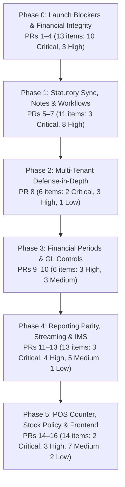

# Implementation Fix Plan: 63 Functional & Release-Blocking Issues

**Target Repository:** Bizboard (Cloud GST Billing & Business Management System)  
**Baseline Git Revision:** `5ba05c7b8811c49dae0fd7112d0db654eacabf02`  
**Authoritative Findings Document:** [`./FUNCTIONAL_CODE_REVIEW_FINDINGS1.md`](./FUNCTIONAL_CODE_REVIEW_FINDINGS1.md) (`CR-001` – `CR-063`)  
**Scope:** 63 Issues (16 Critical / Blocker · 28 High · 15 Medium · 4 Low)  
**Execution Strategy:** 6 Thematic Phases · 16 Focused PR Packages · Rigorous Test-Driven Validation  

> **Notice & Authoritative Reference**:
> - **Authoritative Remediation & Verification Report**: [`REMEDIATION_REPORT_63_ISSUES.md`](./REMEDIATION_REPORT_63_ISSUES.md)
> - **Authoritative Findings Document**: [`FUNCTIONAL_CODE_REVIEW_FINDINGS1.md`](./FUNCTIONAL_CODE_REVIEW_FINDINGS1.md) (63 release-blocking issues)
> - **Sibling Implementation Plan**: [`IMPLEMENTATION_PLAN_63_ISSUES.md`](./IMPLEMENTATION_PLAN_63_ISSUES.md)
> - **Master Issue Register**: [`MASTER_ISSUE_REGISTER.md`](./MASTER_ISSUE_REGISTER.md)
> - **Baseline Git Revision**: `5ba05c7b8811c49dae0fd7112d0db654eacabf02`  

---

## 1. Executive Strategy & Architectural Principles

### Core Invariants Preserved
1. **Append-Only Immutable Ledgers**: `StockMovement` and `JournalLine` are immutable append-only ledgers. Balances and cost layers are materialized views. Drift must be prevented at the write boundary and audited continuously.
2. **Documents as Truth**: Party receivables/payables are strictly derived from operational documents (`SalesInvoice`, `PaymentAllocation`, `SalesCreditNote`, etc.). The GL mirrors operational events; manual journal entries must not corrupt party balances.
3. **Atomic Document Completion**: Document number generation, stock deduction, and accounting postings occur inside a single atomic database transaction. Any pre-condition failure (e.g. GSTIN resolution, tax calculation, period lock) must abort before burning sequence numbers or touching balances.
4. **Tenant Isolation by Construction**: All ORM queries, foreign key lookups, and serializer relation fields must be scoped to `company_id`. No unscoped `PrimaryKeyRelatedField` is permitted on tenant models.

---

## 2. Phased Execution Roadmap



| Phase | PR Package | Focus Area | Issues Covered | Severity Breakdown |
| :--- | :--- | :--- | :--- | :--- |
| **Phase 0** | PR 1 | GL Double-Reversal & Sales Cancel Reversals | `CR-056`, `CR-057` | 2 Critical |
| | PR 2 | Service Procurement, Same-State SEZ & TDS Order | `CR-023`, `CR-026`, `CR-010`, `CR-035` | 3 Critical, 1 High |
| | PR 3 | FIFO Cost Layers, Alternate Units & Snapshot Replay | `CR-024`, `CR-027`, `CR-038` | 2 Critical, 1 High |
| | PR 4 | POS Idempotency, Outbox Oversell & Expiry Write-offs | `CR-001`, `CR-002`, `CR-036`, `CR-037` | 3 Critical, 1 High |
| **Phase 1** | PR 5 | E-Invoice Guards & Delivery Challan Cancellation Locks | `CR-012`, `CR-013`, `CR-017` | 1 Critical, 2 High |
| | PR 6 | Sales Return Reversals, Note Series & Deadlocks | `CR-011`, `CR-028`, `CR-019`, `CR-009` | 1 Critical, 2 High, 1 Med |
| | PR 7 | Sales Order Freeze, Backorders & Recurring Invoices | `CR-016`, `CR-018`, `CR-014`, `CR-015` | 4 High |
| **Phase 2** | PR 8 | Multi-Tenant Serializer Scoping & IDOR Prevention | `CR-058`, `CR-020`, `CR-029`, `CR-008`, `CR-050`, `CR-055` | 2 Critical, 3 High, 1 Low |
| **Phase 3** | PR 9 | Period Gate Dates, Soft-Closed Voids & Cancellations | `CR-040`, `CR-061`, `CR-063` | 2 High, 1 Med |
| | PR 10 | GL Control Account Guard & TDS Audit Logging | `CR-060`, `CR-059`, `CR-062` | 2 High, 1 Med |
| **Phase 4** | PR 11 | Dashboard MTD Return Netting, Aging & Date Bounds | `CR-043`, `CR-044`, `CR-045` | 3 Critical |
| | PR 12 | Stock Valuation Movements, GSTR-2B & Worksheets | `CR-046`, `CR-051`, `CR-052`, `CR-053`, `CR-054` | 1 Critical, 4 Med |
| | PR 13 | Streaming Export Responses, Pagination & IMS Batching | `CR-047`, `CR-048`, `CR-049` | 3 High |
| **Phase 5** | PR 14 | POS Atomic Checkout, Mutual Lock & Drawer Overage | `CR-003`, `CR-004`, `CR-005`, `CR-006`, `CR-007` | 2 High, 3 Med |
| | PR 15 | Purchase Sequence Allocation, Stock Balance Locks, WARN Policy & Validation | `CR-021`, `CR-025`, `CR-030`, `CR-034`, `CR-039`, `CR-041`, `CR-042` | 2 High, 4 Med, 1 Low |
| | PR 16 | Frontend TanStack Query Cache Invalidation Parity | `CR-022`, `CR-031`, `CR-032`, `CR-033` | 3 High, 1 Med |
| **TOTAL** | **16 PRs** | **Full System Remediation** | **63 Issues** | **16 Crit, 28 High, 15 Med, 4 Low** |

---

## 3. Detailed Technical PR Packages

### Phase 0: Launch Blockers & Financial Integrity

#### PR 1: General Ledger Double-Reversal & Document Reversal Parity
- **Issues Addressed**: `CR-056` (Critical), `CR-057` (Critical)
- **Target Files**:
  - `backend/accounting/services.py:1790-1825`
  - `backend/accounting/reports.py:10-25`
  - `backend/sales/services.py:1180-1270`
- **Root Cause & Technical Fix**:
  1. `CR-056`: In `PostingService.reverse(entry)`, when creating an offsetting journal entry, keeping `entry.status = JournalEntry.Status.REVERSED` causes all GL reports filtering on `Status.POSTED` to omit the original positive debits/credits while including the negative reversal entry.
     - *Fix Option A (Query Alignment)*: Update `reports.py` balance filters across `_balances`, `trial_balance`, `profit_and_loss`, `balance_sheet`, and `BooksHealthService` to filter `entry__status__in=[JournalEntry.Status.POSTED, JournalEntry.Status.REVERSED]`. This ensures the original entry ($+1000$) and reversal entry ($-1000$) net to $0.00$.
     - *Fix Option B (Status Contract)*: Keep `entry.status = POSTED` and link `entry.reversed_by = reversal`, marking `reversal.purpose = REVERSE`. Option A is cleaner and preserves existing test fixtures.
  2. `CR-057`: `SalesService.cancel()` restores inventory and voids payment links, but completely omits GL reversal. Add the reversal loop matching `PurchasesService.cancel`:
     ```python
     if invoice.company.accounting_enabled:
         from accounting.models import JournalEntry
         from accounting.services import PostingService
         for entry in JournalEntry.objects.filter(
             company=invoice.company,
             source_type="SALES_INVOICE",
             source_id=invoice.id,
             status=JournalEntry.Status.POSTED,
         ):
             PostingService.reverse(entry, user)
     ```
- **Verification & Test Plan**:
  - `tests/test_gl_reversal_parity.py`:
    - `test_sales_invoice_amendment_does_not_produce_negative_double_reversal`: Create invoice for 1,000, amend to 1,200, verify Trial Balance AR = 1,200 (not 200).
    - `test_sales_invoice_cancel_reverses_gl_entry_to_zero`: Complete invoice, cancel invoice, verify GL Trial Balance AR = 0 and Sales = 0.

---

#### PR 2: Service Procurement, Same-State SEZ & TDS Exclusivity Order
- **Issues Addressed**: `CR-023` (Critical), `CR-026` (High), `CR-010` (Critical), `CR-035` (High)
- **Target Files**:
  - `backend/purchases/services.py:795-830, 1145-1170, 705-770`
  - `backend/sales/services.py:630-645, 735-745`
  - `backend/core/services/place_of_supply.py:80-105`
- **Root Cause & Technical Fix**:
  1. `CR-023` & `CR-026`: In `PurchaseService.complete` and `complete_return`, unconditionally calling `InventoryService.post_movement` crashes when `product.product_type == SERVICE` or `track_inventory == False`.
     - *Fix*: Wrap stock movement and serial checking in `if not is_tally_opening and tracks_inventory(item.product):`.
  2. `CR-010`: Section 7(5)(b) of IGST Act mandates inter-state IGST treatment for SEZ supplies. In `backend/core/services/place_of_supply.py`, update `party_intra_state`:
     ```python
     def party_intra_state(company, customer_state, customer_gstin, seller_state=None, seller_gstin=None, supply_type: str = ""):
         if is_export_or_sez_supply(supply_type):
             return False
         ...
     ```
     Pass `supply_type=invoice.supply_type` from `SalesService.set_items` and `recompute_totals_for_stamped_gstin`.
  3. `CR-035`: In `PurchaseService.complete`, line 708 calls `assert_invoice_tds_exclusive(invoice)` before line 766 computes `invoice.tds_amount = fold_tds_from_rate(...)`. Move `fold_tds_from_rate` *before* line 708.
- **Verification & Test Plan**:
  - `tests/test_service_purchase_and_sez_sales.py`:
    - `test_purchase_service_item_completes_ap_without_stock_movement`: Verify purchase bill with legal/transport fees completes cleanly.
    - `test_purchase_return_service_item_completes_without_stock_movement`.
    - `test_same_state_sez_supply_calculates_igst_and_completes`: Seller 29, Buyer 29, `SEZWP` $\to$ IGST only, completes cleanly.
    - `test_purchase_tds_exclusive_rate_only_enforced`: Supplier with payment TDS rejected if bill has `tds_rate=1.0`.

---

#### PR 3: Inventory Cost Layers, Alternate Units & Valuation Replay
- **Issues Addressed**: `CR-024` (Critical), `CR-027` (High), `CR-038` (Critical)
- **Target Files**:
  - `backend/purchases/services.py:800-815, 450-480`
  - `backend/inventory/services.py:1720-1735, 1810-1830`
- **Root Cause & Technical Fix**:
  1. `CR-024`: In `PurchaseService.complete`, `unit_cost` for `InventoryCostLayer` is stamped using gross `item.unit_price`. Calculate net commercial unit cost:
     ```python
     qty = _line_stock_qty(item.product, item.quantity, getattr(item, "unit_name", None))
     unit_cost = (Decimal(str(item.taxable_amount)) / qty).quantize(Decimal("0.0001")) if qty > 0 else Decimal("0")
     ```
  2. `CR-027`: In `restamp_fifo_layers_for_price_amend`, map cost by line item / movement ID rather than product ID, dividing line taxable amount by movement base quantity to respect unit conversions and discounts.
  3. `CR-038`: In `InventoryValuationService.valuation`, when building baseline state from `InventoryValuationSnapshot` for FIFO replay, `state[key]["layers"] = []` loses layer history. Seed a base layer:
     ```python
     "layers": [[Decimal(str(snap.qty)), (Decimal(str(snap.value)) / Decimal(str(snap.qty))).quantize(Decimal("0.0001"))]] if snap.qty and snap.qty > 0 else []
     ```
- **Verification & Test Plan**:
  - `tests/test_inventory_cost_layer_precision.py`:
    - `test_purchase_discount_nets_fifo_cost_layer`: Buy 10 @ 1,000 with 20% discount $\to$ layer unit cost is 800.0000.
    - `test_restamp_fifo_layers_alternate_unit_box_pcs`: Amend box price $\to$ piece layer cost scales correctly.
    - `test_valuation_fifo_replay_from_snapshot_retains_fifo_costing`: Month-end snapshot followed by sale costs at snapshot layer rate, not WAVG.

---

#### PR 4: POS Idempotency Poisoning, Outbox Oversell & Expiry Write-Offs
- **Issues Addressed**: `CR-001` (Critical), `CR-002` (Critical), `CR-036` (Critical), `CR-037` (Critical)
- **Target Files**:
  - `web/src/pages/pos/PosPage.tsx:690-705`
  - `web/src/offline/flushPosCheckout.ts:105-125`
  - `backend/sales/views.py:180-195`
  - `backend/purchases/views.py:60-75`
  - `backend/inventory/views.py:640-655`
  - `backend/inventory/services.py:50-70, 205-215`
- **Root Cause & Technical Fix**:
  1. `CR-001`: In `SalesInvoiceViewSet.perform_destroy` and `PurchaseInvoiceViewSet.perform_destroy`, query `IdempotencyRecord.objects.filter(company=self.company, resource_id=str(instance.pk))` and call `forget_record`. In `PosPage.tsx` and `flushPosCheckout.ts`, clear or rotate `idempotencyKey` on draft deletion.
  2. `CR-002`: In `flushPosCheckout.ts`, if completion fails with insufficient stock under `BLOCK` policy, do not delete the draft invoice. Transition the draft to an `OUTBOX_CONFLICT_STOCK` state with a UI prompt to reconcile or allow negative stock. In backend `complete()`, allow POS offline flushes to pass `allow_offline_negative_stock=True` which downgrades `BLOCK` to `WARN` with an audit flag `is_offline_oversell=True`.
  3. `CR-036`: In `ExpiryAlertsView.post()`, pass `skip_negative_check=True` to `InventoryService.post_movement()` so expired batches can be written off.
  4. `CR-037`: In `InventoryService.default_warehouse`, wrap `warehouse.save(update_fields=["is_default"])` in an inner `with transaction.atomic():` savepoint before catching `IntegrityError`.
- **Verification & Test Plan**:
  - `tests/test_pos_and_inventory_blockers.py`:
    - `test_draft_delete_clears_idempotency_record_allowing_fresh_create`.
    - `test_expiry_alert_write_off_expired_batch_succeeds`.
    - `test_default_warehouse_concurrent_integrity_error_no_transaction_management_error`.

---

### Phase 1: Statutory Sync, Notes & Workflows

#### PR 5: E-Invoice Guards & Delivery Challan Cancellation Locks
- **Issues Addressed**: `CR-012` (Critical), `CR-013` (High), `CR-017` (High)
- **Target Files**:
  - `backend/sales/irn_guard.py:9-25`
  - `backend/sales/services.py:554-565, 1230-1245`
  - `backend/sales/notes_services.py:890-905`
- **Root Cause & Technical Fix**:
  1. `CR-012`: In `irn_guard.py`:
     ```python
     status = getattr(doc, "einvoice_status", None) or ""
     if status in ("QUEUED", "PENDING"):
         raise BusinessRuleError(f"This {kind} has an e-invoice generation in flight. Please wait for completion.")
     if irn and status != "CANCELLED":
         raise BusinessRuleError(f"This {kind} has a live IRN. Cancel the e-invoice first.")
     ```
  2. `CR-013`: In `SalesService.set_items`, add `if invoice.status == SalesInvoice.Status.COMPLETED: assert_no_live_irn(invoice, kind="invoice")`.
  3. `CR-017`: In `SalesService.cancel`, when reverting a delivery challan, set `linked.converted_invoice = None` so it can be re-converted.
- **Verification & Test Plan**:
  - `tests/test_irn_guard_and_challan_lifecycle.py`:
    - `test_cancel_invoice_blocks_when_einvoice_queued`.
    - `test_set_items_blocks_on_completed_invoice_with_irn`.
    - `test_cancel_invoice_resets_challan_converted_invoice_for_reconversion`.

---

#### PR 6: Sales Return Reversals, Note Series & Allocation Deadlocks
- **Issues Addressed**: `CR-011` (Critical), `CR-028` (Medium), `CR-019` (High), `CR-009` (Medium)
- **Target Files**:
  - `backend/sales/return_service.py:280-305`
  - `backend/purchases/notes_services.py:320-335, 510-525`
  - `backend/payments/services.py:400-425`
  - `backend/sales/notes_services.py:140-155, 205-220`
  - `backend/payments/views.py:395-408`
  - `backend/core/idempotency.py:30-65`
- **Root Cause & Technical Fix**:
  1. `CR-011`: In `ReturnService.complete_return`:
     ```python
     if alloc_amt <= need:
         PaymentService.reverse_allocation(allocation=alloc, user=user)
         need -= alloc_amt
     else:
         keep = alloc_amt - need
         PaymentService.reverse_allocation(allocation=alloc, user=user)
         if keep > 0 and alloc.receipt is not None:
             PaymentService.allocate_receipt(receipt=alloc.receipt, sales_invoice=invoice, amount=keep, user=user)
         need = Decimal("0")
     ```
  2. `CR-028`: In `PurchaseNotesService.complete_credit_note` and `complete_debit_note`, replace `resolve_series_gstin` with `series_identity(note.company, stamp, note.note_date)` to respect `GSTIN_FY` scoping.
  3. `CR-019`: Standardize row lock acquisition ordering: always acquire `SalesInvoice.objects.select_for_update()` before `CustomerReceipt.objects.select_for_update()`.
  4. `CR-009`: Add `allocation_unallocate` to `MONEY_IDEMPOTENCY_SCOPES` and wrap `PaymentAllocationViewSet.unallocate` with `begin_record` / `store_record`.
- **Verification & Test Plan**:
  - `tests/test_notes_and_allocations.py`:
    - `test_sales_return_partial_keeps_remaining_allocation_balance`.
    - `test_purchase_credit_note_series_identity_fy_scoping`.
    - `test_allocation_unallocate_is_idempotent`.

---

#### PR 7: Sales Order Conversions, Backorders & Recurring Invoices
- **Issues Addressed**: `CR-016` (High), `CR-018` (High), `CR-014` (High), `CR-015` (High)
- **Target Files**:
  - `backend/sales/notes_services.py:520-530`
  - `backend/sales/services.py:1030-1045`
  - `backend/sales/recurring.py:30-45, 105-120, 220-235`
  - `backend/sales/serializers.py:560-575`
- **Root Cause & Technical Fix**:
  1. `CR-016`: In `SalesNotesService.set_order_items`, reject edits if `order.converted_invoice_id` is populated or active delivery challans exist.
  2. `CR-018`: In `SalesService.complete`, release reservations only for the quantity invoiced. If partial conversion occurs, leave the order status as `PARTIALLY_CONVERTED` and retain remaining reservations.
  3. `CR-014`: In `_process_one_schedule`, call `schedule.refresh_from_db()` immediately after `generate_draft_for_schedule`.
  4. `CR-015`: In `RecurringInvoiceScheduleSerializer.validate`, convert `next_run_at` to `timezone.localtime(next_run_at)` before extracting `.day`.
- **Verification & Test Plan**:
  - `tests/test_sales_order_and_recurring.py`:
    - `test_sales_order_line_edit_blocked_after_conversion`.
    - `test_partial_sales_order_conversion_retains_backorder_reservations`.
    - `test_recurring_schedule_ist_anchor_day_conversion`.
    - `test_recurring_catch_up_generates_sequential_drafts`.

---

### Phase 2: Multi-Tenant Defense-in-Depth

#### PR 8: Multi-Tenant Serializer Scoping & IDOR Prevention
- **Issues Addressed**: `CR-058` (Critical), `CR-020` (High), `CR-029` (High), `CR-008` (Low), `CR-050` (High), `CR-055` (Low)
- **Target Files**:
  - `backend/accounting/serializers.py:10-30, 75-85, 220-245`
  - `backend/sales/phase1_serializers.py:35-70, 120-155`
  - `backend/purchases/phase1_serializers.py:30-45, 95-110`
  - `backend/sales/serializers.py:70-80`
  - `backend/payments/serializers.py:55-105`
  - `backend/reporting/models.py:75-115`
  - `backend/reporting/views.py:870-940`
  - `backend/reporting/services.py:530-545`
- **Root Cause & Technical Fix**:
  1. `CR-058`: In `FixedAssetSerializer`, wrap `asset_account`, `accumulated_depreciation_account`, and `depreciation_expense_account` with `CompanyPrimaryKeyRelatedField`. In `AccountSerializer`, scope `parent` and `bank_account`. In `CostCenterSerializer`, scope `parent`.
  2. `CR-020`: Add `validate_company_gstin` to `SalesCreditNoteSerializer` and `SalesDebitNoteSerializer`.
  3. `CR-029`: In `PurchaseCreditNoteItemSerializer` and `DebitNoteItemSerializer`, wrap `source_item` in `CompanyPrimaryKeyRelatedField(queryset=PurchaseItem.objects.all())`.
  4. `CR-008`: In `SalesItemSerializer`, declare `batch = CompanyPrimaryKeyRelatedField(queryset=BatchLot.objects.all(), required=False, allow_null=True)`. In `CustomerReceiptSerializer.__init__` and `SupplierPaymentSerializer.__init__`, filter `bank_account` queryset to `cu.company`.
  5. `CR-050`: Add `company_gstin = models.ForeignKey(CompanyGstin, ...)` to `Gstr2bIngest` and update `update_or_create` unique constraints.
  6. `CR-055`: Add explicit `company=company` to secondary orphan lookups in `inventory_summary` and `bulk_sales_invoice_outstanding`.
- **Verification & Test Plan**:
  - `tests/test_multi_tenant_serializer_isolation.py`:
    - Test foreign tenant primary keys are rejected at serializer field-level validation with `Invalid pk` across all 6 serializers.

---

### Phase 3: Financial Period Gates & GL Controls

#### PR 9: Period Gate Dates, Soft-Closed Voids & Cancellations
- **Issues Addressed**: `CR-040` (High), `CR-061` (High), `CR-063` (Medium)
- **Target Files**:
  - `backend/inventory/views.py:720-730, 760-765`
  - `backend/payments/services.py:535-575`
  - `backend/sales/notes_services.py:320-330, 500-505`
  - `backend/purchases/notes_services.py:360-365, 540-545`
- **Root Cause & Technical Fix**:
  1. `CR-040`: In `StockCountSessionViewSet.post`, pass `movement_date = session.counted_on or timezone.localdate()` to `assert_period_allows_money_amend` and `post_movement`.
  2. `CR-061`: In `void_customer_receipt` and `void_supplier_payment`, pass `allow_soft_closed=True` to `assert_period_allows_money_amend` and pass `entry_date = timezone.localdate()` to GL journal reversals.
  3. `CR-063`: In `cancel_credit_note` and `cancel_debit_note` across sales and purchases, pass `allow_soft_closed=True` matching invoice cancellations.
- **Verification & Test Plan**:
  - `tests/test_period_gates_consistency.py`:
    - `test_stock_count_post_rejects_closed_counted_on_period`.
    - `test_void_receipt_in_soft_closed_period_posts_reversal_today`.
    - `test_credit_note_cancel_in_soft_closed_period_allowed`.

---

#### PR 10: General Ledger Control Accounts & TDS Audit Logging
- **Issues Addressed**: `CR-060` (High), `CR-059` (High), `CR-062` (Medium)
- **Target Files**:
  - `backend/accounting/serializers.py:80-110`
  - `backend/ledgers/services.py:280-295, 485-500`
  - `backend/payments/services.py:335-350`
- **Root Cause & Technical Fix**:
  1. `CR-060`: In `JournalLineSerializer.validate_account()`, reject accounts where `account.is_control is True` for manual user journal postings.
  2. `CR-059`: Remove dead code `_gl_party_statement` and clarify in `ledgers/services.py` that Bizboard strictly operates on document-derived subledgers.
  3. `CR-062`: In `record_supplier_payment`, invoke `fold_tds_from_rate()` and record `_tds_override` statutory audit logs when rate and amount diverge.
- **Verification & Test Plan**:
  - `tests/test_gl_control_and_tds_audit.py`:
    - `test_manual_journal_to_account_1200_rejected`.
    - `test_supplier_payment_tds_rate_folding_and_override_logged`.

---

### Phase 4: Reporting Parity, Streaming & IMS Optimization

#### PR 11: Dashboard MTD Return Netting, Aging & Date Bounds
- **Issues Addressed**: `CR-043` (Critical), `CR-044` (Critical), `CR-045` (Critical)
- **Target Files**:
  - `backend/reporting/services.py:150-170, 195-270, 610-630`
- **Root Cause & Technical Fix**:
  1. `CR-043`: In `ReportService.dashboard_kpis`, update `purchases_month` to filter `status__in=(PurchaseInvoice.Status.COMPLETED, PurchaseInvoice.Status.RETURNED)` so purchase returns are not deducted twice.
  2. `CR-044`: In `receivables_aging` and `payables_aging`, remove `is_opening_balance=False` so opening receivables/payables are included, and account for unlinked credit notes so Dashboard aging foots Customer/Supplier ledgers.
  3. `CR-045`: Add `invoice_date__lte=today` across `sales_month`, `purchases_month`, and note queries to exclude future post-dated documents.
- **Verification & Test Plan**:
  - `tests/test_dashboard_kpis_parity.py`:
    - `test_dashboard_purchases_mtd_handles_returns_without_double_deduction`.
    - `test_dashboard_aging_matches_customer_ledger_opening_balance`.
    - `test_dashboard_mtd_excludes_future_dated_invoices`.

---

#### PR 12: Stock Valuation Movements, GSTR-2B & Worksheets
- **Issues Addressed**: `CR-046` (Critical), `CR-051` (Medium), `CR-052` (Medium), `CR-053` (Medium), `CR-054` (Medium)
- **Target Files**:
  - `backend/inventory/views.py:660-675`
  - `backend/reporting/gstr2b.py:165-185`
  - `backend/reporting/tds_worksheets.py:25-135`
  - `backend/reporting/gst_returns.py:290-330`
  - `backend/reporting/gst_rate_scan.py:20-35`
- **Root Cause & Technical Fix**:
  1. `CR-046`: In `StockValuationReportView`, verify live stock quantities against `Sum(StockMovement.quantity)` and trigger replay on drift.
  2. `CR-051`: In `gstr2b.py`, filter by `recipient_gstin` on the 2B ingest row rather than inner joining `purchase_invoice__company_gstin_id`.
  3. `CR-052`: Include `PurchaseCreditNote`, `PurchaseDebitNote`, `SalesCreditNote`, and `SalesDebitNote` in `tds_worksheet_rows` and `tcs_worksheet_rows`.
  4. `CR-053`: In `gst_returns.py`, determine rate-wise RCM taxes from line items directly rather than prorating header memo values.
  5. `CR-054`: In `gst_rate_scan.py`, filter `invoice_type__in=["GST", "TAX", "RETAIL"]`.
- **Verification & Test Plan**:
  - `tests/test_reports_worksheets_and_gst.py`:
    - `test_valuation_report_reconciled_with_movements`.
    - `test_tds_worksheet_includes_purchase_notes`.
    - `test_gstr2b_branch_filter_retains_unlinked_rows`.

---

#### PR 13: Streaming Export Responses, Pagination & IMS Batching
- **Issues Addressed**: `CR-047` (High), `CR-048` (High), `CR-049` (High)
- **Target Files**:
  - `backend/reporting/views.py:100-145, 245-260, 650-665, 1225-1325`
  - `backend/accounting/views.py:585-605`
  - `backend/reporting/ims.py:80-130`
- **Root Cause & Technical Fix**:
  1. `CR-047`: Replace in-memory `io.StringIO` buffers with `StreamingHttpResponse` and generator iterators for CSV exports.
  2. `CR-048`: Add DRF pagination (`PageNumberPagination` with page size 100, max 1,000) to `SalesRegisterView` and `PurchaseRegisterView`.
  3. `CR-049`: In `classify_and_match`, pre-fetch matching purchase invoices into an in-memory dictionary and use `bulk_update` to eliminate the O(N) query and save loop.
- **Verification & Test Plan**:
  - `tests/test_reporting_performance_and_streaming.py`:
    - `test_sales_register_csv_export_streams`.
    - `test_sales_register_view_paginated`.
    - `test_ims_classify_and_match_query_count_constant`.

---

### Phase 5: POS Counter, Stock Policy & Frontend Polish

#### PR 14: POS Counter Ergonomics, Outbox Safety & Thermal Banners
- **Issues Addressed**: `CR-003` (High), `CR-004` (High), `CR-005` (Medium), `CR-006` (Medium), `CR-007` (Medium)
- **Target Files**:
  - `web/src/pages/pos/PosPage.tsx:220-240, 575-585, 740-760, 850-955, 1180-1215`
  - `web/src/offline/invoiceDraftCache.ts:380-400`
  - `web/src/auth/AuthContext.tsx:110-125`
- **Root Cause & Technical Fix**:
  1. `CR-003`: Provide an optional atomic endpoint `POST /api/v1/sales/invoices/pos-checkout/` for online checkout.
  2. `CR-004`: Unify `flushGuard` and `checkoutGuard` into a single mutual-exclusion lock.
  3. `CR-005`: Render an `<Alert severity="warning">` banner with a "Retry Print" button when `thermalWarn` is populated.
  4. `CR-006`: Record `tenderedAmount` and `changeDue` in receipt notes or till metadata.
  5. `CR-007`: In `AuthContext.tsx`, call `indexedDB.deleteDatabase('bizboard-invoice-outbox')` on explicit logout.
- **Verification & Test Plan**:
  - `web/src/pages/pos/PosPage.test.tsx`:
    - `test_thermal_warn_banner_rendered_on_print_failure`.
    - `test_checkout_button_disabled_while_flush_in_progress`.

---

#### PR 15: Purchase Sequence Allocation, Stock Balance Locks, WARN Policy & Input Validation
- **Issues Addressed**: `CR-021` (Medium), `CR-025` (High), `CR-030` (Medium), `CR-034` (Medium), `CR-039` (High), `CR-041` (Medium), `CR-042` (Medium)
- **Target Files**:
  - `backend/purchases/services.py:750-795`
  - `backend/inventory/services.py:1120-1165, 1340-1380`
  - `backend/inventory/tasks.py:1-60`
  - `backend/sales/services.py:40-90`
  - `backend/purchases/services.py:40-90`
  - `backend/payments/views.py:215-225`
  - `backend/imports/services.py:1225-1245`
- **Root Cause & Technical Fix**:
  1. `CR-025`: Resolve `CompanyGstin`, validate multi-GSTIN requirement, and execute `recompute_totals_for_stamped_gstin` *before* allocating sequence numbers via `DocumentNumberService.next_number()` in `PurchaseService.complete`.
  2. `CR-039`: Wrap `rebuild_balance` in `transaction.atomic()` and take `select_for_update()` on `StockBalance`.
  3. `CR-041`: In `StockTransferService.complete`, forbid negative stock at the source godown regardless of `WARN` policy unless explicitly confirmed by admin.
  4. `CR-042`: Add a scheduled Celery task `verify_stock_balances_integrity` checking `StockBalance.on_hand == Sum(StockMovement.quantity)`.
  5. `CR-021`: Add line description (max 255) and batch number (max 64) length checks in `_validate_lines`.
  6. `CR-030`: Catch `(TypeError, ValueError)` on `?supplier=` filter in `SupplierPaymentViewSet`.
  7. `CR-034`: Add SHA-256 duplicate detection on `PURCHASE_BILL` uploads within 30 days.
- **Verification & Test Plan**:
  - `tests/test_w0_multi_gstin_complete.py::test_purchase_complete_multi_gstin_fails_before_number_generation`
  - `tests/test_stock_and_validation_hardening.py`:
    - `test_rebuild_balance_concurrency_lock`.
    - `test_stock_transfer_rejects_negative_stock_under_warn`.
    - `test_supplier_payment_invalid_supplier_id_returns_400`.

---

#### PR 16: Frontend TanStack Query Cache Invalidation Parity
- **Issues Addressed**: `CR-022` (Medium), `CR-031` (High), `CR-032` (High), `CR-033` (High)
- **Target Files**:
  - `web/src/pages/sales/InvoiceDetailPage.tsx:140-160`
  - `web/src/pages/sales/SalesOrderEditorPage.tsx:245-255`
  - `web/src/pages/sales/QuotationsPage.tsx:160-170`
  - `web/src/pages/purchases/NewPurchasePage.tsx:885-940`
  - `web/src/pages/purchases/SupplierPaymentsPage.tsx:115-135`
  - `web/src/pages/purchases/PurchaseReturnsPage.tsx:160-175`
- **Root Cause & Technical Fix**:
  - Invalidate all dependent query keys upon document completion, cancellation, or allocation:
    - Sales: `['sales-invoices']`, `['sales-invoice', id]`, `['customers']`, `['dashboard']`.
    - Purchases: `['purchases']`, `['purchase-invoice', id]`, `['products']`, `['stock-balance']`, `['suppliers']`.
    - Payments: `['supplier-payments']`, `['purchases']`, `['receipts']`, `['sales-invoices']`.
    - Returns: `['purchase-returns']`, `['purchase-credit-notes']`, `['products']`.
- **Verification & Test Plan**:
  - Playwright E2E verification of multi-view state synchronization.

---

## 4. Execution Gate & Acceptance Verification

Every PR must satisfy:
1. **Zero Regression**: All existing 1,206 passing tests must remain green.
2. **Failure Resolution**: The 42 baseline test failures must be progressively turned green as corresponding PRs merge.
3. **Dedicated Regression Tests**: Every finding must have a corresponding automated test case added and passing.
4. **Idempotency & Tenant Defense**: Verified with `tests/test_remaining_gates.py` and multi-tenant test suites.
