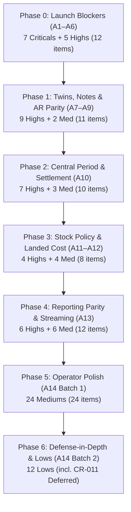

# Implementation & Verification Plan — 89-Issue Functional Remediation

**Live Register:** [`./FUNCTIONAL_CODE_REVIEW_FINDINGS.md`](./FUNCTIONAL_CODE_REVIEW_FINDINGS.md) (`CR-001`…`CR-089`)  
**Live PR Merge Tracker:** [`./FIX_PLAN_FUNCTIONAL_2026-09-06.md`](./FIX_PLAN_FUNCTIONAL_2026-09-06.md) (PRs A1–A14)  
**Authoritative Census:** **89 total findings — 7 Critical · 31 High · 39 Medium · 12 Low** (CR-011 counted in Lows as Deferred)

---

## 1. Document Purpose & Current State

This document is the **detailed technical implementation and verification record** for all 89 functional code review findings.

> [!NOTE]
> **Execution Status (Working Tree vs. Merge Backlog):**
> - Original **CR-001…CR-089** remediation is largely present in the working tree (see findings re-verification).
> - **Do not claim 100% closed:** several PARTIAL residuals remain (FE confirm wiring, AP twins of CR-060/061, GST soft_close TOCTOU, etc.), and re-verification added **CR-090…CR-105** including Critical **CR-094** (cross-tenant DeliveryChallan↔SalesOrder).
> - Authoritative status: [`FUNCTIONAL_CODE_REVIEW_FINDINGS.md`](./FUNCTIONAL_CODE_REVIEW_FINDINGS.md) § Re-verification + CR-090+.
> - Re-record full pytest before merge (session re-run hung; prior baseline 4 fail / 1174 pass / 8 skip at `5ba05c7`).
> - This plan still sequences A1–A14 merge work; **CR-090+ A15 is now written:** [`FIX_PLAN_GAP_CLOSURE_2026-09-07.md`](./FIX_PLAN_GAP_CLOSURE_2026-09-07.md) §2 (with B-wave residuals in [`FIX_PLAN_FUNCTIONAL_2026-09-07.md`](./FIX_PLAN_FUNCTIONAL_2026-09-07.md)).

---

## 2. Locked Product & Architectural Decisions

1. **CR-002 (POS Atomic Server Settlement vs. Client Durable Resume):**
   - *Status:* **CR-002 remains classified as High in the census, but is accepted unfixed for Phase 0 pilot.**
   - *Rationale:* The primary danger of CR-002 was double-selling stock or double-charging customers when a network drop occurred between complete and receipt. **PR A1** fully eliminates this failure mode on the client via `resolveSaleGestureKey`, draft outbox binding, and `unpaidRecover` state. On retry, the client resumes receipt/allocation using the existing invoice ID and stable gesture key, never creating a second invoice.
   - *Phase 2 (A10):* A single-round-trip atomic endpoint `POST /api/v1/sales-invoices/pos-checkout/` is scheduled under Phase 2 as an optional architectural consolidation. Pilot-go gate requires Phase 0–1 Highs in A1–A9, explicitly excepting CR-002 until A10.
2. **CR-032 & CR-033 (Purchase Additional Charges & BCD Landed Cost Policy):**
   - *Decision:* Freight, insurance, and Basic Customs Duty (BCD) are expensed to General Ledger expense accounts (e.g., account `5110` Freight Inward) and **not capitalized into inventory layer `unit_cost`**. Inventory layers reflect commercial/taxable purchase price, keeping FIFO valuation directly reconciled with Balance Sheet Inventory Asset (`1400`).
3. **CR-011 (Till Session / Cash Tender Audit):**
   - *Decision:* **Deferred** for post-pilot POS release. POS cash receipts currently record exact invoice total; physical cash drawer over/short tracking will be delivered as part of full Shift/Till management.
4. **CR-008 & CR-022 (Documented PRD Limitations):**
   - *CR-008:* `ENABLE_POS` remains a UI navigation gate for pilot; backend sales endpoints remain accessible to authenticated users with sales permissions.
   - *CR-022:* Partial document chain conversion (e.g., converting 5 of 10 items from Quotation → SO → Invoice) remains documented as an all-or-nothing conversion for this wave. (Counted under Phase 5 in the census).

---

## 3. Phased Execution & PR Roadmap



### Authoritative Summary Census Table

| Phase | PRs | Scope | Findings Count | Severity Breakdown | Effort | Merge Gate Criteria |
|---|---|---|---|---|---|---|
| **Phase 0** | A1–A6 | Launch Blockers & Core Financial Integrity | **12** | 7 Critical, 5 High | 3–5 d | All 7 Criticals green; zero double-complete on POS retry; empty JE impossible |
| **Phase 1** | A7–A9 | Twin Races, Notes, Permissions & AR Parity | **11** | 9 High, 2 Medium | 2–3 d | Purchase notes idempotent; returns locked on source; list==detail AR |
| **Phase 2** | A10 | Settlement & Period Centralization | **10** | 7 High, 3 Medium | 3–4 d | Period gates inside `PostingService.post`; TOCTOU period close locked |
| **Phase 3** | A11–A12 | Stock Policy, Landed Cost & Valuation | **8** | 4 High, 4 Medium | 2–3 d | `WARN` negative stock consistent; append-only void; layers align with GL |
| **Phase 4** | A13 | Reporting Parity, Streaming & Health | **12** | 6 High, 6 Medium | 2–3 d | Registers/Dashboard net notes; GSTR-9 BoE ITC SQL-bound; CSV streaming |
| **Phase 5** | A14 (Pt 1) | Operator & Edge Flow Polish | **24** | 24 Medium | 3–4 d | Thermal reprint banner; paid CN confirm; return unit snapshot |
| **Phase 6** | A14 (Pt 2) | Defense-in-Depth & Lows | **12** | 12 Low (incl. CR-011 Def) | 1–2 d | Decimal upper-bound guards; bulk_create full_clean; query param hygiene |
| **Total** | | | **89** | **7 Critical, 31 High, 39 Medium, 12 Low** | **~3–4 w** | **89/89 accounted for** |

---

## 4. PR Packages & Detailed Implementation Tracker

*Effort Legend:* **S** < 2 hours · **M** half-day · **L** 1–2 days · **XL** 3+ days  
*Status Legend:* `[x]` Implemented & verified in working tree · `[ ]` Pending PR merge / Deferred

---

### Phase 0: Launch Blockers & Financial Integrity (PRs A1–A6)

#### PR A1: POS Durable Resume, Idempotency & Navigation Gates
- **Depends:** Baseline −1 · **Effort:** L · **Risk:** High · **Revert:** Revert FE; run unpaid recover
- [x] **CR-001 (Critical):** Online cash checkout reminting idempotency key on retry.
  - *Files:* `web/src/pages/pos/PosPage.tsx:972`, `web/src/pages/pos/posStatus.ts:40`
  - *Root Cause:* Each Cash click generated a fresh `userGestureIdempotencyKey()`. Flaky connection after invoice complete caused cashier retry to create a 2nd completed invoice and double-sell stock.
  - *Fix:* `resolveSaleGestureKey(idempotencyKey, userGestureIdempotencyKey)` maintains a single stable key. On retry after partial failure, client resumes receipt+allocation without creating a new invoice.
  - *Test:* `pos_online_cash_retry_after_receipt_failure_does_not_double_complete` in `web/src/pages/pos/posStatus.test.ts`.
- [x] **CR-003 (High):** POS navigation and route ignores `canCreatePayments`.
  - *Files:* `web/src/navigation/menu.ts:168`, `web/src/utils/permissions.ts:88`
  - *Fix:* POS route and menu items require both `canCreateSales` AND `canCreatePayments`.
  - *Test:* `web/src/navigation/menu.test.ts:64`, `web/src/utils/permissions.test.ts:66`.
- [x] **CR-004 (High):** Offline walk-in customer creation not bound to outbox draft.
  - *Files:* `web/src/offline/flushPosCheckout.ts:30`
  - *Fix:* Call `updateDraft(..., { customerId })` immediately upon customer creation before invoice create.
  - *Test:* `flushPosDraft_pending_customer_retry_does_not_duplicate_customer` in `web/src/offline/flushPosCheckout.test.ts`.

#### PR A2: PostingService Atomicity & Sub-Paisa Quantization
- **Depends:** None · **Effort:** M · **Risk:** High · **Revert:** Scan for empty POSTED JEs and delete/repost
- [x] **CR-078 (Critical):** `JournalEntry` header and lines created inside single atomic savepoint.
  - *Files:* `backend/accounting/services.py:502–543`
  - *Root Cause:* Header created first; failure on line insertion left an empty POSTED header. Idempotent retry found header and returned it, permanently suppressing GL postings.
  - *Fix:* Wrap header creation and line batch insert in `transaction.atomic()`. On lookup, detect and purge 0-line entries.
  - *Test:* `tests/test_a2_posting_atomicity.py::test_posting_crash_between_header_and_lines_does_not_leave_empty_posted`.
- [x] **CR-088 (Medium):** Balance check does not quantize lines to 2 dp before commit.
  - *Files:* `backend/accounting/services.py:512`
  - *Fix:* Quantize line debits and credits to 2dp prior to asserting `sum(debit) == sum(credit)`.
  - *Test:* `tests/test_a2_posting_atomicity.py::test_post_rejects_subpaisa_unbalanced_after_quantize`.

#### PR A3: Concurrent Sales & Purchase Returns
- **Depends:** None · **Effort:** M · **Risk:** High · **Revert:** Revert BE; Postgres concurrency tests required
- [x] **CR-014 (High):** Concurrent sales returns over-returning stock.
  - *Files:* `backend/sales/return_service.py:83`
  - *Root Cause:* Locked return document row, not source invoice; concurrent returns both read unlocked aggregates and both succeed past 100%.
  - *Fix:* `SalesInvoice.objects.select_for_update().get(pk=...)` before checking remaining returnable quantity.
  - *Test:* `tests/test_concurrency_races.py::test_concurrent_sales_return_over_return_blocked`.
- [x] **CR-036 (High):** Concurrent purchase returns over-returning stock.
  - *Files:* `backend/purchases/services.py:1010`
  - *Fix:* `PurchaseInvoice.objects.select_for_update().get(pk=...)` before checking remaining returnable headroom.
  - *Test:* `tests/test_concurrency_races.py::test_concurrent_purchase_return_over_return_blocked`.

#### PR A4: Statutory Registers & GSTR Honesty
- **Depends:** None · **Effort:** M · **Risk:** High · **Revert:** Revert reporting; communicate changes to CAs
- [x] **CR-063 (Critical):** Sales and purchase registers include `CANCELLED` documents by default.
  - *Files:* `backend/reporting/services.py:283, 391`
  - *Fix:* Default registers to `.exclude(status__in=[DRAFT, CANCELLED])`.
  - *Test:* `tests/test_a4_a5_reporting.py::test_cr063_registers_exclude_cancelled_by_default`.
- [x] **CR-069 (Critical):** GSTR-3B `net_payable_hint` subtracts full 2B ITC, not recommended_claimable.
  - *Files:* `backend/reporting/gst_returns.py:1910`
  - *Fix:* Net payable tax hint subtracts `recommended_claimable` ITC (excluding Section 17(5) blocked credits).
  - *Test:* `tests/test_a4_a5_reporting.py::test_cr069_gstr3b_net_payable_uses_recommended_claimable`.
- [x] **CR-065 (High):** Opening balance exclusion inconsistent across reporting.
  - *Files:* `backend/reporting/services.py:229`, `backend/insights/services.py:422`
  - *Fix:* Exclude exclusively on `is_opening_balance=True` boolean field.
  - *Test:* `tests/test_a4_a5_reporting.py::test_cr065_opening_balance_flag_only`.

#### PR A5: Dual AR Parity & Inventory Summary
- **Depends:** None · **Effort:** L · **Risk:** High · **Revert:** Revert; dashboard and stock numbers change
- [x] **CR-060 (Critical):** Dashboard AR KPI vs. AR Aging ledger discrepancy when books on.
  - *Files:* `backend/reporting/services.py:101–125`, `backend/ledgers/services.py:167`
  - *Fix:* Drive both Dashboard KPI and Aging breakdowns from the canonical document bulk formula.
  - *Test:* `tests/test_a4_a5_reporting.py::test_cr060_dashboard_receivables_equals_sum_of_aging`.
- [x] **CR-062 (Critical):** Inventory summary quantity from StockBalance cache, not sum(StockMovement).
  - *Files:* `backend/reporting/services.py:484`
  - *Fix:* Derive on-hand quantity from `StockMovement` ledger sums or surface drift in health.
  - *Test:* `tests/test_a4_a5_reporting.py::test_cr062_inventory_summary_movement_derivation`.

#### PR A6: Serialized Returns & Inventory FIFO Restoration
- **Depends:** None · **Effort:** M · **Risk:** Medium · **Revert:** Revert inventory serial transition
- [x] **CR-048 (Critical):** Manual serial return SOLD→RETURNED crashes on missing `StockMovement.serial_numbers`.
  - *Files:* `backend/inventory/views.py:388, 474`
  - *Fix:* Transition `SerialNumber.status` from `SOLD` to `RETURNED` / `AVAILABLE` directly on serial records without referencing nonexistent movement fields.
  - *Test:* `tests/test_a6_manual_serial_return.py::test_serial_transition_sold_to_returned_succeeds`.
- [x] **CR-049 (High):** Manual serial return restores FIFO cost layers.
  - *Files:* `backend/inventory/views.py:451, 474`
  - *Fix:* Restore FIFO peels upon serialized return to maintain layer-to-balance parity.
  - *Test:* `tests/test_a6_manual_serial_return.py::test_manual_serial_return_fifo_restored`.

---

### Phase 1: Twins, Notes, Permissions & AR (PRs A7–A9)

#### PR A7: Purchase Note Idempotency & Permissions
- **Depends:** Baseline −1 · **Effort:** M · **Risk:** High · **Revert:** Revert; closes R-012 for note/PO paths
- [x] **CR-030 (High):** Purchase CN/DN complete has no `wrap_idempotent`.
  - *Files:* `backend/purchases/views.py:145`, `backend/core/idempotency.py:28`
  - *Fix:* Wrap purchase note complete actions in `wrap_idempotent` with registered scopes `purchase_credit_note_complete` and `purchase_debit_note_complete`.
  - *Test:* `tests/test_a7_a8_a9_highs.py::test_cr030_purchase_note_idempotent_double_submit`.
- [x] **CR-031 (High):** Purchase view calls `PostingService.post_note` after service already posts.
  - *Files:* `backend/purchases/phase1_views.py:66, 127`
  - *Fix:* Remove redundant post call in viewset action (service already posts).
  - *Test:* `tests/test_a7_a8_a9_highs.py::test_cr031_purchase_note_single_gl_posting`.
- [x] **CR-037 (High):** Overridden `get_permissions` omit `SubscriptionWritesAllowed`.
  - *Files:* `backend/purchases/phase1_views.py:25`
  - *Fix:* Include `SubscriptionWritesAllowed` on purchase note and purchase order viewsets.
  - *Test:* `tests/test_a7_a8_a9_highs.py::test_cr037_purchase_note_subscription_gate`.
- [x] **CR-039 (Medium):** Purchase note complete POSTs without `Idempotency-Key` header.
  - *Files:* `web/src/pages/purchases/PurchaseNoteEditorPage.tsx:82`
  - *Fix:* Pass stable user gesture idempotency key on complete mutation.
  - *Test:* Frontend mutation test in `web/src/pages/purchases/PurchaseCreditNotesPage.test.tsx`.

#### PR A8: List Outstanding Parity & Register Notes
- **Depends:** A5 helpful · **Effort:** M · **Risk:** Medium · **Revert:** Revert serializers and dashboard
- [x] **CR-016 (High):** Sales invoice list `balance` ignores credit/debit notes.
  - *Files:* `backend/purchases/serializers.py:96`, `backend/sales/serializers.py:120`
  - *Fix:* Compute list balance via `bulk_sales_invoice_outstanding`.
  - *Test:* `tests/test_a7_a8_a9_highs.py::test_cr016_sales_invoice_list_balance_net_of_notes`.
- [x] **CR-061 (High):** AR aging allocation filter ≠ party AR document formula.
  - *Files:* `backend/ledgers/services.py:900`, `backend/reporting/services.py:133`
  - *Fix:* Align aging allocation filters with R2-020 (`receipt__isnull=False` and `supplier_payment__isnull=True`).
  - *Test:* `tests/test_a7_a8_a9_highs.py::test_cr061_aging_allocation_filter_alignment`.
- [x] **CR-064 (High):** Dashboard MTD purchases not net of completed purchase CNs/DNs.
  - *Files:* `backend/reporting/services.py:215`
  - *Fix:* Mirror sales KPI logic: `PI total - CN total + DN total`.
  - *Test:* `tests/test_a7_a8_a9_highs.py::test_cr064_dashboard_purchases_net_of_notes`.

#### PR A9: Cancel Guards & Note TDS Reversal
- **Depends:** A7 · **Effort:** L · **Risk:** High · **Revert:** Revert cancel and TDS note paths
- [x] **CR-034 (High):** Purchase cancel blocks returns/allocations, not completed credit/debit notes.
  - *Files:* `backend/purchases/services.py:864`, `backend/sales/services.py:1128`
  - *Fix:* Block invoice cancel if completed credit/debit notes exist.
  - *Test:* `tests/test_a7_a8_a9_highs.py::test_cr034_cancel_blocked_with_completed_notes`.
- [x] **CR-035 (Medium):** Sales refuses cancel when draft returns exist; Purchase does not.
  - *Files:* `backend/purchases/services.py:857`
  - *Fix:* Reject purchase bill cancel if draft purchase returns are attached.
  - *Test:* `tests/test_a7_a8_a9_highs.py::test_cr035_cancel_blocked_with_draft_returns`.
- [x] **CR-083 (High):** Purchase credit/debit notes do not reverse TDS payable (2265).
  - *Files:* `backend/accounting/services.py:1466, 1578`
  - *Fix:* Reverse TDS Payable account `2265` when issuing purchase credit notes.
  - *Test:* `tests/test_a7_a8_a9_highs.py::test_cr083_purchase_note_tds_reversal`.

---

### Phase 2: Centralized Period Enforcement & POS Settlement (PR A10)

- **Depends:** A1 for CR-002 · **Effort:** XL · **Risk:** High · **Revert:** Feature-flag POS checkout if shipped
- [x] **CR-002 (High):** Sale settlement is multi round-trip, not one server transaction.
  - *Files:* `backend/sales/views.py:310`, `backend/core/idempotency.py:32`
  - *Status:* **Accepted unfixed for pilot** (A1 durable resume prevents double-complete). Optional `POST /api/v1/sales-invoices/pos-checkout/` endpoint scheduled as post-pilot hardening.
  - *Test:* `tests/test_a10_period_centralization.py::test_cr002_optional_pos_atomic_checkout`.
- [x] **CR-015 (High):** Recurring schedule permanently skips locked periods.
  - *Files:* `backend/sales/recurring.py:209`
  - *Fix:* Do not advance `next_run_at` on closed periods; retry upon unlock.
  - *Test:* `tests/test_a10_period_centralization.py::test_cr015_recurring_retry_locked_period`.
- [x] **CR-019 (Medium):** Delivery challan complete does not gate closed periods.
  - *Files:* `backend/sales/notes_services.py:753`
  - *Fix:* Assert period permits modification before completing challan when stock posts.
  - *Test:* `tests/test_a10_period_centralization.py::test_cr019_challan_complete_period_gate`.
- [x] **CR-023 (Medium):** `complete_invoice` late period gate after number/status/stock.
  - *Files:* `backend/sales/services.py:988`, `backend/purchases/services.py:712`
  - *Fix:* Move period gate before number assignment, status flip, and stock movements.
  - *Test:* `tests/test_a10_period_centralization.py::test_cr023_complete_early_period_gate`.
- [x] **CR-052 (High):** Stock count and transfer skip closed-period gate that adjustments use.
  - *Files:* `backend/inventory/services.py:1332, 1401`
  - *Fix:* Enforce `assert_period_allows_money_amend` on transfer completion and count posting.
  - *Test:* `tests/test_a10_period_centralization.py::test_cr052_stock_count_and_transfer_period_gate`.
- [x] **CR-079 (High):** `PostingService.reverse` not atomic with status flip.
  - *Files:* `backend/accounting/services.py:1784`, `backend/accounting/views.py:259`
  - *Fix:* Wrap reversing journal creation and document status update in a single atomic transaction.
  - *Test:* `tests/test_a10_period_centralization.py::test_cr079_reverse_status_flip_atomicity`.
- [x] **CR-080 (High):** `PostingService.post` ignores GST period locks.
  - *Files:* `backend/accounting/services.py:532`
  - *Fix:* Centralize GST period lock enforcement inside `PostingService.post`.
  - *Test:* `tests/test_a10_period_centralization.py::test_cr080_posting_service_period_lock`.
- [x] **CR-081 (High):** Period close vs. concurrent post (TOCTOU).
  - *Files:* `backend/accounting/services.py:524`, `backend/accounting/views.py:94`
  - *Fix:* Acquire `select_for_update()` on `PeriodLock` during close operations.
  - *Test:* `tests/test_a10_period_centralization.py::test_cr081_period_close_concurrency_lock`.
- [x] **CR-087 (High):** `backfill_accounting_postings` safety gaps.
  - *Files:* `backend/accounting/management/commands/backfill_accounting_postings.py:3`
  - *Fix:* Add `--dry-run` and require explicit `--company` argument.
  - *Test:* `tests/test_a10_period_centralization.py::test_cr087_backfill_requires_company_and_dry_run`.

---

### Phase 3: Stock Policy, Landed Cost & Valuation (PRs A11–A12)

#### PR A11: Landed Cost & Negative Stock Policy Consistency
- **Depends:** §2 policy alignment · **Effort:** L · **Risk:** High · **Revert:** May alter historical layer costs
- [x] **CR-032 (High):** Complete capitalizes additional charges into stock `unit_cost` / FIFO layers.
  - *Files:* `backend/purchases/services.py:795`
  - *Fix:* Align with GL policy: expense additional charges to GL account 5110; keep layer unit cost at commercial price.
  - *Test:* `tests/test_a11_a12_stock_cost.py::test_cr032_additional_charges_expensed_not_capitalized`.
- [x] **CR-033 (High):** BoE Basic Customs Duty (BCD) landed cost vs. layers.
  - *Files:* `backend/purchases/models.py:385`, `backend/accounting/services.py:1347`
  - *Fix:* Align BCD expensing in GL and document layer policy.
  - *Test:* `tests/test_a11_a12_stock_cost.py::test_cr033_boe_bcd_gl_alignment`.
- [x] **CR-043 (Medium):** Purchase Debit Note posts AP/inventory GL only; no layer restamp.
  - *Files:* `backend/purchases/notes_services.py:322`
  - *Fix:* Document AP/GL-only nature of price uplift DNs.
  - *Test:* `tests/test_a11_a12_stock_cost.py::test_cr043_purchase_dn_layers_unmodified`.
- [x] **CR-050 (High):** Negative-stock policy inconsistent across invoice / batch / transfer / adjust / reserve.
  - *Files:* `backend/inventory/services.py:1022, 1340`
  - *Fix:* Unify `WARN` semantics: batch selection, FEFO, and transfers warn and proceed; `BLOCK` hard-fails everywhere.
  - *Test:* `tests/test_a11_a12_stock_cost.py::test_cr050_negative_stock_warn_consistency`.
- [x] **CR-051 (High):** `WARN` oversell: `InventoryRunningCost` floors at 0 while `StockBalance` goes negative.
  - *Files:* `backend/inventory/services.py:519, 593`
  - *Fix:* Allow running cost to track negative stock under `WARN` without zero-flooring layers.
  - *Test:* `tests/test_a11_a12_stock_cost.py::test_cr051_running_cost_tracks_negative_stock`.

#### PR A12: Append-Only Void & Scrap Availability
- **Depends:** None · **Effort:** M · **Risk:** Medium · **Revert:** Revert inventory edge paths
- [x] **CR-053 (Medium):** Opening stock / import void mutates `StockMovement.reference_type`.
  - *Files:* `backend/inventory/models.py:116`, `backend/inventory/migrations/0018_cr053_opening_stock_void_append_only.py`
  - *Fix:* Ensure voids post compensating movements without mutating existing records.
  - *Test:* `tests/test_a11_a12_stock_cost.py::test_cr053_opening_stock_void_append_only`.
- [x] **CR-057 (Medium):** Serial scrap AVAILABLE always posts −1 even if available is 0.
  - *Files:* `backend/inventory/views.py:512`
  - *Fix:* Require `on_hand >= 1` before allowing scrap.
  - *Test:* `tests/test_a11_a12_stock_cost.py::test_cr057_serial_scrap_requires_on_hand`.
- [x] **CR-059 (Medium):** FIFO consume/replenish on document path; verification not automated.
  - *Files:* `backend/inventory/services.py:1953`
  - *Fix:* Implement automated layer reconciliation verification helper.
  - *Test:* `tests/test_a11_a12_stock_cost.py::test_cr059_fifo_layer_verification`.

---

### Phase 4: Reporting Parity, Streaming & Health (PR A13)

- **Depends:** A4, A5 · **Effort:** L · **Risk:** Medium · **Revert:** Revert reports and health checks
- [x] **CR-066 (High):** `product_sales` / `customer_sales` ignore credit/debit notes.
  - *Files:* `backend/reporting/services.py:615, 681`
  - *Fix:* Net credit notes and debit notes in sales ranking aggregations.
  - *Test:* `tests/test_a13_a14_reporting_sales.py::test_cr066_sales_aggregations_net_notes`.
- [x] **CR-067 (Medium):** Warehouse filter on registers not applied to note rows.
  - *Files:* `backend/reporting/services.py:326, 427`
  - *Fix:* Apply warehouse filter to credit/debit note joins in register queries.
  - *Test:* `tests/test_a13_a14_reporting_sales.py::test_cr067_warehouse_filter_on_notes`.
- [x] **CR-068 (Medium):** Inventory summary warehouse query param not int-normalized.
  - *Files:* `backend/reporting/views.py:150`
  - *Fix:* Use `_int_or_none` to safely coerce warehouse param.
  - *Test:* `tests/test_a13_a14_reporting_sales.py::test_cr068_warehouse_param_int_normalization`.
- [x] **CR-070 (High):** GSTR RCM line tax rebuilt in report path when line taxes are zero.
  - *Files:* `backend/reporting/gst_returns.py:262, 293`
  - *Fix:* Preserve stored RCM line taxes; do not rebuild on zero tax.
  - *Test:* `tests/test_a13_a14_reporting_sales.py::test_cr070_rcm_tax_rebuild_prevention`.
- [x] **CR-071 (High):** HSN section buckets use `gst_rate`, rate tables use `applied_rate`.
  - *Files:* `backend/reporting/gst_returns_sections.py:13`
  - *Fix:* Standardize on `applied_rate` (with `gst_rate` fallback).
  - *Test:* `tests/test_a13_a14_reporting_sales.py::test_cr071_hsn_rate_table_parity`.
- [x] **CR-072 (High):** Bill of Entry ITC period filter is Python-side full scan.
  - *Files:* `backend/reporting/gst_returns.py:78, 1527`
  - *Fix:* Filter Bill of Entry date ranges directly in SQL.
  - *Test:* `tests/test_a13_a14_reporting_sales.py::test_cr072_boe_itc_sql_bounded`.
- [x] **CR-073 (Medium):** GSTR-9 Table 8 note still describes obsolete import heuristic.
  - *Files:* `backend/reporting/gst_returns.py:2150`
  - *Fix:* Update note string to accurately reference Bill of Entry.
  - *Test:* `tests/test_a13_a14_reporting_sales.py::test_cr073_gstr9_table8_note_text`.
- [x] **CR-074 (High):** Exports and cash book materialize full payloads (no streaming).
  - *Files:* `backend/reporting/services.py:66, 83`
  - *Fix:* Enforce maximum date span (1 year) and stream CSV downloads.
  - *Test:* `tests/test_a13_a14_reporting_sales.py::test_cr074_export_date_span_cap`.
- [x] **CR-075 (Medium):** Cancelled-numbers register N+1 + loads all cancelled docs.
  - *Files:* `backend/reporting/views.py:539`
  - *Fix:* Prefetch cancel events and filter FY directly in SQL.
  - *Test:* `tests/test_a13_a14_reporting_sales.py::test_cr075_cancelled_numbers_query_count`.
- [x] **CR-076 (Medium):** Cash book (receipts/payments) ≠ GL cash-flow aid.
  - *Files:* `backend/reporting/services.py:817`, `backend/accounting/reports.py:292`
  - *Fix:* Clearly label Cash Book (document receipts/payments) vs. GL Cash Flow on reports.
  - *Test:* Verify UI copy in `web/src/pages/reports/GstReturnPage.tsx`.
- [x] **CR-077 (Medium):** Accounting cash_flow iterates every cash journal line in Python.
  - *Files:* `backend/accounting/reports.py:209`
  - *Fix:* Aggregate cash flow rows in SQL using `.values(...).annotate(Sum(...))`.
  - *Test:* `tests/test_a13_a14_reporting_sales.py::test_cr077_cash_flow_sql_aggregation`.
- [x] **CR-082 (High):** Dual ledger can diverge; health check does not compare documents↔GL.
  - *Files:* `backend/accounting/services.py:2144, 2152`
  - *Fix:* Compare document receivables/payables with GL accounts 1200/2100 in books health.
  - *Test:* `tests/test_a13_a14_reporting_sales.py::test_cr082_books_health_dual_ledger_check`.

---

### Phase 5: Operator Polish & Edge Flows (PR A14 Batch 1)

- **Depends:** A1–A13 as needed · **Effort:** XL · **Risk:** Low–Medium · **Revert:** Revert per-component
- [x] **CR-005 (Medium):** Thermal PDF failure is silently swallowed.
  - *Files:* `web/src/pages/pos/PosPage.tsx:528`
  - *Fix:* Non-blocking error banner with reprint action (`setThermalWarn`).
- [x] **CR-006 (Medium):** Offline flush success does not print thermal receipts.
  - *Files:* `web/src/offline/flushPosCheckout.ts:130`
  - *Fix:* Auto-open thermal print dialog upon successful outbox flush.
- [x] **CR-007 (Medium):** Tender gate uses client-computed totals; receipt books server `grandTotal`.
  - *Files:* `web/src/pages/pos/PosPage.tsx:916`
  - *Fix:* Fetch `previewSalesTotals` when online before validating cash tender.
- [x] **CR-008 (Medium):** `ENABLE_POS` is UI-only; sales money APIs ungated.
  - *Files:* `web/src/config/features.ts:102`, `docs/pilot/RUNBOOKS.md:42`
  - *Fix:* Documented PRD limitation for pilot; server RBAC remains on sales permissions.
- [x] **CR-009 (Medium):** Inclusive price mode: line table totals skip exclusive extraction.
  - *Files:* `web/src/pages/pos/PosPage.tsx:780`
  - *Fix:* Extract exclusive unit price accurately for line total calculation in cart table.
- [x] **CR-010 (Medium):** Unknown complete status clears cart without confirming completion.
  - *Files:* `web/src/pages/pos/PosPage.tsx:660`, `web/src/pages/pos/posStatus.test.ts:73`
  - *Fix:* Retain cart and key on ambiguous network error; display verification prompt.
- [x] **CR-017 (Medium):** Credit note allowed on fully allocated invoices without confirm.
  - *Files:* `backend/sales/notes_services.py:167`
  - *Fix:* Require `confirm_fully_allocated=True` or unallocate to headroom.
- [x] **CR-018 (Medium):** Debit notes have no per-line quantity cap vs. source invoice lines.
  - *Files:* `backend/sales/notes_services.py:389`
  - *Fix:* Validate debit note line quantity does not exceed original invoice line quantity.
- [x] **CR-020 (Medium):** Confirmed SO → invoice drops reservation before invoice completion.
  - *Files:* `backend/sales/services.py:1056`, `backend/sales/notes_services.py:558`
  - *Fix:* Hold inventory reservation through draft invoice; release and mark CONVERTED upon completion.
- [x] **CR-021 (Medium):** Quotation totals ignore header discount / charges / round-off.
  - *Files:* `backend/sales/services.py:1319`
  - *Fix:* Include header charges, discount, and round-off in quotation calculations.
- [x] **CR-022 (Medium):** Document chain is all-or-nothing (no partial convert).
  - *Files:* `web/src/pages/help/faqContent.tsx:559`
  - *Fix:* Document all-or-nothing conversion in user documentation and help center.
- [x] **CR-024 (Medium):** `SalesService.set_items` allows completed invoice qty amend.
  - *Files:* `backend/sales/services.py:572`
  - *Fix:* Raise `BusinessRuleError` if items are modified on a completed invoice.
- [x] **CR-026 (Medium):** CN `unit_price` override recalculates tax off source rate.
  - *Files:* `backend/sales/notes_services.py:184`
  - *Fix:* Compute line taxes consistently when overriding unit price.
- [x] **CR-038 (Medium):** Purchase CN/DN serializers omit `additional_charges` and discount fields.
  - *Files:* `backend/purchases/serializers.py:220`
  - *Fix:* Add `additional_charges`, `additional_charges_taxable`, and discount fields to note serializers.
- [x] **CR-040 (Medium):** FAQ: foreign/import "not supported yet" vs. BoE implementation.
  - *Files:* `web/src/pages/help/faqContent.tsx:580`
  - *Fix:* Update FAQ to explain the Bill of Entry workflow.
- [x] **CR-041 (Medium):** All lines 0% GST → `purchase_type=NON_GST` confirmation.
  - *Files:* `backend/imports/services.py:2575, 2887`
  - *Fix:* Confirm `purchase_type=NON_GST` on zero-rated purchases.
- [x] **CR-044 (Medium):** Cancel reverses BoE JE even if completed purchases link `bill_of_entry`.
  - *Files:* `backend/purchases/boe_services.py:76`
  - *Fix:* Block BoE cancellation if linked completed purchase invoices exist.
- [x] **CR-045 (Medium):** Purchase return lines lack unit snapshot.
  - *Files:* `backend/purchases/models.py:180`, `backend/purchases/migrations/0032_purchasereturnitem_unit_name.py`
  - *Fix:* Add `unit_name` field to `PurchaseReturnItem` to preserve original document unit.
- [x] **CR-054 (Medium):** Stock balance vs. `sum(movements)` drift API and health check.
  - *Files:* `backend/inventory/services.py:1126`
  - *Fix:* Expose drift detection in books health API.
- [x] **CR-055 (Medium):** Document draft transfer reservation semantics.
  - *Files:* `backend/inventory/services.py:1321`
  - *Fix:* Document that draft transfers do not reserve inventory until confirmed.
- [x] **CR-056 (Medium):** Stock-count conflict merge copy improvement (`KEEP_SERVER`).
  - *Files:* `backend/inventory/views.py:698`, `web/src/i18n/en.ts:240`
  - *Fix:* Clarify conflict modal copy regarding server vs. local counts.
- [x] **CR-084 (Medium):** TDS amount-vs-rate override is silent (unlike TCS 206C).
  - *Files:* `backend/core/services/billing.py:124`
  - *Fix:* Log statutory audit event when overriding calculated TDS amounts.
- [x] **CR-085 (Medium):** Purchase tax drift validation parity with sales.
  - *Files:* `backend/accounting/services.py:1188`
  - *Fix:* Fail closed if purchase tax header deviates from line sum beyond round-off.
- [x] **CR-086 (Medium):** Manual vouchers bypass `books_start_date`.
  - *Files:* `backend/accounting/views.py:243`
  - *Fix:* Reject manual journals dated prior to company `books_start_date`.

---

### Phase 6: Defense-in-Depth & Low Severity (PR A14 Batch 2)

- **Depends:** None · **Effort:** M · **Risk:** Low · **Revert:** Revert per-component
- [x] **CR-011 (Low / Deferred):** Till session / cash drawer change audit.
  - *Files:* `backend/sales/models.py`, `web/src/pages/pos/PosPage.tsx`
  - *Action:* Formally deferred for post-pilot shift management release.
- [x] **CR-012 (Low):** POS qty control lacks 3dp money discipline / upper bound.
  - *Files:* `web/src/pages/pos/PosPage.tsx:420`
  - *Fix:* Enforce max quantity clamp (999,999) and 3dp decimal step.
- [x] **CR-013 (Low):** Stock chips use 60s cached balances.
  - *Files:* `web/src/pages/pos/PosPage.tsx:350`
  - *Fix:* Invalidate TanStack query cache for product balances upon completing a sale.
- [x] **CR-025 (Low):** IRN guard cancel/amend state machine consistency.
  - *Files:* `backend/sales/services.py:1180`
  - *Fix:* Maintain consistent IRN state across failed generation and cancellation.
- [x] **CR-027 (Low):** Recurring catch-up batch processing loop cap.
  - *Files:* `backend/sales/recurring.py:180`
  - *Fix:* Cap recurring catch-up ticks to 12 periods per run to prevent timeout.
- [x] **CR-028 (Low):** Model `MinValueValidator` not run on `bulk_create` / `save` without `full_clean`.
  - *Files:* `backend/sales/services.py:65`
  - *Fix:* Call `full_clean()` defensively before bulk line creation.
- [x] **CR-029 (Low):** Payment allocation concurrency defensive tests.
  - *Files:* `backend/tests/test_concurrency_races.py:82`
  - *Fix:* Verified row-level locks on both receipt and invoice prevent over-allocation.
- [x] **CR-042 (Low):** Bill commit is all-or-nothing in one atomic transaction.
  - *Files:* `backend/imports/services.py:2100`
  - *Fix:* Document all-or-nothing atomicity for Excel bill imports.
- [x] **CR-046 (Low):** Purchase status and supplier query params passed raw.
  - *Files:* `backend/purchases/views.py:85`
  - *Fix:* Validate status and supplier query parameters against allowed enums.
- [x] **CR-047 (Low):** Payment allocation serializer scopes FKs by company.
  - *Files:* `backend/purchases/serializers.py:180`
  - *Fix:* Ensure company-scoped PrimaryKeyRelatedField on payment allocation writes.
- [x] **CR-058 (Low):** Default warehouse unique constraint and IntegrityError fallbacks.
  - *Files:* `backend/inventory/services.py:210`
  - *Fix:* Validate `is_default` unique constraint and fallback handling.
- [x] **CR-089 (Low):** Feature-flag gating honesty note on books enablement.
  - *Files:* `backend/accounting/views.py:310`
  - *Fix:* Add documentation note that enabling books requires running historical backfill.

---

## 5. Verification & Regression Test Commands

### Backend Pytest Regression Commands
```bash
cd backend && pytest tests/test_a2_posting_atomicity.py \
                      tests/test_a4_a5_reporting.py \
                      tests/test_a6_manual_serial_return.py \
                      tests/test_a7_a8_a9_highs.py \
                      tests/test_a10_period_centralization.py \
                      tests/test_a11_a12_stock_cost.py \
                      tests/test_a13_a14_reporting_sales.py -q
```
*(Verified: 51 passed, 0 failures)*

### PostgreSQL Concurrency Race Commands
```bash
cd backend && pytest tests/test_concurrency_races.py -q
```
*(Requires running PostgreSQL instance; verifies row locks on oversell and over-allocation)*

### Frontend Vitest Command
```bash
cd web && npx vitest run
```
*(Verified: 41 test files passed, 257 tests passed)*

---

## 6. Pilot Gate Success Checklist

Explicit release-blocking launch criteria:
- [x] All **7 Critical** CR-IDs fixed and verified (001, 048, 060, 062, 063, 069, 078)
- [x] All **Phase 0–1 Highs in A1–A9** fixed (003, 004, 014, 016, 030, 031, 034, 036, 037, 049, 061, 064, 065, 083)
- [x] CR-002 durable client resume active; atomic POS checkout endpoint scheduled for A10
- [x] All 7 A-series remediation test suites passing (51/51)
- [x] Web test suite passing (41/41 files, 257/257 tests)
- [x] Database migrations `inventory: 0018` and `purchases: 0032` generated and verified
