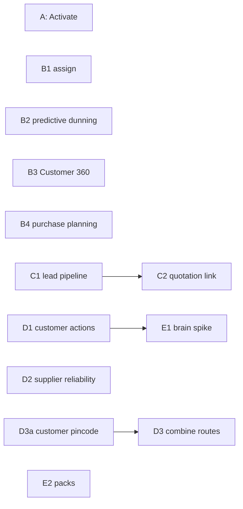
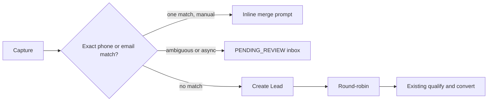

# Implementation Plan

Per-ticket build plans for the phases in the Roadmap tab, following the same data-model / service / API / frontend / flag / tests / DoD shape as the tickets already in the tree. International readiness is architecture-and-design only, per direction — no tickets, flags, or migrations there.

Decisions below were locked on 2026-09-23 after the open-question pass. Ticket text is the source of truth. Nothing in this plan is waiting on an unanswered product question. Three items are resolved dispositions with a trigger, recorded at the end: pilot tenant names, the Retail-vs-Trade flag list, and the WhatsApp Cloud API tier.

## Code facts these tickets rely on

Verified against the tree before the decisions were locked:

- Credit limit hard-blocks at **invoice completion** (`sales/services.py`, around the exposure check). `credit_limit == 0` means no limit. No override exists. Exposure today is ledger outstanding (posted documents minus unallocated advances; GL when books are on), not open sales orders or drafts.
- `MARGIN_DROP_SKU` is line-level: `(unit_price - purchase_price) / unit_price < 0.05` when both prices are positive.
- `DeliveryRouteStop` has sequence, status, notes, and links to the route and sales order. No coordinates, address, or pincode.
- `Customer` and `Supplier` have free-text address and `state` only. `CustomerShippingAddress` is the same. `Company` has a pincode; that is the seller's pincode and is not a delivery-stop location.
- Dunning is company settings (`dunning_days`, channels, quiet hours), not an `ENABLE_*` flag. `GSTIN_PROVIDER` defaults to `"null"`, so the active-status check does not run until a GSP is configured.
- `Lead.status` is `NEW` / `CONTACTED` / `QUALIFIED` / `LOST`. `Opportunity` has title, amount, stage, lead, and customer — no line items.
- There is no salesperson model. The sales-facing role is `CompanyUser.Role.SALES_STAFF`.
- There is no per-company timezone field. Application `TIME_ZONE` is `Asia/Kolkata`.
- RLS enforcement stays off. New tenant tables still get RLS policies in migrations, matching the September 2026 migrations.

## Architecture & engineering standards

These are the house rules every ticket in this plan follows. "Ready to execute" means an engineer can start a ticket without re-deriving these per ticket.

### Phase dependency graph

Product sequence, not a technical chain: Phase C starts after Phase B. Inside the phases, the only hard build dependencies are **C2 after C1** and **E1 after D1** (the spike needs D1's real events). B3 does not wait on B2. D2 does not wait on B. D3 waits on D3a only. E2 bundles whatever flags exist when it is built.

The no-auto-create rule covers financial and inventory documents (purchase orders, transfers, quotations, invoices). Lead auto-assignment is a reversible routing decision and is in scope for C1.

### Standards

1. **Multi-tenancy.** Every new model inherits the existing company-scoped base model; every new FK to a tenant-scoped table gets an index on `(company_id, <lookup field>)`. New tenant tables get RLS policies in the same migration style already used this month. Enforcement stays off unless a separate decision turns it on.
2. **Async by default for anything triggered by an external party.** WhatsApp inbound processing (after signature check and ack), CSV lead import, and any full-company history scan that is too heavy for a request (D1 cadence, E1 event mapping) go through the background task queue. B2 does not send messages. Existing dunning reminders keep their current send path.
3. **Idempotency and authenticity on every inbound webhook.** WhatsApp inbound verifies the provider signature before enqueue, then reuses the existing idempotency-record mechanism. A retried delivery must not create a duplicate Lead.
4. **Cache invalidation is not optional.** B2 and D1 v1 are compute-on-read, with no cache. If a cache is added later, it invalidates on the write that would change the answer. A TTL-only cache is not acceptable for these two.
5. **Migrations are additive-only, nullable, no backfill, by default.** `Lead.source` and `Customer.pincode` follow this. A ticket that needs a backfill must call that out and get its own review.
6. **Zero-config parity is a required test.** Every ticket that changes behavior for existing tenants includes a regression test proving the unconfigured or flag-off case matches today's behavior.
7. **API contracts.** New endpoints return the existing success/data envelope, use existing pagination and error-shape conventions, and are documented via the existing OpenAPI generation.
8. **Observability.** Every new flagged subsystem logs tenant id, flag state, and a structured event for its core action. Phase A's five already-shipped flags do not meet this yet; instrument them before their pilot watch starts.
9. **Rate limiting on every public/unauthenticated endpoint.** C1's web form reuses the existing per-company throttle, plus a honeypot field. A CAPTCHA is a later option, not part of C1.

### Explicitly out of this program

- Payroll. Do not extend it, and do not put `ENABLE_PAYROLL` in any E2 pack.
- Picking and packing states.
- Lead scoring, lead enrichment, price recommendations, and "find customers like my best customers."
- Supplier score, rank, or a switch-supplier suggestion. A later one-line narrative ("6% cheaper, 9 days slower") would be a separate D2b, not part of D2.
- Cross-sell rules and any ML layer.
- Override / audit-reason UX on the credit check.
- Mobile. New UI is web, English and Hindi.
- A second country, multi-currency implementation, or a payment-interface extraction. Sandboxed Cashfree/PayU do not count as a second live provider.
- A named reviewer gate for the India tax pack. A PR-template checklist for "new India logic stays in the India pack" is a separate process fix, not a ticket here.

## Phase A — activate what's already built (0–2 months)

Rollout of the five tickets already merge-ready behind default-off flags, plus one instrumentation task before any watch starts.

**Before the first flip.** Add the standard 8 log line (tenant id, flag state, core action) to supplier price history, replenishment, route profit, customer portal, and GST Guard. The pilot watch uses those events.

**Sequencing, least to most risk.** These are independent. GST Guard does not wait for the other four.

1. `ENABLE_SUPPLIER_PRICE_HISTORY` — read-only, zero new migrations.
2. `ENABLE_REPLENISHMENT` — enriches an existing alert row, additive migration only.
3. `ENABLE_ROUTE_PROFIT` — additive migration, only computes at route Complete.
4. `ENABLE_CUSTOMER_PORTAL` — new auth surface. Re-run rate-limit and scoping tests against a **staging copy** seeded with the pilot tenant's data shape. Do not exercise live magic links against production customers.
5. `ENABLE_GST_GUARD` — flips when CA sign-off lands, even if the other pilots are still in their watch window.

**Pilot rule.** One or two tenants per flag, with real volume in that flag's area. Names are an input supplied at flip time. No Phase A ticket, and no later phase, waits on knowing those names in advance. Flags are scoped and tested independently of which tenant they land on first. If no candidate has multiple warehouses, replenishment waits for one that does. If none has live delivery routes, route profit waits for one that does.

**Watch window, then the next flip of that same flag to a wider set:**

| Flag | Watch |
| --- | --- |
| Replenishment, route profit | One delivery or purchase cycle, about 1–2 weeks |
| Customer portal | Two weeks of usage |
| GST Guard | One monthly filing period |
| Supplier price history | One purchase cycle, about 1–2 weeks |

Flag grants use the existing company-level admin path. Global defaults stay off. Rollback is flipping the flag off. Migrations in this batch are additive and nullable.

**GST Guard sign-off.** `GSTIN_PROVIDER` defaults to `"null"`, so active-status never fires until a GSP contract is configured. Ask the CA to sign the **format check** that actually runs, with an explicit note that active-status is a no-op until that contract. Do not request sign-off on a check that cannot fire. `UNVERIFIED` stays a skip, as implemented.

## Phase B — Command Center + Cash completeness

B1, B2, B3, and B4 can proceed in parallel. B3 does not consume B2.

### B1. Business Action Object v2 — owner + due date

**Goal.** Add explicit assignment and a due date to Attention rows.

**Data model.** Extend `AttentionRowState` with `assigned_to` (FK to `CompanyUser`, nullable) and `due_date` (date, nullable). Both nullable so unassigned rows behave as today. RLS policy in the migration. Flag-off hides these fields and does not delete them.

**Service layer.** `assign_attention_row(company, dedupe_key, user, due_date)`, beside the existing snooze/dismiss functions. Assignee must be an active user with module access under existing RBAC. No notification in v1.

**Overdue.** A distinct overdue marker. Do not change severity. A severity bump would change sort order and the existing critical-alert cap. Due date is a calendar date in `Asia/Kolkata` (there is no per-company timezone). The row becomes overdue on the day **after** `due_date`.

**My Actions.** Assigned to the current user and not dismissed. A snoozed assigned row remains theirs and stays out of the surfaced list until the snooze ends.

**API.** One new action next to snooze/dismiss.

**Frontend.** Assignee and due-date pickers, My Actions filter, overdue marker. English and Hindi.

**Flag.** `ENABLE_ACTION_ASSIGNMENT`, default off.

**Tests.** Assignment persists independently of snooze/dismiss. Overdue flips on the day after `due_date`, not on the due date itself. Non-members cannot be assigned. Flag-off responses omit assignee and due date and leave the stored values in place. Existing Attention tests pass unmodified.

**DoD.** Owner and due date settable on any row · overdue is a marker, not a severity change · My Actions matches the rule above · flag default off.

**Effort.** 1–2 weeks.

### B2. Collections Intelligence v2 — predictive dunning

**Goal.** Show "usually pays N days late" before the due date. The existing reminder cadence is unchanged and still does the sending.

**Data model.** None. Compute on read. No cache in v1.

**Formula.**

- Days late = median, weighted toward the last 5 paid invoices.
- Confident only at 3 or more paid invoices. Below that, show nothing predictive.
- Surface a row 3 days before the due date, and only when predicted lateness is 2 days or more.
- Runs beside the existing cadence. It does not replace `dunning_days` or send WhatsApp, SMS, or email.

**API/Frontend.** A new Today row, plus a **new** collections worklist sorted by predicted risk. Do not fold this into the AR aging report.

**Flag.** `ENABLE_PREDICTIVE_DUNNING`, default off. There is no dunning feature flag to extend.

**Tests.** 0–2 paid invoices produce no prediction. A 3rd paid invoice can. The row appears only inside the 3-day window and only at 2+ predicted days late. Flag off leaves cadence and Today unchanged.

**DoD.** Predicted days-late shown with a confidence indicator · cold start is silent · no new outbound message · existing cadence unchanged when the flag is off.

**Effort.** 2–3 weeks.

### B3. Customer 360

**Goal.** One page over four services that already exist.

**Inputs.** Invoice profitability, customer sales report, AR aging, and the existing dunning risk snapshot. B2's prediction is a later enrichment if B2 has shipped. It is not a blocker.

**Data model.** None.

**API.** One composed endpoint.

**Frontend.** Customer 360 tab on the existing customer detail page.

**Visibility.** Reuse Attention's `can_view_financial_reports` gate. Hide profitability and outstanding amount when that capability is off. Order history, product history, and pattern text stay visible. Traceability is a test requirement: each number maps to the underlying service fixture. No drill-through UI in v1.

**Flag.** `ENABLE_CUSTOMER_360`, default off.

**Tests.** Composition against each service's fixtures. Financial fields hidden without `can_view_financial_reports`. Flag off leaves the customer page unchanged.

**DoD.** Four sources on one page · visibility matches Attention · flag default off.

**Effort.** 2 weeks.

### B4. Inventory Autopilot — Purchase Planning screen

**Goal.** List every reorder suggestion company-wide, not only Today's capped set. The user still saves the document.

**Data model.** None beyond replenishment's reorder fields.

**Service layer.** Every product/warehouse row with a positive suggested quantity. Exclude the company-wide aggregate row (same exclusion as the replenishment aggregate fix). Urgency = days to stockout at current velocity.

**API.** Filterable by warehouse, supplier, and urgency. If `ENABLE_REPLENISHMENT` is off, reject with a clear error. Do not return an empty list that looks like "nothing to buy."

**Frontend.** Bulk select opens one pre-filled purchase order or transfer **per supplier**, not one mixed document. The user saves. No auto-create.

**Flag.** `ENABLE_PURCHASE_PLANNING`, default off, dependent on `ENABLE_REPLENISHMENT`.

**Tests.** Listing matches Today's logic with the cap removed and the aggregate row absent. Bulk pre-fill is one document per supplier. Planning-on / replenishment-off returns the error. Flag off hides the page.

**DoD.** Full reorder list · per-supplier pre-fill still requires save · dependency enforced at the API · flag default off.

**Effort.** 2 weeks.

## Phase C — Growth & Sales foundation

Working sequence: start C after B. C1 is the largest ticket in the plan (4–6 weeks). C2 waits on C1. C3 does not.

### C1. Real lead pipeline

**Goal.** Capture, exact-match dedupe, and round-robin assignment on the existing lead model. Qualification and conversion stay as they are.

**Status machine.** Keep `NEW` → `CONTACTED` → `QUALIFIED` → `LOST`. "Qualify" is the existing transition to `QUALIFIED`. `convert_lead()` is unchanged. C1 only adds source, dedupe review, and assignment before conversion.

**Data model.**

| New field | Type | Notes |
| --- | --- | --- |
| `source` | enum, nullable | referral, website, whatsapp, walk_in, import, phone. No backfill, no default forced onto existing rows |
| `assigned_to` | FK to CompanyUser, nullable | set by round-robin; manual reassignment always allowed |
| `dedupe_matched_customer` | FK to Customer, nullable | single exact match |
| `dedupe_matched_lead` | FK to Lead, nullable | single exact match |
| `dedupe_review` | enum, nullable | `PENDING_REVIEW` when async capture is ambiguous. Not a fifth `Lead.status` |

RLS policy on any new tenant table. Indexes on `(company_id, source)`, `(company_id, assigned_to)`, `(company_id, dedupe_review)`.

Manual entry keeps the inline merge prompt in the request. CSV import and WhatsApp processing run in the background after the request is acknowledged. Ambiguous matches (phone hits one party and email hits another, or several candidates) become `PENDING_REVIEW` with both candidates shown. They are not auto-merged and not left as a second live lead.

**Dedupe.** Exact match after the existing phone canonicalization. No fuzzy match in v1.

**Round-robin.** Active users (`User.is_active`) whose membership role is `SALES_STAFF`. Inactive users are excluded. One eligible user receives every lead. An empty pool leaves the lead unassigned on the inbox. Fairness is the rolling 30-day assignment count, not lifetime.

**Channels.**

1. Manual entry — exists.
2. CSV import — reuse the imports app. Required for the definition of done.
3. Web form — required for the definition of done. Company identified by a per-company token or slug. Public fields: name, phone or email, free-text message. Throttle plus honeypot.
4. WhatsApp inbound — optional, behind `ENABLE_CRM_WHATSAPP_INBOUND` only. The Cloud API tier check is the trigger for that sub-flag. CSV import and the web form ship without it. When the sub-flag is built: verify the provider signature, then idempotency; store sender phone, text, timestamp, and the linked lead; no media in v1.

**API/Frontend.** Leads page gains source, assignee, and review filters, plus a "my leads" view and a pending-review queue. The public form is a small separate page. English and Hindi.

**Flags.** `ENABLE_CRM` gates the pipeline. `ENABLE_CRM_WHATSAPP_INBOUND` gates inbound only, and requires `ENABLE_CRM`.

**Tests.** Exact dedupe against customers and leads. Split phone/email match stays in review. Round-robin over a 30-day window, pool of one, and empty pool. CSV and web form accept well-formed input and reject malformed input. Webhook without a valid signature is dropped. Existing `convert_lead()` tests pass unmodified. `source` null on pre-existing leads.

**DoD.** CSV and web form live · exact dedupe against customers and leads · ambiguous async matches sit in `PENDING_REVIEW` · assignment is automatic for `SALES_STAFF` and still manually editable · public form is rate-limited · WhatsApp is off unless its sub-flag and the provider tier are both confirmed.

**Effort.** 4–6 weeks. WhatsApp is additional and does not gate this definition of done.

### C2. Opportunity → Quotation link

Depends on C1 only for a populated opportunity to click from. The link itself is small.

**Goal.** One click from a won opportunity to a quotation draft.

**Data model.** Nullable FK from Quotation to Opportunity. Quotations created outside CRM stay valid with the FK empty. One opportunity may spawn many quotations.

**Pre-fill.** Customer only. Opportunity has no product lines, so the draft has blank items. Button is shown on `WON` only.

**Flag.** `ENABLE_CRM`.

**Tests.** Pre-fill sets the customer and leaves items empty. Non-CRM quotations are unchanged. `OPEN` and `LOST` do not offer the action.

**DoD.** Won opportunity creates a customer-prefilled quotation draft · no behavior change for other quotations.

**Effort.** 1 week.

### C3. Credit check + margin warning at sales-order confirmation

**Goal.** At Sales Order confirmation, hard-block a credit breach and warn on a thin margin. Direct invoice and POS keep today's invoice-time credit block. Quotations are not gated.

**Credit.** Hard block. No override in v1.

- `credit_limit == 0` means no limit, same as today.
- Exposure at **sales-order confirmation** is broader than the invoice check: open sales orders + drafts + posted-invoice exposure from `customer_exposure_for_credit_limit`. This broadening is new scope. Do not change the invoice-completion formula in this ticket.
- Because the two formulas differ, an open order can block a later sales order while a direct invoice for the same customer still uses today's narrower check. That split is intentional.

**Margin.** Warn only, do not block. Reuse the `MARGIN_DROP_SKU` formula on the order's lines: `(unit_price - purchase_price) / unit_price < 0.05`.

**Data model.** None. No override log.

**API/Frontend.** Confirmation dialog. Credit breach stops confirmation. Margin breach is a warning the user can continue past, with no reason field.

**Flag.** `ENABLE_ORDER_GATES`, default off.

**Tests.** Limit 0 does not block. A projected SO exposure over the limit blocks confirmation. The same customer can still complete an invoice under today's formula when the flag is on. Margin under 5% warns and still confirms. Flag off matches today's sales-order confirmation exactly. POS and direct invoice tests stay unchanged.

**DoD.** Sales-order confirmation hard-blocks credit and warns on margin · invoice and POS paths unchanged · no override · flag default off.

**Effort.** 2–3 weeks.

## Phase D — Intelligence as action generators

D1, D2, and D3a can start without waiting on Phase B. D3 waits on D3a. E1 waits on D1.

### D1. Customer action generation

**Goal.** Attention rows for churn risk and repeat-order due, from order history. Customer 360 is not a prerequisite.

**Rules.** Heuristic, deterministic.

- **Cadence.** Median gap over the last 6 completed orders, or fewer if that is all the history. Cancelled orders are excluded. Partial returns do not change cadence.
- **Minimum history.** 3 completed orders and 60 days of history. Otherwise no row.
- **Churn.** Header-level. Gap since last order is at least 1.5× cadence. The 1.5 multiple is a fixed default.
- **Repeat-order due.** Per product. Fires when the date is inside the last 20% of the cadence interval before the predicted reorder date.
- Both may fire for the same customer in the same week.
- **Money impact.** Churn uses trailing-90-day average order value. Repeat-order uses that product's typical order value.
- **Cross-sell** is a later ticket, own sub-flag, not in this estimate. **Price recommendations** are not ticketed.

**Data model.** None. Compute on read. No cache. A later cache must invalidate on write.

**Flag.** `ENABLE_CUSTOMER_ACTIONS`, default off. Churn and repeat-order ship under this flag. Do not add the cross-sell sub-flag until that follow-on is scoped.

**Tests.** Under 3 orders or under 60 days produces no row. Cancelled orders are ignored. Churn uses 1.5× and the header. Repeat-order uses the product and the 20% window. Both can appear together. Flag off adds no Today rows.

**DoD.** Churn and repeat-order on Today with the money figures above · no row on thin history · no cross-sell and no price suggestion · flag default off.

**Effort.** 3–4 weeks.

### D2. Supplier Intelligence v2 — reliability metrics

No dependency on Phase B. Can ship beside the price-history pilot.

**Goal.** Two independent numbers on the supplier price-history tab: lead time and fill rate. No composite score, no rank, no switch-supplier suggestion.

**Lead time.** `receipt_date - order_date`, one sample per goods-receipt row. Partial receipts are separate samples, then averaged.

**Fill rate.** Sum of received quantity / sum of ordered quantity on non-cancelled lines. Display capped at 100%. Over-receipt is a separate flag, not a fill rate above 100%. Cancelled lines are excluded from both sums.

**Flag.** Extends `ENABLE_SUPPLIER_PRICE_HISTORY`. Companies with that flag on will see the two numbers when this ships. Call that out in the pilot notes. Do not add a second flag unless the pilot asks to separate them.

**Tests.** Seeded partial receipts, over-receipt, and cancelled lines. Response has no score or rank field, extending the existing price-history guard.

**DoD.** Lead time and fill rate per supplier/product · over-receipt called out separately · no score or rank.

**Effort.** 1–2 weeks.

### D3a. Customer pincode

**Goal.** Give D3 a location key. Do not parse free-text addresses, and do not cluster on state.

**Data model.** `Customer.pincode`, nullable, no backfill. Populate on create and edit from this ticket forward. RLS unchanged aside from the new column on an existing tenant table (follow the current column-add RLS pattern if one exists; do not invent a backfill).

**Frontend.** Pincode on the customer form. English and Hindi.

**Tests.** Existing customers save with a null pincode. New and edited customers can store one.

**DoD.** Nullable pincode on Customer · no backfill · no clustering in this ticket.

**Effort.** Under a week.

### D3. Route optimization — combine orders

Blocked on D3a. No dependency on `ENABLE_ROUTE_PROFIT`.

**Goal.** Advise combining same-day pending stops that share a pincode. The planner still commits the route.

**Rule.** Group pending stops whose sales order's customer has the same non-empty pincode. Different pincode means do not suggest combining. Missing pincode means the stop is left out of suggestions. Capacity, driver, and time windows are out of scope.

**Surface.** The route-planning screen, not Today. Suggestions do not modify a route.

**Flag.** `ENABLE_ROUTE_OPTIMIZATION`, default off.

**Tests.** Same pincode suggests a group. Different or blank pincode does not. Applying a suggestion does not happen in the API; the planner uses the existing route edit.

**DoD.** Advisory groups by pincode on the route-planning screen · no route auto-edit · flag default off.

**Effort.** About 1–2 weeks after D3a.

## Phase E — Business Brain and packaging

### E1. Event/decision pipeline formalization

Start only after D1 has shipped, so the spike maps real events.

**Goal.** A design spike for Events → State → Rules → Recommend → Approve → Execute → Outcome → Learn. No pipeline implementation in this ticket. No ML.

**Approval.** Only explicit assignment counts as approval. Dismiss and snooze are "not now." They are not approvals.

**Outcome.** The human acted inside the row's window (assigned and then resolved, or dismissed) and, where the metric is measurable, whether that metric improved afterward.

**Learning.** A report a person reads. v1 does not auto-adjust thresholds.

**DoD.** Every current alert and action source mapped to a proposed event schema · outcome and learning defined as above · no implementation ticket opened from the spike until that schema is reviewed.

**Effort.** 2–3 week spike.

### E2. Archetype packaging + persona onboarding

**Goal.** Named flag bundles and an onboarding wizard. This does not change how features are sold or entitled. Subscription entitlement wins over a pack default.

**Packs.** Retail and single-godown Trade first. Distribution and Manufacturing wait until the features they would bundle are stable. Phases A–D do not need the flag split. When E2 starts, draft a proposed Retail vs Trade split of the existing flags for review. Internal and ops flags stay out of that draft.

**Excluded from every pack.** Internal and ops flags, and `ENABLE_PAYROLL`.

**Data model.** Pack definition (name → flag set) and onboarding answers (what you sell, how you sell, whether you deliver, GST registered). Answer → pack is a new lookup table.

**Behavior.** The wizard proposes a pack and shows a confirm step before any flag changes. It never flips flags silently. A re-run does not overwrite flags the company changed by hand after the pack was applied. Packs stay editable in existing settings.

**Tests.** Each pack matches its documented flag list. A changed answer changes the proposal. Confirm is required before grants. A manual deviation survives a second wizard run. A flag absent from the subscription is not turned on. Payroll is in no pack.

**DoD.** Retail and Trade selectable at onboarding · entitlement and manual deviations win · payroll excluded · no new activation mechanism.

**Effort.** 3–4 weeks for the wizard and two packs. The first step of the ticket is the proposed flag split; the wizard build follows that review.

## International readiness — architecture and design only

No tickets, flags, migrations, or effort estimates. Do not build this without a separate decision.

### Multi-currency core (design)

Design target is five roles: **base**, **transaction**, **customer**, **supplier**, **reporting**. If this is ever built, the minimum first cut is base, transaction, and reporting. Also design, not build: a Currency master, a dated exchange-rate table, a currency-aware money type, and FX gain/loss accounts (realized at payment, unrealized at period-end). Invoices and payments would carry transaction currency plus the rate at document date, at the same seam the tax engine uses for totals.

### Payment abstraction (design)

The business layer should know Payment Intent, Payment, Refund, Settlement, Fee, and Reconciliation. Extract that interface only when a second **live** provider relationship exists. Sandboxed Cashfree and PayU adapters do not meet that bar.

### Country-pack contents (design)

A future country pack defines tax computation, invoicing and document-numbering rules, e-invoicing format, default currency, date and number formatting, and regulatory reports. Jurisdiction packs stay behind the tax/compliance engine. The India pack is the proof. Until a non-India deal exists, new India-specific logic stays inside that pack.

## Resolved dispositions

These are not open questions. Each has a trigger. Nothing else in the plan waits on them.

1. **Pilot tenants.** Selection rule is fixed: one or two tenants per flag, with real volume in that flag's area. Names are supplied when a flag is ready to flip. Phase A instrumentation, tests, and every later phase proceed without those names.
2. **Retail vs Trade flag list.** Not an input to Phases A–D. Trigger: E2 starts. First action of that ticket is a proposed split of the existing flags for review, with internal and ops flags excluded and `ENABLE_PAYROLL` in no pack. Entitlement, the confirm step, and manual-deviation protection stay as already specified.
3. **WhatsApp Cloud API tier.** Trigger for `ENABLE_CRM_WHATSAPP_INBOUND` only. C1's core deliverable is CSV import plus the web form, and that ships whether or not inbound is available on the contracted tier.
