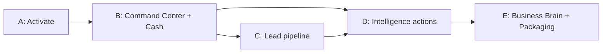
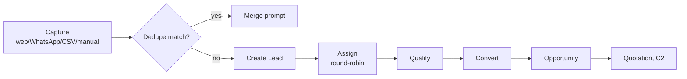
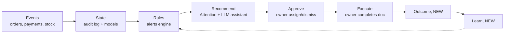

# Implementation Plan

Per-ticket build plans for the phases in the Roadmap tab, following the same data-model / service / API / frontend / flag / tests / DoD shape as the tickets already in the tree. International readiness is architecture-and-design only, per direction — no tickets, flags, or migrations there.

## Decisions from the 2026-09-23 review

53 open questions were raised against this plan and answered (full Q&A in chat history); every answer that changes what an engineer would build is folded into the ticket sections below. Highlights: C3 is redesigned — the credit gate moves to Sales Order confirmation matching today's invoice-time block exactly (`sales/services.py`'s existing `credit_limit`/exposure check), no override in v1; margin gate warns, doesn't block. C2's scope is trimmed — Opportunity has no line items today, so v1 is customer-only pre-fill. D3 gets a new precursor ticket, D3a, because there is no pincode field either (only free-text address) — D3 cannot be scoped until D3a lands. B2 gets its own flag, `ENABLE_PREDICTIVE_DUNNING` (the existing dunning switch is a company setting, `dunning_days`, not an `ENABLE_*` flag). The phase-dependency graph below is loosened: D2 and D3a don't depend on Phase B, only on their own data. Payroll and picking/packing are confirmed out of scope for this program. Packaging (E2) ships as flag bundles only, explicitly not an entitlement/billing change.

## Architecture & engineering standards

These are the house rules every ticket in this plan follows — codifying patterns already proven in the tickets shipped 2026-09-23, not new invention. "Ready to execute" means an engineer can start a ticket without re-deriving these per ticket.

### Phase dependency graph

```mermaid
flowchart LR
  A[A: Activate] --> B[B: Command Center + Cash]
  B --> C[C: Lead pipeline]
  B --> D[D: Intelligence actions]
  C --> D
  D --> E[E: Business Brain + Packaging]
```

Loosened 2026-09-23: only C2→C1 and E1→D1 are real dependencies. D2 (supplier reliability) needs only PurchaseOrder/GoodsReceipt, which exist today — no dependency on B. D3 depends on the new D3a pincode ticket, not on B. E2 (packaging) can bundle whatever flags exist when it's built, no hard dependency on B specifically. D1 doesn't need Customer 360 as a technical prerequisite (it reads order history directly). E1's spike still needs D1 shipped first, for real generated-action events to formalize against.

### Standards

1. **Multi-tenancy.** Every new model inherits the existing company-scoped base model; every new FK to a tenant-scoped table gets an index on `(company_id, <lookup field>)`, not just `company_id` alone — the replenishment ticket's own N+1 fix (precomputing per-company maps instead of querying per row) already shows this matters at real data volume. RLS is present but disabled by default; nothing in this plan changes that default without a separate decision.
2. **Async by default for anything triggered by an external party.** Inbound webhooks (WhatsApp inbound in C1), outbound notification sends (B2, C1), and any computation over a full company's transaction history (D1's cadence calculations, E1's event mapping) go through the background task queue, following the pattern the customer-portal ticket already established. Nothing in this plan should add a new synchronous external call inside a request/response cycle.
3. **Idempotency on every inbound webhook.** Reuse the existing idempotency-record mechanism for WhatsApp inbound (C1) and any future payment-provider webhook — a retried delivery must not create a duplicate Lead or duplicate action.
4. **Cache invalidation is not optional.** Attention's own 60-second read cache with no write-invalidation is a known, accepted tradeoff today — but it already caused two test flakes in the tickets shipped this week. Any new cached aggregation this plan introduces (B2's payment-pattern snapshot, D1's cadence/co-purchase stats) must invalidate on the write that would change its answer, or be documented as eventually-consistent with an explicit TTL, not silently copy the existing footgun.
5. **Migrations are additive-only, nullable, no backfill, by default.** This is what makes flag-off rollback free. A ticket that needs a backfill (none currently do) must call that out explicitly and get its own review.
6. **Zero-config parity is a required test, not a nice-to-have.** Every ticket that changes behavior for existing, already-configured tenants includes a regression test proving the unconfigured/default case matches today's behavior exactly — the same discipline the replenishment formula's own correction already forced.
7. **API contracts.** New endpoints return the existing success/data envelope, use existing pagination and error-shape conventions, and are documented via the existing OpenAPI generation — no bespoke response shapes.
8. **Observability.** Every new flagged subsystem logs at minimum: tenant id, flag state, and a structured event for its core action (lead captured, action assigned, order gate triggered), so Phase A's per-flag pilot-watch step has something concrete to watch, not just "no errors so far."
9. **Rate limiting on every public/unauthenticated endpoint.** C1's web-form intake and any future public capture surface reuse the existing per-company throttle class already validated for the customer-portal request-link endpoint.

## Phase A — activate what's already built (0–2 months)

Not new engineering — a rollout checklist for the five tickets already merge-ready behind default-off flags.

**Sequencing, least to most risk:**

1. `ENABLE_SUPPLIER_PRICE_HISTORY` — read-only, zero new migrations, safest to flip first.
2. `ENABLE_REPLENISHMENT` — enriches an existing alert row, additive migration only.
3. `ENABLE_ROUTE_PROFIT` — additive migration, only computes at route Complete.
4. `ENABLE_CUSTOMER_PORTAL` — a new auth surface; flip only after re-running its rate-limit and scoping tests against the pilot tenant's real data.
5. `ENABLE_GST_GUARD` — held last; gated on a decision outside engineering, not on code readiness.

**Per-flag rollout steps:**

- Pick one or two pilot tenants with real transaction volume in the relevant area (multiple warehouses for replenishment, active delivery routes for route profit, and so on). Resolved 2026-09-23: the selection rule is locked as written above; actual tenant names are a supplied input, not resolved in this plan — nothing else in Phase A or any later phase depends on knowing them in advance. Flip flags for named tenants as they're provided.
- Flip the flag via the existing company-level grant, never a global default change.
- Watch for at least one full business cycle before flipping the next flag. Expect at least one real surprise per feature — the replenishment ticket's own post-implementation review already found one (a company-wide aggregate row silently miscounted as a real warehouse).
- Rollback is just flipping the flag back off — every migration in this batch is additive-only and nullable, so no data cleanup follows a rollback.

**GST Guard — the one non-engineering gate:**

- Package the two new checks (buyer GSTIN format, buyer GSTIN active-status) for CA review: what triggers an alert, what's explicitly skipped (`UNVERIFIED`, no live provider configured), and why.
- Get written sign-off before flipping the flag for any tenant, pilot or not — this is a compliance-surface flag, not a UX one.
- Once signed, flip it for the same pilot tenants already validating the other four flags, so the CA and the business owner are watching the same account.

## Phase B — Command Center + Cash completeness

### B1. Business Action Object v2 — owner + due date

**Goal.** Close the one gap between Attention rows and the vision's Business Action Object: explicit assignment and a due date, not just per-user dismiss/snooze.

**Data model.** Extend the Attention row-state table with `assigned_to` (FK to a company user, nullable) and `due_date` (nullable). Keep both nullable so unassigned rows behave exactly as today.

**Service layer.** Attach `assigned_to`/`due_date` to each row's payload where a state row exists. New `assign_attention_row(company, dedupe_key, user, due_date)`, mirroring the existing snooze/dismiss functions rather than inventing a new state machine. Overdue rows (due date passed, not dismissed) get a severity bump or a distinct overdue flag — reuse the existing severity vocabulary instead of adding a new one.

**API.** One new action next to the existing snooze/dismiss endpoints.

**Frontend.** Assignee + due-date pickers on Attention rows; a "My Actions" filter; overdue rows visually distinct.

**Flag.** `ENABLE_ACTION_ASSIGNMENT`, default off.

**Tests.** Assignment persists independently of snooze/dismiss state; overdue detection at the boundary date; only company members can be assigned; every existing Attention test still passes unmodified.

**DoD.** Owner + due date settable on any row · overdue rows visibly distinct · existing Attention/dashboard tests pass unmodified · flag default off.

**Effort.** 1–2 weeks.

### B2. Collections Intelligence v2 — predictive dunning

**Goal.** Reactive (overdue → remind) to predictive ("Customer A usually pays 7 days late — ₹3.2L due Friday, contact today"), per vision Phase 4.

**Data model.** None for v1 — compute on read from existing receipt and invoice due-date history. Add a cached snapshot table later, mirroring the existing cashflow-forecast pattern, only if the naive version proves too slow.

**Service layer.** Add a payment-pattern calculation next to the existing risk-snapshot function: average/median days-late per customer, weighted toward recent invoices, with a confidence indicator based on sample size. Feed it into the existing risk snapshot and into a new Attention row when a due date is approaching and the pattern predicts lateness.

**API/Frontend.** New Today row surfacing the prediction; a dedicated collections worklist sortable by predicted risk, built on the existing AR aging report.

**Flag.** Corrected 2026-09-23: dunning today is a company setting (dunning\_days, channels, quiet hours), not an ENABLE\_\* flag — there is no existing flag to extend. New flag: ENABLE\_PREDICTIVE\_DUNNING, default off. Reusing the settings switch would have silently turned predictions on for every company already using reminders.

**Tests.** Cold-start customers (0–2 paid invoices) don't get a false-confident prediction; pattern updates correctly as receipts arrive; no regression to existing cadence behavior when the feature is off.

**DoD.** Predicted days-late shown with a confidence indicator · cold-start handled · existing cadence unaffected when off.

**Effort.** 2–3 weeks.

### B3. Customer 360

**Goal.** One page combining what's scattered across four existing services, per vision Phase 7.

**Data model.** None — pure aggregation.

**Service layer.** Compose the existing invoice-profitability service, customer sales report, AR aging, and the B2 payment pattern into one view. Orchestration, not new computation.

**API.** One new endpoint returning the composed view.

**Frontend.** New Customer 360 tab on the existing customer detail page.

**Flag.** `ENABLE_CUSTOMER_360`, default off, mainly for staged rollout rather than risk reduction.

**Tests.** Composition correctness against each underlying service's existing fixtures; role-based field visibility matches the existing pattern Attention already uses to hide financial data from cashiers.

**DoD.** All four data sources on one page · role-based visibility matches existing rules · every number traceable to an existing, tested service.

**Effort.** 2 weeks.

### B4. Inventory Autopilot — Purchase Planning screen

**Goal.** Promote the replenishment suggestion from a Today-row enrichment into a full planning screen, per vision Phase 5.

**Data model.** None beyond the reorder-level fields already added for replenishment.

**Service layer.** List every product/warehouse combination with a positive suggested quantity, company-wide — the existing suggestion logic, run across all rows rather than only the ones that fit Today's capped list.

**API.** One new endpoint, filterable by warehouse/supplier/urgency.

**Frontend.** New page; bulk-select opens pre-filled PO/transfer create screens — still owner-completes-and-saves, same no-auto-create rule as the underlying suggestion feature.

**Flag.** `ENABLE_PURCHASE_PLANNING`, dependent on `ENABLE_REPLENISHMENT`.

**Tests.** Full listing matches what Today would show uncapped; bulk pre-fill produces the same query params as the single-row action; flag dependency enforced.

**DoD.** Every reorder-needing product listed, not just Today's capped set · bulk pre-fill still requires manual save · flag default off and dependent.

**Effort.** 2 weeks.

## Phase C — Growth & Sales foundation

### C1. Real lead pipeline

**Goal.** Replace the three-state CRM stub with actual capture, qualification, and assignment — the vision's single most important correction.

**Data model.** Extend the Lead model with a `source` field (referral, website, WhatsApp, walk-in, import, phone), keeping its existing status field. Add a simple assignment rule (round-robin — the simplest correct thing) rather than a full rules engine.

| New field | Type | Notes |
| --- | --- | --- |
| `source` | enum | referral, website, whatsapp, walk\_in, import, phone |
| `assigned_to` | FK to CompanyUser, nullable | set by the round-robin service |
| `dedupe_matched_customer` | FK to Customer, nullable | set when dedupe finds an existing customer |
| `dedupe_matched_lead` | FK to Lead, nullable | set when dedupe finds an existing lead |

```mermaid
flowchart LR
  A[Capture<br/>web/WhatsApp/CSV/manual] --> B{Dedupe match?}
  B -- yes --> C[Merge prompt]
  B -- no --> D[Create Lead]
  D --> E[Assign<br/>round-robin]
  E --> F[Qualify]
  F --> G[Convert]
  G --> H[Opportunity]
  H --> I[Quotation, C2]
```

Every arrow into "Create Lead" or "Merge prompt" runs inside a background task when the source is a webhook (WhatsApp) or a bulk import (CSV) — only manual entry and the web-form's synchronous "we got it" acknowledgment stay in the request/response cycle, per standard 2 above.

**Capture channels, cheapest-to-verify first:**

1. Manual entry — already exists.
2. CSV import — reuse the existing imports app's pattern rather than building new ingestion.
3. Web form — a public, rate-limited endpoint, reusing the same throttle pattern the customer portal's request-link endpoint already uses.
4. WhatsApp inbound — reuse the existing outbound WhatsApp integration; inbound requires a new webhook receiver.

**Deduplication.** Match phone/email against existing customers and leads before creating a new record; surface a merge prompt rather than silently duplicating.

**Service layer.** Add lead-assignment and dedup services alongside the existing lead-conversion service, following its pattern rather than a new module.

**API/Frontend.** Extend the existing Leads page with source/assignment filters and a "my leads" view; the public web-form's own frontend is a small, separate embed.

**Flag.** The existing CRM flag (currently dark) — this ticket is what makes it worth turning on. Resolved 2026-09-23: WhatsApp inbound gets its own sub-flag, ENABLE\_CRM\_WHATSAPP\_INBOUND, separate from the core ENABLE\_CRM pipeline. Confirming the contracted WhatsApp Cloud API tier allows inbound blocks only this sub-flag; CSV import and the web form are unblocked and ship as C1's core deliverable regardless of that answer.

**Tests.** Dedup correctness across channels; assignment fairness; each channel's ingestion path, including malformed/spam input on the public endpoint.

**DoD.** At least two capture channels beyond manual entry live · dedup checked against both customers and leads · assignment automatic, not manual-only · public endpoints rate-limited.

**Effort.** 4–6 weeks — the largest ticket in this plan; a genuinely new subsystem, not an extension.

### C2. Opportunity → Quotation link

**Goal.** Close the loop from a CRM Opportunity into the existing Quotation chain, so a won deal doesn't need re-keying.

**Data model.** Optional link from Quotation to Opportunity (Quotation stays the side that can exist without an Opportunity — most sales won't originate from CRM for a long time).

**Service layer.** Resolved 2026-09-23: Opportunity has no line items today (title, amount, stage, lead, customer only) — "pre-fill any products already noted" has nothing to read. v1 trims to customer-only pre-fill: "Create Quotation" action on the Opportunity detail view (WON stage only), opening a blank-items Quotation pre-addressed to the right customer. A follow-on ticket would add OpportunityLine (products/quantities) if product pre-fill is actually wanted — not part of this estimate. One Opportunity may spawn multiple Quotations, no one-to-one constraint.

**API/Frontend.** One new action button and pre-fill; no new page.

**Flag.** Rides the CRM flag.

**Tests.** Pre-fill correctness; Quotations created outside CRM (the common case today) are unaffected.

**DoD.** One click from a won Opportunity to a pre-filled Quotation draft · no behavior change for non-CRM Quotations.

**Effort.** 1 week.

### C3. Credit check + margin check as order-time gates

**Goal.** Move credit-limit and margin checks from after-the-fact alerts to Sales Order confirmation, per the vision's Order-to-Cash Control Tower.

**Policy decision needed before scoping.** Resolved 2026-09-23: no override, block only, matching today's invoice-time behavior exactly. The original open question was: should a breach **block** confirmation outright, or **warn with an audited override**? The existing stock-availability check blocks unconditionally for every product; credit and margin are judgment calls, not physical impossibilities, so the same rule may not fit. Don't scope the rest of this ticket until that's decided — it changes both the UX and the audit-trail requirement.

**Data model.** None. No override in v1, so no override-log record. Exposure calculation broadens from today's invoice-only exposure to open sales orders + drafts + posted invoices, since the point of moving the gate earlier is to catch exposure building up before it reaches an invoice — this is real new scope on top of the reused check, not a pure reuse.

**Service layer.** Extend the order-confirmation path with a pre-check reusing the exact credit-limit/exposure logic from sales/services.py's invoice-completion path (credit\_limit == 0 means no limit, same as today) and the exact line-level margin formula MARGIN\_DROP\_SKU already uses (unit\_price vs. product.purchase\_price, 5% threshold) — reuse both, don't reimplement either.

**API/Frontend.** Confirmation blocks outright on a credit breach (no reason field, no override, matching today's invoice behavior). A margin breach shows a warning banner on the same confirmation screen but does not block.

**Flag.** `ENABLE_ORDER_GATES`, default off.

**Tests.** Credit breach blocks confirmation with no override path; margin breach warns without blocking; a customer/product with nothing configured behaves exactly as today — the same "unconfigured case matches current behavior" discipline the replenishment ticket already used for its formula.

**DoD.** Credit breach blocks at confirmation using the same rule as today's invoice check, exposure now including orders/drafts · margin breach warns only · no override surface built · unconfigured cases (credit\_limit=0) unaffected.

**Effort.** 2 weeks — policy question resolved 2026-09-23, no longer blocking estimation.

## Phase D — Intelligence as action generators

### D1. Customer action generation

**Goal.** Turn Customer 360 data into real Attention rows: repeat-order due, cross-sell opportunity, churn risk — vision Phase 7.

**Approach.** Heuristic rules inside the existing alerts engine pattern, not a new ML system — consistent with the codebase's existing deterministic-first doctrine.

- **Churn risk:** a customer whose gap since last order exceeds roughly 1.5× their historical average order cadence. Cadence is computable from existing order history, no new data.
- **Repeat-order due:** the inverse — a customer approaching their typical reorder interval for a specific product.
- **Cross-sell:** start with simple co-purchase counts (customers who buy A also buy B; this customer has A but not B), not a recommendation model. The weakest of the three — ship it last, after the other two prove the pattern.

**Data model.** None for the rule-based version; cache cadence/co-purchase stats later only if performance demands it, mirroring B2's approach.

**Flag.** `ENABLE_CUSTOMER_ACTIONS`, default off, with separate sub-flags per rule so the weaker cross-sell heuristic can be held back independently.

**Tests.** Each rule's trigger condition in isolation; false-positive sanity checks against seeded order histories — a brand-new customer shouldn't trigger churn risk on day one.

**DoD.** Churn-risk and repeat-order-due rules live on Today · cross-sell behind its own sub-flag · no false-confident action from insufficient history.

**Effort.** 3–4 weeks for churn + repeat-order; cross-sell is a follow-on, not included.

### D2. Supplier Intelligence v2 — reliability metrics

**Goal.** Add lead-time and fill-rate visibility to supplier price history, per vision Phase 8 — pending the scoring decision flagged in the Roadmap tab.

**Data model.** None — compute from existing goods-receipt dates/quantities against purchase-order dates/quantities.

**Service layer.** A reliability calculation — average lead time, fill rate — shown as plain figures on the existing supplier price-history tab. If the no-score decision stands, ship exactly this: numbers, no composite score, no ranking, no switch-supplier suggestion, continuing the explicit constraint the price-history ticket already tests for. If that decision is overturned, this ticket's scope grows to include a composite-score design, which should be re-planned separately.

**Flag.** Extends the existing supplier price-history flag.

**Tests.** Metric correctness against seeded PO/receipt pairs; confirms no score/rank field appears in the response, extending the existing regression guard.

**DoD.** Lead-time and fill-rate shown per supplier/product · no score or rank anywhere, unless explicitly overturned first.

**Effort.** 1–2 weeks for the metrics-only version.

### D3. Route optimization — combine orders

**Goal.** Suggest combining pending deliveries into fewer routes, per vision Phase 6's end state.

**Blocking prerequisite — confirm before scoping.** Confirmed 2026-09-23: DeliveryRouteStop has sequence/status/notes/delivered\_at only, no location field, and Customer/Supplier have no pincode either (only free-text address + state). New precursor ticket, D3a: add a nullable pincode field to Customer, populated going forward, no backfill — same additive-migration discipline as every other ticket here. D3 cannot be scoped until D3a lands; don't build against parsed free-text addresses or state-level grouping (too coarse for one city).

**Service layer, once confirmed.** Simple proximity clustering of same-day, same-area pending stops — not a real vehicle-routing optimizer, matching the simplest-correct-thing-first pattern used elsewhere in this plan.

**Flag.** `ENABLE_ROUTE_OPTIMIZATION`, default off.

**Tests.** Clustering correctness against seeded stop locations; no suggestion when stops are too sparse or far apart to combine sensibly.

**DoD.** Location-data audit complete and documented before any clustering code · suggestions advisory only, no route auto-modified.

**Effort.** Unscoped until the location-data audit lands; budget about a week for the audit before estimating the rest.

## Phase E — Business Brain and packaging

### E1. Event/decision pipeline formalization

**Goal.** Give the vision's Events → State → Rules/Analytics/ML/LLM → Decision → Approval → Execution → Outcome → Learning pipeline an explicit shape, building on what already exists rather than replacing it.

**What this formalizes, not replaces:** the existing alerts engine (rules), the LLM assistant (explanation/recommendation), Attention's dismiss/snooze/assign state (Phase B, approval-adjacent), and the existing audit-event infrastructure — the closest thing to an event log today.

**Recommended first step — a design spike, not a build.** Mirror the discipline the tax-engine seam used: a bounded 2–3 week spike mapping every existing alert/action source to a proposed event schema, and — critically — designing the outcome-tracking half, which doesn't exist at all today (was a recommendation followed, and did it work). Outcome tracking is the actual moat the vision describes; get its design right before writing pipeline code around it.

**Explicit scope guard.** No ML/optimization layer in this phase. The vision itself places Business Brain last for a reason — this formalizes the rules/approval/outcome skeleton later ML work would need; it doesn't add prediction.

```mermaid
flowchart LR
  EV[Events<br/>orders, payments, stock] --> ST[State<br/>audit log + models]
  ST --> RU[Rules<br/>alerts engine]
  RU --> RE[Recommend<br/>Attention + LLM assistant]
  RE --> AP[Approve<br/>owner assign/dismiss]
  AP --> EX[Execute<br/>owner completes doc]
  EX --> OU[Outcome, NEW]
  OU --> LE[Learn, NEW]
  LE -.-> RU
```

Everything left of Outcome exists today in some form. Outcome and Learn are the two genuinely new pieces this ticket adds — the dotted feedback line back into Rules is the part that makes this a loop instead of a one-way pipeline, and is the actual design risk the spike needs to resolve.

**DoD (for the spike).** Every existing alert/action source mapped to a proposed event schema · outcome-tracking design reviewed and agreed before any implementation ticket opens against it.

**Effort.** 2–3 week spike; implementation effort follows once the spike's findings are in.

### E2. Archetype packaging + persona onboarding

**Goal.** Bundle today's roughly 30 independent feature flags into named packs (Retail, Trade, Distribution first, per the vision's own wave sequencing) with persona-based onboarding — pending the packaging decision flagged in the Roadmap tab.

**Data model.** A pack-definition mapping (pack name → the flag set it turns on), plus the answers captured at onboarding (what do you sell, how do you sell, do you deliver, GST registered).

**Service layer.** Onboarding wizard maps answers to a pack to the corresponding flags, applied through the existing company-level flag-grant mechanism — no new activation path, just a guided way to set the same flags a founder would otherwise set by hand.

**Frontend.** A new onboarding wizard; a pack stays hand-tunable afterward through existing settings — packaging is a smart default, not a lock.

**Sequencing.** Ship Retail and single-godown Trade packs first; Resolved 2026-09-23: which of the roughly 30 flags sit in Retail versus Trade is a business list, explicitly deferred until E2 actually starts — not needed for and not blocking any earlier phase. A proposed split (internal/ops flags excluded, per the locked entitlement rule above) gets drafted for review when E2 begins, not required as an input before then. hold Distribution/Manufacturing packs until their underlying features (this plan's Phase B–D work) are further along, per the vision's own wave order.

**Tests.** Each pack's flag set matches its documented feature list; changing an onboarding answer updates the proposed pack correctly; a company can still deviate from its pack's defaults afterward.

**DoD.** At least Retail and Trade packs defined and selectable at onboarding · underlying flags unchanged — packaging is a UX layer, not a new activation mechanism.

**Effort.** 3–4 weeks for the wizard plus two packs, assuming the underlying features they bundle are already stable.

## International readiness — architecture and design only

No tickets, flags, migrations, or effort estimates in this section — it exists to keep design direction consistent, not to schedule work. Do not build against it without a separate, explicit decision to do so.

### Multi-currency core (design)

Three currency roles needed on every money-bearing document: **base** (the company's own), **transaction** (the document's), **reporting** (consolidation). Concepts to design, not build: a Currency master, a dated exchange-rate table, a currency-aware money type used consistently instead of raw decimals, and FX gain/loss GL accounts (realized at payment, unrealized at period-end revaluation). Where it would eventually touch the codebase: invoices and payments would need a transaction-currency plus exchange-rate-at-document-date pair, designed to sit at the same seam the tax engine already isolates totals computation at — not scattered across sales/purchase call sites.

### Payment abstraction (design)

The business layer should only know Payment Intent, Payment, Refund, Settlement, Fee, Reconciliation. Country/provider specifics implement them underneath — India's gateway adapters already exist in roughly this shape, so the main design gap is naming and extracting the shared interface explicitly, the same refactor the tax engine already did for tax. Do this extraction only when there's a second provider ecosystem to design against — extracting an interface from one implementation tends to guess wrong.

### Country-pack contents (design)

A future country pack needs to define, modeled on what the India pack already covers: tax computation (already isolated), invoicing/document-numbering rules, e-invoicing/reporting format, default currency, date/number formatting, and regulatory report definitions. Design principle carried over directly from the vision: pluggable jurisdiction packs behind a tax/compliance engine, never country checks scattered through business logic — the India pack is the existence proof this is achievable without a rewrite, when the time comes.

### What to actually do now

Two things, both already true today and worth stating explicitly so they don't erode: keep new India-specific logic inside the India tax pack rather than letting it leak back into shared sales/purchase call sites, and don't add a second country's tax/currency/payment code until a specific non-India deal makes it real. Everything else above is reference for that future decision, not a queue.
