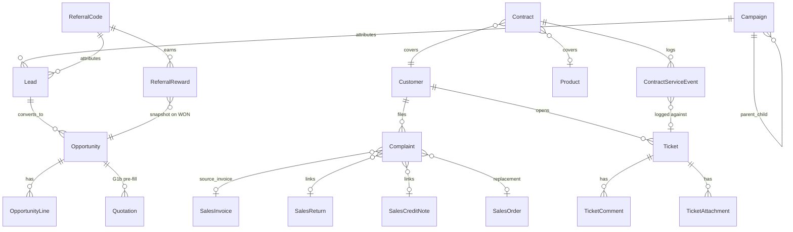

# Growth OS Epics — Implementation Plan

Per-ticket build plans for the five phases in
[GROWTH_OS_EPICS_ROADMAP_2026-09-24.md](GROWTH_OS_EPICS_ROADMAP_2026-09-24.md), at the same
data-model / service / API / frontend / flag / tests / DoD depth as
[BIZBOARD_OS_VISION_IMPLEMENTATION_PLAN_2026-09-23.md](BIZBOARD_OS_VISION_IMPLEMENTATION_PLAN_2026-09-23.md),
so an engineer can start a ticket without re-deriving conventions. Grounded directly in what's in
the tree today (`crm/models.py`, `crm/pipeline.py`, `crm/views.py`, `core/models.py`,
`core/services/feature_flags.py`, `core/services/document_numbers.py`, `insights/alerts.py`) — not
invented patterns.

Decisions below were locked in the 2026-09-24 review, including the three business confirmations
and the Hindi and attachment defaults. Where the roadmap still disagrees, this document wins.
The plan is ready to build. G4 still waits on a pilot tenant that sells warranty, AMC, or
subscriptions — that wait is a confirmed start gate, not an open question.

## Architecture decisions

These are the design calls that make this a coherent system instead of five unrelated features
bolted on. Read this section once before touching any ticket below.

### 1. App boundaries

| App | New or existing | Owns |
| --- | --- | --- |
| `crm` | existing, extended | `Campaign`, `Lead.campaign`, `Lead.referral_code`, `OpportunityLine`, `Opportunity.probability` / `expected_close_date`, `ReferralCode`, `ReferralReward` |
| `complaints` | **new** | `Complaint`, `ComplaintAttachment` |
| `support` | **new** | `Ticket`, `TicketComment`, `TicketAttachment` |
| `contracts` | **new** | `Contract`, `ContractServiceEvent`, `ContractDocument` |

Three new apps, not one big "growth" app — matches how this codebase already separates bounded
contexts (`payments`, `purchases`, `sales`, `insights` are all separate). Referral stays inside
`crm`: it is attribution on `Lead`, reuses `crm.pipeline.capture_lead`, and a standalone app
would only import `crm`.

`support` never imports `contracts`. `complaints` may import `sales`; `sales` never imports
`complaints`. `contracts` may import `support.Ticket`; the only link is
`ContractServiceEvent.ticket`. There is no `Ticket.contract` field and no automatic service-event
creation from a ticket status change.

### 2. One shared numbering primitive, not three copies

`core/services/document_numbers.py`'s `DocumentNumberService` is GST-document-specific — its
series are keyed by `(doc_type, gstin_key, fy_label)` and generate prefixes like `INV-2627-A1B2`.
Complaint, Ticket, and Contract are not GST documents. Reusing that service would drag in FY/GSTIN
partitioning and couple three apps to `_queryset_for`'s hardcoded model map.

Add one primitive in `core`. Numbers are minted synchronously inside the create transaction, never
left blank and backfilled. Uniqueness matches `SalesReturn` / `SalesCreditNote`: a **partial**
unique index that ignores `number=""`.

```python
# core/models.py — new model, additive migration
class SequenceCounter(CompanyScopedModel):
    scope = models.CharField(max_length=32)   # "COMPLAINT", "TICKET", "CONTRACT"
    last_value = models.PositiveIntegerField(default=0)

    class Meta:
        constraints = [
            models.UniqueConstraint(fields=["company", "scope"], name="core_sequence_company_scope_uniq"),
        ]

# core/services/sequences.py — new file
def next_number(company, scope: str, *, prefix: str) -> str:
    """Row-locked per-company, per-scope counter. Not a GST document series.
    Retry the first-insert race: two transactions can both miss the SELECT."""
    from django.db import IntegrityError, transaction

    for _ in range(3):
        try:
            with transaction.atomic():
                counter, _ = SequenceCounter.objects.select_for_update().get_or_create(
                    company=company, scope=scope, defaults={"last_value": 0}
                )
                counter.last_value += 1
                counter.save(update_fields=["last_value", "updated_at"])
                return f"{prefix}-{counter.last_value:06d}"
        except IntegrityError:
            continue
    raise BusinessRuleError("Could not allocate a number, try again.")
```

Do not audit number mints. Status transitions and contract-status refreshes are audited; a counter
increment is noise.

On `Complaint`, `Ticket`, and `Contract`:

```python
models.UniqueConstraint(
    fields=["company", "number"],
    condition=~models.Q(number=""),
    name="uniq_<model>_number_per_company",
)
```

### 3. Attachments reuse `core.FileAsset`, never a new upload path

`core.FileAsset` is the existing file-storage model. There is no generic upload endpoint; each
consumer creates a `FileAsset` itself (see `sales/views.py` export). Ticket, Complaint, and
Contract each get a thin join table plus their own `POST /{id}/attachments/` action that creates
the `FileAsset` (`kind=FileAsset.Kind.ATTACHMENT`) and the join row in one call.

```python
class TicketAttachment(CompanyScopedModel):
    ticket = models.ForeignKey(Ticket, on_delete=models.CASCADE, related_name="attachments")
    file = models.ForeignKey("core.FileAsset", on_delete=models.PROTECT, related_name="+")
```

Same shape for `ComplaintAttachment` and `ContractDocument`.

Size ceiling is the existing upload cap, not a second limit: `FILE_UPLOAD_MAX_MEMORY_SIZE`
(default 15MB in `config/settings.py`). The request is already cut by `MAX_REQUEST_BODY_SIZE`
(default 25MB). Accept only `image/jpeg`, `image/png`, `image/webp`, and `application/pdf`.
That covers damage photos, inspection photos, and signed contract PDFs. No video and no
arbitrary office documents in v1 — there is no malware-scanning story yet.

Delete is allowed for the record's assignee or any user who passes `CanCreateSales`. No separate
delete permission class.

### 4. Entity-relationship overview



Every arrow into an existing model is a nullable FK on the new side, except required `customer`
on Complaint, Ticket, and Contract, and required `product` on `OpportunityLine`.

### 5. Indexing rule (applies to every model below)

Every new FK to a company-scoped table gets a composite index on `(company_id, <lookup field>)`,
not `company_id` alone. Every table below lists its indexes explicitly.

### 6. Background work — what needs Celery and what doesn't

- **Needs a task:** G4's nightly `refresh_contract_statuses`. It walks contract rows, not a
  request.
- **Does not need a task:** everything else is a single-row write or a read-time aggregation
  scoped to one company.

### 7. Caching

No cache table for campaign funnel, forecast, or referral leaderboard in v1. Contract `status`
is stored and refreshed because it is read from Attention on every Today-page load.

### 8. Flag registry changes

Four new rollout flags. Company JSON can turn them on or off, same both-ways semantics as
`ENABLE_CUSTOMER_360`. None are dark modules.

They stay **out of** `accounts/packs.py` `retail` / `trade` tuples and **out of** the trial plan's
`modules` dict until each is stable in production. Same wave-sequencing rule already used for
`distribution` / `manufacturing`.

Each flag needs all four of these, in the same PR that introduces it:

1. `ENV_FLAG_KEYS` in `core/services/feature_flags.py`
2. `ROLLOUT_GRANTABLE_KEYS` in the same file
3. `settings.py` env default **off** (`ENABLE_COMPLAINTS = _env_bool("ENABLE_COMPLAINTS")`, and the same for the other three)
4. A flag-lifecycle test extending the existing pattern (`test_flag_observability.py` if that file has landed, otherwise the current flag-lifecycle test)

```python
ENV_FLAG_KEYS = (
    ...,
    "ENABLE_COMPLAINTS",
    "ENABLE_SUPPORT_TICKETS",
    "ENABLE_CONTRACTS",
    "ENABLE_REFERRALS",
)
ROLLOUT_GRANTABLE_KEYS = frozenset({
    ...,
    "ENABLE_COMPLAINTS",
    "ENABLE_SUPPORT_TICKETS",
    "ENABLE_CONTRACTS",
    "ENABLE_REFERRALS",
})
```

`Campaign` and `OpportunityLine` ride `ENABLE_CRM` (`assert_crm_enabled`). `ENABLE_REFERRALS` is
checked **in addition to** `ENABLE_CRM`.

Every new write path calls `log_flag_event` with tenant id, flag key, flag state, and a structured
event name (`complaint_created`, `ticket_created`, `contract_created`, `referral_code_issued`).

Do not wait for G1a before flipping `ENABLE_CRM` for a pilot. The Lead pipeline alone is a
complete pilot surface. A lead with no campaign is the zero-config default. Gating the flip on
Campaigns would delay a validated feature for an unvalidated one.

### 9. API conventions

Every new route is under the existing mount: `/api/v1/...` (`config/urls.py` includes apps at
`path("api/v1/", ...)`). Not `/api/crm/...`.

`CompanyScopedViewSet` base. Permission on each new viewset:
`IsAuthenticated + HasCompany + CanCreateSales`, same class list as `LeadViewSet` and
`OpportunityViewSet`. `CanCreateSales` is the `can_create_sales` capability (`OWNER` always
passes). The public lead form stays unauthenticated and rate-limited.

Existing success/data envelope, existing pagination (`fetchPage`), documented through
`manage.py spectacular`. Each ticket that adds or changes an endpoint regenerates
`docs/openapi-snapshot.json` and `web/src/api/openapi-types.ts` in that ticket's PR.

Every cross-model FK uses `CompanyPrimaryKeyRelatedField` (`core/serializers.py`), the same field
`OpportunitySerializer` already uses for `lead` and `customer`. That includes `Campaign.parent`,
`Complaint.customer` / `source_invoice` / document links, `Ticket.customer` / `assigned_to`,
`Contract.customer` / `product`, `ReferralCode.referrer_customer` / `referrer_user`, and
`Lead.campaign` / `Lead.referral_code`.

Service-layer status changes call `AuditService.log` explicitly.
`CompanyScopedViewSet.perform_create` / `perform_update` / `perform_destroy` already audit generic
CRUD. `refresh_contract_statuses` writes a system-actor audit row per status change.

### 10. Frontend conventions

Web only. `mobile/` is a separate follow-on plan, not part of these tickets.

Every new route gets a nav entry hidden when its flag is off, plus keys in `en.ts` and `hi.ts`.
`hi.ts` uses the English string plus a comment marking the key untranslated. Do not invent Hindi,
and do not block a PR on a translator. Translation of the Growth OS strings is one follow-up
ticket before launch, not a per-PR obligation. No owner is named yet.

### 11. Testing convention carried over

Every ticket includes a zero-config parity test: with the new flag off, existing suites pass
unmodified. `OpportunityViewSet.quotation` keeps today's customer-only header when the opportunity
has zero lines.

---

## Phase G1 — CRM foundation completion

### G1a. Campaign model + attribution

**App.** `crm`.

**Data model.**

| Field | Type | Notes |
| --- | --- | --- |
| `name` | `CharField(200)` | required |
| `campaign_type` | `CharField(16)`, choices | `DIGITAL`, `REFERRAL`, `EVENT`, `MARKET_VISIT` |
| `parent` | `FK("self")`, null | same company only, via `CompanyPrimaryKeyRelatedField` |
| `budget` | `DecimalField(12,2)`, default 0 | |
| `target_revenue` | `DecimalField(14,2)`, null | context, not the ROI denominator |
| `expected_outcome` | `CharField(255)`, blank | free text |
| `start_date` / `end_date` | `DateField`, null | `end_date < start_date` raises `ValidationError` |
| `status` | `CharField(16)`, choices | `DRAFT`, `ACTIVE`, `PAUSED`, `COMPLETED`; default `DRAFT`. **User-set.** Never derived from dates. |

`Lead.campaign` — nullable FK, `on_delete=SET_NULL`, `related_name="leads"`. `source` stays the
channel. A `whatsapp` lead can belong to a campaign or to none.

**Hierarchy.** A parent rollup includes the parent's own leads plus every descendant. Cycle check
at write time: walk `parent` from the proposed parent; if `self` appears, reject. `campaign_rollup`
also stops at depth 5 so a missed cycle cannot hang.

**Indexes.** `(company, parent)`, `(company, status)` on `Campaign`; `(company, campaign)` on `Lead`.

**Service layer.** `crm/campaigns.py`:

- `campaign_funnel(company, campaign) -> dict` — direct leads only (not descendants).
- `campaign_rollup(company, campaign) -> dict` — same shape, self plus descendants, depth cap 5.

Revenue for each won opportunity:

- If one or more linked quotations have `status=CONVERTED`, revenue is the **sum** of those
  `grand_total` values and `revenue_source="quotation_total"`. Draft and cancelled quotations
  are ignored. A later converted quotation does not replace an earlier one. Converting is the
  deal-closing action, so two converted quotations are two revenue events.
- If none are converted, use `Opportunity.amount` and `revenue_source="opportunity_amount"`.

Not invoice cash. Most won opportunities will not have followed Quotation → Order → Invoice for a
long time. The response labels the source so the number is not read as collected cash.

Funnel payload:

```text
{
  leads, opportunities, won_opportunities,
  budget, revenue, target_revenue,
  roi_ratio,          # revenue / budget, or null when budget == 0
  variance,           # revenue - budget
  revenue_source      # per won row, or a breakdown the UI can show
}
```

`target_revenue` is optional context. It is not the ROI denominator. `roi_ratio` is null when
`budget` is 0, not zero and not an error.

**Capture.**

| Channel | `campaign` | `referral_code` |
| --- | --- | --- |
| Manual entry and public web form | optional | optional |
| CSV import (`import_lead_rows`) | optional column | optional column |
| WhatsApp inbound | never — leave null | never — leave null |

WhatsApp text is not parsed for a code.

On the public form, an unknown or other-company `campaign` is ignored the same way as a bad
referral code: the lead is still captured, `campaign` stays null, and the response stays
`{"ok": True}`. Do not reveal that the campaign id was wrong.

**API.** All under `/api/v1/crm/campaigns/`. `CampaignViewSet` standard CRUD.
`GET /api/v1/crm/campaigns/{id}/funnel/` returns `campaign_funnel`, plus rollup when the campaign
has children. `LeadViewSet` filter `?campaign=<id>` is a **direct** match only. Descendant totals
are the rollup endpoint's job.

**Frontend.** `Campaign` type and client calls in `web/src/api/crm.ts`. `pages/crm/CampaignsPage.tsx`
(list, create, detail funnel). Lazy route `crm/campaigns`. Campaign dropdown on `LeadsPage` next
to the source filter. `en.ts` and `hi.ts` keys.

**Flag.** `ENABLE_CRM` via `assert_crm_enabled`. `log_flag_event` on campaign create is not
required — this flag already exists. New flags are the ones that must log.

**Tests.** Funnel math including a lead with no campaign (absent from every funnel) and a campaign
with no leads (zeros). Rollup includes self plus children and rejects a cycle. `roi_ratio` is null
at `budget=0`. Two converted quotations on one opportunity sum both `grand_total`s; drafts are
ignored; with no converted quotation, `Opportunity.amount` is used. A bad public `campaign` still
returns `{"ok": True}` and leaves `campaign` null.
`end_date < start_date` is a validation error. Existing lead tests pass with `campaign` null.
CSV maps the new columns; WhatsApp capture leaves both null.

**DoD.** Campaign CRUD live · funnel labels revenue source and returns `roi_ratio` plus `variance` · hierarchy rollup includes self and descendants and refuses cycles · `?campaign=` is direct-only · zero-config parity for a lead with no campaign · OpenAPI snapshot and `openapi-types.ts` regenerated.

**Effort.** 2–3 weeks.

### G1b. Opportunity depth — probability, line items, forecast

**App.** `crm`.

**Data model.** On `Opportunity`, additive:

| Field | Type | Notes |
| --- | --- | --- |
| `probability` | `PositiveSmallIntegerField`, default 0 | 0–100, `MaxValueValidator(100)`. Not a per-stage default. |
| `expected_close_date` | `DateField`, null | |

`OpportunityLine`:

| Field | Type | Notes |
| --- | --- | --- |
| `opportunity` | `FK(Opportunity, related_name="lines")` | `on_delete=CASCADE` |
| `product` | `FK("masters.Product")` | **required.** `QuotationItem.product` is required (`PROTECT`). A no-SKU service line is out of v1. |
| `description` | `CharField(255)`, blank | |
| `quantity` | `DecimalField(12,3)` | `MinValueValidator(0.001)` |
| `unit_price` | `DecimalField(12,2)` | `MinValueValidator(0)` |

Not a subclass of `DocumentLineModel`. No stored `line_total`.

**Amount.** When one or more lines exist, `Opportunity.amount` is recomputed as `sum(quantity * unit_price)` on every line create, update, and delete, and the API rejects a direct write to `amount`. When there are zero lines, `amount` stays writable, which is today's behavior. Forecast always reads `amount`.

**Indexes.** `(company, opportunity)` on `OpportunityLine`.

**Quotation pre-fill.** Extend `OpportunityViewSet.quotation`. Zero lines: today's header-only create, unchanged. With lines: build `QuotationItem` rows (product required, `gst_rate` / `hsn_code` copied from `Product`) and run the existing quotation totals path — `get_tax_engine(quotation.company).compute_document_totals(...)` as `SalesDocumentService.set_quotation_items` already does in `sales/services.py`. Do not sum by hand. `quotation_date` keeps the model default (`timezone.localdate`). `Quotation.supply_type` already exists and defaults to `B2B`; do not override it. Response shape stays `{id, customer, opportunity}`.

**Forecast.** `crm/forecast.py::pipeline_forecast(company, *, group_by="month")`. `sum(amount * probability / 100)` for `stage=OPEN` only. Group by `expected_close_date`'s month in company-local time. Rows with a null close date go in an `"unscheduled"` bucket. They are not dropped.

**Kanban.** Three columns, matching the existing enum: `OPEN`, `WON`, `LOST`. New stage values are a separate ticket. `closed_at`, `convert_lead`, and this forecast all key off `WON` / `LOST`.

**API.** Nested line CRUD at `/api/v1/crm/opportunities/{id}/lines/` (same sub-resource pattern as lead activities). `GET /api/v1/crm/opportunities/forecast/`.

**Frontend.** `pages/crm/OpportunityPipelinePage.tsx` is an additional view. `OpportunitiesPage` stays the table. Probability and close date on the detail form. Line editor follows the quotation line UI and does not copy its GST math into the opportunity. Forecast chart includes the unscheduled bucket. Competitor tracking is not built.

**Flag.** `ENABLE_CRM`.

**Tests.** Forecast at mixed probabilities, stages, and dates, including the unscheduled bucket. Amount is derived when lines exist and still writable when they do not. Quotation: zero lines matches today; N lines produce N `QuotationItem` rows and totals from the tax engine. Validators reject negative price and zero quantity. Adding a stage value is not part of this ticket.

**DoD.** Three-column kanban live · probability defaults to 0 · forecast includes unscheduled · quotation pre-fill uses the tax engine when lines exist and is unchanged when they do not · existing C2 tests pass · OpenAPI snapshot regenerated.

**Effort.** 3 weeks.

---

## Phase G2 — Returns & Complaints workflow

**App.** `complaints` (new).

**Data model.**

| Field | Type | Notes |
| --- | --- | --- |
| `number` | `CharField(32)`, blank | `next_number(company, "COMPLAINT", prefix="RMA")` inside the create transaction. Partial unique index. |
| `customer` | `FK("masters.Customer")` | required, `CompanyPrimaryKeyRelatedField` |
| `source_invoice` | `FK("sales.SalesInvoice", null=True)` | set at create or before return / credit-note actions |
| `category` | `CharField(16)`, choices | `DAMAGED`, `WRONG_DELIVERY`, `QUALITY`, `OTHER` |
| `description` | `TextField` | |
| `status` | `CharField(16)`, choices | `OPEN`, `INSPECTING`, `APPROVED`, `REJECTED`, `RESOLVED`; default `OPEN` |
| `inspection_notes` | `TextField`, blank | |
| `sales_return` | `FK("sales.SalesReturn", null=True)` | |
| `sales_credit_note` | `FK("sales.SalesCreditNote", null=True)` | |
| `replacement_order` | `FK("sales.SalesOrder", null=True)` | |
| `assigned_to` | `FK("accounts.CompanyUser", null=True)` | |
| `resolved_at` | `DateTimeField`, null | |

The three document FKs are independent. A complaint may link a credit note and a replacement
together. At most one of each.

`ComplaintAttachment` joins `core.FileAsset`.

**Indexes.** Partial unique `(company, number)`; `(company, status)`; `(company, customer)`; `(company, source_invoice)`.

**Design boundary.** Do not modify `SalesReturn`, `SalesCreditNote`, `PurchaseReturn`, or `PurchaseCreditNote`. The complaint only links documents created through the existing sales path. Dependency is `complaints → sales` only.

Supplier complaints are a later epic. Not in this plan.

**Status.** Linear machine:

- `OPEN → INSPECTING → APPROVED | REJECTED`
- `APPROVED → RESOLVED`
- `REJECTED` is terminal. A dispute is a new complaint.
- `RESOLVED` is terminal. Reaching it with no linked document is valid ("inspected, nothing to do").
- Any other transition raises `BusinessRuleError`. Stamp `resolved_at` on entry to `RESOLVED`.
- `AuditService.log` inside `transition_status`.

**Service layer.** `complaints/services.py`:

- `create_complaint(...)` mints the number, status `OPEN`, `log_flag_event(..., "complaint_created")`.
- `transition_status(...)` as above.
- `link_sales_return` / `link_credit_note` / `link_replacement_order` are complaint-side setters.

**API.** `/api/v1/complaints/`.

- `POST /{id}/create-return/` and `POST /{id}/create-credit-note/` are allowed only in `INSPECTING` or `APPROVED`. Both require `source_invoice`. Without it, 400. They open the existing sales create path for that invoice, **no lines pre-selected**, and persist a `DRAFT` the user still completes. Inside the same `transaction.atomic()`, if that FK is already set, return the existing document. Do not create a second one.
- `POST /{id}/create-replacement-order/` same status gate. Pre-address the existing `SalesOrder` form to the customer. No credit, margin, or stock bypass, including `ENABLE_ORDER_GATES`. Same idempotent FK check. Creates a `DRAFT`.
- Linking a return that already has another complaint is allowed. The response includes a warning when that happens.
- `GET /api/v1/complaints/report/` — volume by category; average `resolved_at - created_at` over `status=RESOLVED` only, in company-local time (same basis as `_company_localtime` in `insights/alerts.py`); counts split into resolved-with-a-linked-document vs resolved-with-none.

**Frontend.** `pages/complaints/ComplaintsPage.tsx`. Category and status filters. The three create buttons on the detail view, disabled until the status gate (and, for return / credit note, until `source_invoice` is set). Reporting view. `api/complaints.ts`.

**Flag.** `ENABLE_COMPLAINTS`, default off. Not in packs or the trial module list.

**Tests.** Every illegal transition rejected, including reopen of `REJECTED` and `RESOLVED`. Resolve with no document succeeds, and the report separates that case. Create-return without `source_invoice` is 400. Second click returns the same document. A return created only through `sales` has no complaint. Company A cannot see company B. Concurrent number minting does not collide. Flag-off parity.

**DoD.** Workflow live and independent of existing return flows · `source_invoice` required before return or credit note · drafts only, gates intact · report uses resolved complaints and company-local time · flag default off · OpenAPI snapshot regenerated.

**Effort.** 3–4 weeks.

---

## Phase G3 — Customer Success (support ticketing)

**App.** `support` (new).

**Data model.**

| Field | Type | Notes |
| --- | --- | --- |
| `number` | `CharField(32)`, blank | `next_number(..., "TICKET", prefix="TKT")` at create. Partial unique index. |
| `customer` | `FK("masters.Customer")` | required |
| `subject` | `CharField(255)` | |
| `description` | `TextField`, blank | |
| `priority` | `CharField(8)`, choices | `LOW`, `MEDIUM`, `HIGH`, `URGENT`; default `MEDIUM` |
| `status` | `CharField(16)`, choices | `OPEN`, `IN_PROGRESS`, `WAITING`, `RESOLVED`, `CLOSED`; default `OPEN` |
| `assigned_to` | `FK("accounts.CompanyUser", null=True)` | |
| `sla_due_at` | `DateTimeField`, null | set at creation from the fixed offset |
| `waiting_since` | `DateTimeField`, null | set on entry to `WAITING`, cleared on exit |
| `resolved_at` | `DateTimeField`, null | |

No `contract` FK on `Ticket`.

`TicketComment`: `ticket` FK, `body`, `is_internal` default `True`. Author is `created_by` from `AuditFieldsModel`. The serializer exposes `created_by` the way `LeadActivitySerializer` does. v1 comments are internal only.

`TicketAttachment` joins `core.FileAsset`.

**Indexes.** Partial unique `(company, number)`; `(company, status)`; `(company, assigned_to)`; `(company, customer)`; `(company, sla_due_at)`.

**Assignment.** Do not add `SUPPORT_STAFF`. v1 round-robins `CompanyUser.Role.SALES_STAFF`, the same pool as leads. A later `eligible_for_tickets` boolean is the extension point, not a new role.

Do not add a `role=` argument to `crm.pipeline.next_assignee`. Extract only the tie-break:

```python
# core/services/round_robin.py
def pick_least_loaded(members, load_counts):
    if not members:
        return None
    return min(members, key=lambda m: (load_counts.get(m.id, 0), m.id))
```

`next_assignee` keeps its locked `SALES_STAFF` query and its 30-day lead counts, then calls `pick_least_loaded`. `support.tickets.next_ticket_assignee` uses the same locked member query and counts **open tickets**, then calls `pick_least_loaded`. No matching member: create the ticket with `assigned_to=None`.

**SLA.** Fixed offsets, company-local `timezone.now()`:

| Priority | Offset |
| --- | --- |
| `URGENT` | 4 hours |
| `HIGH` | 24 hours |
| `MEDIUM` | 3 days |
| `LOW` | 7 days |

Not business hours. Not per-company in v1.

**Status.**

- `OPEN → IN_PROGRESS → RESOLVED → CLOSED`
- `IN_PROGRESS → WAITING → IN_PROGRESS` (waiting is optional)
- `IN_PROGRESS → RESOLVED` directly
- Reopen `RESOLVED` or `CLOSED` → `IN_PROGRESS`, and clear `resolved_at`
- On entry to `WAITING`, set `waiting_since`. On exit, add the elapsed wall time to `sla_due_at` and clear `waiting_since`.
- Stamp `resolved_at` on entry to `RESOLVED`.
- `AuditService.log` inside `transition_status`.

**API.** `/api/v1/support/tickets/`. Filters `?status=`, `?assigned_to=`, `?mine=`, `?priority=`. Nested `GET/POST /{id}/comments/`. Attachment upload action. `GET /api/v1/support/tickets/report/` for resolution time. The list endpoint stays a plain page of tickets.

**Alerts.** `build_ticket_alerts` is appended inside `build_business_alerts` only when `flag_enabled(company, "ENABLE_SUPPORT_TICKETS")`. When the flag is off, the builder is not registered and does not query. Breach filter is `sla_due_at__lte=timezone.now()` for statuses `OPEN`, `IN_PROGRESS`, `WAITING`. `dedupe_key=f"TICKET_SLA_BREACH:{t.id}"`. A resolved or closed ticket stops matching.

**Frontend.** `pages/support/TicketsPage.tsx` — list and status board, SLA badge, internal comments, attachments. `Customer360Page` (`web/src/pages/sales/Customer360Page.tsx`) is a stack of sections, not tabs. Add a Support section on that page, rendered only when both `ENABLE_CUSTOMER_360` and `ENABLE_SUPPORT_TICKETS` are on. `api/support.ts`.

**Flag.** `ENABLE_SUPPORT_TICKETS`, default off. Not in packs or the trial module list. `log_flag_event` on create (`ticket_created`).

**Tests.** SLA offset per priority. Waiting pushes `sla_due_at` by time spent waiting. Inclusive breach (`<=`). Alert absent when the flag is off, with `build_business_alerts` output unchanged (builder not called). Round-robin uses open-ticket counts; lead assignment counts are unchanged. Ticket without a customer is `BusinessRuleError`. Reopen clears `resolved_at`. Unassigned when no `SALES_STAFF` exists.

**DoD.** Ticket CRUD, SLA, and sales-staff round-robin live · SLA alert on Attention only when the flag is on · resolution report at `/report/` · Customer 360 section gated on both flags · `next_assignee` lead behavior unchanged · flag default off · OpenAPI snapshot regenerated.

**Effort.** 4–5 weeks.

---

## Phase G4 — Warranty / AMC / Contract

**Do not start this epic until at least one pilot tenant is confirmed to sell warranty, AMC, or subscriptions.** QOS-0028 corroborates the gap, but this is the one epic here with no validated user until that confirmation. Sequence stays after G3. This is a business gate, not an engineering unknown.

**App.** `contracts` (new).

**Data model.**

| Field | Type | Notes |
| --- | --- | --- |
| `number` | `CharField(32)`, blank | `next_number(..., "CONTRACT", prefix="CON")` at create. Partial unique index. |
| `customer` | `FK("masters.Customer")` | required |
| `product` | `FK("masters.Product", null=True)` | one product in v1. A set or a serial is a later ticket. |
| `contract_type` | `CharField(16)`, choices | `WARRANTY`, `AMC`, `SUBSCRIPTION`, `INSURANCE`, `OTHER`. Label only. No billing, invoice, or journal. |
| `start_date` / `end_date` | `DateField` | required |
| `renewal_reminder_days` | `PositiveSmallIntegerField`, default 30 | not null. `0` means remind on the end date. |
| `value` | `DecimalField(12,2)`, null | reporting only |
| `status` | `CharField(16)`, choices | `ACTIVE`, `EXPIRING`, `EXPIRED`, `CANCELLED`. System-owned except cancel / un-cancel. |
| `notes` | `TextField`, blank | |

`ContractServiceEvent`: `contract` FK, nullable `ticket` FK to `support.Ticket`, `occurred_at`, `notes`. This is the only ticket link. `ContractDocument` joins `core.FileAsset`.

**Indexes.** Partial unique `(company, number)`; `(company, status)`; `(company, end_date)`; `(company, customer)`.

**Status rules.** `compute_contract_status(end_date, renewal_reminder_days, today) -> str` is the only derivation. `Contract.save()` and the nightly task both call it.

- `end_date < today` → `EXPIRED` (the day after `end_date`)
- `end_date <= today + timedelta(days=renewal_reminder_days)` → `EXPIRING`
- else → `ACTIVE`

`end_date == today` with the default 30-day reminder is `EXPIRING`, because that day is inside
the window. The contract is still valid through `end_date`; stored status is not `ACTIVE` on
that day. `renewal_reminder_days = 0` is `EXPIRING` only when `end_date == today`, and `ACTIVE`
on every earlier day.
- `today` is `timezone.localdate()`

The API rejects a client write of `ACTIVE`, `EXPIRING`, or `EXPIRED` (400). The client may set `CANCELLED`, or un-cancel back to `ACTIVE` (an explicit action; `save()` then re-derives). `CANCELLED` is excluded from the nightly rewrite.

```python
@shared_task
def refresh_contract_statuses():
    today = timezone.localdate()
    qs = (
        Contract.objects.exclude(status="CANCELLED")
        .only("id", "company", "end_date", "renewal_reminder_days", "status")
        .iterator()
    )
    for contract in qs:
        new_status = compute_contract_status(
            contract.end_date, contract.renewal_reminder_days, today
        )
        if new_status == contract.status:
            continue
        Contract.objects.filter(pk=contract.pk).update(
            status=new_status, updated_at=timezone.now()
        )
        AuditService.log(
            action="contract_status_refreshed",
            company=contract.company,
            entity_type="Contract",
            entity_id=contract.pk,
            metadata={"status": new_status},
        )
```

No company scan and no `F()` duration math. A contract row exists only if the flag was on at create time. Date math stays in Python because dev/CI is SQLite and prod is Postgres. `.iterator()` bounds memory. Unchanged rows are not written. One `CELERY_BEAT_SCHEDULE` entry in `config/settings.py`. `only()` includes `company` so `AuditService.log` gets a tenant.

**Service events.** `contracts/services.py::log_service_event(contract, *, ticket=None, notes)` is a manual action from the ticket UI or the contract UI. `support.tickets.transition_status` does not call it. `support` does not import `contracts`.

**Alerts.** Renewal reminder reads stored `status="EXPIRING"`. Register `build_contract_alerts` only when `ENABLE_CONTRACTS` is on, same conditional pattern as G3. `dedupe_key=f"CONTRACT_RENEWAL:{contract.id}"`.

**API.** `/api/v1/contracts/`. `POST /{id}/service-events/`. `GET /api/v1/contracts/{id}/timeline/` — service history and linked tickets. `GET /api/v1/contracts/report/` — `Sum("value")` grouped by `status` and `contract_type`.

**Frontend.** `pages/contracts/ContractsPage.tsx`. Renewal row on the existing Attention page. Per-customer **service history** on Customer 360 (warranty period, end date, service-event log). Not a visit calendar. `api/contracts.ts`.

**Flag.** `ENABLE_CONTRACTS`, default off. Not in packs or the trial module list. `log_flag_event` on create (`contract_created`).

**Tests.** Shared function: with `renewal_reminder_days=30`, `end_date == today` is `EXPIRING` and the next day is `EXPIRED`; `end_date == today + 30` is `EXPIRING`; a day before the window is `ACTIVE`. `renewal_reminder_days=0` is `EXPIRING` only on `end_date == today` and `ACTIVE` before that. Create with a past end date is `EXPIRED` immediately. Task is idempotent. Manual `ACTIVE` write is 400. Cancel survives the task. Un-cancel re-derives. Service event with and without a ticket. Flag-off: contract alert builder is not registered. `value` creates no invoice.

**DoD.** Generic contract, label-only type · status system-owned and correct on save · nightly refresh idempotent · renewal on Attention · service history, not a visit schedule · recurring-value report · no accounting side effects · flag default off · OpenAPI snapshot regenerated.

**Effort.** 3–4 weeks, plus the beat-schedule entry. Milestone billing / job-work (QOS-0028) is not included.

---

## Phase G5 — Referral Engine

**App.** `crm`.

Payout is out of scope. `APPROVED` means the owner accepts that the reward is owed and will settle it outside BizBoard. There is no `PAID` state until a real payout mechanism exists.

**Data model.** Two models, not one.

`ReferralCode`:

| Field | Type | Notes |
| --- | --- | --- |
| `referrer_customer` | `FK("masters.Customer", null=True)` | XOR with `referrer_user` |
| `referrer_user` | `FK("accounts.CompanyUser", null=True)` | employee referral |
| `code` | `CharField(16)` | partial of the company unique constraint below |
| `reward_type` | `CharField(16)`, choices | `FLAT`, `PERCENT`; default `FLAT` |
| `reward_value` | `DecimalField(10,2)`, default 0 | rule, not the payout |
| `active` | `BooleanField`, default True | |

```python
models.UniqueConstraint(fields=["company", "code"], name="crm_referral_code_company_uniq")
models.CheckConstraint(
    check=(
        models.Q(referrer_customer__isnull=False, referrer_user__isnull=True)
        | models.Q(referrer_customer__isnull=True, referrer_user__isnull=False)
    ),
    name="crm_referral_code_exactly_one_referrer",
)
```

A code is issued once and reused by many leads.

`ReferralReward` — one row per won opportunity, not per code:

| Field | Type | Notes |
| --- | --- | --- |
| `referral_code` | `FK(ReferralCode)` | |
| `lead` | `FK(Lead)` | |
| `opportunity` | `FK(Opportunity)` | the won deal this row snapshots |
| `reward_amount` | `DecimalField(10,2)` | snapshot; later amount edits do not change it |
| `reward_status` | `CharField(16)`, choices | `PENDING`, `APPROVED`, `REJECTED`; default `PENDING` |

`Lead.referral_code` — nullable FK to `ReferralCode`, `on_delete=SET_NULL`. No reverse FK on the code. `source` is independent: a code does not force `source="referral"`.

**Code alphabet.** 8 characters from `ABCDEFGHJKMNPQRSTUVWXYZ23456789` via `secrets.choice`, retry on `IntegrityError` against the company+code constraint.

**Indexes.** Unique `(company, code)` on the code. `(company, referrer_customer)` and `(company, referrer_user)` on the code. `(company, reward_status)` and `(company, referral_code)` on the reward.

**Service layer.** `crm/referrals.py`:

- `issue_referral_code(...)` — `log_flag_event(..., "referral_code_issued")`.
- `capture_lead(..., referral_code: str = "")`. Unknown, inactive, or other-company code: still create the lead, leave `referral_code` null, log quietly. The public form still returns `{"ok": True}` either way (`PublicLeadFormView`). Do not reveal that the code was wrong.
- CSV may pass a code column. WhatsApp never does.
- `evaluate_referral_reward(opportunity)` — called from the existing WON transition (`convert_lead` and `OpportunityViewSet` update) when `opportunity.lead.referral_code_id` is set. Every won opportunity gets its own reward row. Amount is a snapshot of `opportunity.amount` (not GST-aware, same figure the funnel uses before a converted quotation). `PERCENT`: `amount * reward_value / 100`, quantized to `Decimal("1")` with `ROUND_HALF_UP`. `FLAT`: `reward_value` as-is, even if it exceeds the deal. Status stays `PENDING` until an approve or reject action. One explicit call, not a signal. If a reward row already exists for that opportunity, do not recompute it.

**API.** `/api/v1/crm/referrals/codes/` and `/api/v1/crm/referrals/rewards/`. `POST .../codes/issue/` stays on `CanCreateSales`. `POST .../rewards/{id}/approve/` and `POST .../rewards/{id}/reject/` allow only `CompanyUser.Role.OWNER` and `MANAGER`. Any other role gets 403 from an inline check on those two actions, the same shape as the `OWNER` check on `whatsapp_token` in `crm/views.py`. No new permission class. `GET .../leaderboard/` ranked by `Sum(reward_amount)` where `reward_status=APPROVED`. One board for customer and employee referrers, with `referrer_type` on each row. Both viewsets assert `ENABLE_CRM` and `ENABLE_REFERRALS`.

**Frontend.** Issue a code from the customer detail page. If Customer 360 is already shipped, the same action is also linked from that page (one implementation, two entry points). Employee codes are issued from the existing user/team admin screen. `pages/crm/ReferralsPage.tsx` for the leaderboard. Optional code field on the public lead form. Types live in `api/crm.ts`.

**Flag.** `ENABLE_REFERRALS` default off, and `ENABLE_CRM`. Not in packs or the trial module list. Public-form code handling is a no-op unless both are on (capture still succeeds).

**Tests.** Concurrent issue retries collisions. Check constraint rejects both or neither referrer. Second lead with the same code is a second `Lead.referral_code`, and a reward appears only when that lead's opportunity is won. Two won opportunities produce two reward rows. Amount edited after WON does not change `reward_amount`. Bad public code still returns `{"ok": True}` and does not set the FK. `FLAT` and `PERCENT` rounding. A `SALES_STAFF` approve or reject is 403. `OWNER` and `MANAGER` can set `APPROVED` or `REJECTED`. Leaderboard sums approved rewards only. `ENABLE_REFERRALS` on and `ENABLE_CRM` off behaves as disabled. Capture with no code is unchanged.

**DoD.** Reusable codes · one reward row per won opportunity, held for manual approval, no `PAID` · leaderboard by approved total · flag default off and gated on `ENABLE_CRM` · OpenAPI snapshot regenerated.

**Effort.** 2–3 weeks.

---

## Rollout sequencing

1. **Core primitives first.** `SequenceCounter` + `next_number` (half a day) before G2, G3, or G4. `pick_least_loaded` before G3, with `next_assignee` switched onto it and a regression test that lead assignment is unchanged.
2. **G1a and G2 in parallel.** No shared code.
3. **G1b after G1a.** Avoids two people editing `OpportunityViewSet` at once. G1a does not change that action.
4. **G3 after the round-robin extraction.** It does not need a new role and it does not change `next_assignee`'s counting. The Customer 360 section is part of G3, gated on both flags. The page is already section-shaped.
5. **G4 after G3, and only after a pilot tenant is confirmed to need warranty / AMC / subscription tracking.** `ContractServiceEvent.ticket` needs `Ticket`. There is no follow-up `Ticket.contract` migration.
6. **G5 last.** It reuses capture and the funnel's "read `Opportunity.amount`" rule. Customer-detail issuance ships in G5. The Customer 360 link ships in the same ticket if that page is already live; otherwise it is a follow-up of one entry point, not a second implementation.

Each ticket ships behind its own flag, default off. `ENABLE_CRM` stays a dark module until a deployment decision, and that flip does not wait on G1a.

Nothing in this plan is still open. G1a, G1b, G2, G3, and G5 can start in the order above. G4 starts only after a pilot tenant is confirmed to sell warranty, AMC, or subscriptions. Hindi translation is a single pre-launch follow-up ("translate Growth OS strings"), using the English fallback until then. Referral v1 does not pay inside BizBoard.
