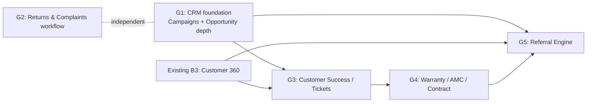

# Growth OS Epics — Roadmap (from the PRD, reconciled against what's actually built)

Build spec: [GROWTH_OS_EPICS_IMPLEMENTATION_PLAN_2026-09-24.md](GROWTH_OS_EPICS_IMPLEMENTATION_PLAN_2026-09-24.md).
Where this roadmap and that plan disagree, the plan wins. It was updated after the 2026-09-24 review.

Source: `Roadmap and Vision.docx` (BizBoard Growth OS — Epic Definitions, PRD v1.0), supplied 2026-09-24.
That document is a product-vision PRD: seven epics with business rationale and competitor
inspiration, written as if starting from zero. This roadmap is the engineering reconciliation of
it — for each epic, what already exists in this codebase today, what the existing
[BIZBOARD_OS_VISION_IMPLEMENTATION_PLAN_2026-09-23.md](BIZBOARD_OS_VISION_IMPLEMENTATION_PLAN_2026-09-23.md)
/ [OPEN_ITEMS_2026-09-24.md](BIZBOARD_OS_VISION_OPEN_ITEMS_2026-09-24.md) already commits to, and what
is genuinely new scope. It does not replace those documents — Phase A–E there stays the plan of
record for Command Center / Cash / Intelligence work. This is the CRM/Growth-suite slice the PRD
asks for, sequenced against current reality instead of a green-field assumption.

## Analysis: what the PRD assumes vs. what exists

Correction 2026-10-01: the table below is the 2026-09-24 snapshot. Campaigns, Customer 360, tickets, referrals, contracts, and complaints now exist. QOS-0083..0094 are `verified`. Do not use this table as the current build state.

The PRD's seven epics read as if BizBoard has no CRM at all. It's about 40% built already — unevenly:

| Epic | PRD asks for | Actually in the codebase today | Build state |
| --- | --- | --- | --- |
| 1. Campaigns + Leads | Campaign hierarchy, budget/ROI, lead capture, assignment, follow-up | `crm/models.py`: `Lead` with `source`, `assigned_to` (round-robin), dedupe against Customer/Lead, `LeadIngestJob` for CSV/WhatsApp async intake. **No `Campaign` model at all** — no budget, no hierarchy, no ROI dashboard. | **Leads: ~80% built** (this is exactly Phase C1, largely shipped). **Campaigns: 0%.** |
| 2. Customer 360 | One page: orders, invoices, payments, activities, documents, support | Not built yet, but fully scoped as ticket B3 — pure aggregation over already-existing invoice-profitability, AR-aging, and payment-pattern services. No new data model needed. | **Planned, not built.** Cheapest epic in this whole PRD once B3 lands — mostly plumbing. |
| 3. Opportunity | Deal value, close date, probability, quotations, competitor tracking, forecast | `crm/models.py`: `Opportunity` exists (`lead`, `customer`, `title`, `amount`, `stage`, `closed_at`) but **has no line items, no probability %, no competitor tracking, no forecast dashboard.** C2 ticket (existing plan) adds a WON-stage → Quotation link, customer-only pre-fill. | **~25% built.** Stage/amount tracking exists; deal mechanics (probability, forecast, line items) don't. |
| 4. Customer Success (support tickets) | Ticket management, priority/SLA, assignment, comments, attachments, resolution history | **No `Ticket` model anywhere in the codebase.** `insights/customer_actions.py` (D1, planned) computes churn-risk/repeat-order/cross-sell *signals* from order history — that's retention intelligence, not a ticketing system. They're complementary, not overlapping. | **0% built.** Full green-field epic. |
| 5. Referral Engine | Referral codes, referrer tracking, rewards, analytics | **Nothing exists.** No model, no service. | **0% built.** Full green-field epic. |
| 6. Warranty / AMC / Contract | Contract records, warranty period, AMC schedule, renewals, service history | **Nothing exists.** `docs/PRODUCT_QUALITY_BACKLOG.md` (QOS-0028) already flags "service-contract milestone invoicing and job-work" as an open P1/P5 gap (XL effort, heuristic-severity) — same territory, already on the backlog under a different name. | **0% built,** but the need is independently corroborated by the quality backlog, not just this PRD. |
| 7. Returns & Complaints | Return request, complaint categories, inspection notes, credit note, replacement, complaint reporting | The **financial/document backbone is already fully built**: `SalesReturn`, `SalesCreditNote`, `PurchaseReturn`, `PurchaseCreditNote`, `DeliveryChallanReturn` all exist with full document lifecycle (numbering, GST, e-invoice, PDF) in `sales/` and `purchases/`. What's missing is the **complaint/RMA workflow wrapper**: categories, inspection notes, a trackable status distinct from the accounting document, and complaint-level reporting. | **~60% built.** The expensive part (money/stock correctness) is done. What's left is a thin workflow layer on top. |

Also worth noting: `ENABLE_CRM` is a **dark module** today (`accounts/packs.py`), env-gated at the
deployment level regardless of pack — QOS-0066 confirms it's off for the current pilot. Landing
epic-1/2/3 work doesn't turn CRM on by itself; that's a separate, non-engineering decision, same
pattern as the GST Guard sign-off in the existing plan.

## Priority logic

Ranked by (business value the PRD argues for) ÷ (cost given what's already built), not by the
PRD's own epic numbering:

1. **Cheapest wins first.** Epics 1–3 sit on infrastructure that already exists (Lead/Opportunity
   models, C1/C2 tickets already scoped). Finishing them is the highest-leverage work in this
   whole roadmap — closing gaps in something 80% done beats starting something at 0%.
2. **Returns & Complaints (7) next**, for the same reason: the hard 60% (money, stock, GST
   correctness) is done. The remaining 40% is a workflow layer, not a financial-correctness
   problem — much lower risk than any green-field epic.
3. **Customer Success (4) before Referral (5) or Warranty (6)** among the green-field epics —
   retention (stopping revenue leaving) is higher-value than acquisition-via-referral or
   contract-recurrence for a pilot-stage product, and it directly complements the D1 churn-risk
   actions already planned in the existing roadmap.
4. **Warranty/AMC/Contract (6) before Referral (5).** AMC/contract ties to recurring revenue and
   is independently corroborated by QOS-0028; Referral is real but is an acquisition nice-to-have
   that depends on Customer 360 (for referrer attribution) and a working support loop being
   credible first — a referral program on top of a business with no support/warranty story asks
   customers to vouch for something not yet proven.
5. **Referral Engine (5) last.** Smallest in scope, but lowest urgency, and benefits from
   Customer 360 (epic 2) and Contract (epic 6) both existing first, since "recommend and earn"
   reads best once repeat/renewal relationships are visible.

## Phase dependency graph

G2 has no real dependency on the others — it can run in parallel with G1 by a different engineer,
since it touches `sales/`/`purchases/` return models, not `crm/`.

## Standards carried over unchanged

Same house rules as the existing implementation plan — not repeating them per ticket below:
company-scoped models with `(company_id, <lookup>)` indexes, additive/nullable migrations with no
backfill, async background tasks for anything externally triggered, idempotent webhooks, cache
invalidation on the write that changes the answer, existing API envelope/pagination/OpenAPI
conventions, per-flag structured observability logging, and rate limiting on any public endpoint.
Every new epic here ships behind its own default-off flag and is a `retail`/`trade` pack candidate
only after it's stable, per the existing wave-sequencing discipline in `accounts/packs.py`.

---

## Phase G1 — CRM foundation completion (Campaigns, Opportunity depth)

**Goal.** Close the two gaps that keep Epics 1 and 3 from being what the PRD describes, building
directly on the Lead/Opportunity models that already exist.

### G1a. Campaign model + attribution

**Data model.** New `Campaign` (company-scoped): `name`, `type` (`DIGITAL`/`REFERRAL`/`EVENT`/`MARKET_VISIT`, matching the PRD's four), `budget`, `expected_outcome` (text or numeric target), `parent` (self-FK, nullable — campaign hierarchy), `start_date`/`end_date`, `status`. Add `Lead.campaign` (FK, nullable, additive) alongside the existing `source` field — `source` stays the channel taxonomy, `campaign` is the specific initiative, matching how HubSpot/Zoho separate the two per the PRD's own "what to borrow" list.

**Service layer.** A campaign funnel: leads → opportunities → won revenue. Revenue is the sum of every `CONVERTED` quotation's `grand_total` on that opportunity, otherwise `Opportunity.amount`, and the response labels which. Not invoiced cash in v1. ROI returns `roi_ratio` (`revenue / budget`, null when budget is 0) and `variance` (`revenue - budget`). A parent rollup includes itself plus descendants. `?campaign=` on leads is a direct match only.

**API/Frontend.** Campaign CRUD; a Campaign detail page showing the funnel (leads → opportunities → won revenue); campaign filter added to the existing Leads page.

**Explicitly out of scope**, per the PRD's own "don't copy" guidance for this epic: email builders, landing-page builders, social schedulers. Campaign here is an attribution/budget object, not a marketing-execution tool.

**Flag.** Rides `ENABLE_CRM` (dark module — no new flag needed, same gate as Leads).

**Tests.** ROI rollup correctness with and without campaign hierarchy; a lead with no campaign (the common case today) is unaffected; budget vs. attributed-revenue math against seeded fixtures.

**DoD.** Campaign CRUD live · ROI dashboard shows leads/opportunities/revenue per campaign · hierarchy rollup correct · existing sourceless-lead behavior unchanged.

**Effort.** 2–3 weeks.

### G1b. Opportunity depth — probability, line items, forecast

**Data model.** Add `probability` (integer percent, **default 0**, not per-stage) and `expected_close_date` to `Opportunity` (additive). New `OpportunityLine` (required product, quantity, unit price). When lines exist, `amount` is derived from them. The v1 kanban is the existing three stages (`OPEN` / `WON` / `LOST`).

**Service layer.** A forecast aggregation: sum of `amount × probability` grouped by expected close month, per the PRD's "forecast dashboard" ask. Once `OpportunityLine` exists, extend C2's pre-fill from customer-only to line-item pre-fill on the generated Quotation.

**API/Frontend.** Probability/close-date fields on the Opportunity detail view; a Kanban pipeline view grouped by stage (the PRD explicitly calls out Pipedrive's drag-and-drop as the model to follow, and explicitly warns not to overbuild this screen); a forecast report.

**Explicitly out of scope for v1:** competitor tracking field. It's on the PRD's feature list but has no dependency from anything else and is pure data entry with no workflow behind it yet — cheap to add later, not worth sequencing ahead of probability/forecast which actually feed a report.

**Flag.** Rides `ENABLE_CRM`.

**Tests.** Forecast math against seeded opportunities at various stages/probabilities; C2's existing pre-fill tests extended to cover the line-item case without breaking the customer-only path when no lines exist.

**DoD.** Kanban pipeline live · probability + forecast dashboard shipped · C2 pre-fill upgraded to line items when present, unchanged when absent.

**Effort.** 3 weeks.

---

## Phase G2 — Returns & Complaints workflow layer

**Goal.** Wrap the already-correct financial/stock return documents in the complaint workflow the PRD asks for, without touching the accounting logic that's already tested and shipped.

**Data model.** New `Complaint` (company-scoped): `customer`, nullable `source_invoice` (`SalesInvoice`), `category`, `description`, `status` (`OPEN` → `INSPECTING` → `APPROVED` or `REJECTED`; `APPROVED` → `RESOLVED`). `REJECTED` and `RESOLVED` are terminal. Resolving with no linked document is valid. Optional independent links to one `SalesReturn`, one `SalesCreditNote`, and one replacement `SalesOrder`. Return and credit-note actions require `source_invoice` and create drafts through the existing sales path. Replacement orders do not bypass credit or stock gates. This ticket does not touch `sales/models.py`'s return logic. Supplier complaints are a later epic.

**Service layer.** Complaint status transitions (open → inspecting → resolved/rejected); "Create Return", "Create Credit Note", and "Create Replacement Order" actions from a Complaint, pre-filling the existing forms the same way C2 pre-fills Quotation from Opportunity — action buttons, not new document logic.

**API/Frontend.** Complaint list/detail; category + status filters; a complaint reporting view (volume by category, resolution time) — the PRD's "complaint reporting" ask, built from data the Complaint model itself now captures.

**Flag.** `ENABLE_COMPLAINTS`, default off.

**Tests.** Status-transition correctness; each "Create X" action produces a document identical to what creating it directly would (no divergent pre-fill path); a return/credit-note created without a Complaint (today's only path) is completely unaffected.

**DoD.** Complaint workflow independent of and non-breaking to existing return/credit-note flows · inspection notes captured · complaint reporting live · flag default off.

**Effort.** 3–4 weeks.

---

## Phase G3 — Customer Success (support ticketing)

**Goal.** The green-field epic with the strongest retention case — closes the "after the sale" gap the PRD calls out, and gives Customer 360 a Support section. The shipped page is a stack of sections, not tabs.

**Data model.** New `Ticket` (company-scoped): `customer`, `subject`, `description`, `priority` (low/medium/high/urgent), `status` (open/in-progress/waiting/resolved/closed, with reopen back to in-progress), `assigned_to`, `sla_due_at`, `waiting_since`, `resolved_at`. `TicketComment` (internal; author is `created_by`) and `TicketAttachment`. No `Ticket.contract` field.

**Service layer.** SLA is a fixed offset per priority (4h / 24h / 3d / 7d), company-local, inclusive breach (`<=`). Time spent in `WAITING` extends `sla_due_at`. No new role: assignment round-robins `SALES_STAFF` by open-ticket count via a shared `pick_least_loaded` helper. `next_assignee` keeps counting leads. The SLA alert builder is not registered when the flag is off.

**API/Frontend.** Ticket list/detail/Kanban-by-status; SLA countdown badge; internal comments; attachments; a Support section on Customer 360, shown only when both `ENABLE_CUSTOMER_360` and `ENABLE_SUPPORT_TICKETS` are on. That section is part of G3, not a follow-up.

**Flag.** `ENABLE_SUPPORT_TICKETS`, default off.

**Tests.** SLA due-date calculation per priority; assignment fairness (reusing C1's existing fairness test pattern); a ticket with no customer... reject at creation (tickets are always customer-linked, unlike Leads which can be anonymous) — an explicit validation test, not a nullable-FK escape hatch.

**DoD.** Ticket CRUD + SLA + assignment live · Customer 360 shows a Support section when both flags are on · resolution-time reporting available.

**Effort.** 4–5 weeks — comparable to C1's Lead-pipeline build, for the same reason (a genuinely new subsystem, not an extension).

---

## Phase G4 — Warranty / AMC / Contract

**Goal.** Recurring-revenue and renewal tracking. Per the PRD's own advice for this epic — "use a generic Contract object instead of hardcoding AMC" — and consistent with QOS-0028's independent flag of the same gap.

**Data model.** New `Contract` (company-scoped): `customer`, one nullable `product`, `contract_type` (label only — no billing), `start_date`, `end_date`, `renewal_reminder_days` (integer, default 30, `0` means remind on the end date), system-owned `status`, `value` for reporting only. Documents reuse `FileAsset`. Do not start G4 until a pilot tenant actually sells warranty, AMC, or subscriptions.

**Service layer.** Nightly status refresh in Python over contract rows (no company scan, no database duration math), sharing `compute_contract_status` with `save()`. The end date itself stays `ACTIVE`; the next day is `EXPIRED`. Service history is a manual `ContractServiceEvent`, optionally pointing at a `Ticket`. There is no visit calendar and no automatic create-from-ticket. `value` does not generate invoices.

**API/Frontend.** Contract CRUD; renewal Attention row; per-customer service history (period, end date, logged visits). A future-visit calendar is out of scope. `GET /api/v1/contracts/report/` sums `value` by status and type.

**Flag.** `ENABLE_CONTRACTS`, default off.

**Tests.** With a 30-day reminder, `end_date == today` is `EXPIRING` and the next day is `EXPIRED`. `renewal_reminder_days = 0` is `EXPIRING` only on the end date. There is no "no reminder" state. Service history with a ticket and without one.

**DoD.** Generic Contract object (not AMC-hardcoded) · renewal reminders on Attention · service history visible per customer · flag default off.

**Effort.** 3–4 weeks, plus the milestone-billing/job-work piece QOS-0028 separately sizes as XL if that gets pulled in later — not included in this estimate.

---

## Phase G5 — Referral Engine

**Goal.** Lowest-urgency epic in the PRD, sequenced last because it's most valuable once Customer 360 (attribution) and Contract (renewal relationships worth referring from) both exist.

**Data model.** `ReferralCode` (reusable, unique per company, exactly one of customer or employee referrer, 8-character unambiguous alphabet) plus `ReferralReward` (one row per won opportunity, status `PENDING` / `APPROVED` / `REJECTED`, no `PAID`). `Lead.referral_code` is the only attribution FK. A bad public code still captures the lead and returns the same `{"ok": true}`.

**Service layer.** Referral-code generation and lookup at Lead-capture time (extends C1's capture flow with one more attribution field, same pattern as `source`); reward-rule evaluation (flat/percentage, simple rule table — not a rules engine, matching the "simplest correct thing" doctrine used throughout the existing plan).

**API/Frontend.** Referral code issuance per customer (from Customer 360); a referral leaderboard/analytics view; conversion reporting (referred lead → opportunity → won revenue), reusing the same funnel logic G1a already builds for Campaign ROI — a referral is structurally a campaign with one specific referrer as its source.

**Flag.** `ENABLE_REFERRALS`, default off, dependent on `ENABLE_CRM`.

**Tests.** Code uniqueness; reward calculation correctness; a Lead captured without a referral code is unaffected; leaderboard math against seeded conversions.

**DoD.** Referral codes issuable and trackable · rewards computed correctly · leaderboard/reporting live · flag default off and dependent on CRM.

**Effort.** 2–3 weeks — smallest epic, largely reuses G1a's attribution/funnel plumbing.

---

## What this roadmap deliberately does not do

- Does not re-litigate or duplicate C1 (Lead pipeline) or C2 (Opportunity→Quotation) — both already
  scoped in the existing implementation plan; G1 only fills the gaps they explicitly left open
  (Campaign, OpportunityLine).
- Does not touch `sales/`'s or `purchases/`'s return/credit-note models — G2 wraps them, never
  edits their accounting logic.
- Does not build a rules engine, ML scoring, or recommendation model anywhere — every "engine" in
  this doc (referral rewards, contract renewals, campaign ROI) is a deterministic calculation,
  matching the codebase's existing deterministic-first doctrine (same call the existing plan makes
  for D1's churn-risk/cross-sell heuristics).
- Does not turn `ENABLE_CRM` on for any tenant. That's a deployment-level decision independent of
  all engineering work above, same as the GST Guard sign-off gate in Phase A of the existing plan.

## Decisions locked 2026-09-24

Confirmed. The implementation plan is ready to build.

1. **`ENABLE_CRM` flip** does not wait on Campaigns. The current Lead pipeline is enough to pilot.
2. **G4** stays sequenced after G3, and does not start until one pilot tenant sells warranty, AMC, or subscriptions.
3. **Referral v1** has no in-app payout and no `PAID` status. `APPROVED` means the owner will settle outside BizBoard.

Attachments are JPEG, PNG, WebP, and PDF, capped by the existing 15MB upload setting. `hi.ts` ships the English string with an untranslated comment. Translating those strings is one pre-launch follow-up, not a per-PR obligation.
